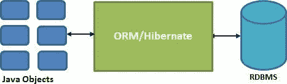
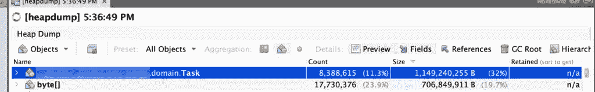

# 错误跟踪:修复 Hibernate 堆问题

> 原文：<https://betterprogramming.pub/bug-tracking-fixing-hibernate-heap-problems-5944a313c4d3>

## 为了避免不必要的数据检索



在现代世界中，数据是最有价值的资产，无论应用程序是什么，数据处理和加工都是其核心功能的一部分，这并不奇怪。通过拥有几个 ORM(对象/关系映射)框架，像 [Hibernate](https://hibernate.org/) 或 [Eclipselink](https://www.eclipse.org/eclipselink/) Java，在访问应用数据的过程中为开发者提供了真正的帮助。它通过创建一个抽象数据访问层来实现这一点，抽象数据访问层负责检索应用程序数据并将其保存到数据库中。

*“只要数据被保存或检索，应用程序开发人员就不应该关心数据是如何保存或检索的。”*

还是应该关心？

最近，我们有一个真实的情况，在几次高堆内存分配后，一个应用程序后端崩溃了(如图所示)，在很短的时间内有超过 2G 的内存分配。

使用 [VisualVM](https://visualvm.github.io/) ，我们能够实时跟踪内存分配，并查看应用程序进行的对象分配。


强制垃圾收集是一个临时的解决方案，堆被释放，但是，过了一段时间后，内存分配又开始增加。

事实上，垃圾收集器能够释放内存，这暗示我们没有处理内存泄漏，但一定有其他东西产生了高内存使用率。

在应用程序中，我们在与`FetchType`惰性和分页相关的任何地方都使用它，以避免检索不需要的数据时不必要的数据库负载。

VisualVM 允许我们在如此大的堆内存分配之后立即进行内存转储。它看起来是这样的:



我们的一个域类`Task`在堆上有几个实例。尽管启用了分页和惰性抓取，hibernate 还是设法将所有这些元素加载到内存中。830 万条记录。这是内存使用量不时急剧增加的原因。

是时候检查代码了。

在域定义中，我们定义了两个类，一个是`Task`，另一个是`User`。`User`和`Task`之间还有`@OneToMany`关系，`Task`和`User`之间还有`@ManyToOne`关系。

```
/* Relation between User and Task */
@Transient private int tasksNo;@OneToMany(mappedBy = "author")
@JsonIgnore private List<Task> tasks;/* Relation between Task and User */ 
@ManyToOne(fetch = FetchType.LAZY) 
@JoinColumn(name = "author_id") 
@JsonIgnore private User author;
```

在领域级定义上，一切似乎都很好。

在业务层面，后端正在处理几个与`User`和`Task`相关的 REST API 调用。在一些 API 响应中，我们需要获得分配给用户的任务总数。当我们返回一个 JSON 响应时，我们有一个`Transient`变量`tasksNo`，它应该包含任务的数量，并且定义了一个 getter 来计算任务的数量。

```
public int getTasksNo() {
  if (tasks != null) {
    return tasks.size();
  }
  return 0;
}
```

现在，这是一个问题。即使我们为任务提供了惰性数据获取，hibernate 也需要检索集合中的所有记录，以便能够计算其大小。让一个用户处理 830 万个任务，最终要从数据库中检索 830 万个对象，最终会出现内存问题。

*“使用合适的工具完成工作。”*

显然，这不是检索集合大小的正确方法。该框架为解决这个问题提供了一个解决方案。在 hibernate 中，可以将公式附加到字段，如下所示:

```
@Formula("(select count(task.id) from task where task.author_id = id)")
private int tasksNo;
```

这样，hibernate 将使用提供的查询对记录进行计数，避免不必要的数据检索。

以下是一些休眠技巧:

*   尽可能使用惰性数据提取
*   使用分页来限制检索的记录数
*   确保您的代码没有强制 hibernate 检索整个集合
*   更喜欢框架提供的解决方案，而不是在应用程序中编码它们

感谢阅读。敬请关注更多内容！