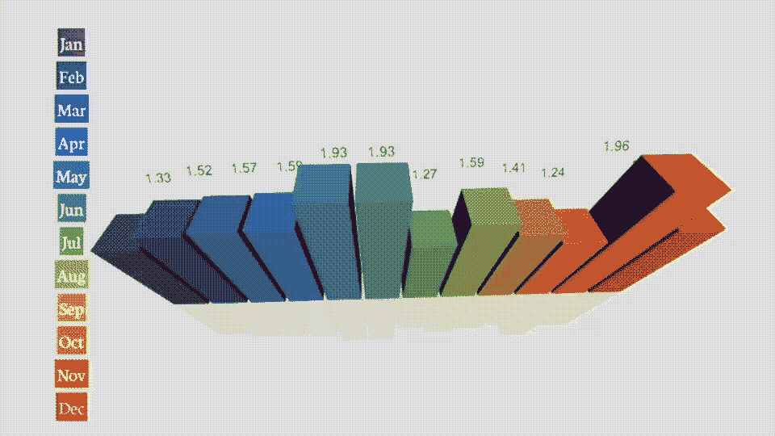
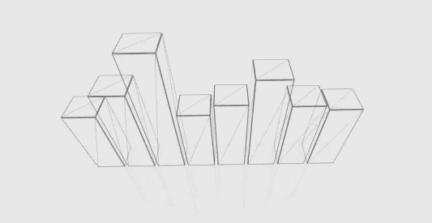
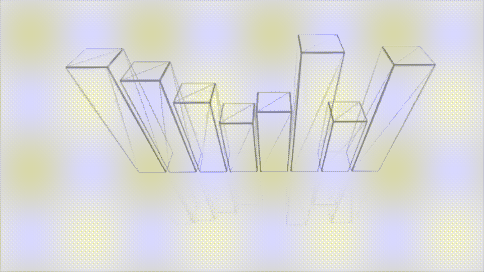
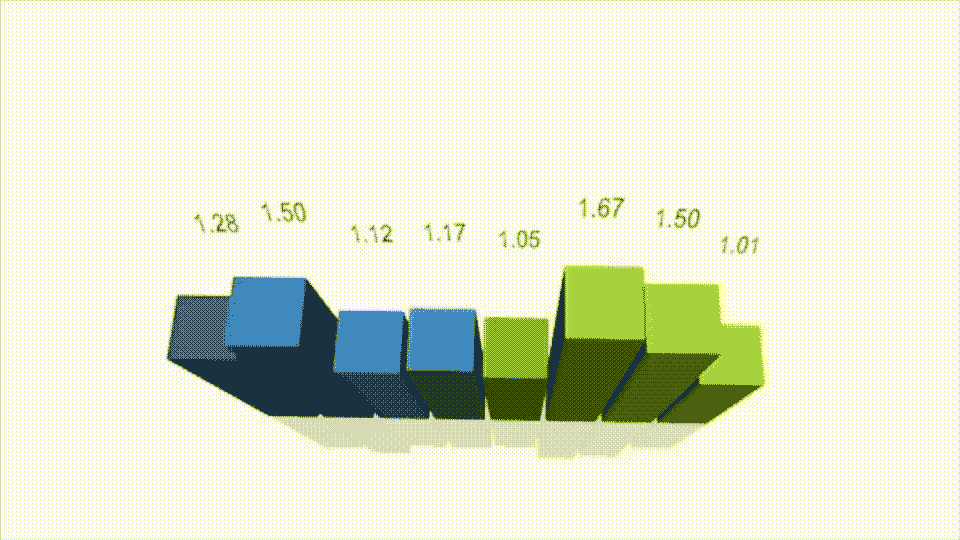
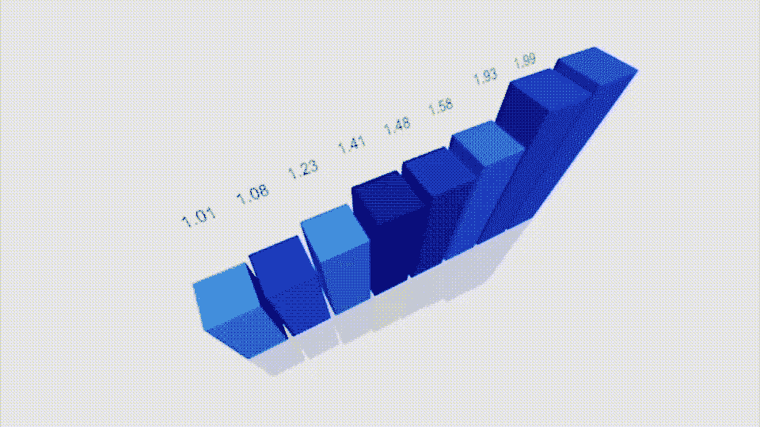
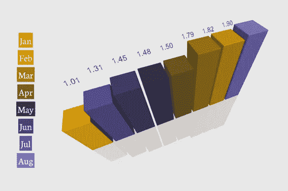

# 使用 SwiftUI 在 SceneKit 中构建 3D 条形图

> 原文：<https://betterprogramming.pub/build-a-3d-bar-chart-in-scenekit-with-swiftui-789a2631ef6f>

## 创建新 Apple 图表库的缺失组件



您将使用本文构建的图表的动画 GIF

我在 WWDC 2022 之前开始这篇文章，这是一个由苹果宣布的性感新框架，名为[图表](https://developer.apple.com/documentation/Charts)。当我在最新的 SwiftUI 演讲中听到宣布我可能已经被打败后，我曾短暂地担心过，但当我意识到苹果图表框架只做 2D 图表时，我感觉好多了。

也就是说，我确实在去年写了几篇关于构建 2D 饼状图的文章，这些文章现在都已经不存在了——但是这篇文章还活着。请和我一起使用我在过去一个月左右的时间里一直在谈论的 SceneKit 框架，不是为了构建一个游戏，而是一些更普通的东西，一个 3D 条形图。

# 技术栈

好的——我们将需要一个运行在 SwiftUI 中的`SCNScene`,以及一个链接两者的联合发布者。在场景中，我想画一行盒子&标签，我打算用`SCNMorph`来改变盒子的大小。我将使用一种结构来运行它，这种结构很像在 Apple 关于新图表框架的演讲中描述的结构。

## 三维图表

bon——我首先将这些线条添加到我的场景中。它们不加载任何数据；他们只是凭空生成一些数字，然后用线条创建一个超级简单的 3D 条形图。这里的第一个挑战是形状从它们的中心开始生长，这种状态似乎几乎不可能改变。

代码有效地为我们构建了一个漂亮简单的 4D 图表，如下所示。



3D 条形图的快照[包括一个楼层，如下所述]

## 动画技术

画完并排列好条形后，我决定添加一个`SCNFloor`让它看起来更时髦一点，并在一个`SCNMorph`周围添加了`SCNTransation`来使用动画改变条形的大小。



由事务管理的三维图表的大小调整

## 配置

我通过 Combine 框架将它链接到 SwiftUI 接口，使用了我在本文[中概述的订阅技术，并使用了一个带有 SceneDelegate 的 singleton 类。](/16-useful-extensions-for-swiftui-88aae6ff8909)

上面的代码包含在`GameScene.swift`文件中，基于 Combine 的关联主题通过 SwiftUI 界面中的一个简单的文本对象触发。

```
**Text("_5yawC")
  .onTapGesture {
    relocating.send(._5yawClockwise)
}**
```

代码将让我定位我的三维条形图在屏幕上的最佳观看。

## 相机视图

正如我在[这篇文章](/managing-the-camera-in-scenekit-under-swiftui-6608e7a0de52)中指出的，仅仅移动对象是不够的，我实现了一个单独的机制来移动场景使用的相机以查看 3D 条形图。这次我在`SceneDelegate.swift`内完成了工作

`Common.shared`只是对 SwiftUI 接口和 SceneKitDelegate 代码之间的共享结构的引用。

改变`superSIMDValue.xV`的值会导致不连续的移动，改变`share.superSIMDValue.RX`的值会导致每隔`spawnTime`秒执行一次的连续移动。

## 调色板

当然，条形图需要颜色，这个主题比你想象的要复杂得多。我在这里写了所有关于颜色的[。切入正题，我决定现在添加一个固定的 12 色调色板。](/colour-hue-saturation-and-brightness-24661bb809a3)


## 文本标签

因为 [WWDC 2022 关于这个主题的演讲](https://developer.apple.com/videos/play/wwdc2022/10136/)会告诉你没有标签的图表不是很有用，所以我也添加了一些。



带有显示不同值的标签的三维条形图

注意，在将文本添加到所示的栏之前，我使用这段代码倾斜了文本，以确保它是可读的。

```
let quaternion = simd_quatf(angle: GLKMathDegreesToRadians(-45), axis: simd_float3(1,0,0))
textNodes[k].simdOrientation = quaternion * textNodes[k].simdOrientation
sourceNodes[k].addChildNode(textNodes[k])
```

## 整理

这个项目带来的一个我没有意识到的事情是，3D 条形图只有在描述一个随着时间推移而变大的数据集，一个排序集时才看起来好。我在视觉上做了这个；因为这当然是乐趣的一半。



一个三维条形图排序本身。

## 神话；传奇

最后，我在`SceneKit`视图上添加了一个 SwiftUI 图例，最终结果如下:



我觉得一个 3D 条形图还是挺合理的；你觉得呢。我也应该在这里对这篇关于颜色的[文章](https://www.heavy.ai/blog/12-color-palettes-for-telling-better-stories-with-your-data)快速点头。我在这里使用了其中描述的调色板。

# 将来的

我认为你可以做一些事情来改善这种情况。

*   排序本身可以更加动态，在您更改条形的值时发生。
*   我认为将标签放置在条形顶部可能会更好——一些微调。
*   数据可以/应该动态加载，所以可以是 JSON 或 XML 源。
*   你可以用相机做更多的事情，使用一些预先设定的路线，比如绕着图表转或者飞过图表。

所有这些让我想到了这篇文章的结尾，我希望你能像我写这篇文章一样喜欢阅读它。你可以在这个[链接](https://bitbucket.org/wizard1066/bars/src/master/)上找到一个包含所有代码的位桶。