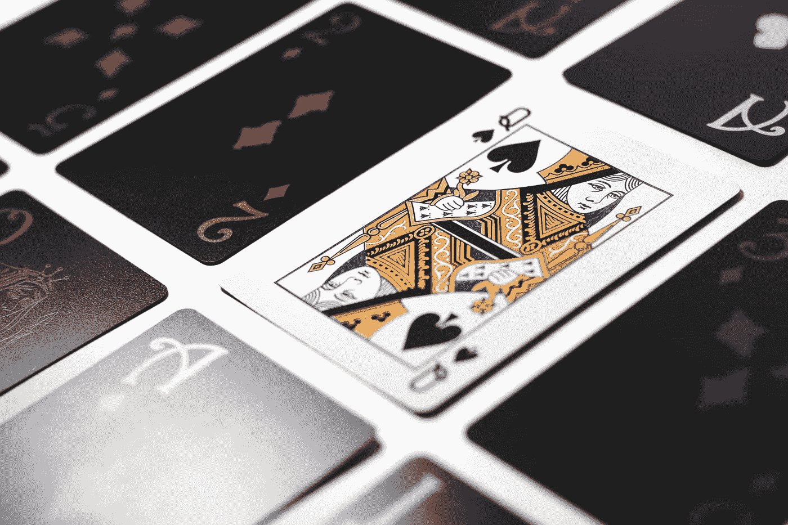
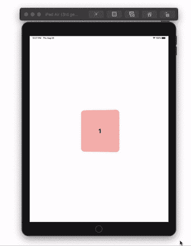

# 在 SwiftUI 中构建 3D 卡片滚动动画

> 原文：<https://betterprogramming.pub/build-a-3d-card-scrolling-animation-in-swiftui-337c123fce73>

## 使用 ScrollView 和 GeometryReader 创建动画 3D 滚动效果

由 [Esteban Lopez](https://unsplash.com/@exxteban?utm_source=medium&utm_medium=referral) 在 [Unsplash](https://unsplash.com?utm_source=medium&utm_medium=referral) 上拍摄的照片。

# 卡片视图

从卡片开始，我们将创建一个接受颜色和数字的结构视图。这些卡片将会是填充了颜色的`RoundedRectangles`和一个`Text`视图，其中的数字以`ZStack`的形式堆叠在一起。

我在`RoundedRectangle`上有一个背景属性，它以白色为视图。这是因为我给`CardView`赋予了不透明度值为 0.3 的颜色。如果使用不透明度值为 1.0 的颜色，则不需要背景色。

# 内容视图

`ContentView`包含我们发送给`CardView`的颜色数组。选择您的颜色或创建另一种类型的数组，并用您要放在卡片内的内容填充它:

在`ContentView`主体中，我们将需要一个`GeometryReader`来确定`HStack`所需的填充量和间距。使用`ForEach`将数字和颜色填入卡片。将您的`HStack`嵌入到`ScrollView`中:

# 3D 卡片动画

在我们的`CardView`中，我们需要知道我们屏幕的`maxX`。我们可以使用`UIScreen`检索它，并将其存储在一个变量中。将`ZStack`嵌入到`GeometryReader`中。使用`ZStack`上的`rotation3DEffect`属性。使用几何代理传递`maxX`值，并从中减去我们存储的`maxX`值。然后加上`maxX`值的一半，使卡片以 0 度在屏幕中间居中。将结果除以-5，或者您可以试验其他值，看看这会如何影响您的动画。

全部完成！感谢阅读。