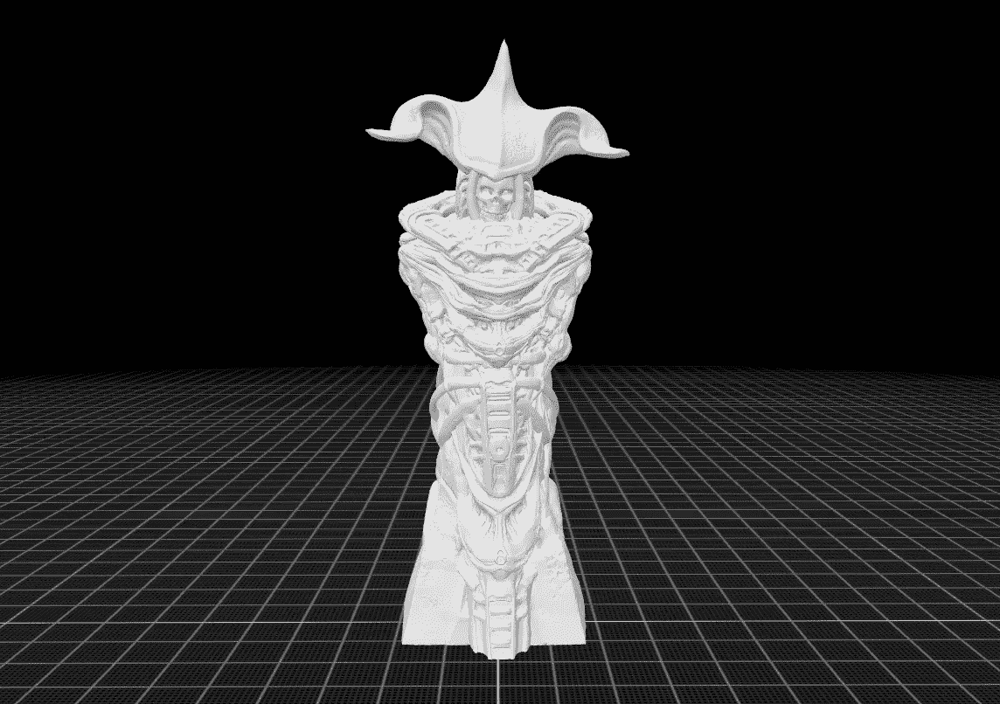
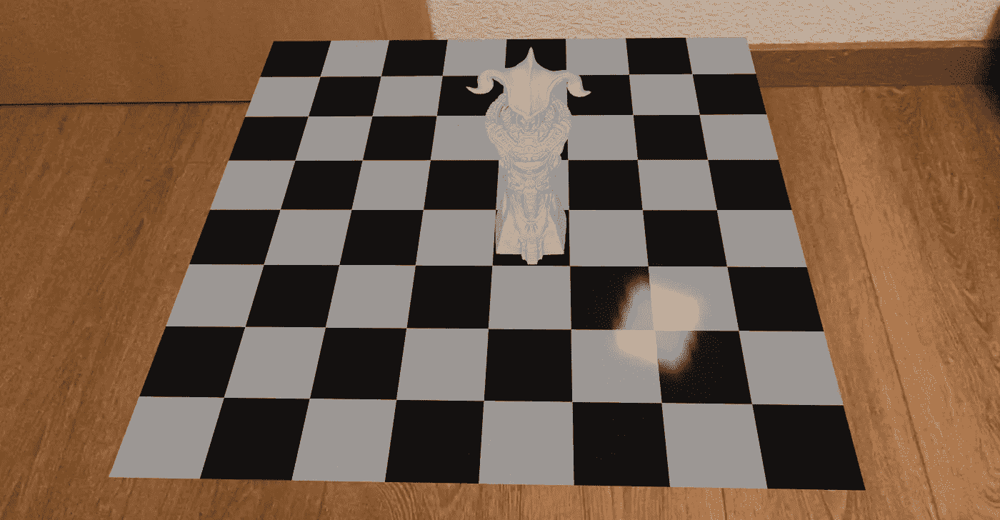

# 使用 SwiftUI 和 RealityKit 设置 3D 棋盘

> 原文：<https://betterprogramming.pub/build-a-3d-chess-with-swiftui-and-realitykit-43d84095e46>

## 使用 SwiftUI、RealityKit、ARKit 和 Multipeer 框架



今年[2022]我花了大部分时间探索 SceneKit。我记录了一次旅行，在 medium 上你可以找到差不多 24 篇关于这个主题的文章。在涵盖了 SceneKit 中的大部分元素之后，我决定在 2023 年转移到 RealityKit/ARKit。

虽然我不确定从哪里开始，但我在 ARKit 上观看了 WWDC2022 的最新演示，然后 RealityKit 和 well 它没有帮助。我查了一下哪个先来，然后是我能查到的最早的 WWDC。

我看的这个是 WWDC2019 上的“[用 RealityKit](https://developer.apple.com/videos/play/wwdc2019/605/) 构建应用”。这几乎是一个灵光乍现的时刻。我不禁反思 SceneKit 和 RealityKit 的相似之处。RealityKit 是 SceneKit。他们可能是在考虑到多处理的情况下从头开始开发它的，但是在许多情况下，这些原语看起来几乎是相同的。他们想尽可能平稳地从一个过渡到另一个。事实上，如果你甚至可以在没有摄像头的情况下创建一个基于 RealityKit 的应用程序，这个应用程序最终看起来就像你在 SceneKit 上做的一样。ARKit 似乎是 RealityKit 不可分割的一部分，所以它们就像阴和阳；一个只有和另一个在一起才有意义。

看完演示后，我决定使用 RealityKit/ARKit 重建我在[这篇论文](https://medium.com/better-programming/start-building-a-3d-chess-game-using-scenekit-and-swiftui-3d072b025db2)中描述的象棋游戏，重点放在前两个部分。建立一个原型并用游戏状态整理它。

# 原型

## 不可再现

bon——所以都快 2023 年了，没有让时光倒流，对我来说使用 UIKit 构建计划将与 WWDC2019 演示文稿中描述的计划相同，只有一些小的更改和更新。
我复制了我上一篇 SceneKit 文章后面的代码，并将其作为构建的基础。我的 UIRepresentable 和你想象的一样简单，只有十行左右。

```
struct CustomARView: UIViewRepresentable {
    typealias UIViewType = ARView

    var view:ARView
    var options: [Any] = []

    func makeUIView(context: Context) -> ARView {
        view.session.delegate = context.coordinator
        return view
    }

    func updateUIView(_ view: ARView, context: Context) {
    }

    func makeCoordinator() -> Coordinator {
        Coordinator(self.view)
    }

    // coordinator 
}
```

## 协调器类

coordinator 类同样简单，这里是框架代码，没什么特别的。

```
class Coordinator: NSObject, ARSessionDelegate {
        private let arView: ARView

        init(_ view: ARView) {

            self.arView = view
            super.init()

         }
```

在这一点上，这是显而易见的；我在一个屏幕上播放了 WWDC2019，并在另一个屏幕上更新了协调器内的代码。我在这里建立了一个原型，所以，不需要整个板，只需要基本的代码，理解语义和语法。

我最初遇到了一个小问题，因为我的模型看起来像怪物，这很容易解决。我在 transform 的语法上遇到了第二个障碍，这与我的预期不同，尽管令人惊喜的是，苹果公司在这里很好地记录了它，并且它也很快得到了解决。

这是最基本的——事实上，我甚至领先一步，因为我已经为我的原型使用了 3D 模型，只是我使用了错误的调用来加载它们。我在同步做这件事，导致我的应用程序冻结。我在这个[的帮助下改进了异步代码，所以发布](https://stackoverflow.com/questions/62752649/realitykit-asynchronous-model-loading-doesnt-work)。这里的变量加载属于可取消类型。【WWDC2019 代码都不会编译】。

```
loading = Entity.loadModelAsync(named: assetName)
    .sink(receiveCompletion: { completion in
        if case let .failure(error) = completion {
            print("Unable to load a model due to error \(error)")
        }
        self.loading?.cancel()

    }, receiveValue: { [self] (entity: Entity) in
        if let entity = entity as? ModelEntity {
            let piecePlayer = entity
            loading?.cancel()
            print("Congrats! Model is successfully loaded!")
            piecePlayer.position = SIMD3(x: 0, y: 0, z: 0)
            piecePlayer.setScale(SIMD3(0.01,0.01,0.01), relativeTo: piecePlayer)
            piecePlayer.generateCollisionShapes(recursive: true)
            piecePlayer.name = "GCHKing"
            anchor.addChild(piecePlayer)
        }
    })
```

我仍然需要冲浪板。在 SceneKit 中，我已经用立方体构建了一个，但它对 RealityKit 来说没什么意义，所以我决定在这段代码中使用一个普通的网格。我将代码嵌入到几个循环和几个布尔运算中，以得到完整的电路板。

```
let material = SimpleMaterial(color: .black, isMetallic: true)
let plainMesh = MeshResource.generatePlane(width: 0.1, depth: 0.1)
let entity = ModelEntity(mesh: plainMesh, materials: [material])
anchor.addChild(entity)
```

我在 WWDC2019 上构建游戏进行了一半——但在这一点上，我遇到了另一个障碍。照明不工作——这是一个有用的问题，因为我不知道照明在 ARKit 中是如何工作的，并在这里找到了一些有用的代码。

```
directionalLight.light.color = .white
directionalLight.light.intensity = 500
directionalLight.light.isRealWorldProxy = true
directionalLight.shadow?.maximumDistance = 1
directionalLight.shadow?.depthBias = 4.0
directionalLight.orientation = simd_quatf(angle: Float(0).degrees2radians(),
                                           axis: [0,1,0])

let lightAnchor = AnchorEntity(world: [0,1,0])
lightAnchor.addChild(directionalLight)
arView.scene.anchors.append(lightAnchor)
```

## 游戏状态

bon——当我们进行到 WWDC2019 演示的这一部分时，我怀疑他们的时间不多了。我猜这是因为他们没有解释如何将他们解释的实体/组件代码与它集成。更糟糕的是，我被 async 代码中糟糕的 ModelEntity 命名弄糊涂了。在演示中，他们称之为“模型”。这个名字实际上意味着你需要在带有`model.model`的模型中引用这个模型——不好，苹果。

回到现实世界，你有两个棋手，一白一黑，轮流下。因此，我的自定义组件将是您刚刚点击的棋子的颜色，以确保它是您要移动的布景。我还想给不同的部分赋予一个值，一个语义，我可以用它来判断谁赢了或者输了游戏。

```
enum PieceColor: Codable {
    case black
    case white
}

struct PieceComponent: Component, Codable {
    var color: PieceColor
    var value: Int
}

class ChessEntity: Entity, HasModel, HasCollision, HasPhysics {
    //public var model: ModelEntity!
    public var piece: PieceComponent {
        get { return components[PieceComponent.self] ?? PieceComponent(color: .white, value: 0) }
        set { components[PieceComponent.self] = newValue }
    }
}
```

我在我创建的自定义类中添加了一个新组件来表示棋子，以及您可以对它们采取的动作。在这一点上，我只是想要一个最小可行的产品。

```
extension ChessEntity {
    func movePiece() {
        print("name \(self.name)")
        self.transform.translation -= SIMD3<Float>(0,0,-0.1)
    }
}
```

您与现有例程集成的代码，即资产的加载和当有人点击某个部分时的检测/操作。您需要对设置了实体的负载进行的更改只有两行。

```
let piecePlayer = ChessEntity()
piecePlayer.model = entity.model 
```

把重要的棋子放好之后，我就准备给象棋游戏添加动作了。我从 WWDC2019 展示中获得的行动或多或少。从简单的`UITapgestureRecognizer`触发的代码。

```
@objc func handleTap2(_ sender: UIGestureRecognizer? = nil) {
    let tapLocation = sender?.location(in: arView)
    if let piece = arView.entity(at: tapLocation!) as? ChessEntity {
        piece.movePiece()
    }

}
```

## 图像

一切就绪后，我搭建了棋盘，并把我的棋子放在上面。我为下一步做好了准备。



## 将来的

这就是增强现实版国际象棋的原型，不仅使用了 RealityKit，还使用了 ARKit——这两者感觉几乎不可分割。

当然，仍然有相当多的东西需要实现——在演示中，他们完成了一个多人版本，这是与 SceneKit 的一个显著区别，也是我必须实现的。我希望这一次我能比上次做得更多一点。或许在游戏中加入一些智能。

最后，我的思绪回到了 2022 年 3 月我开始这段旅程的时候。我当时认为 SceneKit 没有死；它只是在休息。现在说我是否改变了主意还为时过早，但我对 RealityKit 和 SceneKit 之间的相似之处感到惊讶。

也就是说，四处搜索，我找到了托尼·莫拉莱斯的这篇优秀的[作品](https://1984.dev/Limitations-of-RealityKit-1-0) *，他在两年前写了一篇文章比较了这两者。我后来找到了他，他告诉我“我的大部分问题都已经解决了”——现在看起来和听起来都像 RealityKit 已经取代了 scene kit——如果明年这个时候我改变了主意，我会让你知道，那时我自己有机会真正深入了解这一点。请在媒体上关注我，保持对这个主题的关注。*