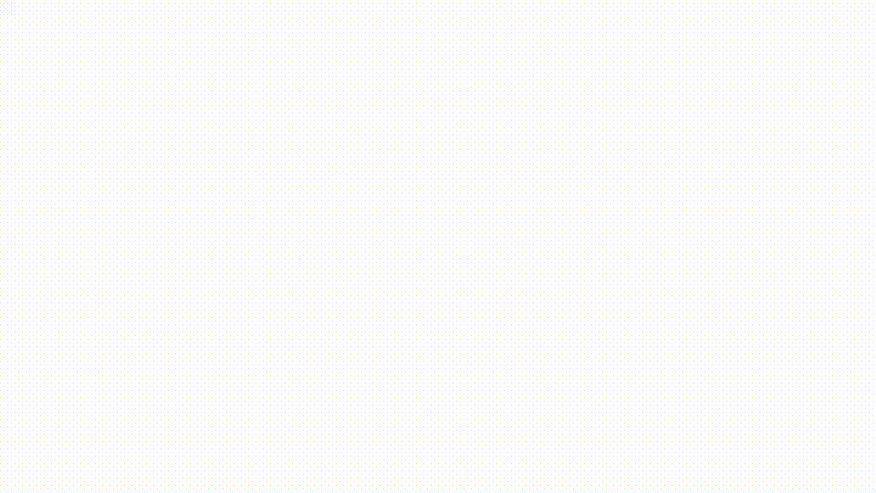
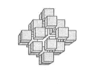

# 在 SwiftUI 和 SceneKit 中构建 3D 编辑器

> 原文：<https://betterprogramming.pub/build-a-3d-editor-in-swiftui-and-scenekit-7a680e95d8a>

## 使用 SwiftUI 界面中运行的 SceneView

3D 编辑器

我正在写一篇文章，它依赖于各种 3D 编辑器来建立一个模拟，嗯——超过一半的时候，很明显我建立的简单编辑器不能满足它。所以我决定记录我的重建之旅，简单编辑说。和我一起分享这个故事，来发现我建造了什么，我是如何制造它的，为什么它不能工作，以及我是如何修复它的。

# 挑战

邦——所以问题就在这里。目标是建立一个 3D 编辑器，我可以用它来创建这样的图片，挑战是放置立方体。虽然我当时不知道，但是我会面对和修复七个问题。

简单的 3D 形状

# 代码

我从一个基本的 SceneKit 实现开始，它是从这篇文章[的](/a-self-avoiding-walker-in-swiftui-9d2922ee1837)中复制的。我需要使用可表示的，因为我需要/想要触摸。当你触摸屏幕时，你会得到一个新的立方体，一个你可以在显示屏上拖动的立方体。一张你可以旋转的图画，让立方体就位。和过去一样，我使用 Combine 框架中的订阅模型将场景链接到 SwiftUI 接口。

# 挑战一

它开始得很好，至少是轰轰烈烈。场景已经就位，触摸控制也是如此。这是第一个挑战。当然，我可以检测到在我的场景中哪里发生了触摸事件，但它是在错误的坐标空间中；我需要一个例程在两者之间进行转换，这说起来容易做起来难。我在这个代码上找到了解决方法。

将屏幕坐标转换为场景坐标

# 下一个挑战 II

但是我需要一些结构，一些秩序。让艺术家在任何地方放置立方体很快就变成了一团乱麻。所以我实现了这段代码，试图让事情变得合理。

尝试让事情变得更有序的代码

# 下一个挑战 III

但是结构带来了新的问题；把立方体一个放在另一个上面太容易了。我需要实现一些代码来让立方体互相避开。最初，我把它们放在不同的 Z 平面上。但是当我转动相机时，平面改变了位置，所以立方体的位置开始看起来是随机的；真是一团糟。我用 SO 的`worldPosition`和另一个[宝石](https://stackoverflow.com/questions/481144/equation-for-testing-if-a-point-is-inside-a-circle/72104483#72104483)解决了它。

检测冲突立方体的代码

这段代码知道立方体的哪一面已经存在，我需要把新的放进去。

检测哪个是正面的代码。

# 下一个挑战四

我现在可以放置立方体并旋转创建的形状，但我希望能够移动立方体，如果它们看起来像是在错误的位置——所以我引入了一个平移手势来这样做。

但是这段代码有两个问题几乎立即浮出水面。首先，随着平移手势到位，我不能再旋转绘图；更糟糕的是，我怀疑 SwiftUI 手势有太多的干扰；有时它会工作，有时不会。

所以我重新审视了它，直接在 SwiftUI 中使用 drag 来实现它，通过订阅返回到我的`sceneView`类。

# 下一个挑战 V

当然，每个人都会犯错误，如果我不小心添加了一个立方体，我需要删除它的方法。我这样做是通过长按这个代码来实现的。

我就快成功了，尽管我需要一种改变位置的方法，这种方法不像拖拽那样随意。

# 下一个挑战 VI

所以我决定试着用双击来实现；用这个代码。

# 挑战七

这里的解决方案与前一个几乎相同，所以我现在跳过代码。问题；我希望能够放大和缩小。我用两个按钮解决了这个需求，这两个按钮再次依赖于`worldPosition`来知道他们需要向哪个方向移动相机。

所有这些让我想到这篇短文的结尾。我希望您在这里找到了一些有趣的代码字节；让所有东西都协同工作是一个挑战。