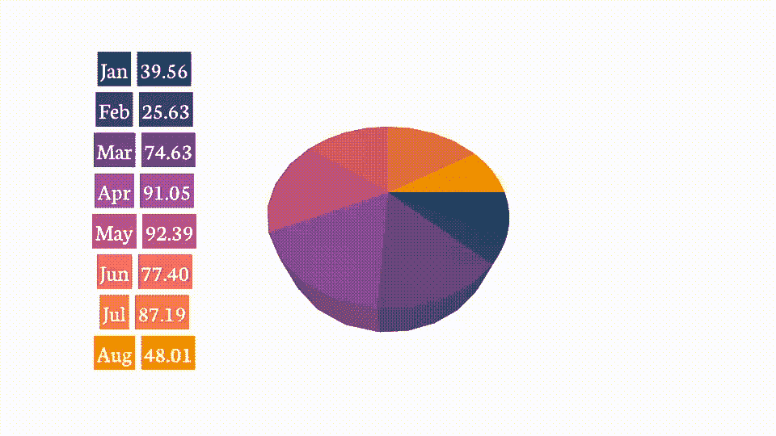
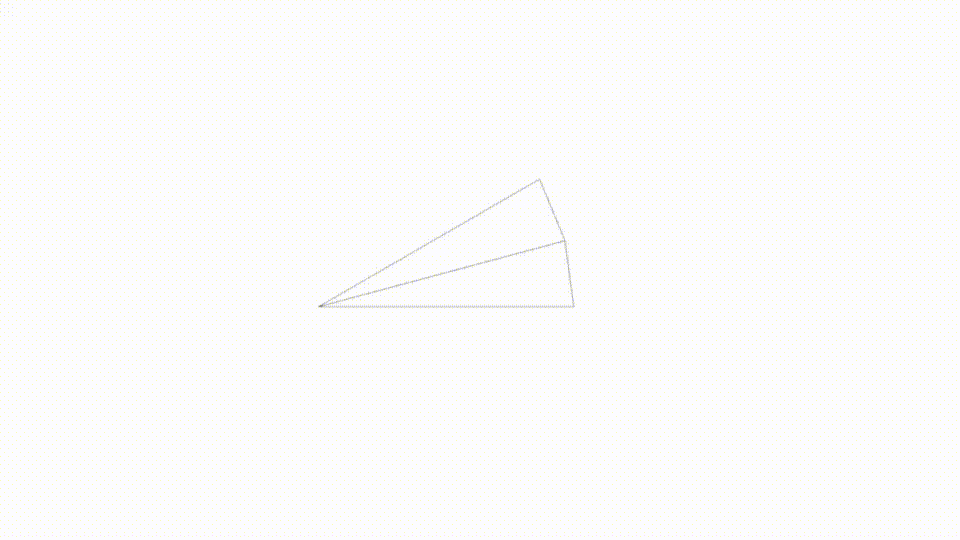
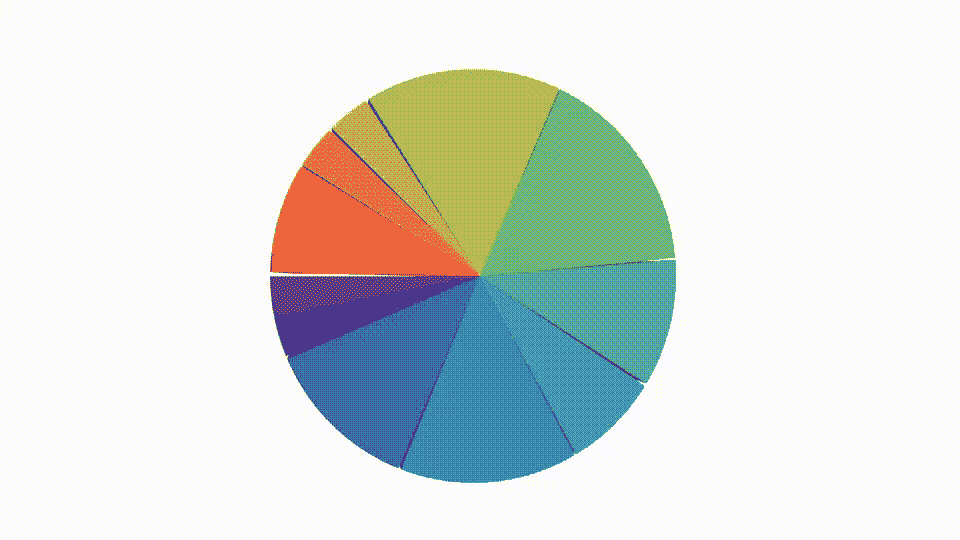
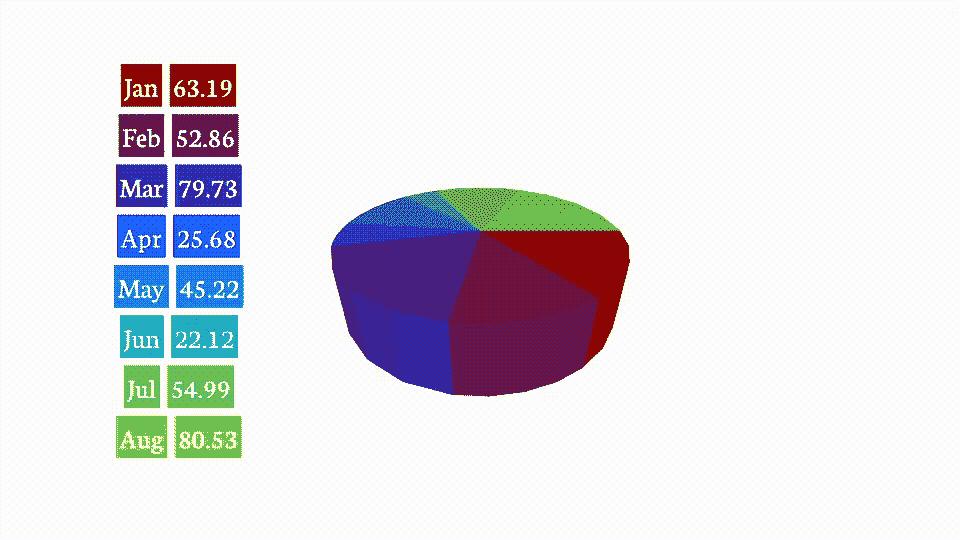
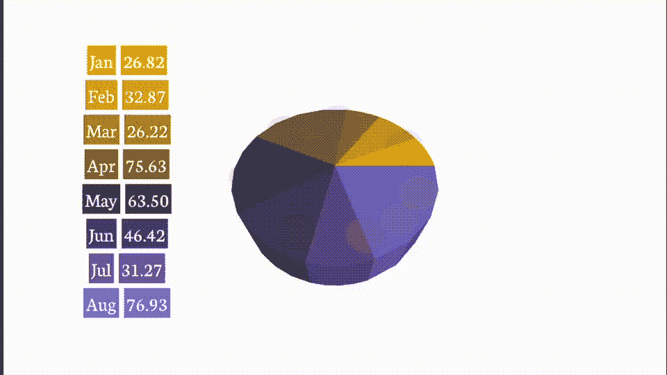

# 使用 SceneKit 和 SwiftUI 构建 3D 饼图

> 原文：<https://betterprogramming.pub/build-a-3d-pie-chart-using-scenekit-and-swiftui-423f24fc765a>

## 交互式三维饼图



交互式三维饼图

上个月，在苹果宣布 WWDC 2022 的图表之前，我写了一篇关于[使用 SceneKit](https://medium.com/p/789a2631ef6f) 创建 3D 条形图的文章。我向你保证，这完全是巧合。一篇受到好评的论文。

因此，本月用 SceneKit 构建 3D 饼图时，给予相同的待遇是完全合理的。除此之外，这也是一个很好的借口来仔细研究 SceneKit 框架的其他几个方面，在过去的一两个月里，我已经就这个主题写了六篇文章，但是还没有涉及到这些方面。

## 乐计划

接下来的计划是使用我在这篇[文章](https://medium.com/analytics-vidhya/shapes-with-paths-using-swiftui-part4-954853cd47c9)中谈到的数学来为一个`SCNShape`节点构建路径。我将使用我在 SceneKit [文章](/build-a-3d-bar-chart-in-scenekit-with-swiftui-789a2631ef6f)中为这个 3D 条形图开发的代码制作一个演示应用程序。

# 编码

我以 so 开头..当然，通过寻找一个`SCNShape`实现的好例子。第一个目标是用这里展示的基本代码构建一个切片。



一片馅饼

请注意，尽管苹果称之为贝塞尔路径，但它似乎只不过是一条路径。你可以查看我写的关于贝塞尔路径的更多信息，这里是，[这里是](/using-de-casteljaus-algorithm-bezier-curves-in-swiftui-3dcadd62635e)，这里是[这里是](/a-better-bezier-curve-a-polynomial-in-swiftui-e0807e9cc214)。

bon——我给自己设定的下一个挑战是构建一个完整的切片饼——另一个看起来像这样相当容易的胜利。



三维饼图

# 分离切片

好吧，但你我都知道大多数馅饼都想拿一片做个例子，比如说最大的一片——事实上，许多馅饼都拿所有的部分做个例子。一个需要一段时间来完善的问题。简而言之，对于每个切片，我查看中心线，计算偏移并创建偏移切片。

```
let r = startAngle - ((startAngle - endAngle) / 2)
let radians4 = Double(r) * Double.pi / 180.0
osx = Double(center.x) + Double(radius.width / 4) * Double(cos(radians4))
osy = Double(center.y) + Double(radius.height / 4) * sin(radians4)
os.append(CGPoint(x: osx, y: osy))
```

我添加了几个订阅来通过我的 SwiftUI HUD 运行动画，并包括了图例和文本标签。

使用 SceneKit & SwiftUI 构建的 3D 饼图

您看到的是一系列永无止境的 SCNTransactions，它们在每个切片的两个可能位置之间执行 SCNMorphs。

# 调整切片大小

现在，最后一个挑战是根据命令调整切片的大小。我很快发现，这项工作比我在当前设计中想象的要难。我使用`SCNMorph`方法编写的初始代码悲惨地失败了，出现了严重的崩溃。

**错误:变形:目标顶点数与基础顶点数不匹配(268！= 258)**

问题是如果你使用变形，形状的几何形状**必须**匹配，因为它们需要有相同数量的顶点。我的初始代码有一个问题，因为使用的数字顶点是它所代表的值的反映，所以更大的切片有更多的度数。

我停下来写了一两个小时的代码，勾画了一些如何解决这个问题的想法。最终的修复比我最初想象的要简单得多。我做的修改是将这条线添加到创建贝塞尔路径的循环中。

```
**let steps = (endAngle - startAngle) / 16**
```

完成后，我可以在不同的饼图切片之间快速变换，尽管这样做的效果有点奇怪。



三维饼图，动态调整大小

# 排序切片

我决定看看如果我整理我的馅饼，事情会不会变得更好。和以前一样，这是我添加到更改方法中的一行程序。

```
**share.pie.sort { $0.value > $1.value }**
```

我重新调整了饼图的大小，但是并没有什么不同。我仔细查看了代码十几次，但是我找不到对我稍后将向您展示的行为的解释。如果你能发现问题，请在评论中分享。

# 实现触摸

是的，我确实说过最后一个任务是最后一个，但是在做了修改之后，我决定我也要做 touch。现在我尝试用 SceneKit 域实现了一些东西，这样当你触摸一个切片时，它会移出并移回。

但是——你没有 touch[除非你使用主机控制器实现场景]——你必须在 SwiftUI 中捕捉手势，然后尝试将所述坐标映射回 SceneKit。

尽管我尽了最大努力，但还是没有找到一个好的解决方案——我决定采用一个更简单的方法，使用 SwiftUI 覆盖；最后的结果相当不错。
在我翻转饼图之前，你可以看到我放置的 SwiftUI 覆盖图，让你可以选择饼图的一部分。



交互式三维饼图

您可以看到我放置的覆盖图，当我翻转饼图时，它可以让您选择一块饼图。

# 结论

和以往一样，一个我认为会很快成功的项目，因为我相信我已经完成了大部分工作，结果比我想象的更具挑战性。

你可以在这里下载完整的代码——注意，我还没有清理它。就是你在上一张动画 GIF 里看到的版本。