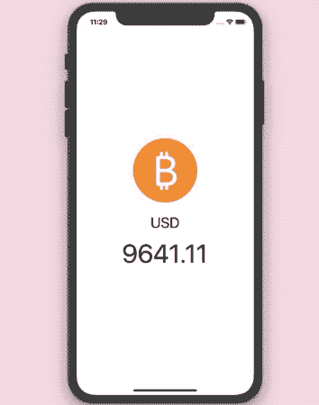
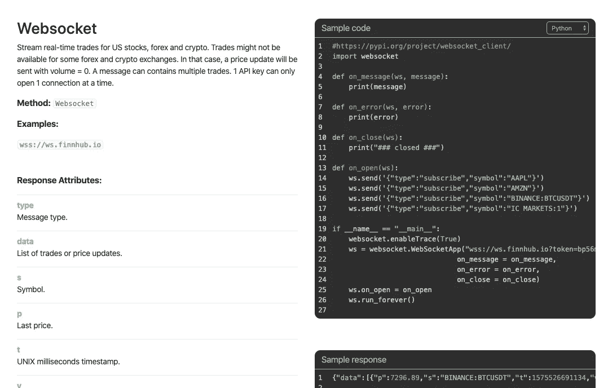
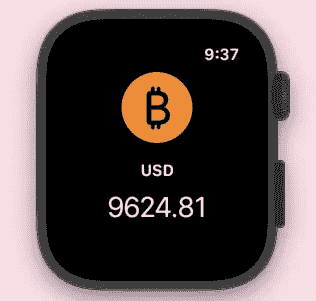

# 在 SwiftUI 中构建比特币价格行情

> 原文：<https://betterprogramming.pub/build-a-bitcoin-price-ticker-in-swiftui-b16d9ca566a8>

## 利用 iOS 13 的 WebSockets 显示实时加密货币更新

*编者按:本文并非投资建议，仅供娱乐和教育之用。*


德米特里·德米德科在 [Unsplash](https://unsplash.com?utm_source=medium&utm_medium=referral) 上拍摄的照片

WebSockets 以前在 [WebView](https://developer.android.com/reference/android/webkit/WebView) 的 Javascript API 下得到支持。随着 iOS 13 和 macOS Catalina 的推出，苹果在他们的网络框架中引入了这个协议——URL session 和 Network。

# WebSocket 的需求是什么？

以前，对于双向数据通信，我们要么使用轮询、长轮询，要么触发静默推送通知。

虽然定期轮询会导致大量请求，其中许多请求不会返回新数据，但是发送太多静默推送通知也是没有效率的。很多时候，通知不是实时收到的。

长轮询是三种轮询中较好的一种，它是轮询的一种扩展，可以保持活动连接。但是它也有缺点——每个请求都有 HTTP 开销，并且需要在服务器上维护额外的复杂性。

谢天谢地，没有任何 HTTP 开销的 WebSocket 协议拯救了我们。

一旦客户端向服务器发送一个 WebSocket 连接请求，就会创建一个双向流，允许从任何一端发送和接收消息(不是请求)。

通常，WebSockets 用于聊天应用程序和多人游戏中。

# 我们的目标

*   在接下来的小节中，我们将看到如何在客户端用我们的`URLSession`构建一个 WebSocket。
*   此外，我们将创建一个基于 SwiftUI 和[组合](https://developer.apple.com/documentation/combine)的 iOS 应用程序，该应用程序使用 WebSockets 从 API 接收实时比特币价格更新。

下面是这篇文章结束时我们将实现的一瞥:



# 具有 URLSession 的 WebSockets

`[URLSessionWebSocketTask](https://developer.apple.com/documentation/foundation/urlsessionwebsockettask)`让用`URLSession`创建 WebSocket 变得非常容易。

以下是 WebSocket 连接的五个核心组件。

## **1。打开连接**

```
let urlSession = URLSession(configuration: .default)let webSocketTask = urlSession.webSocketTask(with: "wss://ws.finnhub.io?token=XYZ")webSocketTask.resume()
```

## **2。以字符串或数据形式发送消息**

```
webSocketTask.send(.string("Hello")){error in ...}
```

## **3。接收封装在结果类型中的消息**

```
webSocketTask.receive{result in  ...}
```

## **4。断开**

```
webSocketTask.cancel(with: .goingAway, reason: nil)
```

## 5.乒乓球

此外，我们可以设置一个 ping 来验证并确保连接是活动的，并返回一个 pong，如下所示:

```
webSocketTask?.sendPing { (error) in ... }
```

# 使用 WebSockets 的 SwiftUI 比特币价格报价器

为了获得实时加密货币更新，我生成了一个 API 密钥，并使用了来自这个网站的 WebSocket URL。



来自 [Finnhub](https://finnhub.io/docs/api#websocket-price) 的截屏

以下 SwiftUI 视图由一个图像组成，该图像包含一个带有前景色设置的 [SF 符号](https://developer.apple.com/design/human-interface-guidelines/sf-symbols/)，以及一个显示实时价格更新的文本:

`priceResult`需要从`ObservableObject`类— `WebSocketService.swift`中发布，我们将在下面看到:

在上面的代码中，我们定义了一些属性，并在`init`方法中设置了一个订阅。你需要用你自己生成的 API 密匙替换`XYZ`。

发布服务器上使用的操作符很重要。`Debounce`用于降低实时更新的速度，而`removeDuplicates`用于仅发送那些与先前值不同的更新。

为了手动发布对 SwiftUI 视图的更改，当联合订阅更新`priceResult`属性时，会触发`didChange.send()`。

下面给出了构建 WebSocket `URLSession`的`WebSocketService`类的剩余部分:

以下结构模型用于解码 API 响应:

在 watchOS 模拟器上构建应用程序时，我得出了以下结果:



# 结论

在上面的实时比特币价格更新实现中，我们看到了 Combine 操作符在 SwiftUI 中控制数据流的能力。

WebSockets 应该理想地用于发送小块消息。数据传输速度很快。

上述应用程序的完整源代码可以在 [GitHub 资源库](https://github.com/anupamchugh/iowncode/tree/master/SwiftUIWebSockets)中找到。

这一篇就到此为止——感谢阅读。