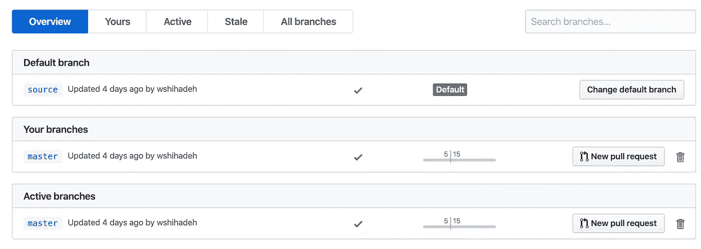
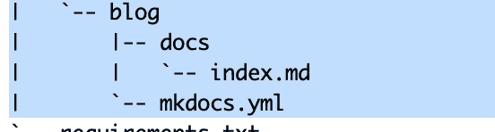
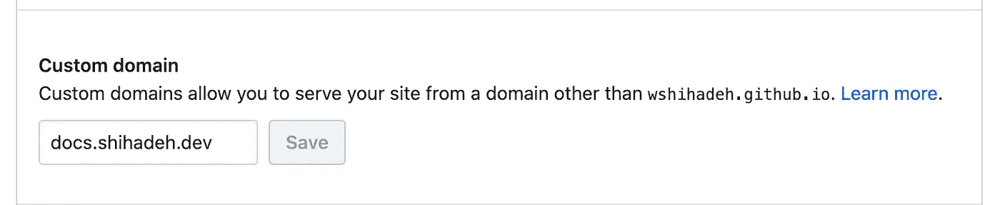
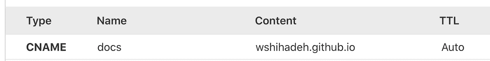

# 用 GitHub 和 MkDocs 建立一个博客

> 原文：<https://betterprogramming.pub/build-a-blog-with-github-and-mkdocs-cf47914affa7>

## 在 GitHub 页面上免费发布你的 Markdown 博客


[Belo Rio 工作室](https://unsplash.com/@beloriostudio?utm_source=medium&utm_medium=referral)在 [Unsplash](https://unsplash.com?utm_source=medium&utm_medium=referral) 拍摄的照片。

建立和托管个人博客有很多选择。可以使用一个知名的博客平台，比如 [WordPress](https://makeawebsitehub.com/choose-right-blogging-platform/#wordpressorg) 、 [Blogger](https://makeawebsitehub.com/choose-right-blogging-platform/#blogger) 和 [Tumblr](https://makeawebsitehub.com/choose-right-blogging-platform/#tumblr) 来托管你的博客。有了这个选项，你不需要担心维护博客的基础设施和博客平台。

另一方面，你可以在一个云提供商上托管自己的博客。下面是一篇资料丰富的文章，描述了如何使用 Ghost 和 DigitalOcean 来完成这项任务:

[](https://myedes.io/ghost-on-docker/) [## 我如何在 Docker 上用 Nginx 和 MariaDB 运行我的 Ghost 博客

### 在这篇博文中，我将描述我是如何建立我的博客的:我一直想开一个我的个人博客…

myedes.io](https://myedes.io/ghost-on-docker/) 

上面提到的所有选项都有一些缺点:

*   你必须维护基础设施。
*   它不是免费的。
*   编辑博客文章并不舒服(至少对我来说)。

创建博客主机的另一个选择是使用 [GitHub 页面](https://pages.github.com/)。GitHub 的这项服务提供了一种为单个项目存储库或 GitHub 组织/帐户构建静态网页的方法。在本文中，我们将一步一步地解释如何使用 GitHub 页面来托管个性化博客。

# **GitHub 存储库设置**

使用 GitHub 托管您的个性化博客的第一步是在 GitHub 上创建和配置一个专用的存储库来托管博客文件。存储库名称应该采用以下模式:`${account}.github.io`。

这个存储库的主分支将被用作 GitHub 页面的静态文件的源。一旦实施了新的更改，这些文件将自动生成。因此，我们需要在存储库上创建另一个分支来存储博文文件的源。下图显示了如何在存储库中创建分支:



# **管理博客内容**

GitHub Pages 旨在托管和服务组织存储库主分支上的静态页面。这意味着如果您将一个名为`index.html`的 HTML 文件提交到存储库的主分支，它将被自动部署并显示到您的 GitHub Pages 地址。然而，我们的目标不是用 HTML 写博文(那样一点也不方便)。我们可以使用一个静态站点生成器来生成 HTML 文件，而不是等待 HTML 页面。

有几个工具可以用来生成静态 HTML 文件，比如 [VuePress](https://vuepress.vuejs.org/) 、 [Jekyll](https://jekyllrb.com/) 和 [MkDocs](https://www.mkdocs.org/) 。这些工具允许我们将 Markdown 文件转换成 HTML 文件。在本文中，我将演示如何使用 MkDocs 来生成 HTML 静态文件。但是，也可以使用其他工具来执行相同的任务。下面是建立新的 MkDocs 项目所需的步骤。

*   在本地克隆存储库并签出源分支:

```
$> git clone ${repo_url}
$> cd ${repo_path}
$> git checkout -b source 
```

*   创建新项目。可以使用`mkdocs`命令行创建一个新项目，如下面的代码片段所示:

```
$> mkdocs new blog
```

上面的命令将创建如下文件，如下图所示(如果不想安装`mkdocs`命令，可以手动创建这些文件):

→ `mkdocs.yml`:项目配置文件

→ `docs`:存储所有降价文件的文件夹

→ `index.md`:包含`index.html`文件内容的 Markdown



默认配置文件只包括站点名称配置。但是，还有其他几种配置可以添加到该文件中，例如:

*   站点全局配置，如名称、描述和作者
*   用于生成静态文件的主题
*   额外资产，如 CSS 文件或 JavaScript 文件
*   插件和降价扩展
*   站点树或导航栏

以下是配置文件的示例:

要在本地提供和显示静态文件，您可以执行下面的命令，并且您将能够在本地主机的端口 8080 上查看站点:

```
$> mkdocs serve
```

# **将解决方案归档**

因为我不想在本地安装`mkdocs`,并且我计划在博客上自动生成和部署新的变更，所以我决定实现以下操作:

*   使用 Docker 生成静态文件:通过引入包含`mkdocs`命令行的 Docker 映像并使用 Docker 卷来获得生成文件的副本，就可以简单地完成这个任务。下面的 Docker 文件可用于构建 Docker 映像。这个映像基本上是一个 alpine Docker 映像，它包含了`mkdocs`所需的所有库(在 requirements.txt 中定义):

使用下面的 Docker 命令，我们可以构建 Docker 映像并在`site`文件夹中生成静态文件:

```
$> docker build -t mkdocs-image .
$> docker run --rm -v $(CURDIR):/mkdocs mkdocs-image  sh -c "mkdocs build && chown -R $(shell id -u):$(shell id -g) ./site"
```

*   在部署之前验证和 lint Markdown:为了完成这个任务，我们可以使用 [markdownlint](https://github.com/DavidAnson/markdownlint) 静态分析器。下面的 shell 脚本可用于检查和验证`docs`文件夹下的所有降价文件:

因为限制过程也需要使用 Docker 容器来完成，所以我们需要使用一个定制的 Docker 映像，它包括 [markdownlint](https://github.com/DavidAnson/markdownlint) 命令行:

使用下面的命令，我们可以触发林挺脚本:

```
$> docker build -t linting-image .
$> docker run --rm -v $(CURDIR):/app linting-image /lint.sh
```

为了使命令的执行更容易、更舒适，我们可以使用下面的 Makefile，它包含了前面提到的所有命令:

使用上面的 Makefile，可以使用下面的命令来生成和验证静态文件:

```
$> make docs
```

# **自动化博客的部署**

最后一项任务是自动部署到 GitHub 页面，而不是手动生成静态文件并将其推送到主分支。这个任务在 GitHub Actions 的帮助下可以轻松完成。在部署期间，需要执行以下操作:

*   执行`make docs`生成静态文件的最新副本。
*   将生成的文件推送到 GitHub 存储库的主分支。

下面的 GitHub 流程在每次`source`分支自动更新时触发这些动作:

# **使用自定义域名**

我不想使用 GitHub 域名，而是想在我的个人域名上使用一个子域。可以使用以下操作来完成此任务:

*   在 GitHub 存储库上设置一个自定义域，如下图所示:



*   添加 CNAME DNS 记录，将流量从自定义域重定向到 GitHub 域，如下图所示:



# **结论**

有几个选择来托管和建立个人博客。本文强调了其中一个选项。它依赖于 GitHub 页面和一个静态站点生成器(`mkdocs`)。

我喜欢这种方法，原因如下:

*   博客文章使用 Markdown 格式编写，编辑和修改非常容易。
*   博客文章被持久化并存储在版本控制和 Git 中。
*   博客的部署是自动完成的。

我博客的完整实现可以在 GitHub 上找到[。](https://github.com/wshihadeh/wshihadeh.github.io)