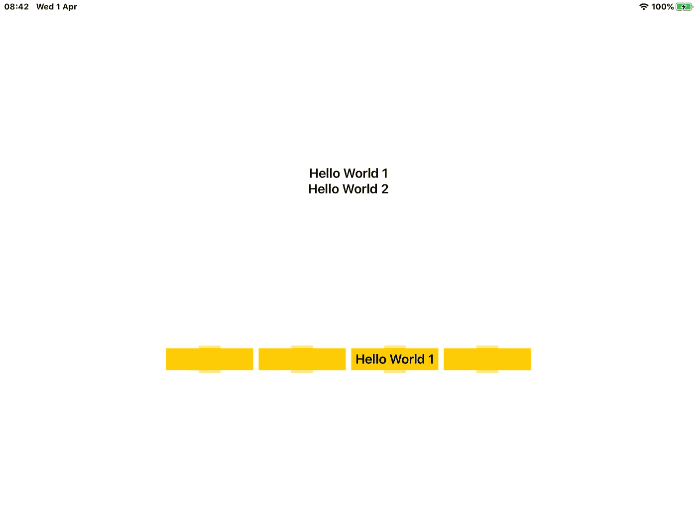

# 构建一个没有政治的棋盘游戏(第 1 部分)

> 原文：<https://betterprogramming.pub/build-a-board-game-without-the-politics-part-1-3f17f29eeb0b>

## 通过拖放使用 SwiftUI


Randy Fath 在 [Unsplash](https://unsplash.com?utm_source=medium&utm_medium=referral) 上拍摄的照片。

本文基于 iOS 11.4 和 2020 年 3 月下旬发布的 Swift 5 的一个版本。警告:如果你还没有更新你的 iDevice 和/或 Xcode，显然它不会工作。

在本文中，我将通过几个例子来介绍新的拖放协议的构建。最终目标是创建一个迷你数独板，然后您可以填充它。我们的目标只是创建一个你可以拖动棋子的板子。当然，它可以是你想尝试和构建的任何棋盘游戏的任何棋盘。

在潜入太深之前，让我们先把脚弄湿。在我们的实现中，我们会发现 SwiftUI 和拖放有一些小问题——其中最明显的是 SwiftUI 不鼓励您访问任何坐标。事实上，要做到这一点，您必须实现特定的视图。

SwiftUI 中的那个视图被称为`GeometryReader`。它是一个容器，您可以在其中读取用于布局应用程序的值。随着时间的推移，这是一个拖放障碍的原因将变得更加清楚。

让我们从一些简单的`GeometryReader`例子开始。

创建一个新项目并更改`ContentView.swift`，使其看起来像这样，用`GeometryReader`封装标签:

运行它，它会报告你的设备的尺寸。是的，是的，我知道这不是你想要的。`GeometryReader`返回从运行视图的父视图中获取的值。因此，为了获得文本“Hello World”的坐标，我们需要在标签的视图中运行`GeometryReader`。这段代码将完成这个任务:

它是做什么的？它在我们的文本框的背景视图中绘制了一个零尺寸的矩形，并返回它用来这样做的坐标。其父视图的坐标。我添加了一个`onTapGesture`标签，这样你也可以看到这些数字，并画了一个黄色的小圆圈来表示返回了哪个坐标。

就这么简单。让我们接着吃主菜。配置`drag`是小菜一碟，而配置`drop`就不那么容易了。让我们尝试将它添加到我们的“Hello World”部分:

我需要做三件事:

*   定义一个`dropDelegate`呼叫。
*   对象的可删除标签(在本例中是 my `Text Object`)。
*   一个我可以把它放在上面的对象。

`dropDelegate`本质上是模板代码，唯一有挑战性的位出现在末尾前几行——用于解码被拾取的对象并将其分配到正确位置的行:

此时，您应该能够编译和运行了。将“Hello World”从家中拖到黄色方框中。

好的，我注意到你根本没有拖《Hello World》。原文还在。官方的做法是添加一个`dropProposal`，虽然在撰写本文时，这似乎还没有在 iOS SwiftUI 中实现。我记录了与苹果的通话，如果我错了，我会更新这个。你可能也注意到了我们拖动的图像没有出现——这是我还在探索的另一个 iOS 功能。

后一个问题目前仍未解决。我找到了一种绕过前者的方法，即使这不是官方路线。代码如下:

但是我们需要实现一些东西，让我可以拖动“Hello World”到多个框中。让我们保持简单。创建两个黄色的盒子并使其工作。您需要更改顶部的代码来构建一个包含两个框的界面:

将该方法添加到您的`dropDelegate`结构中。显然，我没有实现我的“修复”,因此我可以将“Hello World”拖动到两个框中:

你发现那里的障碍了吗？`DropTarget`方法不是模板的一部分。它是我的。它使用你的设备的尺寸来计算哪个盒子在调用`dropDelegate`。想象一下，你有一个完整的网格要做。你需要一种方法来知道你的网格把你的盒子放在了界面的什么地方。你需要坐标。你需要那个禁果。

让我们使用`insideView`方法创建一个坐标数组。然后我们可以用我们的坐标把这个例子带到下一个层次。让我们把标签的数量和盒子的数量增加一倍。我们需要胸怀大志。

我们的新`ContentView`看起来像这样:

重要的变化。我们升级了`InsideView`，现在它可以在一个数组中记录它的测量值。我还为我们的拖放目标引入了一个循环，这样我们就可以很容易地生成更多的拖放目标。我不知道…

升级了`insideView`之后，我需要修改`dropTarget`，以便它现在使用`rect` 数组来识别它需要更新哪个盒子:

您还需要更新`TheDropDelegate`方法，以反映它现在也引用一个数组的事实:

```
struct TheDropDelegate: DropDelegate {
@Binding var textID:Int
@Binding var textText:[String]
@Binding var rect:[CGRect]
```

好了，你应该会编译运行了。这一次，你会有“Hello World 1”和“Hello World 2”，你可以将其中任何一个拖到下面四个黄色方框中的任何一个。



这就是你要的:拖放的绝对要素，没有任何花哨的东西。继续读。在本系列的第 2 部分中，我们将把事情推向无限甚至更远。嗯…差不多了。