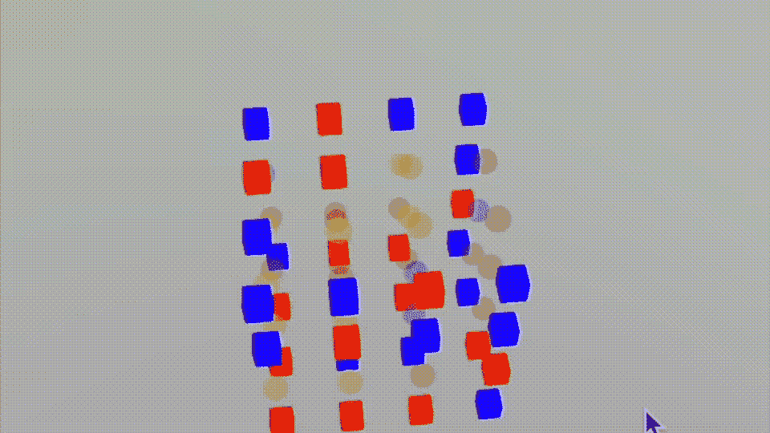
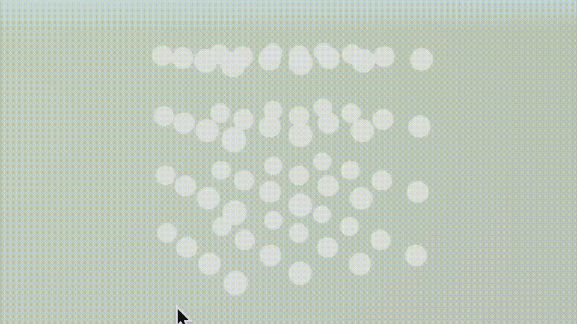
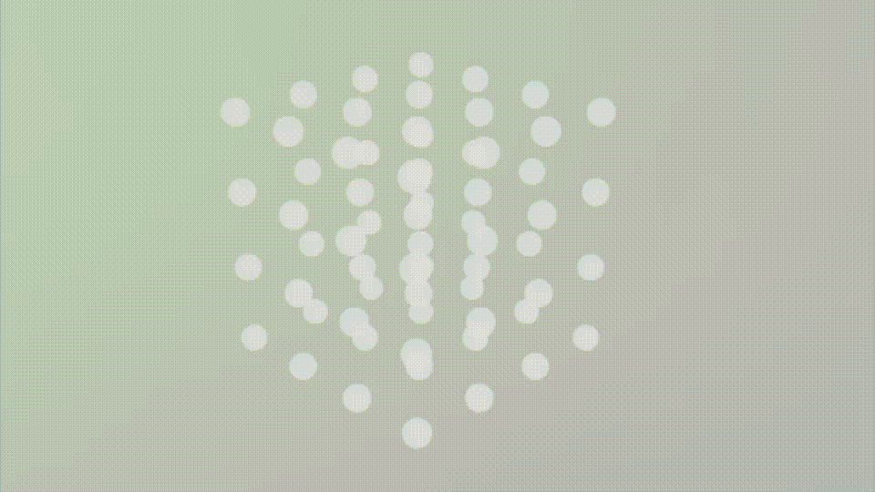

# 在 SwiftUI 下的 SceneKit 中为你的 3D 井字游戏构建一个机器人

> 原文：<https://betterprogramming.pub/build-a-bot-for-your-3d-tic-tac-toe-game-in-scenekit-under-swiftui-6c5d22d5aaa7>

## 和电脑玩量子游戏



和电脑玩量子游戏

描述如何创建一个 3D 井字游戏的论文的延续。

# 确认

从我离开的地方开始，我需要验证我有所有的获胜线。我在 hit-winning 方法中添加了一些内容，向我展示了我可以在每个标记的方块中找到的所有可能的线条。



在 4x4x4 的底座上，可以看到一条缺失的获奖线

当我继续玩游戏时，我纠正了缺失的环节。维基百科告诉我我应该有 74 个；我考了 64；如果您下载并试用代码，请与我和其他人分享缺失的链接。

这里的代码将`debugX`命名为 subscription，我将选择一个节点时发现的获胜行的副本发送给这个例程。我给另一个玩家用了不同颜色的线。新手柄背后的代码变得越来越复杂。

Bon，当我到处玩的时候，很明显，角节点是最有价值的，其次是边——当我考虑构建一个自动化代理时，我会考虑这些信息。看着节点改变方向，很明显镜像角落移动看起来是最好的防守策略之一。



两个节点都有权利的任何线路实际上都是失败的原因；蓝色和橙色节点所在的中心对角线上有一个已注册的节点，这就是我们手头的例子——你可以在这里看到非常暗的黄色线条。

在这张 GIF 动画中，你可以看到蓝色玩家至少选择了一个静止节点的线上的浅蓝色节点。浅红色节点是橙色玩家至少选择了一个节点的线。黄色/绿色的节点实际上是“丢失”的节点，红色和蓝色都不能赢得游戏选择。白色节点位于“自由”线上，红色和蓝色都还没有要求。

我尝试了一些不同的想法，但最终确定了一个结构，它将每行中使用的节点数存储在三个数组中。第一个是包含在该行中的节点，第二个是使用的节点，第三个是仍待选择的节点——我称之为自由节点。

```
struct MetaMatrix {
  var redCount: Int = 0
  var blueCount: Int = 0
  var line:[SIMD3<Int>?]
  var used:[SIMD3<Int>?]
  var free:[SIMD3<Int>?]
}private var shared:[Int:MetaMatrix] = [:]
```

## 下一步

然后，我开始采用一个简单的防御策略，使用概述的结构。机器人用它来判断你应该选择哪一行。

它看起来很有希望，尽管当我玩游戏时，很明显我需要更多。我需要机器人也能赢。最后，我只用了四条规则，按照显示的顺序进行。

*   如果蓝玩家[你]连续三次，阻挡他们。
*   如果红色玩家[bot]连续三个，则结束游戏！
*   如果红色玩家[bot]已经开始了一条线，那么继续，直到你被封锁或者获胜！
*   如果规则 1-3 不可执行，随机选择一个空闲节点；最好是还没拍过的:)

老实说，规则 2 和 3 有点太简单了；你玩游戏就知道了。在一个理想的世界里，你需要一些更复杂的东西。代码中类似这样的规则。

这个视频展示了一个完整的游戏。我在这里玩了十几个或者更多的乐趣；尽管说实话，您需要做一些更正式的测试，但是可能的排列数量是很大的。

蓝色最终赢了——我比机器人聪明吗——不确定；也许代码还不是很完美。

所有这些把我带到了这篇短文的结尾，这是一个只有 600 多行代码的好游戏。Y

你可以从 GitHub 库下载工作代码——这里非常欢迎你为机器人提出一些更好的规则。

所有这些让我想到这篇短文的结尾。我希望你喜欢读它，就像我喜欢写它一样。