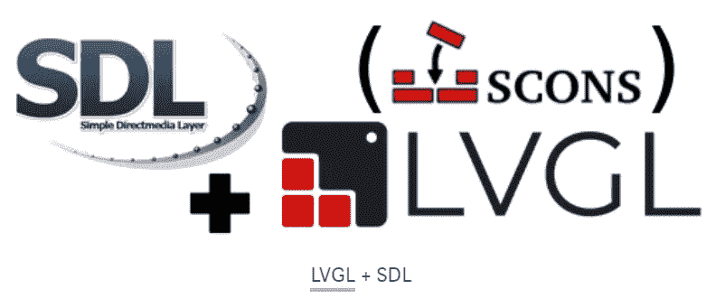

# 用 LVGL 和 SDL2 作为后端构建一个 C GUI 应用程序

> 原文：<https://betterprogramming.pub/build-a-c-gui-application-with-lvgl-and-a-sdl2-as-the-backend-85a07ee94a9f>

## 为任何显示类型创建漂亮的用户界面



今天，我想谈谈小虚拟图形库，简称 LVGL。这是一个最高质量的软件项目，近年来对我非常有用。

总之，它的名字足够描述它了。这是一个用 C 语言编写的 GUI 库，旨在构建图形应用程序。问题是它是硬件不可知的；它不依赖于操作系统或特定的硬件(如显示器)来工作。它主要针对嵌入式设备——或者至少是高度专业化的接口——而不是一般的 PC 环境。

它无处不在的特性使得它可以毫不费力地移植到许多不同的平台上。然而，正如我很快将向您展示的，硬件不可知并不排除作为 PC 的常规 UI 框架工作的可能性——事实上，它比大多数其他库表现得更好。

下面的教程是基于截止到写作日期的最后一个 LVGL 版本，8.3。

# 简单而美丽

LVGL 诞生于在许多平台上使用单一 UI 库的愿望。为了实现这一点，我们必须将 GUI 开发的每一个方面抽象出来，不可避免地与底层硬件联系在一起。

事实证明，这并不多:对于 LVGL 应该呈现的每个监视器，开发人员必须实例化一个`lv_disp_drv_t`实例。这是将库与屏幕上的实际像素联系起来的接口。除了 RAM 中需要一个明显的缓冲区之外，这个接口还需要一个函数指针来完成所有繁重的工作:

```
void (*flush_cb)(struct _lv_disp_drv_t * disp_drv, const lv_area_t * area, lv_color_t * color_p);
```

> 注意:`*lv_disp_drv_t*`结构包含许多其他可以初始化的函数指针，但没有一个是严格要求的。
> 有用于性能监控的钩子和用于极限情况的可选快捷方式。

这个函数将被 LVGL 内部调用，以表示一个矩形`area`将被绘制在屏幕上。


flush_cb 回调充当硬件和库之间接口

如何实现取决于开发人员。它可以将 SPI 连接上的数据发送到串行显示器；通过 Linux framebuffer 接口在 HDMI 监视器上写像素；将生成的图像转储到 PNG 文件中，甚至通过网络连接。

库的其余部分完全不知道边界之外发生了什么，只满足于在提供的 RAM 缓冲区中绘制 UI 界面。

尽管非常简单，但这种方法非常有效。
我一直和 LVGL 在几十个不同的目标上合作(分辨率、颜色格式、硬件、处理器架构，你能想到的)，同时用同样熟悉的 API 进行开发。

人们可以将 LVGL 描述为 UI 架构的前端部分。它提供了小部件、绘图例程和输入控制。

就其本身而言，它不起作用；它需要插入一个后端来在屏幕上显示图像。

为了向您展示如何在不掌握特定硬件的情况下构建 LVGL 应用程序，我将针对 SDL2 后端，以便应用程序可以在任何具有窗口管理器的机器上呈现。

即使最终结果在 PC 上运行，这也是任何嵌入式目标的指南。当然，还应该提供合适的显示驱动程序。

# 要求

至少需要一个 C 编译器。我将使用 gcc，但我不明白为什么 clang 不应该工作。

我将使用 [SCons](https://scons.org/) 来构建项目。这是一个优雅而有效的构建系统，我已经在这里广泛地称赞过它了。它可以作为软件包安装，也可以通过 pip 安装。

由于我们将使用 SDL2 后端，因此必须安装相应的库(在其开发形式中);它在每个发行版中都作为官方包提供。

最后，我使用 git 来管理 LVGL 和类似的源代码依赖项，但是只需下载源代码并将其复制到项目中就可以了。

这就是开始的全部内容。

# 该项目

我喜欢把我的 C 项目分成两个主文件夹:`main`和`components`(很大程度上受 [ESP-IDF 项目](https://github.com/espressif/esp-idf-template)的启发)。

`main`文件夹将包含我的代码，而在`components`中，我将添加所有的外部库。

要包含 LVGL，进入`components`目录并运行以下命令:

```
cd components
git clone https://github.com/lvgl/lvgl.git
git checkout --track origin/release/v8.3
```

最后一个命令确保我们使用的是库的 8.3 版本，这是撰写本文时最新的稳定版本。

在使用 LVGL 之前，应该先进行配置；它通过一个简单的头文件来实现。

你可以在`components/lvgl/lv_conf_template.h`中找到一个模板:你应该创建文件夹`main/config`并复制到那里，重命名为`lv_conf.h`。

```
mkdir main/config
cp components/lvgl/lv_conf_template.h main/config/lv_conf.h
```

> 注意:LVGL 集成了一些特定的框架，这些框架也管理它与其他工具(例如 KConfig)的配置。
> 这里不是这种情况，所以我们将直接编辑头文件。

首先，必须通过在第 15 行手动更改预处理器保护来启用配置文件:

```
/**
 * @file lv_conf.h
 * Configuration file for v8.3.3
 */
/*
 * Copy this file as `lv_conf.h`
 * 1\. simply next to the `lvgl` folder
 * 2\. or any other places and
 *    - define `LV_CONF_INCLUDE_SIMPLE`
 *    - add the path as include path
 */
/* clang-format off */
#if 0 /*Set it to "1" to enable content*/   // <-- Change this 0 to 1
#ifndef LV_CONF_H
#define LV_CONF_H
// ...
```

有许多配置选项，但在这个阶段，默认值已经足够好了。

它们中大多数的重要性很大程度上取决于目标的具体情况:例如，`LV_COLOR_DEPTH`应该由 LVGL 正在使用的显示器的功能来设置。此处的错误值通常会导致屏幕上的输出混乱；然而，SDL 几乎可以处理任何可用的格式，所以这与我们无关。

下一步是编写最少的初始化代码，并设置构建系统。创建包含以下内容的文件`main/main.c`:

```
#include <stdio.h>
#include <unistd.h>
#include "lvgl.h" 
```

```
int main(void) {
    // What oh, LVGL!
    lv_init();
    printf("Begin main loop\n");
    for (;;) {
        // Run LVGL engine
        lv_tick_inc(1);
        lv_timer_handler();
        usleep(1000);
    }
    return 0;
}
```

这将是我们应用程序的起点和跳动的心脏。
包含的内容很简单:`stdio.h`在终端上打印内容，`unistd.h`访问`usleep`功能，当然还有`lvgl.h`图形库。

这里只有两点有趣:

1.  `lv_init()`初始化库。在做任何与 LVGL 相关的事情之前，必须调用它。
2.  `lv_tick_inc(1)`和`lv_timer_handler()`是 LVGL 实际工作的地方。

后一个调用是运行绘图引擎和管理输入设备和周期性任务所需要的。在内心深处的某个地方，在某个时刻，`flush_cb`回调将与实际屏幕交互。
前者通知引擎已经过了一些时间单位——在本例中是一个单位。这隐含地计算毫秒数。

有点简单，但这已经可以被称为 LVGL 应用程序了。我们最终将添加一个 SDL2 驱动程序，但现在，让我们开始编译。

# 建筑物

如前所述，我在这个项目中使用 SCons。下面是`SConstruct`文件:

```
import os
import multiprocessing
from pathlib import Path
# Name of the application
PROGRAM = "app"
# Project paths
MAIN = "main"
COMPONENTS = "components"
CONFIG = f"{MAIN}/config"
LVGL = f"{COMPONENTS}/lvgl"
# Compilation flags
CFLAGS = ["-Wall", "-Wextra", "-g", "-O0", ]
CPPPATH = [COMPONENTS, MAIN, LVGL, CONFIG]
CPPDEFINES = ["LV_CONF_INCLUDE_SIMPLE"]
def main():
    # If not specified, guess how many threads the task can be split into
    num_cpu = multiprocessing.cpu_count()
    SetOption("num_jobs", num_cpu)
    print("Running with -j {}".format(GetOption("num_jobs")))
    env_options = {
        "CPPPATH": CPPPATH,
        "CPPDEFINES": CPPDEFINES,
        "CCFLAGS": CFLAGS,
    }
    env = Environment(**env_options)
    # Project sources
    sources = [File(filename) for filename in Path(
        f"{MAIN}").rglob("*.c")]  # application files
    sources += [File(filename)
                for filename in Path(f"{LVGL}/src").rglob("*.c")]  # LVGL
    env.Program(PROGRAM, sources) 
```

```
main()
```

在文件的开头，我声明了一些有用的常量，比如程序名、每个主要组件的路径和一些编译标志。

其中，有两个非常重要:

1.  LVGL 源代码所在的文件夹应该包含在`CPPPATH`中，以确保可以找到它的头文件。
2.  在整个项目中，宏`LV_CONF_INCLUDE_SIMPLE`被定义。这是一个额外的配置位，告诉 LVGL 它可以在包含路径中找到文件`lv_conf.h`。否则，它将寻找`../../lv_conf.h`，这不是我们存储它的地方。

`main` python 函数是定义建筑层次的地方。
首先，我们告诉 SCons 应该运行多少个作业，这取决于处理器内核的数量:LVGL 是一个中等大小的库，如果可能的话，我们应该利用并行编译。

然后，我们使用所有先前定义的编译标志实例化一个构建环境。

最后，所有的。来自 LVGL 和我们的应用程序的 c 源文件应该收集在一个列表中，并指定为最终可执行文件的依赖项。
为此，我利用了来自`pathlib` Python 库的`Path`对象，它允许我递归搜索文件夹中所有匹配正则表达式的文件。

目前，这个项目中只有两个文件夹有源代码:`main`和`components/lvgl/src`。

`env.Program(PROGRAM, sources)`最终确定行动。运行`scons`现在应该可以编译所有内容，并且可以执行结果`app`。

当然，这除了在终端上打印“Begin main loop”之外什么也没做，但是到目前为止，我们已经打下了基础。让我们添加一个窗口。

# 硬件抽象

以下步骤将使该项目专门显示在 SDL2 窗口上。

通常，这需要一个小教程来理解它是如何工作的。幸运的是，这次有人已经为我们解决了这个棘手的问题。

[lv_drivers](https://github.com/lvgl/lv_drivers) 是针对很多常见的显示驱动为 LVGL 做的接口集合，其中，还有一个 SDL2 驱动。

使用以下命令添加驱动程序库:

```
cd components
git clone https://github.com/lvgl/lv_drivers.git
git checkout --track origin/release/v8.3
```

就像 LVGL 一样，驱动程序有一个 8.3 分支来与主库对齐，也像 LVGL 一样，有一个头文件来配置它。

将`components/lv_drivers/lv_drv_conf_template.h`复制到`main/config/lv_drv_conf.h`，并通过将第 11 行的预处理器指令设置为 1 来启用它；通过在第 89 行执行同样的操作来启用 SDL 驱动程序:

```
/**
 * @file lv_drv_conf.h
 * Configuration file for v8.3.0
 */
/*
 * COPY THIS FILE AS lv_drv_conf.h
 */
/* clang-format off */
#if 0 /*Set it to "1" to enable the content*/   // <-- Change this 0 to 1
#ifndef LV_DRV_CONF_H
#define LV_DRV_CONF_H
// ...
/* SDL based drivers for display, mouse, mousewheel and keyboard*/
#ifndef USE_SDL
# define USE_SDL 0  // <-- Change this 0 to 1
#endif
```

现在我们需要在编译过程中包含驱动程序库，这需要对`SConstruct`做三个简单的添加。

首先，为驱动程序的路径声明一个新变量，并将该变量添加到包含路径列表中:

```
DRIVERS = f"{COMPONENTS}/lv_drivers"
# ...
CPPPATH = [COMPONENTS, MAIN, LVGL, CONFIG, DRIVERS]
```

然后在环境字典中添加一个新选项，将 SDL2 链接到应用程序:

```
env_options = {
    # Include the external environment to access DISPLAY and run the app as a target
    "CPPPATH": CPPPATH,
    "CPPDEFINES": CPPDEFINES,
    "CCFLAGS": CFLAGS,
    "LIBS" : ["-lSDL2"],
}
```

如果没有这一步，编译将会失败，出现几个错误，提到对`SDL_`函数的未定义引用。

最后，将另一轮源文件添加到`sources`列表:

```
sources += [File(filename)
            for filename in Path(DRIVERS).rglob("*.c")]  # Drivers
```

烤饼到此为止。现在再次打开`main.c`，为`"sdl/sdl.h"`添加一个包含，并在`lv_init()`之后立即调用`sdl_init()`。

这里的顺序很重要。由于`sdl_init()`是 SDL2 的 LVGL 驱动的一部分，LVGL 在调用之前必须已经初始化；否则将导致分段错误。

之后，我们需要将 SDL2 驱动程序连接到 LVGL 绘图引擎。这是通过初始化显示器和输入设备来完成的。

```
#define BUFFER_SIZE (SDL_HOR_RES * SDL_VER_RES)
    /*A static or global variable to store the buffers*/
    static lv_disp_draw_buf_t disp_buf;
/*Static or global buffer(s). The second buffer is optional*/
    static lv_color_t *buf_1[BUFFER_SIZE] = {0};
/*Initialize `disp_buf` with the buffer(s). With only one buffer use NULL instead buf_2 */
    lv_disp_draw_buf_init(&disp_buf, buf_1, NULL, BUFFER_SIZE);
    static lv_disp_drv_t disp_drv;         /*A variable to hold the drivers. Must be static or global.*/
    lv_disp_drv_init(&disp_drv);           /*Basic initialization*/
    disp_drv.draw_buf = &disp_buf;         /*Set an initialized buffer*/
    disp_drv.flush_cb = sdl_display_flush; /*Set a flush callback to draw to the display*/
    disp_drv.hor_res  = SDL_HOR_RES;       /*Set the horizontal resolution in pixels*/
    disp_drv.ver_res  = SDL_VER_RES;       /*Set the vertical resolution in pixels*/
    lv_disp_t *disp = lv_disp_drv_register(&disp_drv); /*Register the driver and save the created display objects*/
    lv_theme_default_init(disp, lv_color_make(0x77, 0x44, 0xBB), lv_color_make(0x14, 0x14, 0x3C), 1, lv_font_default());
```

首先，显示器需要一个内存缓冲区来工作。现在，我使用一个和整个屏幕一样大的缓冲区，但是 LVGL 可以轻松地处理更小的部分。

显示驱动程序本身就是`lv_disp_drv_t`结构，它被赋予三条重要信息:

1.  显示缓冲区应该工作。
2.  硬件抽象，即在屏幕上绘制的功能。
3.  屏幕的大小(水平和垂直分辨率)

这被注册为库的一个显示，并且一个默认的主题被分配给它。

> 注意:通过初始化更多的`*lv_disp_drv_t*`，LVGL 有可能同时支持多个屏幕！唯一的限制是它们必须具有相同的色深。

LVGL 还可以管理用户输入，通常是触摸屏；在这种情况下，我们谈论的是你的鼠标或触控板。

```
static lv_indev_drv_t indev_drv;
    lv_indev_drv_init(&indev_drv); /*Basic initialization*/
    indev_drv.type    = LV_INDEV_TYPE_POINTER;
    indev_drv.read_cb = sdl_mouse_read;
    lv_indev_drv_register(&indev_drv);
```

这段代码注册了一个输入设备，该设备由内部引擎用`indev_drv.read_cb`轮询。

`sdl_mouse_read`和`sdl_display_flush`一样，都是由 SDL2 驱动程序提供的。

注意`disp_buf`、`buf_1`、`disp_drv`、`indev_drv`声明为`static`；即使我们从正在处理的函数中返回，它们也应该在内存中保持持久，因为 LVGL 希望它们的内存是持久的。用`malloc`或类似工具动态分配它们也可以。

再次编译并运行:现在你应该看到一个工作窗口——尽管是空的。这很正常，因为我们还没有用任何有意义的东西来填充它。


我们的 LVGL 窗口—目前

现在，一个简单的按钮就足够了。在所有初始化之后和主循环之前添加以下代码:

```
lv_obj_t *btn = lv_btn_create(lv_scr_act());    // Create a new button on the current screen
    lv_obj_t *lbl = lv_label_create(btn);           // Add a label to this button
    lv_label_set_text(lbl, "Hello world!");
    lv_obj_center(lbl);
    lv_obj_center(btn);
```

我不打算深究 LVGL API 本身；[有很好的文档说明](https://docs.lvgl.io/8.3/)。我只想说，我正在创建一个包含标签的按钮，并把它放在屏幕的中央。

最后一次编译，运行，瞧！


# 时间考虑

在结束话题之前，我想更多地关注 LVGL 是如何处理时间的。

这个例子将库的时钟周期数每毫秒增加一，这在一定程度上是正确的。除了`usleep`的延迟不精确之外，应用程序可能被其他任务占用超过 1000 微秒，这使得报告的运行时间更加不准确。

这不是特别重要，因为 LVGL 所做的图形工作不会因为偶尔几毫秒的错误而受损，但我们是来学习的，所以让我们好好工作。

## 自定义时间

一种选择是让 LVGL 直接绑定到系统时间，这样它就可以自主读取当前的滴答计数，而不是依赖于被调用的`lv_tick_inc`。

这是通过`LV_TICK_CUSTOM*`配置选项实现的。
首先，我们需要一个单调的(即总是增长的)源来显示经过的毫秒数。

创建包含以下内容的文件`main/utils/system_time.c`:

```
#include <time.h>
#include <sys/time.h> 
```

```
unsigned long get_millis(void) {
    unsigned long   now_ms;
    struct timespec ts;
    clock_gettime(CLOCK_MONOTONIC_RAW, &ts);
    now_ms = ts.tv_sec * 1000UL + ts.tv_nsec / 1000000UL;
    return now_ms;
}
```

可能有其他方法可以得到类似的结果；我对这个最满意。
`get_millis`将返回机器开机后经过的毫秒数。

用 forward 声明添加一个相应的头文件，然后转到`lv_conf.h`的第 88 行，编辑如下:

```
/*Use a custom tick source that tells the elapsed time in milliseconds.
 *It removes the need to manually update the tick with `lv_tick_inc()`)*/
#define LV_TICK_CUSTOM 1
#if LV_TICK_CUSTOM
    #define LV_TICK_CUSTOM_INCLUDE "utils/system_time.h"   /*Header for the system time function*/
    #define LV_TICK_CUSTOM_SYS_TIME_EXPR (get_millis())    /*Expression evaluating to current system time in ms*/
#endif   /*LV_TICK_CUSTOM*/
```

现在您可以删除对`lv_tick_inc`的调用了，因为 LVGL 可以自己跟踪时间。

虽然很方便，但我不喜欢这种方法，因为它会导致我的应用程序挂起。

发生这种情况是因为我正在呈现一个包含大量动画的页面，即依赖于时间的绘图任务。

想象一下，你的屏幕上有`n`个动画物体，帧率为 30 fps，也就是说大约每 33 ms 一帧。

`lv_timer_handler`调用在注册的任务上循环，其中有管理那些动画的任务。

它从动画 1 开始，处理绘图，并将其发送到屏幕上——这两项任务都很耗时。

然后它移动到第二个动画，第三个，等等。

当它完成最后一个动画时，`lv_timer_handler`应该会返回…除了自从第一个动画更新以来已经过了 33 毫秒，LVGL 知道它应该渲染下一帧。

循环重新开始，您的应用程序永远不会从`lv_timer_handler`退出。

如果出于动画对象之外的原因给 LVGL 的计时器增加了过多的负载，也会发生这种情况。

这是一个有问题的情况，应该通过减少所述负载来解决；尽管如此，仍然希望应用程序更有弹性。

## 适当的时间跟踪

另一个我更喜欢的选项是仍然直接输入节拍，但是精确计算自最后一次调用以来的运行时间。

```
int main(int argc, char *argv[]) {
    static unsigned long last_invoked = 0;
    /* ... */
    for (;;) {
        // Run LVGL engine
        if (last_invoked > 0) {
            lv_tick_inc(get_millis() - last_invoked);
        }
        last_invoked = get_millis();
        lv_timer_handler();
        usleep(1000);
    }
```

```
 return 0;
}
```

通过取走时钟，我们确保即使在任务溢出的情况下,`lv_timer_handler`也会返回。渲染过程会变慢，但不会挂起。

# 结论

这就是如何使用 LVGL 建立一个项目。正如介绍中所述，与特定显示器的接口可能会稍微复杂一点，但是`lv_drivers`可能包含您正在使用的模型所需的代码——或者非常类似的代码。

你可以在这里找到最终收集的[结果。](https://github.com/Maldus512/lvgl_base_sdl_simulator)

除了学习方法之外，在您的机器上而不是目标上工作还会带来其他好处。有可能在编译 PC 上至少运行嵌入式应用程序的 UI 部分，以减少代码-编译-调试周期的时间。

LVGL 很棒。考虑将它用于您的下一个 C 项目——嵌入式或其他。