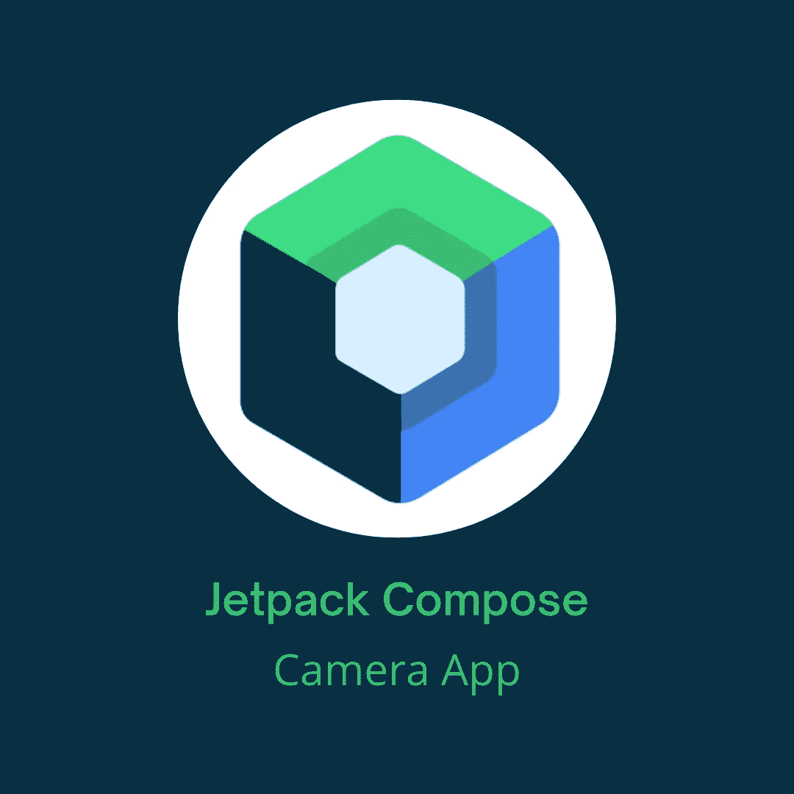

# 使用 CameraX 在 Jetpack Compose 中构建一个相机 Android 应用程序

> 原文：<https://betterprogramming.pub/build-a-camera-android-app-in-jetpack-compose-using-camerax-4d5dfbfbe8ec>

## Jetpack 撰写+相机



这张图片中使用的 Jetpack Compose 标志是由谷歌创建的官方标志

正在考虑创建一个相机应用程序，还是需要在应用程序中录制视频？图书馆是一个很好的方法。今天，我将向你解释如何使用谷歌推荐的`CameraX`库创建一个相机应用程序。

> " CameraX 是一个 Jetpack 库，旨在帮助简化相机应用程序的开发."根据 [CameraX 官方文档](https://developer.android.com/training/camerax)

有几个您可以使用`CameraX`的用例:

*   [图像采集](https://developer.android.com/training/camerax/take-photo) — *保存图像*
*   [视频采集](https://developer.android.com/training/camerax/video-capture) — *保存视频和音频*
*   [预览](https://developer.android.com/training/camerax/preview) — *查看显示器上的图像*
*   [图像分析](https://developer.android.com/training/camerax/analyze)——*无缝访问一个缓冲区，供您的算法使用*

在本文中，我们将讨论视频捕捉，因为这不是一个经常讨论的话题。

## 视频捕捉

首先，让我们添加一些依赖项:

**注意:**检查这些依赖项是否有更新的版本。

现在，我们的主屏幕将记录视频，但首先，我们需要请求相机和音频权限。我不会详细解释，因为我已经在我以前的一篇文章中解释过了，如果你需要更多的解释，看看吧。

现在，我们将创建几个录制视频所需的对象。

`Recording`是一个允许我们控制当前活动记录的对象。它将允许我们停止，暂停和恢复当前的记录。当我们开始记录时，我们就创建了那个对象。
`PreviewView`是一个自定义视图，将显示摄像机画面。我们将它绑定到生命周期，添加到`AndroidView`，它将显示我们当前记录的内容。
`VideoCapture`是一个通用类，提供适合视频应用的摄像机流。这里我们传递了`Recorder`类，它是`VideoOutput`接口的一个实现，它允许我们开始记录。
`recordingStarted`和`audioEnabled`是我们将在这个屏幕中使用的辅助变量，我认为它们是不言自明的。
`CameraSelector`是一组要求和优先级，用于选择一台摄像机或返回一组经过过滤的摄像机。这里我们将只使用默认的前置和后置摄像头。
在 LaunchedEffect 中，我们正在调用一个函数，它将为我们创建一个视频捕获用例。该函数如下所示:

首先，我们创建一个`Preview`,这是一个用例，它提供了一个用于在屏幕上显示的摄像机预览流。我们可以在这里设置很多东西，比如长宽比，捕捉处理器，图像信息处理器等等。我们不需要它们，所以我们创建普通的`Preview`对象。
接下来是选择我们的视频质量。为此，我们使用`QualitySelector`来定义所需的质量设置。我们想要全高清质量，所以我们会通过`Quality.FHD`。有些手机可能没有理想的质量，所以你应该总是有一个备份计划，因为我们在这里通过`FallbackStrategy`。有几个策略:

*   `higherQualityOrLowerThan` — *选择最接近且高于输入质量的质量。如果不能得到支持的质量，选择最接近但低于输入质量的质量*
*   `higherQualityThan` *—选择最接近且高于输入质量的质量*
*   `lowerQualityOrHigherThan` — *选择最接近且低于输入质量的质量。如果这不能产生支持的质量，选择最接近并高于输入质量的质量*
*   `lowerQualityThan` — *选择最接近且高于输入质量的质量*

另一种方法是通过`Quality.LOWEST`或`Quality.HIGHEST`，这可能是更简单的方法，但我也想展示这一点。
现在我们创建一个`Recorder`，并通过调用`VideoCapture.withOutput(recorder)`用它来获取`VideoCapture`对象。
相机提供者是`ProcessCameraProvider` singleton 的一个对象，它允许我们将相机的生命周期绑定到应用程序进程中的任何生命周期所有者。我们用来获取摄像机提供商的函数是:

`ProcessCameraProvider.getInstance(this)`返回我们需要等待完成才能获得实例的未来。
接下来，我们需要将所有东西绑定到生命周期，我们通过了`lifecycleOwner`、`cameraSelector`、`preview`和`videoCapture`。

现在是时候完成剩下的代码了，我希望你还和我在一起！

在`PermissionsRequired`内容块内，我们添加了`AndroidView`和按钮进行录制。像这样:

`AndroidView`将显示我们的预览。
至于按钮，我们将用它来开始和停止录音。当我们想要开始录制时，我们首先获取要放视频的媒体目录，如果该目录不存在，我们只需创建它。接下来是调用如下所示的`startRecordingVideo`函数:

一个简单的功能，创建一个文件，准备一个记录，并开始它。如果启用了音频，我们也将在启用音频的情况下开始录制。这个函数返回的对象，我们将用它来停止记录。`consumer`参数是一个回调函数，将在每个事件上调用。视频录制完成后，您可以使用它来获取文件的 URI。

让我们只添加音频和摄像机选择器的逻辑。

这是两个按钮，可以启用-禁用音频，并在前置和后置摄像头之间切换。当我们在摄像机之间切换时，我们需要创建一个新的`videoCapture`对象来改变我们的预览显示。

这就是这个屏幕，但现在最好看看我们记录了什么，对吗？当然，为此，我们将创建另一个屏幕，并使用`ExoPlayer`来显示视频。

让我们首先在消费者回调中添加逻辑:

```
if (event is VideoRecordEvent.Finalize) {
    val uri = event.*outputResults*.*outputUri* if (uri != Uri.*EMPTY*) {
        val uriEncoded = URLEncoder.encode(
            uri.toString(),
            StandardCharsets.*UTF_8*.toString()
        )
        navController.navigate("${Route.VIDEO_PREVIEW}/$uriEncoded")
    }
}
```

如果 event 为`VideoRecordEvent.Finalize`，则意味着录制完成，我们可以获得视频的 URI。有几个视频记录事件，您可以使用其中任何一个，但这里我们只需要`Finalize`:

*   开始
*   完成
*   状态
*   中止
*   简历

如果视频太短，比如不到半秒钟，URI 可能是空的，这就是为什么我们需要 if 语句。
应该对 URI 进行编码，将其作为导航参数传递。

这个屏幕的最终代码如下所示:

## ExoPlayer

`ExoPlayer`是安卓 MediaPlayer API 的替代产品，可以在本地和互联网上播放音频和视频。它更容易使用，并提供更多的功能。此外，它很容易定制和扩展。

现在，当我们知道什么是`ExoPlayer`时，让我们创建下一个屏幕。添加依赖项:

```
//ExoPlayer Library
exoPlayerVersion = '2.18.1'
implementation "com.google.android.exoplayer:exoplayer:$exoPlayerVersion"
```

我们的屏幕应该是这样的:

我们将使用一个构建器来创建`ExoPlayer`，设置将要加载的视频的 URI，然后准备播放器。

我们使用`AndroidView`来显示我们的视频，并将`StyledPlayerView`附加到它上面。

`StyledPlayerView`是播放器媒体播放的高级视图。它在播放过程中显示视频、字幕和专辑封面，并使用`StyledPlayerControlView`显示播放控制。
`StyledPlayerView`可以通过设置属性(或者调用相应的方法)或者覆盖 drawable 来定制。

这就是我们的录像机，我希望你在这篇文章中学到了一些新的东西，并喜欢它。

你可以在我的 GitHub repo 中找到所有的源代码。

```
**Want to Connect?**[GitHub](https://github.com/Giga99)
[LinkedIn](https://www.linkedin.com/in/igor-stevanovic/) [Twitter](https://twitter.com/igor_s1999)
[Portfolio website](https://giga99.github.io/portfolio-website/)
```

如果您想了解更多关于 Jetpack Compose 的信息，请阅读以下文章:

*   [在 Jetpack 排版中实现底部表单](/implement-bottom-sheet-in-jetpack-compose-d6472e8eaf2e)
*   [在 Jetpack Compose 中实现水平和垂直 view pager](/implement-horizontal-and-vertical-viewpager-in-jetpack-compose-a7a91f2ac746)
*   [在 Jetpack Compose 中请求权限的 2 种方式](/jetpack-compose-request-permissions-in-two-ways-fd81c4a702c)

此外，通过阅读本文，您可以了解如何使用拦截器在请求中包含访问令牌:

[](/android-access-token-logic-with-retrofit-okhttp-interceptors-740ea48547a0) [## Android 访问令牌逻辑和改进的 OkHttp 拦截器

### 使用 OkHttp 拦截器的访问令牌头逻辑

better 编程. pub](/android-access-token-logic-with-retrofit-okhttp-interceptors-740ea48547a0) 

# 资源

[https://developer.android.com/training/camerax](https://developer.android.com/training/camerax)

 [## ExoPlayer

### ExoPlayer 是一款面向 Android 的应用级媒体播放器。它为 Android 的 MediaPlayer API 提供了另一种选择…

exoplayer.dev](https://exoplayer.dev/)