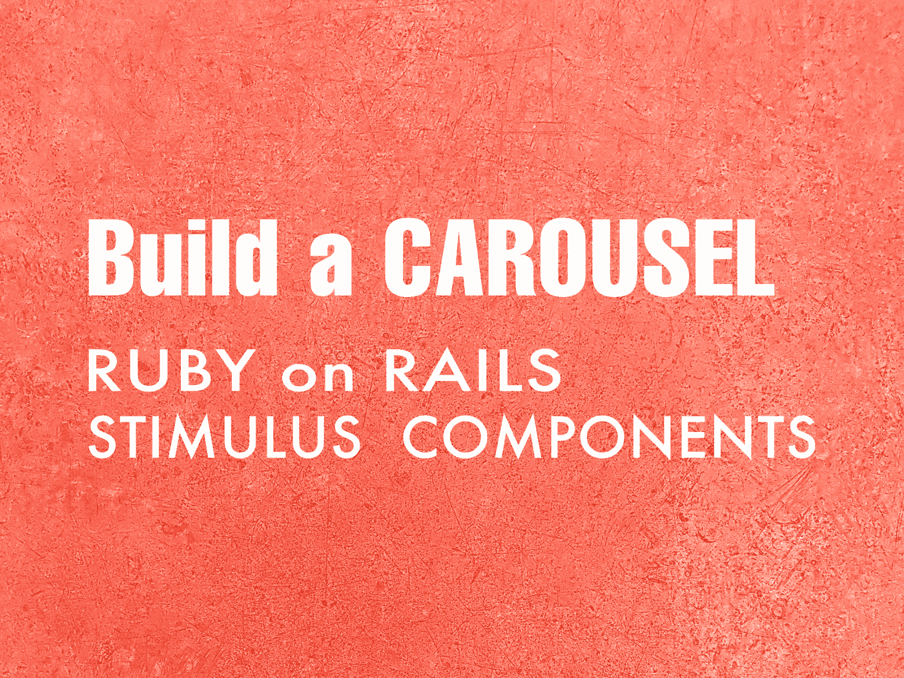
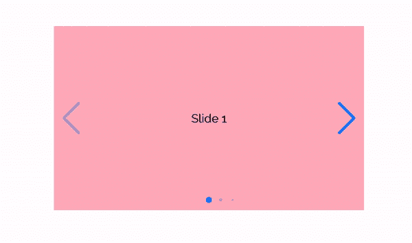
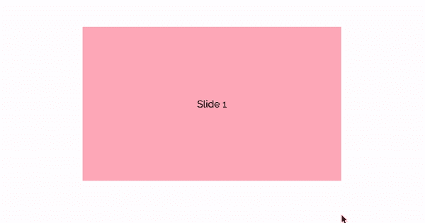
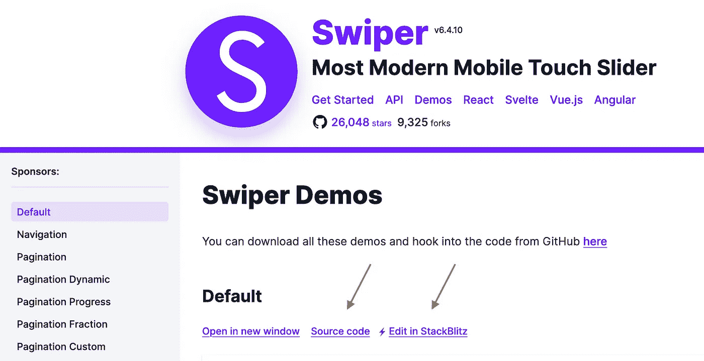

# 用 Ruby on Rails 和刺激组件库构建一个旋转木马

> 原文：<https://betterprogramming.pub/build-a-carousel-with-ruby-on-rails-and-the-stimulus-components-library-22b1b5e1e682>

## 不用一行定制的 JavaScript 就可以设置漂亮的旋转木马

作者照片。

在本文中，您将学习如何使用 Ruby on Rails 和[刺激组件](https://stimulus-components.netlify.app/)来设置一个现代的旋转木马。这是一个强大而简单的解决方案，无需编写任何定制的 JavaScript 就可以在项目中构建一个漂亮的旋转木马。

查看[演示页面](https://swiperjs.com/demos)了解阅读本文后您可以构建什么。

本演示中的轮播结果

# 开始之前

确保你安装了刺激装置。检查`package.json`文件或运行`yarn why stimulus`。如果尚未安装刺激，请遵循[文档](https://stimulus.hotwire.dev/handbook/installing)或观看 GoRails 剧集。对于 webpack 用户来说，就像运行`rails webpacker:install:stimulus`一样简单。

# 创建您的旋转木马

## 1.安装软件包

在终端运行`yarn add stimulus-carousel`。

## 2.将刺激转盘库添加到您的项目中

## 3.导入样式表

从两者中选择一个:

如果您得到一个“文件导入未找到”的错误，尝试使用@ import“swiper/swiper-bundle”。

## 4.将 HTML 布局添加到页面中

注意第 2 行添加的`data-controller`属性。Stimulus 使用标识符(`“carousel”`)将 HTML 页面链接到 JS 控制器(它正在创建一个新的 [carousel 控制器实例](https://github.com/stimulus-components/stimulus-carousel/blob/master/src/index.js))。转盘的范围在开启`div`(线 3)和关闭`div`(线 11)之间。

## 5.添加您的内容

幻灯片的内容(文本、图片、背景)出现在`swiper-slide div`(第 6 到 8 行)。或者您可以应用不同的背景样式。

迄今为止的进展:滑动旋转木马。

## 6.添加分页和按钮

*   滑动按钮允许用户点击导航 v 形按钮(`< >`)。
*   Swiper 分页显示页面，就像幻灯片 1/10，…或进度条。
*   `Data-carousel-options-value`是一种在 HTML 中将[选择的特性](https://swiperjs.com/demos)的任何功能作为数据属性传递的方法。

如果你想避免在 HTML 中编写任何数据轮播选项，你可以选择[扩展功能](https://stimulus-components.netlify.app/docs/components/stimulus-carousel/#-extending-controller)库并添加默认的轮播选项。

就这样，你的滑球准备好了！

成品滑块

# 向轮播添加更多功能

检查源代码以找到应用的功能

这很简单，因为:

1.  从 [swiper](https://swiperjs.com/demos) 中搜索所需功能。
2.  检查源代码或在 Stackblitz 上查看。
3.  在`data-carousel-options-value`属性中添加选项。

*注意:确保每个散列键都用引号括起来，并注意多余的逗号，因为它们可能会破坏代码。*

# 结论

有了唾手可得的合适工具，编码是一件有趣的事情。Stimulus Components 是构建旋转木马的优秀库。它提供了令人兴奋的特性，而不需要自己编写任何 JavaScript！

感谢阅读！