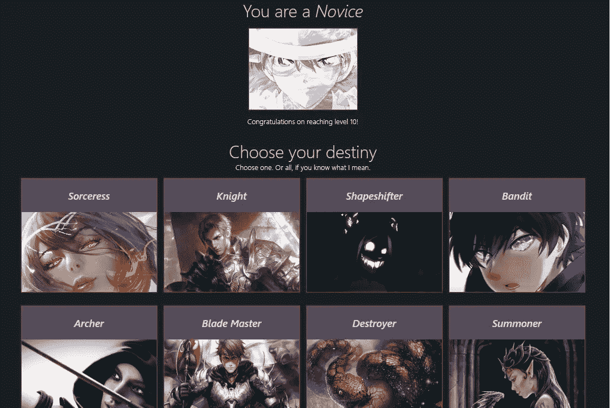
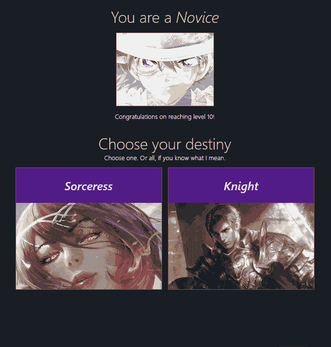
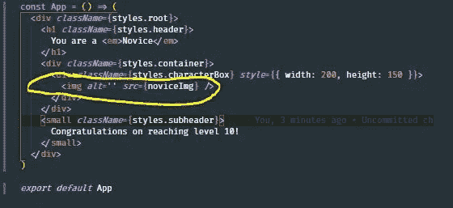
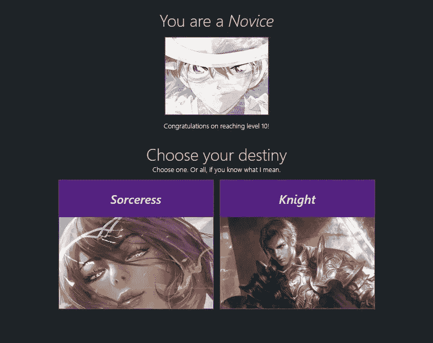
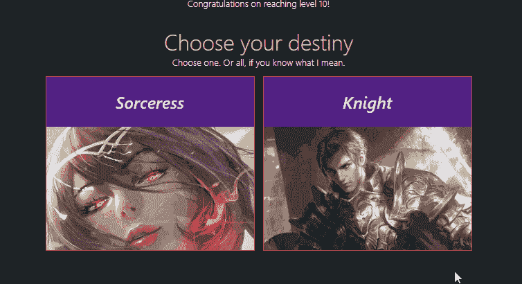
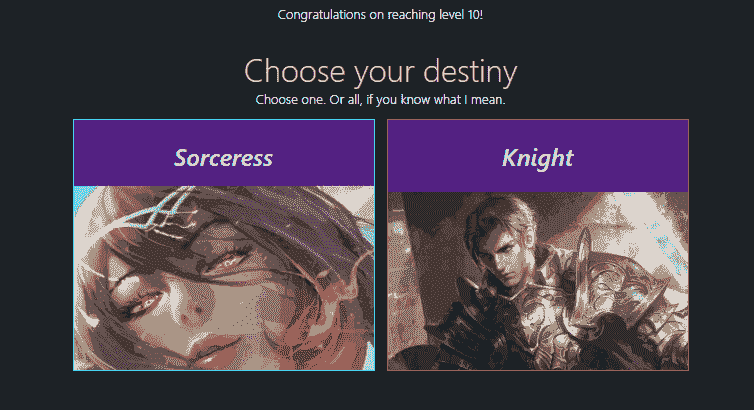
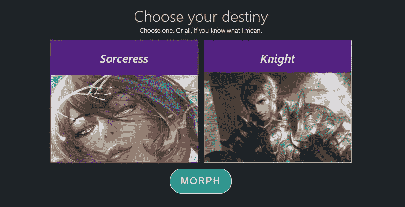
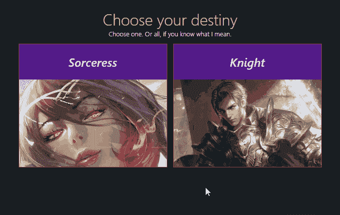
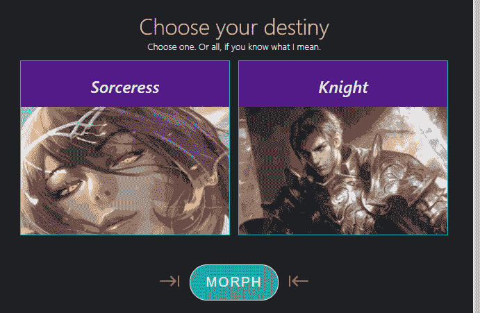
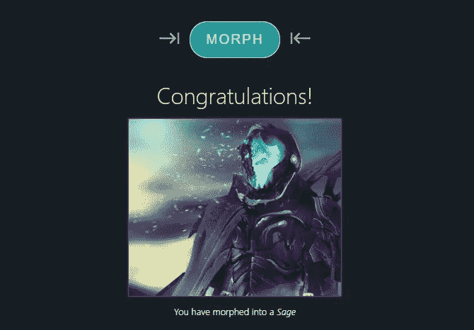

# 在 React 中构建一个角色选择屏幕

> 原文：<https://betterprogramming.pub/build-a-character-select-screen-in-react-9ed5ad5797f6>

## 现在是让 React 做大事的时候了



React 是一个 JavaScript 库，众所周知，它有助于构建令人惊叹的用户界面，同时保持其简单性。像[脸书](https://facebook.com/)、[网飞](https://www.netflix.com/)和[纽约时报](https://www.nytimes.com/)这样的大型老牌网站已经非常成功地用 React 维护了他们的网络应用。

感谢[对开源库的积极参与](https://github.com/facebook/react/pulls)，它每天都在变得更好。

本文将介绍构建一个基本角色选择屏幕的步骤，利用 React 的机制使它变得生动。

我们将一边走一边展示思考的过程，并在问题出现之前揭示如何解决问题。希望这种方法可以帮助新的 React 开发人员！

如果你跟着做，到最后你应该会得到这样的东西:



如果您想要包含附加字符的 GitHub repo 的链接，请单击此处的。

除了安装一个 loading spinner 之外，我不会在这篇文章中使用 UI 库来制作任何效果，因为我希望每个人都能够跟随，而不必研究库的 API 来理解示例。

事不宜迟，我们开始吧！

在本教程中，我们将使用`create-react-app`快速生成一个 react 项目

继续使用下面的命令创建一个项目。在本教程中，我称我们的项目为*角色选择*。

```
npx create-react-app character-select
```

完成后进入目录:

```
cd character-select
```

在主条目 src/index.js 中，我们进行了一些清理:

以下是开始的风格:

*src/styles.css*

现在转到 src/App.js，从根元素开始，因为我们已经定义了样式:

[https://gist.github.com/5488a324c2b127ff9bdac740f601a054](https://gist.github.com/5488a324c2b127ff9bdac740f601a054)

在我们开始之前，让我们解释一下这个角色选择屏幕的流程，这样我们就知道我们都在同一页上。

我们在玩 MMORPG 游戏。所有玩家都从创造一个角色开始。每个玩家默认从`Novice`职业开始。当他们升到 10 级时，他们可以变成 2 级职业(在这篇文章中，我们只有一个*女巫*和一个*骑士*可用，但是 MMORPG 游戏通常有其他职业，比如弓箭手和死灵法师。

当他们到达 10 级并选择一个职业时，他们点击一个写着“变形”的按钮，他们的角色就会相应地改变它的外观。在这些动作之间，它们会自动向下滚动，以保持玩家的交互性。最后，他们被引导到一个新的屏幕。

让我们首先展示一个祝贺他们的屏幕，然后给他们展示两个二级职业，他们可以选择变形他们的角色。

如果他们选择*女巫*，他们将能够变成一个女巫，继续他们的旅程，成为游戏中最好的玩家。同样的概念也适用于骑士期权。然而，有一个秘密的选择。如果玩家足够聪明和爱管闲事，他们会意识到他们可以选择*和*两个人，然后变成一些人类还没见过的不寻常的东西。生活充满了惊喜，我们的游戏应该反映这一点，以保持现实。

为了展示屏幕，我们将向他们展示一个标题、一张他们新手班级的照片(因为他们再也不会看到它了)，以及一条温暖人心的消息，提醒他们他们的努力已经有了回报。

(如果您想使用相同的图片，可以在上面的 GitHub 链接中找到这些图片)

*src/App.js*

以下是 CSS 的新增内容:

*styles.css*

查看该组件，您可以看到根元素包含一个标题、一个内容容器和一个子标题作为直接子元素。我提到我们将向用户展示一张新手的照片——这就是在类名为`styles.content`的 div 元素中发生的事情:



我们为 header 和 subheader 定义了 CSS 类名，因为有些东西告诉我这些可以在进一步的界面中重用，比如当播放器被引导到一个新的部分时。当我想到单词“section”时，我认为它包含一些标题和主体，所以这看起来像是一个有效的移动。我们也可能对其他角色使用“角色箱”,比如法师或其他什么，所以我们定义了一个`.characterBox`类名称来在我们继续的时候保持这个想法。

现在我们已经建立了本教程最简单的部分，让我们继续更有趣的部分！

接下来要做的是制作*选项*或*选择*屏幕。这个屏幕负责向玩家显示角色类别选择。这些角色被称为*女巫*和*骑士*。这是玩家一到达 10 级就会被提示的画面。

我们可以有效地解决这个问题的方法是思考玩家下一步的目的是什么。目的是让他们在女巫或骑士之间做出选择，因此抓取一些角色选择框并呈现给玩家是有意义的。

现在，我们想尽可能避免创建基本上做同样事情的多个组件。这样做并不是一个好的做法，因为将来你会越来越难以回头修改代码，甚至在调试小错误的时候。

考虑到这一点，带有字符选择选项的下一个*部分*可以具有与前一个相同的结构(标题、内容/正文和副标题)，如前几个示例所示。

我们将通过提取出*标题*、*副标题*和*容器*(或内容)来重用这个概念来创建角色选择屏幕。

通常我会将这些可重用的组件提取到它们自己的文件中，这样我们就可以直接将它们作为单独的模块`import`，但是为了节省时间和空间，我们将把它们全部放入`src/components.js`

在同一个目录下创建一个`components.js`文件，并将可重用文件定义为命名导出文件:

*src/components.js*

现在，让我们用新的可重用组件替换应用组件:

*src/App.js*

代码现在开始变得更好看了，不是吗？现在我们将制作显示角色类的屏幕:

*src/App.js*

以下是`styles.module.css`的新增内容:

经过这一更改，我们的界面现在看起来像这样:



您可以在代码中看到，我们能够为下一个*部分*重用`Header`、`Subheader`和`Content`。界面看起来*一致*并且我们获得了一个非常重要的好处:我们现在只需要在*一个*位置改变标题/子标题/内容组件，而不是将来在多个位置！

从这种方法中获得的其他一些显著的好处是*隐式文档*(我们现在仅仅*知道*那些是标题和子标题组件，并且可以很容易地返回并理解代码)。

我们要做的下一件事是让女巫和骑士盒子在被点击时调用某种类型的动作。

我们将只定义一个无用的`onSelect`处理程序，就像我们定义一些*“结构”*一样，这样我们可以不断地被提醒，有一些点击动作供以后使用:

一切看起来都很好，但是没有办法在没有任何视觉变化的情况下判断玩家选择了哪个角色(因为我们所做的只是将“我是无用的”记录到控制台):



我们可以首先通过提供悬停效果使它更具交互性，这仍然是一个进步，因为它比静态图像更好。

现在，既然我们要开始合并类名，这样我们就可以对单个元素产生并行的影响，我将安装方便的 [classnames](https://github.com/JedWatson/classnames) 库来为我们进行合并:

```
npm install --save classnames
```

在需要根据具体情况应用类名时，`classnames`的实力大放异彩。我们将需要它，因为某些元素只需要在特定时间可见或隐藏。

现在让我们为字符框元素添加一些样式:

当玩家悬停在上面时，我们应用了一个无限变化的`hue-rotate`过滤器来突出这些。玩家应该很兴奋变成第二层职业！:)

现在，这些悬停效果不会做任何事情，因为我们需要应用 CSS 中显示的新类名。我们需要做的就是将`className`属性应用到 tier2 图像元素:

*src/App.js*

瞧啊。我们现在有一些颜色变化的悬停效果:


我们有了悬停效果，现在我们需要一个样式来处理其中一个被*选中*的情况。这意味着当玩家选择一个角色时，我们必须让一些风格保持不变。

也就是说，我们现在可以引入 react 钩子了。让我们在 App 组件的正上方创建一个名为`useLevelUpScreen,`的定制钩子，并定义`select`状态以及一个用于更新它的`onSelect`处理程序:

*src/App.js*

在`useLevelUpScreen`中，我们定义了`selected`状态，这将帮助我们决定玩家选择哪个等级 2。`onSelect`处理程序是更新该状态的 API。它使用回调版本的`useState`，以确保它准确地接收到对`selected`状态的最新更新。在回调函数中，它检查是否已经选择了`type`(在我们的例子中是`Knight`或`Sorceress`)。如果是，我们假设玩家决定取消选择，所以我们在下一次状态更新时将其过滤掉，反之亦然。

然后，我们将`onSelect`处理程序应用于`App`组件中需要它们的元素:

*src/App.js*

我们现在应该会收到关于哪个角色被选中，哪个没有被选中的更新。这还不会反映在玩家的用户界面上，因为我们还没有在组件中应用它，所以我们接下来会这样做。对于下一步，我们将使用`classnames`包有条件地将类名应用于元素，如下所示:

*src/App.js*

随着这些新样式的加入，我们必须更新样式以适应它:

*src/styles.css*

```
.selectedBox {
  border: 1px solid rgb(24, 240, 255) !important;
}.characterBox img.tier2:hover,
.characterBox img.selected {
  animation: hueRotate 2s infinite;
  transform: scale(1.05);
}
```

(注意偷偷摸摸的“`.characterBox img.selected`”被作为兄弟追加在`hover`行之后)

有了这个改变，我们现在有两个漂亮的反应角色选择框了！



在教程的前面我们提到过，如果玩家够聪明够八卦，他们可以通过选择女巫和骑士以及变形来学习，他们会变成意想不到的东西——一个秘密角色。很明显，我们需要给玩家一些 UI 元素，这样他们就可以代表自己改变新手。为此我们需要一个`button`。

我们将编写一个简单的`button`，并附加一个我们将要创建的`onMorph`处理程序，同时将`styles.morph`应用到按钮的`className`:

*src/App.js*

如果你看看从`useLevelUpScreen`钩子返回的内容，我们可以看到有两个新的添加:`morphed`和`onMorph`。它们将在自定义挂钩中定义:

*src/uselevelupscreen . js*

下面是`styles.morph`类名的样式:

*src/styles.module.css*

```
.morph {
  margin: 50px auto;
  text-align: center;
}
```

以下是我们目前掌握的情况:



就我个人而言，我更喜欢隐藏变形按钮，直到做出选择，让玩家只专注于选择一个角色类别。所以我会应用一些隐藏的可见性效果，直到`selected`被填充了一些东西:

注意:我们用一个`div`元素包装了按钮，这样我们可以更好地控制按钮的位置和间距。

现在，用户清楚地知道他或她需要选择某样东西，因为这将是我们向他们提供的唯一选项:



这个钮扣似乎有点朴素。我们试图让玩家保持动力，并为他们已经到了 10 级而感到高兴。所以对于下一步，我在变形按钮的左右两边放置了图标，你也可以通过安装`react-icons`来跟随它。

```
npm install --save react-icons
```

注意:如果您在使用 NPM 安装软件包时遇到错误，请尝试安装 yarn 并通过运行`yarn add react-icons`再次添加软件包。之后，您可以返回 NPM 启动服务器。

接下来，我导入了这个图标组件:

```
import { MdKeyboardTab } from 'react-icons/md'
```

我在按钮前插了一个，然后又插了一个。现在箭头图标是静止的，它们都面向同一个方向。除了将右箭头图标的方向固定为指向按钮之外，我们还必须通过设计它们的样式并赋予它们无限循环的颜色变化效果来为它们添加一些活力:



使用的样式:

*src.styles.module.css*

与以前的版本相比，这将使他们更加兴奋地开始他们冒险的下一个篇章！

我们当前的`onMorph`函数在点击时将`morphed`状态设置为真，所以一旦`morphed`转换为真，我们就可以显示玩家选择变形的秘密角色类别。我们将把它放在包含变形按钮的 div 元素下面:

*src/App.js*

*src/styles.module.css*

```
.morphed {
  animation: flashfade 4s forwards;
  opacity: 0;
}@keyframes flashfade {
  0% {
    opacity: 0;
  }
  60% {
    opacity: 0.7;
  }
  100% {
    opacity: 1;
  }
}
```

他们将要变成的秘密职业是圣人！现在看起来是这样的:



我*能不能接受这样的结局。但在我看来，一切还是有点“僵硬”。换句话说，我认为玩家需要一些滚动动作，这样他们就可以一直忙于我们的界面。我们将安装一个名为`react-scroll-to-component`的小库，通过传入元素的引用，它将允许我们将玩家的屏幕滚动到任何元素中:*

```
npm install --save react-scroll-to-component
```

在`src/App.js`内导入:

```
import scrollToComponent from 'react-scroll-to-component'
```

现在我们创建一个 ref 并将其附加到元素上:

因为我们希望这种滚动效果看起来平滑，我们需要增加页面底部的高度，这样我们就有更多的空间。实际上，当`morphed`切换为 true 时，我们可以通过添加一个具有高度的空 div 来轻松做到这一点:

但是现在我们有一个问题。在贤者区域变得可见之前，高度将不能按时出现在屏幕上。换句话说，滚动到功能不起作用，因为在调用它的时候还没有看到进一步的空间。我们将通过添加一个名为`morphing`的额外状态来解决这个问题，这将给我们一些时间来破坏 UI，直到`morphed`变成`true`:

然而，现在我们面临一个新的问题。似乎`morphed`阻止了内部元素的渲染，从而阻止了我们在 1.5 秒的时间框架内应用逻辑:

我们要做的是去掉`morphed &&`条件，并使用 *classnames* 包来合并一些额外的样式。这些样式将模仿行为，并且*将元素保留在 react 树中，*因此它们将支持动画等特性:

编辑:我忘了在变形按钮上应用另一个引用，当玩家选择一个角色类别时，页面会滚动到那里。很抱歉。

*src/App.js* :

在上面的例子中，一旦变形完成，我们应用了一个`style={{ opacity: morphed ? '0.4' : 1 }}`来通知玩家这个按钮将不再可用。

我们应用了一个禁用属性来禁用`disabled={morphed}`的点击事件。我们还用`{morphing ? 'Morphing...' : morphed ? 'Morphed' : 'Morph'}`根据形态状态更新改变了文本，让用户不断忙于查看变化的事物。

我们还移除了包裹变形按钮的`{!!selected.length && (`，因为它阻挡了我们的动画，就像我们最近讨论代码的其他部分一样，并如上所示对它应用了`morphRef` ref。

最后，在自定义钩子中，我们还在`onSelect`函数的末尾应用了`scrollToComponent`实现，以动画显示滚动到变形按钮。

# **结束编辑**

变形完成后，我们模拟某种加载动画，让用户知道我们正在处理接下来的步骤:

```
<div
  className={cx(styles.next, {
    [styles.hidden]: !ready,
  })}
>
  <div>
    <RingLoader size={60} color="rgb(213, 202, 255)" loading />
    <p>Loading...</p>
  </div>
</div>
```

款式:

```
.next {
  text-align: center;
  margin: 35px auto;
  display: flex;
  justify-content: center;
}.next p {
  font-family: Patua One, sans-serif;
  font-weight: 300;
  text-align: center;
  color: #fff;
}
```

您可以看到还有一个名为`ready`的新状态，因此我们必须在自定义钩子中实现它:

最后，我们将淡化整个页面，这样我们就可以在当前页面完成后开始下一页。这意味着向名为的定制钩子添加另一个状态— `shutdown` ,并向根元素`div`应用一个新的类名。只有当 `ready`变为真时，`shutdown`状态才会切换为真*。*

下面是最终结果！


下面是整个代码的样子:

*src/App.js*

*src/components.js*

*src/styles.module.css*

您可能已经注意到，在整个教程中有一些重复的代码。假设您不得不突然调整字符选择框，比如调整大小。如果你改变了一个，你必须扫描整个文件，找到其他的选择框，使界面一致。目前，`Sorceress`和`Knight`选择框是相同的，它们需要保持同步。但是如果我们在游戏中加入更多的第二层角色会怎么样呢？你会有一堆重复的代码，所以把它们抽象成自己的组件是个好主意。这带来了一个非常重要的好处:更好的*定制*能力。

如果您抽象出字符选择框，代码看起来可能是这样的:

*src/App.js*

*src/components.js*

# 结论

本文到此结束。我希望你喜欢它，并在未来继续寻找更多！