# 在 Node.js 中构建一个具有房间功能的聊天应用

> 原文：<https://betterprogramming.pub/build-a-chat-app-in-node-js-with-room-functionality-6ebbd4b19133>

## 如何使用 Socket？web 应用中的 IO


来源:[普里西拉·杜·普里兹在 Unsplash](https://unsplash.com/photos/BjhUu6BpUZA)

作为一名程序员，你可能曾经想知道聊天应用程序是如何工作的。是什么让这一技术奇迹成为可能？[插座。IO](http://socket.io) 使得聊天应用的开发变得更加容易，并且已经在[许多软件项目](https://awesomeopensource.com/projects/socket-io)中使用。

在本文中，我们将使用套接字构建一个聊天应用程序。IO 库和 Node.js 引擎。这是它看起来的样子:

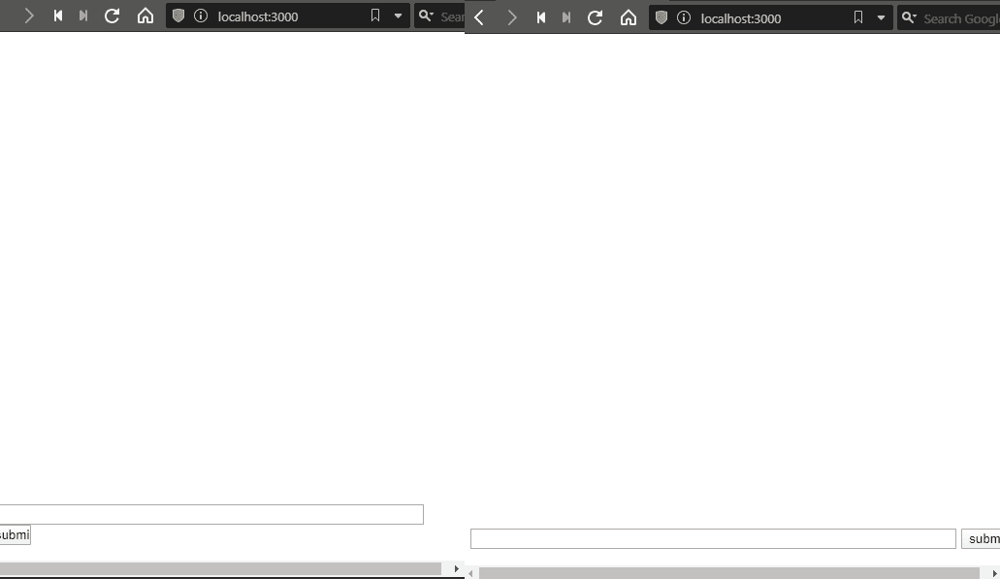

我们将在本教程中构建的聊天应用程序的演示

# 入门指南

## 图书馆的安装

我们将安装:

*   处理我们的路线

```
npm install express
```

*   `socket.io`这是我们应用程序的要点——它将基本上处理我们的聊天功能

```
npm install socket.io
```

就是这样！我们现在终于能够在应用程序中使用这些库了。是时候把手弄脏了。现在让我们继续关注`require`他们。

## 库的导入

要将`socket.io`集成到您的`main.js`中，请编写以下代码:

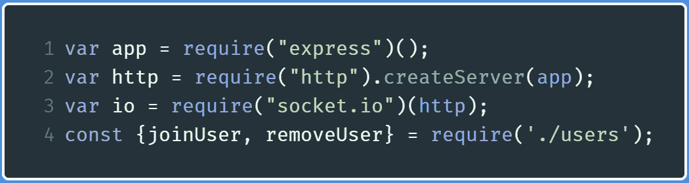

使用“require”关键字导入库

关于代码的解释，更多信息在[插座上提供。IO 网站](https://socket.io/docs/#Using-with-Express)。这基本上会将您的`express`实例绑定到您的`socket.io`实例。此外，您还可以选择根据官方`socket.io`网站提供的指南来使用`http`模块。

在`line 4`中，我们还导入了一个名为`user.js`的文件，它将处理我们聊天室中已连接客户端的添加和删除。

现在已经完成了，让我们继续创建聊天应用程序的客户端。

# 我们应用程序的客户端

这是用户打开聊天应用时看到的第一个东西。

在您的目录中，编写一个名为`index.html`的新文件，并为您的`body`和`script`标记编写以下代码。

*   **第 2-7 行:**创建一个带有文本字段的表单来写消息，并添加一个提交按钮
*   **第 10-13 行:**为客户端功能导入`socket.io`，并初始化一个`socket`实例。这个插座就是你的客户端。

我们将继续回到`index.html`文件来做进一步的修改和改进。现在，我们将转移到`users.js`来处理我们应用程序中用户功能的添加和删除。

# 在 users.js 中添加和删除用户

创建一个新文件，`users.js`，并添加下面一行代码:

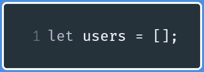

声明一个名为“users”的空数组

我们实际上创建了一个名为`users`的数组。每当用户加入时，相关信息被`pushed`放入这个数组，当用户离开时，相关的`index`从数组中删除。

现在，让我们添加用户。

## 1.添加用户

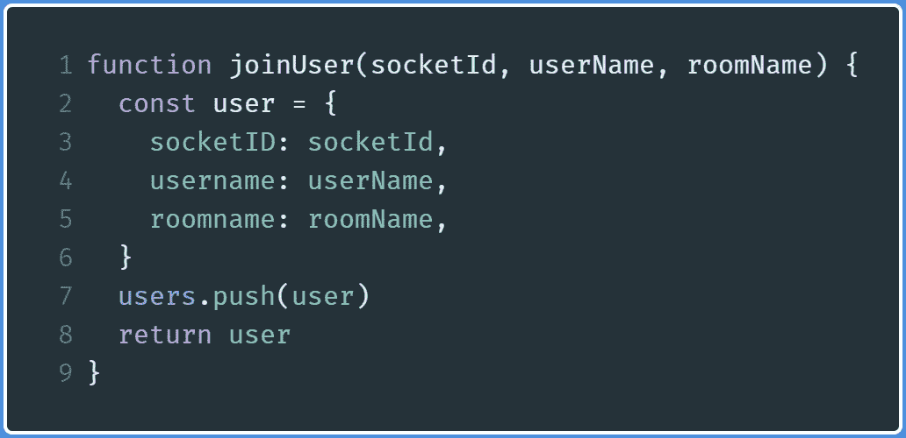

“加入用户”功能

这段代码相当简单。

*   **第 2-6 行:**创建一个包含用户 ID、用户名和他们加入的聊天室的对象
*   **第 7-8 行:**使用`push`方法将这个对象添加到`users`数组中，然后在这个过程完成后返回数组

现在用户想要离开应用程序，所以我们声明一个函数来移除用户。

## 2.删除用户

在`users.js`中，添加一个名为`removeUser`的新函数。

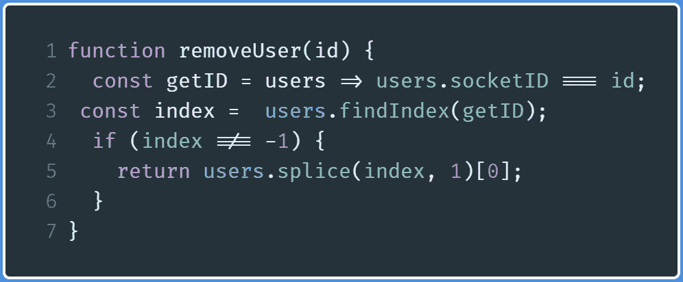

“removeUser”函数定义

*   **第 2-3 行:**查找包含匹配 ID 的元素的索引。关于`findIndex`数组方法的更多信息，[点击这里](https://developer.mozilla.org/en-US/docs/Web/JavaScript/Reference/Global_Objects/Array/findIndex)。
*   **第 4-5 行:**如果找到了元素(`index`不是`0`)，那么删除数组中的元素并返回这个被删除的元素。稍后，我们将使用这个元素，然后提取`username`属性来显示离开的用户的姓名。

最后，您的代码将是这样的:

既然已经完成了，我们现在将进入项目的核心部分，`main.js`。

# 应用程序的主要部分在 main.js 和 index.html

## 连接事件

每当客户端登录聊天应用程序时，就会发出一个`connection`事件。我们将使用`[EventEmitter](https://medium.com/analytics-vidhya/event-emitters-in-node-js-d93084441974)` [概念](https://medium.com/analytics-vidhya/event-emitters-in-node-js-d93084441974)来处理相关事件。

在这里，我们；我来处理`connection`事件。每当用户登录到应用程序时，就会触发该事件。在`main.js`中，在导入库之后，编写以下代码:


处理“连接”事件

*   **第 1 行和第 8 行:**当用户进入`localhost:3000`(根目录)时，Express 将呈现`index.html`文件作为响应。关于这方面的更多信息，请点击这里。
*   **第 4 行:**`thisRoom`变量存储聊天室名称。这个后面会用到。
*   **第 5-7 行:**这处理了`connection`事件。当用户登录聊天应用程序时，将发出此事件。

**注意:**在整篇文章中，我们将修改`main.js`，所以一定要在文件末尾保留第 7 行。此外，所有其他事件处理都将在`connection`事件处理程序中进行。

转到`localhost:3000`。在浏览器中输入提示，这将是控制台中的结果:

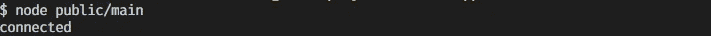

显示用户已连接的控制台

## “加入房间”活动

你现在应该知道插座。IO 是一个事件驱动的库，所以现在我们将从客户端发出将在客户端处理的事件。

为此，让我们发出一个`join room`事件。

转到`index.html`，在`script`标签之间添加以下内容:

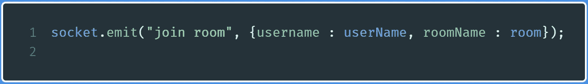

从客户端代码发出“加入房间”事件

这段代码做的是发出一个`join room`事件，然后发送一个对象作为数据。现在我们需要从服务器端处理这个事件，并处理传入的数据。此外，现在我们将为客户分配一个 ID，并将他发送到指定的聊天室。

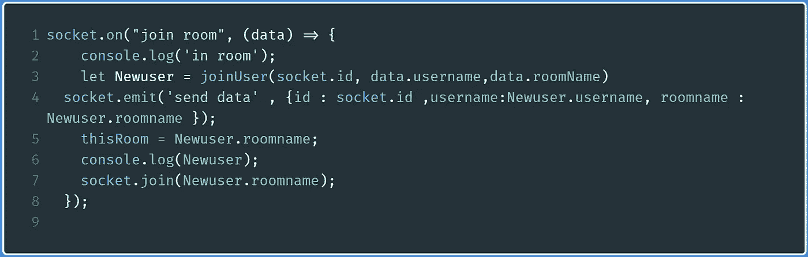

处理“加入房间”事件

*   **第 1-3 行:**处理`join room`事件。使用给定数据作为参数应用`joinUser`功能。在这个过程中，我们还为客户端分配了一个 ID。`socket.emit`方法确保这些数据只发送给发送者，而不是聊天中的所有客户。
*   **第 4 行:**发出`send data`事件，同时发送给定的数据。该事件将由客户端处理。每当客户端发送消息时，我们将使用这些数据来显示用户名。
*   **第 7 行:**用给定的名字加入房间

这将是浏览器中的输出:

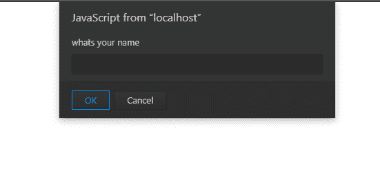

这将是控制台中的输出:


记录用户详细信息的输出

## “发送数据”事件

在上面的标题中，注意我们也发出了`send data`事件。在这个过程中，我们发送用户的 ID、他们的名字和他们的聊天室。我们将使用他们的聊天 ID 来比较他们是否是房间中任何消息的发送者。此外，只要他们发送消息，就会显示姓名。

现在，我们将从客户端处理这个事件。

转到`index.html`，添加以下 JavaScript:

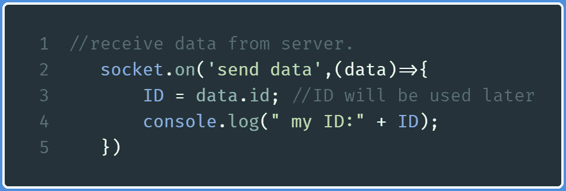

处理“发送数据”事件的代码

*   **第 2 行:**获取包含服务器发送的数据的对象(`data`变量)。
*   **第 3 行:**将`id`赋给另一个变量，这样`id`字段在整个程序中都是持久的

这将是您输入所需信息后浏览器中的输出:

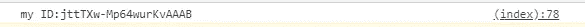

显示用户 ID 的输出

## “聊天消息”事件

显然，没有消息功能的聊天应用是不完整的。

在这一步中，我们将发出一个`chat message`事件，该事件将被服务器端和客户端代码获取。

转到`index.html`，编写以下代码:

*   **第 1 行:**关注文本字段
*   **第 3-11 行:**当用户点击`submit`按钮时，发出`chat message`事件。在这个过程中，它将文本字段值和用户名作为数据发送。
*   **第 13 行:**在上面的代码运行后，使文本字段为空
*   **第 15 行:**获取服务器发出的`chat message`事件并处理该事件
*   **第 17 行:**向网页显示消息

`displayMessage`执行以下操作:

*   比较`chat message`事件发送的`id`和`send data`事件(`ID`)发送的`id`
*   如果是`true`，将适当的 CSS 样式应用到`list`元素，以指示客户端发送了消息
*   如果是`false`，将适当的 CSS 样式应用到`list`元素，以指示另一个客户端发送了消息
*   在每个信息气泡的角上，也显示了它被发送的时间

现在转到`main.js`来处理`chat message`事件。


处理 main.js 中的聊天消息事件

*   **第二行:**发送`chat message`事件到用户所在的指定房间。在此过程中，发送所需的数据和用户的`id`字段。

这将是浏览器中的输出:

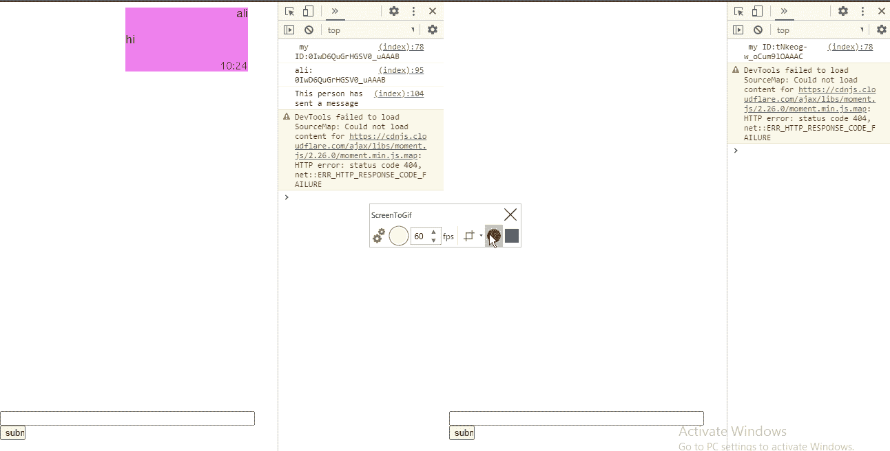

显示代码输出的 GIF

这是终端中的输出:

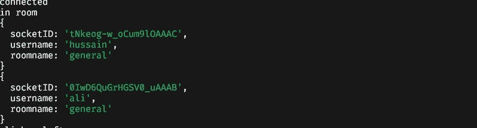

显示用户数据的终端输出

## 处理“断开连接”事件

每当客户端在浏览器中关闭聊天客户端时，就会发出`disconnect`事件。

转到`main.js`，编写以下代码:

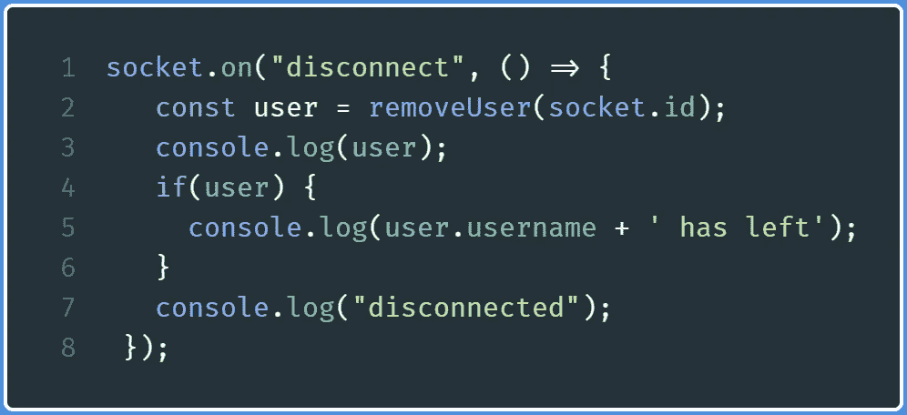

处理“断开连接”事件的代码

*   **第 2 行:**从`users`数组中删除用户
*   **第 5 行:**显示用户的用户名，表示该用户已离开聊天应用

这就是当用户离开聊天窗口时会发生的情况。

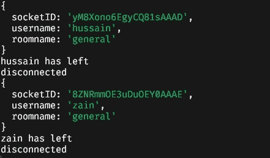

显示用户“zain”和“hussain”已离开聊天应用程序的输出

这就是聊天应用程序的全部内容。

# 回顾和链接

这是`users.js`:

这是`index.html`:

这是`main.js`:

这是这个项目的 [GitHub 回购](https://github.com/HussainArif12/Chat-App)。

## 进一步阅读

*   [“用 Node 搭建实时聊天 App。Js 和 Socket.io](https://www.youtube.com/watch?v=rxzOqP9YwmM)

# 结论

插座。IO 有一个较小的学习曲线；然而，如果您编写代码并深入理解程序，并广泛研究每个函数的作用，这是最好的。只是不要放弃你的编程之旅。

非常感谢您的阅读，祝您有美好的一天！

下一篇文章:[在 React](https://levelup.gitconnected.com/get-your-daily-dose-of-inspiration-with-reactjs-fa529940326d)
中获取每日灵感前一篇文章:[在 React](https://levelup.gitconnected.com/weather-app-in-react-js-ca668ae86b14?source=your_stories_page---------------------------) 中创建一个天气应用