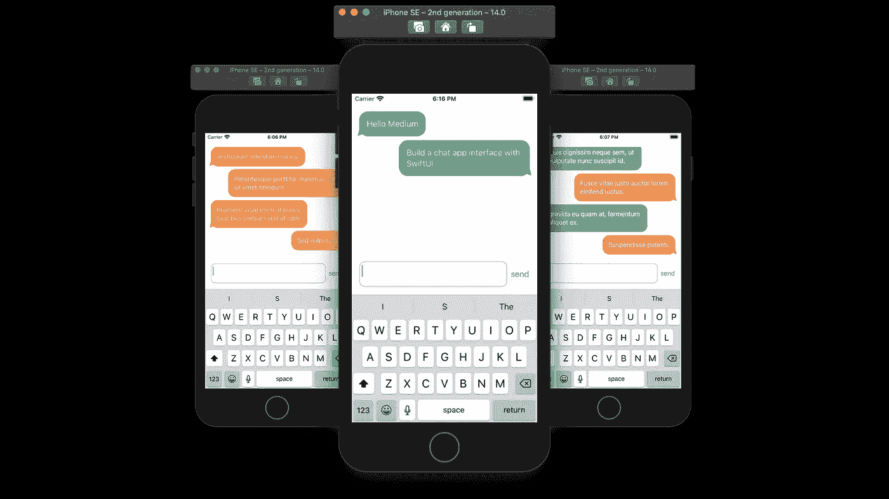
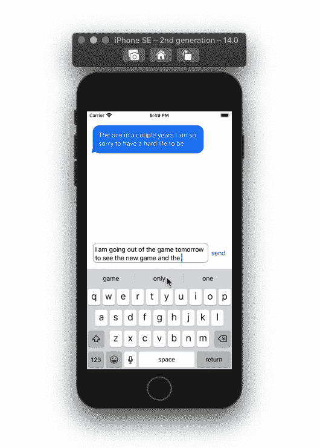

# 使用 SwiftUI 构建聊天应用程序界面

> 原文：<https://betterprogramming.pub/build-a-chat-app-interface-with-swiftui-96609e605422>

## 现在每个应用程序都有消息功能。以下是如何快速在你的应用中加入信息

用 SwiftUI 制作的聊天 app。作者照片。

# 聊天模型

让我们首先为气泡位置创建一个枚举。气泡可以在屏幕的右侧或左侧:

现在，我们可以创建存储消息、气泡位置和用户输入文本的模型。在本教程中，我们将把最后一个聊天气泡的位置存储在一个变量中，这样我们就可以在左侧和右侧气泡位置之间进行切换:

# 聊天气泡

我们需要利用`ViewBuilder`创建一个聊天气泡。在我们的`body`变量中，我们可以创建一个气泡形状。在本教程中，我们使用`RoundedRectangle`和一个箭头系统图像来制作泡泡形状。

如果气泡在右边，那么聊天气泡不应该扩展到屏幕的左端，反之亦然。使用填充来控制气泡可以膨胀的程度。使用帧修改器调整气泡的对齐方式:

# 自定义滚动视图

如果你想让你的`ScrollView`自动滚动，你可以使用下面由 [Asperi 提供的关于栈溢出](https://stackoverflow.com/a/58708206)的代码:

# 聊天结构

现在，我们可以使用我们的模型和自定义的`ScrollView`来遍历消息并将它们添加到 UI 中。在`ChatBubble`内容闭包中，我们将有一个文本视图，它获取保存在我们的消息数组中的最后一条消息。

在我们的自定义`ScrollView`下，我们需要添加一个带有发送按钮的文本编辑器。我们使用文本编辑器而不是文本字段，因为我们不希望键盘上的 return 按钮关闭键盘。相反，我们希望它添加一个新行。

在我们的按钮闭包内，当文本编辑器不为空时，我们需要将消息及其位置添加到模型的数组中，然后清空文本编辑器:

最后，在我们的`ContentView`中添加`Chat`视图，并运行应用程序:

全部完成！感谢阅读。