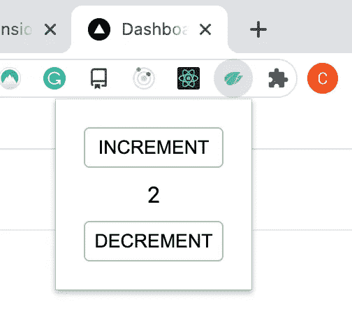
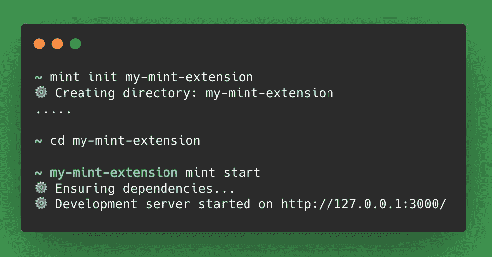
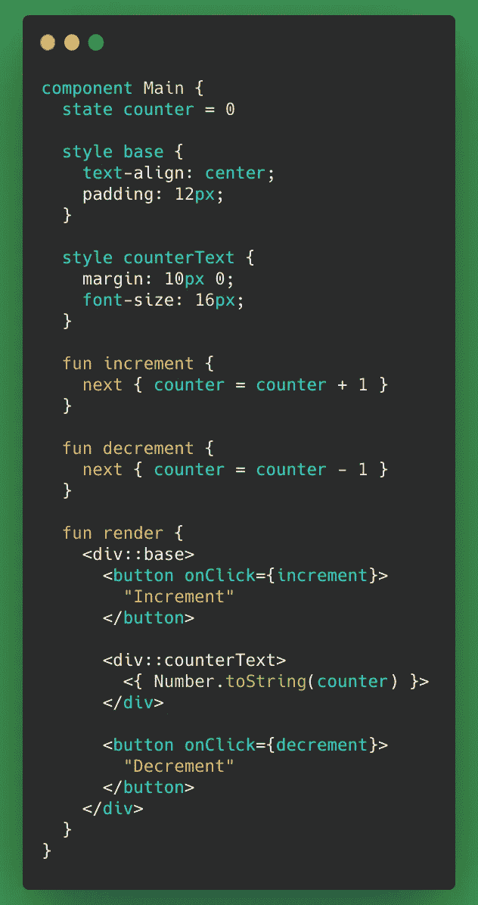
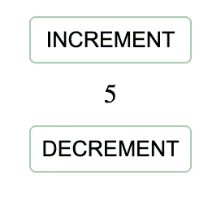
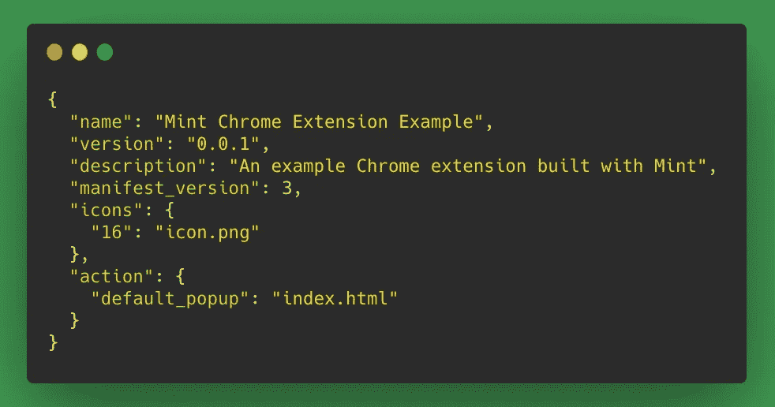
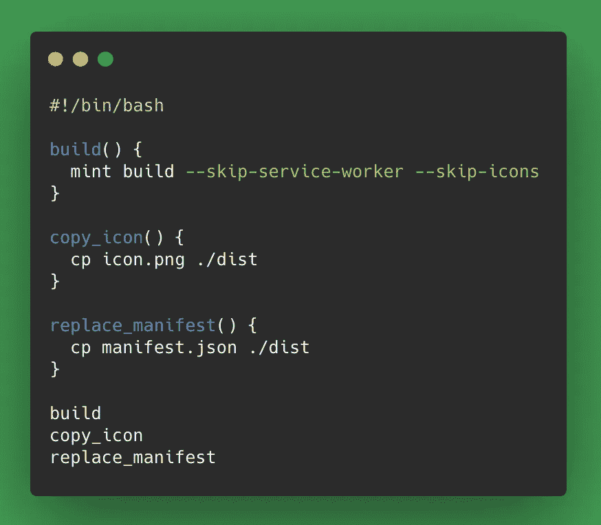
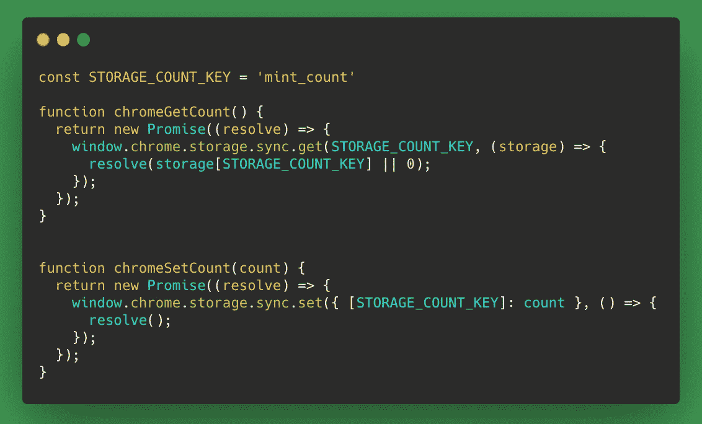
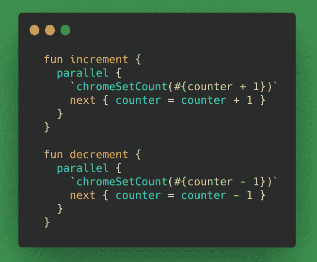
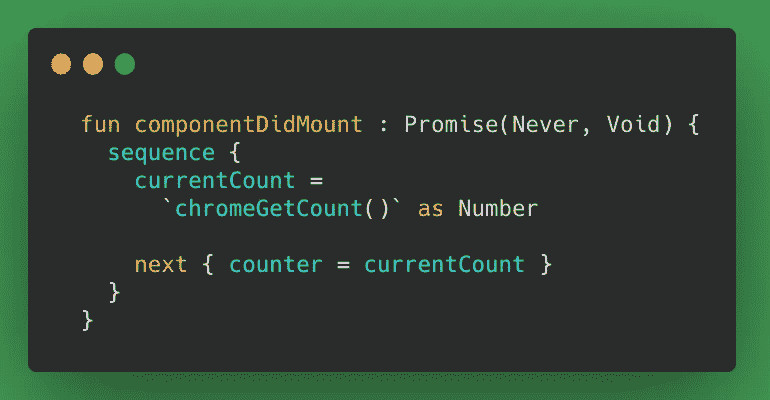
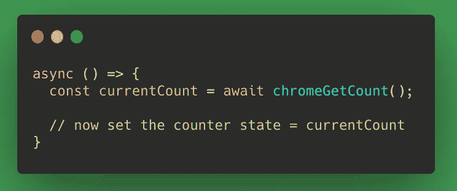

# 用 Mint 构建一个 Chrome 扩展

> 原文：<https://betterprogramming.pub/build-a-chrome-extension-with-mint-e993355b5d5d>

## 一种用于构建 web 的弱势语言


作者照片。

在我的[上一篇文章](/leave-javascript-aside-mint-is-a-great-language-for-building-web-apps-3ce5a6873d48)中，我讨论了为什么我喜欢使用 [Mint](https://www.mint-lang.com/) 来构建一个小的网络应用程序——更确切地说，是构建一个 Chrome 扩展弹出窗口。

用 Mint 构建一个 Chrome 扩展非常简单，但是在这个过程中我遇到了一些障碍。今天，我将解释如何:

1.  快速设置开发薄荷铬扩展。
2.  使用 Chrome 存储 API 添加一些功能。

在本文中，我们将构建一个演示 Chrome 扩展。代码可从 GitHub 上的[获得。](https://github.com/cpv123/mint-chrome-extension-example)

# 我们在建造什么？

我们的演示 Chrome 扩展将是一个简单的计数器，其中的计数值存储在 Chrome 的浏览器存储中。当浏览器关闭时，计数器值将在选项卡之间保持不变，甚至会同步到用户登录的其他 Chrome 浏览器。



要查看用 Mint 构建的更复杂的 Chrome 扩展，请看一下 GitHubGo 的[代码。它是一个扩展，使用 Chrome 的 Omnibox 和存储 API，并展示了 Mint 用于构建 web 应用程序的更多内置功能。](https://github.com/cpv123/github-go-chrome-extension/tree/master/mint)

# 如何用 Mint 构建 Chrome 扩展

用 Mint 构建 Chrome 扩展可以分为三个部分:

1.  设置一个普通的 Mint web 应用程序作为扩展的弹出窗口——当你点击工具栏中的扩展图标时显示的小 UI
2.  通过定制默认的 Mint 产品版本，将应用程序构建成 Chrome 扩展格式
3.  利用 [Mint 与 JavaScript 的互操作性](https://www.mint-lang.com/guide/reference/javascript-interop)为 Chrome APIs 添加一些功能

## 1.启动一个新的 Mint 应用程序

搭建一个新的 Mint 应用程序很容易。首先，[安装 Mint](https://www.mint-lang.com/install) ，然后按照这些指令[使用`mint init`和`mint start`命令初始化并运行新的应用程序。](https://www.mint-lang.com/guide/getting-started/using-the-cli)

您的终端现在应该看起来像这样:



在 [http://localhost:3000](http://localhost:3000/) ，你应该有一句“你好薄荷！”来自运行 Mint 应用程序的欢迎消息。

现在让我们把它变成一个基本的计数器应用程序。在`Main.mint`文件中，定义一个`counter`状态来保存计数值，并显示该值以及增加和减少计数的按钮。



如果你对 Mint 语言、组件或风格不熟悉，那么看一看文档。

在对按钮应用了一些额外的样式(样式不包括在上面的代码中)之后，应用程序看起来应该是这样的:



## 2.将应用程序构建成 Chrome 扩展格式

我们可以用`mint build`命令构建我们的 Mint 应用程序，它会将所有生产就绪资产捆绑到一个`dist`目录中。这些资产将是 HTML 和 JavaScript 文件、一个清单 JSON 文件和许多图标。

首先，我们需要从这个构建中删除一些东西:

1.  服务工作者，因为在`index.html`文件中，服务工作者在一个内联脚本中注册。根据[内容安全政策](https://developer.chrome.com/docs/apps/contentSecurityPolicy/)，Chrome 扩展中不允许内嵌脚本。
2.  图标只是因为 Mint 生成了许多不同大小的图标，但我们现在只需要其中的一个。

方便的是，我们可以将一些标志传递给`build`命令来处理这两种情况:

```
mint build --skip-service-worker --skip-icons
```

即使我们已经删除了所有生成的图标，我们仍然希望有一个图标被用作扩展的 favicon，这样它就可以在工具栏中被识别。选择一个小图片(最好是正方形或者圆形)，保存在项目根目录下，然后复制到`dist`目录下:

```
cp icon.png ./dist
```

最后，我们需要用定义 Chrome 扩展的文件替换生成的`manifest.json`文件。

所有 Chrome 扩展都需要一个`manifest.json`文件来描述扩展(它的名称、版本、所需的浏览器权限等等)。在项目根中定义一个`manifest.json`文件，如下所示:



注意，它将`index.html`定义为`default_popup`，并将`icon.png`文件用作扩展 favicon。稍后，我们将回来添加更多的属性，如所需的浏览器权限。

将这个新的清单文件复制到`dist`目录中，以替换新生成的文件:

```
cp manifest.json ./dist
```

我们刚刚为 Chrome 扩展准备的所有工作都可以由一个简单的 [shell 脚本](https://gist.github.com/cpv123/6a8511f5484c5851196c3898e1e3b32e)来处理，我们称之为`build.sh`:



build.sh

记住允许对这个脚本文件(`chmod 755 build.sh`)的执行权限后，我们可以通过运行`./build.sh`来构建我们的应用程序。到`dist`目录的构建输出现在可以在 Chrome 中测试了。

在 Chrome 中，进入`chrome://extensions`，确保你处于“开发者模式”单击“Load unpacked”按钮并选择包含我们最新构建的计数器应用程序的`dist`目录。

计数器扩展现在应该可以测试了。单击工具栏中的扩展图标，并更改计数值。该值将按预期变化，但每次关闭并重新打开扩展模块的弹出窗口时，计数将重置为零。

在本文的下一部分，也是最后一部分，我们将使用 Chrome 存储 API 使计数值持久化。

## 3.使它对 JavaScript 和 Chrome 存储 API 有用

此时，我们需要暂时离开 Mint，写一些普通的 JavaScript。这个 JavaScript 将使用 [Chrome 存储 API](https://developer.chrome.com/docs/extensions/reference/storage/) 做两件事:

1.  将“计数”值保存到 Chrome 存储器中。
2.  从 Chrome 存储器中检索“计数”值。

创建一个名为`js/index.js`的文件，并为每个目的编写一个函数——由于存储 API 的异步特性，这两者都应该返回一个承诺:



js/索引. js

在我们的扩展可以使用这些 JavaScript 函数之前，我们需要更新`mint.json`和`manifest.json`文件中的一些配置。

告诉 Mint 应用程序在构建中包含这个新的 JavaScript 文件。在`mint.json`中，添加“外部 JavaScript”部分:

```
"external": {
  "javascripts": [
    "js/index.js"
  ]
}
```

并告诉 Chrome，我们的扩展现在需要使用 Chrome 存储的权限。在`manifest.json`中，添加“权限”部分:

```
"permissions": [
  "storage"
]
```

最后，我们的 Mint 扩展已经准备好开始使用 Chrome 的浏览器存储。我们定义的`chromeGetCount`和`chromeSetCount`函数(作为“外部 JavaScript”包含在构建中)在应用程序的最终 JavaScript 构建中是全局可用的。这意味着在我们的 Mint 代码中，我们可以在任何地方调用这些函数，只要我们告诉 Mint 编译器它是 JavaScript，用反斜杠将它包装起来。像这样在 Mint 代码中调用 JavaScript 函数是 Mint 的 [JavaScript 互操作性](https://www.mint-lang.com/guide/reference/javascript-interop)的一个例子。

我们的计数器应用程序现在正在处理“计数”的两个实例:作为本地状态存储在`Main.mint`组件中的值和将保存在 Chrome 浏览器存储中的值。应用程序需要保持这两个值同步，这意味着当调用`increment`或`decrement`函数时，两个地方的计数都需要更新:



你可以在[文档](https://www.mint-lang.com/guide/reference/control-expressions/parallel)中阅读更多关于 Mint 的`parallel`表达。

现在 Chrome 存储器是一个*持久*的真实来源，我们可以从这里读取计数值，并用它初始化组件的`counter`状态值。这需要在每次打开扩展的弹出窗口时发生(即当组件第一次挂载时):



另一个可能不熟悉的 Mint 表达式是`sequence`，你可以在文档中读到更多关于[的内容。在这里使用它可以确保在下一行代码将`counter`状态设置为某个值之前，`chromeGetCount()`承诺已经解析为该值。用 JavaScript 术语来说，该函数类似于:](https://www.mint-lang.com/guide/reference/control-expressions/sequence)



最后，扩展的行为符合预期:

*   当扩展的弹出窗口打开时，可以更改计数，更新本地状态值和 Chrome 存储值。
*   通过从 Chrome 的存储器中读取当前值，弹出窗口将始终显示当前值。

# 结论

虽然 Mint 可能不是构建 Chrome 扩展的显而易见的选择，但它肯定是一个不错的选择。

用 Mint 构建 web 应用程序(比如 Chrome 扩展弹出窗口)既简单又快速，Mint 处理 JavaScript 代码的能力意味着它是一种装备良好的 Chrome 扩展语言。