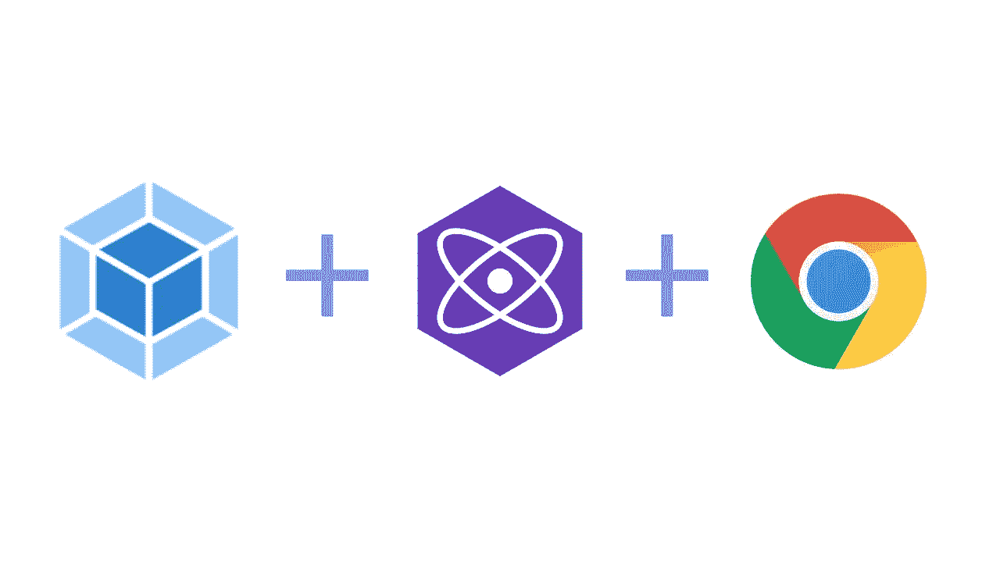
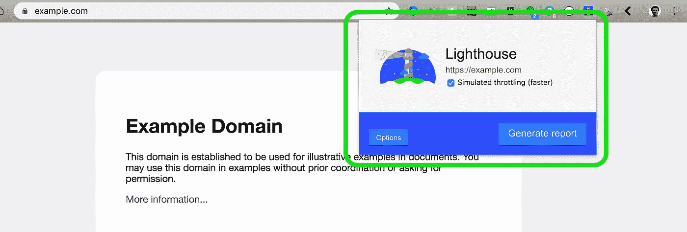
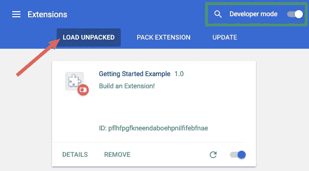
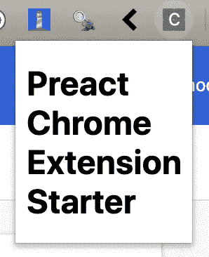
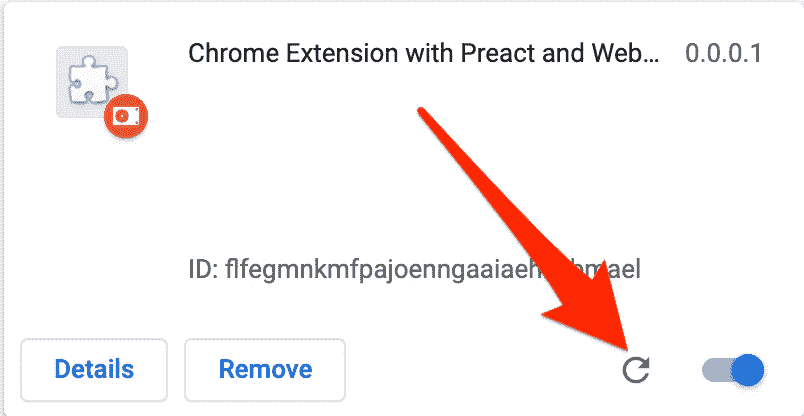
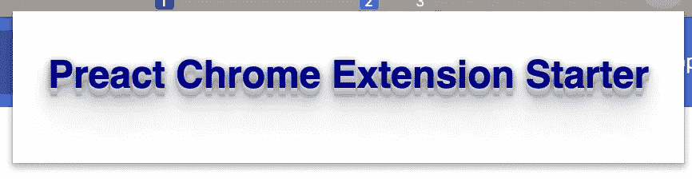

# 用 Preact 和 Webpack 构建一个 Chrome 扩展

> 原文：<https://betterprogramming.pub/build-a-chrome-extension-with-preact-and-webpack-c90edafe05f2>

## Preact 很快，非常轻，并且非常接近 DOM



*TL；DR:***克隆* [*这个 repo*](https://github.com/drewctate/preact-chrome-extension-starter) *并开始用 Preact 构建一个 Chrome 扩展！**

*最近，我对 [Preact](https://preactjs.com/) 感到相当兴奋。它很快，非常轻便，非常接近 DOM，同时仍然提供众所周知的有用的抽象。因此，当我决定创建一个 Chrome 扩展时，Preact 突然出现在我的脑海中，作为 UI 引擎的一个不错的选择。我真的很高兴。*

# *Chrome 扩展简介*

*Chrome 中的扩展由逻辑和 UI 单元组成，分为三大类:*

*   *弹出窗口:这些是当你点击导航栏中的图标时显示的小窗口。*
*   ***后台脚本/页面:**这些可以是仅支持 JS 的脚本，也可以有一个不可见的 UI。无论哪种方式，它们都是有用的，因为它们在页面更改和其他破坏性事件期间保持不变。*
*   ***内容脚本:**实际访问或更改用户正在查看的页面的脚本。*

**

*谷歌的灯塔扩展**弹出***

*Preact 非常适合弹出窗口。弹出窗口是小的、有状态的用户界面，可以包含一系列功能。*

# *设置您的项目*

## *搭建应用程序*

*   *`mkdir <your project name> && cd <your project name>`*
*   *`npm init -y`*
*   *`npm i preact --save`*
*   *`mkdir src`*
*   *`touch manifest.json src/popup.html src/popup.jsx`*

*将以下内容粘贴到`manifest.json`:*

*这个文件定义了你的 Chrome 扩展。你可以看到我们已经告诉 Chrome 为`browser_action`弹出窗口显示一个名为`popup.html`的文件。浏览器动作是当用户点击我们扩展的小图标时应该发生的。让我们填写`src/popup.html`:*

*这个文件引用了`popup.js`，一旦 [Babel](https://babeljs.io/) 将我们的 [JSX](https://reactjs.org/docs/introducing-jsx.html) 传输到 JS，这个`src/popup.jsx`就会被调用。将以下内容粘贴到`popup.jsx`中:*

*您可以看到，`popup.jsx`通过调用`render`为 Preact 执行初始引导。它正在从尚不存在的`./app/app`导入根`App`组件。所以，我们需要创造它。*

*   *`mkdir src/app`*
*   *`touch src/app/app.jsx`*

*将以下内容粘贴到`app.jsx`:*

*不错！你已经有了 Preact Chrome 扩展的开端。现在我们只需要建立一个构建系统。*

## *设置构建系统*

*我们将在构建系统中使用两个主要的库:*

*   ***巴别塔:**允许我们使用酷炫的 [ES6](http://es6-features.org/) 功能，最重要的是，JSX。
    `npm i @babel/core @babel/preset-env @babel/plugin-transform-react-jsx --save-dev`*
*   *[**Webpack:**](https://webpack.js.org/) 模块捆绑器。
    `npm i webpack webpack-cli babel-loader --save-dev`*

*先说 webpack。Webpack 自动寻找`webpack.config.js`中的配置。因此，运行`touch webpack.config.js`并粘贴以下内容:*

*请注意，我们已经将`./src/popup.jsx`定义为我们应用程序的入口(文件 webpack 从这里开始，因为它跟踪`import`语句)。我们还定义了一个通用的`output`，以防你以后想要添加其他入口点(Chrome 扩展通常由多个 Javascript 文件组成)。*

*我们已经包含了一个规则，使用上面安装的`babel-loader`来运行 JSX 文件。*

*最后，我们来配置巴别塔。在项目的根目录下创建一个`.babelrc`文件，并用以下内容填充它:*

*这告诉 Babel 使用 Preact 的`h`函数将 JSX 转换成 JS。*

*跟着我。我们很接近了。*

## *编写构建脚本*

*在您的`package.json`中，创建如下两个脚本:*

```
**"scripts"*: {
  *"build"*: "rm -rf dist && webpack && npm run copy:dist",
  *"copy:dist"*: "cp ./src/popup.html manifest.json ./dist"
},*
```

*`build`脚本将清空`dist`文件夹并运行 webpack 来完成捆绑、复制和缩小。然后，它将运行第二个脚本，`copy:dist`将扩展依赖的非 JS/JSX 文件复制到`dist`文件夹中。*

*准备好迎接魔法了吗？*

*运行`npm run build`并观看一个捆绑的、缩小的、功能性的 Chrome 扩展在一个名为`dist`的新文件夹中具体化。*

# *将你的扩展载入 Chrome！*

**

*来自[官方文件。](https://developer.chrome.com/extensions/getstarted)*

1.  *打开 Chrome 并导航到`chrome://extensions`。*
2.  *单击开发人员模式开关以启用开发人员模式。*
3.  *单击 Load Unpacked 按钮(在图片中寻找红色箭头)。*
4.  *选择您的`dist`目录并点击确定。*
5.  *点击 Chrome 工具栏上显示的小“C”图标。*

**

*你应该看看这个！*

*嘣宝宝！*

*随着我们继续对扩展进行改进，您可以单击扩展卡上的小刷新图标来重新加载新的更改。*

**

*单击此图标刷新扩展。*

# *添加样式*

*我们将在本教程中讨论的最后一步是如何给应用程序添加样式。让我们设置 [SASS](https://sass-lang.com/) :运行`touch src/app/app.scss`并粘贴以下内容:*

*为了让 webpack 正确处理`.scss`文件，我们需要安装一些额外的库。*

```
*npm i sass-loader resolve-url-loader css-loader style-loader node-sass --save-dev*
```

*现在，在`webpack.config.js`中，将以下规则添加到规则数组中:*

```
*rules: [
  ...
  {
    test: /\.scss$/i,
    use: [
      'style-loader',
      'css-loader',
      'resolve-url-loader',
      'sass-loader'
    ]
  }
]*
```

*在此查看已完成的`webpack.config.js` [。](https://github.com/drewctate/preact-chrome-extension-starter/blob/master/webpack.config.js)*

*最后一步是将我们的`app.scss`文件导入到我们的`app.jsx`文件中。这样，webpack 将知道把它包含在包中。*

*将`import './app.scss';`添加到`app.jsx`文件的开头。这里可以看到成品[这里](https://github.com/drewctate/preact-chrome-extension-starter/blob/master/src/app/app.jsx)。*

*现在运行`npm run build`并重新加载你的扩展，就像我们在*中讨论的那样。*一节。*

*弹出窗口现在应该是这样的:*

**

*预作用铬延伸与造型！*

*干得好。现在去构建一些扩展吧！如果你最终用 Preact 构建了一个扩展，请在评论中告诉我。*

# *特殊原料药的注意事项*

*同样值得注意的是，虽然 Chrome 扩展是用 JavaScript 和 HTML 编写的，但它们可以访问的浏览器 API 比一般的 web 应用程序要广泛得多。点击查看特殊扩展 API 列表[。](https://developer.chrome.com/extensions/api_index)*

*对大多数这些强大 API 的访问需要在您的扩展的`manifest.json`中请求，这是您整个扩展的定义文件。*

# *资源*

*   *[行动指南](https://preactjs.com/guide/v10/getting-started)*
*   *[官方 Chrome 扩展介绍](https://developer.chrome.com/extensions)*
*   *[官方 Chrome 扩展教程](https://developer.chrome.com/extensions/getstarted)*
*   *[Preact Chrome 扩展启动器库](https://github.com/drewctate/preact-chrome-extension-starter)*