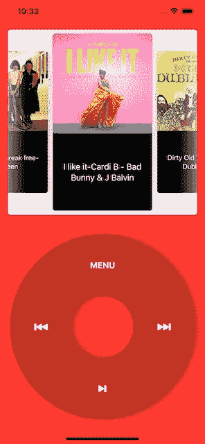
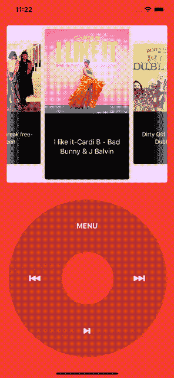
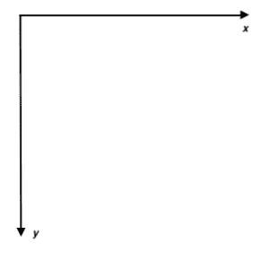
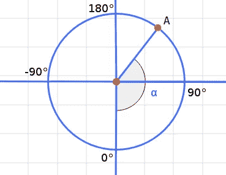

# 使用 SwiftUI 构建经典的 iPod 应用程序

> 原文：<https://betterprogramming.pub/build-a-classic-ipod-app-with-swiftui-f1ff3f19b97e>

## 还记得你珍爱的 iPod 的日子吗？用 SwiftUI 把它带回来

# 介绍

自从 SwiftUI 发布以来，我们已经看到了许多很酷的应用和设计，我们可以用这个新框架来实现。我们看过一个[钱包 App](https://medium.com/better-programming/how-to-create-fun-animations-in-swiftui-1c08adcb93ce) ，动画剧情，电影……

在本文中，我们将展示另一个例子来强调这个 UI 框架的能力，它肯定会在未来几年内改变 iOS 的开发。最终结果应该是这样的:

我们将对代码片段进行注释。你可以在我的报告中找到完整的实现:

 [## fermoya/iPod

### 此时您不能执行该操作。您已使用另一个标签页或窗口登录。您已在另一个选项卡中注销，或者…

github.com](https://github.com/fermoya/iPod) 

# 各个击破

为了简单起见，我们不会关注大而复杂的视图。相反，我们将使用分而治之的策略，并尝试将屏幕简化为更小且可重复使用的视图:

*   一个寻呼机，里面有你喜欢的所有歌曲。
*   `ControlPad`:浏览专辑和播放音乐的控制面板。

`AlbumView`极其容易实现。我们将使用 [SwiftUIPager](https://github.com/fermoya/SwiftUIPager) ，一个 100%由 SwiftUI 组件构建的寻呼机。

为了编码`ControlPad`，我们需要首先构建一个类似甜甜圈的形状`Ring`。我们还将创建一个视图修改器`SpinnableViewModifier`，它将帮助我们跟踪`ControlPad`上的旋转手势。这将允许我们对专辑中的歌曲进行分页。

## 实现 AlbumView

如上所述，我们将使用[快捷导航](https://github.com/fermoya/SwiftUIPager)来实现这张专辑。这个库提供了一个叫做`Pager`的易用组件。我们只需要添加一些定制:

`AlbumView`只不过是一个视图，它包装了一个定制`Pager`并管理它的事件`onPageChanged`。

为了帮助您向视图添加特定的视图修改器，创建一个`Buildable`协议。`Buildable`将允许我们轻松地改变我们的视图，并添加助手功能来定制它们:

使用`Buildable`，我们已经成功定义了一个视图修饰符`onPageChanged`，来传递对`Pager.onPageChanged`事件值的回调。

## 实施 ControlPad

这是这个项目最困难的部分。首先，让我们专注于创建一个形状，`Ring`，并在其上添加特性。

要实现`Ring`，扩展`Shape`协议并添加所需的存根:

给定一个`ratio`和一个`rect`，我们已经创建了一条路径，并在上面画了两条弧线。`ratio`设置两个圆弧之间的距离。

我们现在可以将`ControlPad`定义为一个`Ring`，上面堆叠了四个按钮:

有些事件`ControlPad`必须公开为按钮动作的回调:

*   `onForwardTapped`按下前进按钮时。
*   `onPlayPauseTapped`当用户点击播放/暂停按钮时。

我们可以使用与`AlbumView`中相同的策略并实现`Buildable`:

# 使环可纺

此时，我们已经实现了按钮的回调，但是我们仍然缺少使 iPod 成为如此受欢迎的音频播放器的关键部分:浏览专辑的旋转手势。

为了实现这个手势，我们将创建一个视图修改器，`spinnable`，它将添加一个`DragGesture`到`Ring`，并将拖动位置转换为旋转。

先来刷新一些数学概念。`DragGesture`给出基于坐标空间的位置，如下所示:

为了得到旋转的角度，我们需要:

*   将原点移动到环中心，即将点转换到不同的坐标空间。
*   将旋转角度计算为拖动位置的反正切。

让我们扩展`CGPoint`来帮助我们完成这些转换:

现在，我们准备实施`SpinnableViewModifier`:

我们使用`DragGesture`获得一个定位点，然后用它来计算角度。`Rotation`是一个结构，让我们根据方向(顺时针或逆时针)累加这个角度，并将这个值转换为`laps`:

准备好所有这些新组件后，回到`ControlPad`并使`Ring`可旋转:

# 将碎片拼在一起

我们已经非常接近拥有一个实用的 iPod 了。留给我们的唯一任务是连接`AlbumView`和`ControlPad`。一旦完成，我们就都准备好了！

就这样，你完成了！点击运行并享受音乐:

# 结论

太酷了，我们创造了自己的 iPod！我们从识别设计的各个部分开始，我们将它分开，这样就更容易分离关注点，让每个视图各司其职，最后，我们将所有东西放在一起。

别忘了你可以在这里看到完整的代码:

 [## fermoya/iPod

### 此时您不能执行该操作。您已使用另一个标签页或窗口登录。您已在另一个选项卡中注销，或者…

github.com](https://github.com/fermoya/iPod)