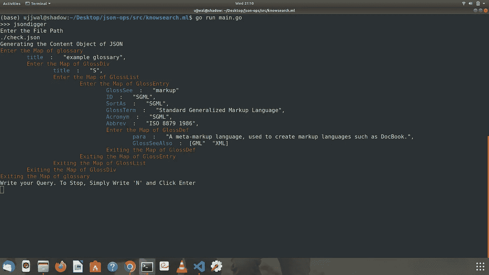
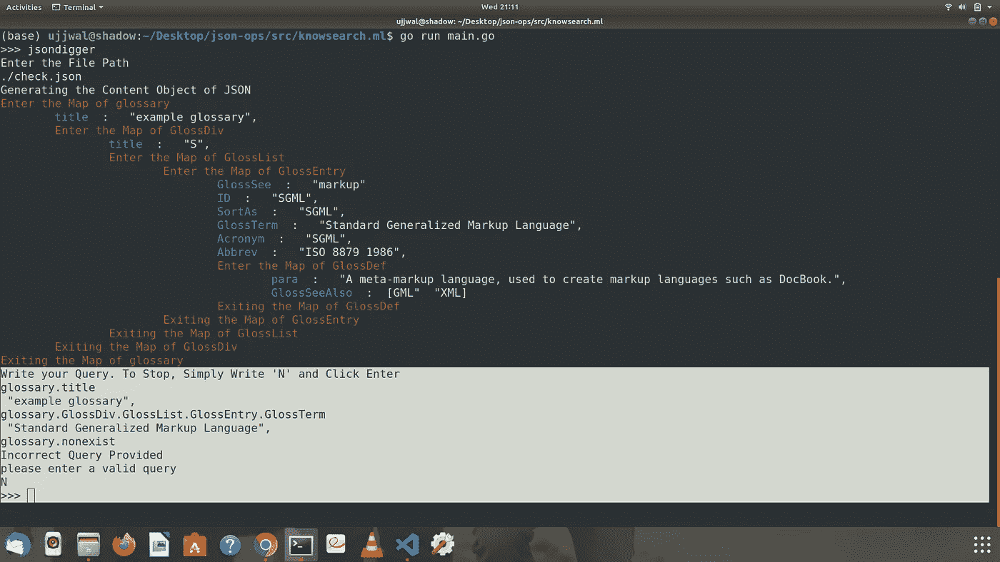

# 构建一个 CLI 工具来解析和查询 Golang 中的动态 JSON

> 原文：<https://betterprogramming.pub/build-a-cli-tool-to-parse-and-query-dynamic-json-in-golang-cc1db72b1e85>

## 运行时查询和解析 JSON


马修·法斯纳赫特在 Unsplash[拍摄的照片](https://unsplash.com?utm_source=medium&utm_medium=referral)

如果您一直在使用 Golang 开发 JSON 友好的应用程序，我猜您可能已经遇到了解析动态(我们不知道这个文件的结构)JSON 文件的问题。

有很多解决这个问题的方法，比如使用一个空接口和[解组](https://pkg.go.dev/encoding/json),但是在你必须访问 JSON 的值之前，这似乎是一件轻而易举的事情。

# 我们会学到什么？

不，我们不打算在这个项目中使用`JSON.Unmarshal`。我们将构建自己的逻辑，使用字符串操作和映射字符串接口从 JSON 文件解组到 Golang 数据结构。

我们还将构建一个查询工具，它将帮助我们基于用户在运行时提供的输入来访问[映射字符串接口](https://bitfieldconsulting.com/golang/map-string-interface)中的值(接口通常不允许这样做)。这将是一种[深度优先搜索](https://www.geeksforgeeks.org/depth-first-search-or-dfs-for-a-graph/)类型的基于递归的算法。这听起来可能很吓人，但代码实际上非常简单。

在我为 JSON 验证写的[上一篇文章中，我使用了参数作为输入，我在这个项目中使用了一个交互式 shell。它更有趣，也更容易使用。这将有助于我们在执行期间获得用户输入，提供文本和背景颜色，使我们的程序看起来不枯燥，并有助于无缝的用户交互。](/build-your-first-golang-cli-tool-for-json-validation-30dd4ff0b963)

# 先决条件

你应该了解基本的 Golang 语法。这需要对[栈、递归、指针、结构和控制结构](https://gobyexample.com/)有所了解。如果你对这些有一个基本的概念，你可以继续！我在要点代码中提供了注释，这样你就不会迷路。

我在最后提供了 Github 库供你参考。

# 项目结构

我采用这种代码结构是因为我的项目中有一个额外的模块叫做`jsonvalidator`。这种结构使理解包变得容易，并有助于实现模块化。我可以在其中添加任意数量的包，而不会破坏现有的功能。

```
- src/
-- example.com/
--- check.txt
--- check.json
--- go.mod
--- main.go
--- jsonvalidator/
--- jsondigger/
     - jsondigger.go
     - jsondigger_test.go
```

# 项目索引

为了更好的理解，这个项目被分成了几个部分。

1.  使用`github.com/abiosoft/ishell/v2`设置交互式外壳并添加命令
2.  构建将 JSON 解组到 map string 接口的逻辑
3.  向用户显示 JSON 文件的映射
4.  构建查询 JSON 的逻辑

# 使用 ishell 设置交互式 Shell 并添加命令

`Ishell`是一个伟大的开源工具，有助于构建交互式命令行应用程序。它支持用户输入，多行输入，提供颜色，清单和多选选项。我已经使用了`ishell`来构建 CLI 命令。

这里的`name`是您将在 shell 中调用的模块的名称。`help`包含模块的描述。`Ishell`提供了惊人的 shell 体验，您只需在 shell 中键入`help`即可查看描述。

`Ishell`定义了一个`context`，它包含命令行参数，每个函数用一个命令执行。我已经将它传递给了`jsondigger`包函数，以便从`CLIExecuter`函数中访问命令行参数。

# 将 JSON 解组到 Map String 接口的逻辑

地图字符串接口是 Golang 中最有用的概念之一。它为我们提供了一个指向空接口的映射。

我喜欢把它看作是 Python 字典，但是是在面向对象编程的意义上。接口可以包含字符串、映射、整数或任何任意类型的内容。这给了我们处理不同数据类型的灵活性。

然而，顾名思义，映射将字符串指向一个接口，而接口并不是为了在运行时被查询而构建的。它们不是为了直接引用值而构建的，而是使用称为方法的函数。

一个空的接口没有任何方法，即使我们填充了它，我们也不能查询它。

这就是为什么使用`map[string]interface{}`和`json.Unmarshal` 不适合嵌套 JSON 的原因。如果我们有一个嵌套的 JSON，那么查询到更深的层次几乎是不可能的。

我们可以编写自己的代码来解组到我们选择的接口中。我使用了堆叠逻辑来处理这个问题。因为我们有一个 JSON 文件，所以几乎每一行都以一个字符串后跟一个冒号开始。

我只使用了`map[string]interface{}`，但是接口中值的类型是由冒号后面的内容定义的。

我考虑过三种可能性。

*   冒号后的第一个字符可以是一个`“`，如果它是一个字符串的话
*   `{`如果是嵌套的 JSON 对象(为此我们需要一个栈)
*   `[`表示 JSON 文件中的一个数组。

因此，基于这一点，我必须确保每个级别的地图都被正确填充。主要目的是处理 JSON 中的嵌套对象，所以我在这个例子中使用了`Stack`。但是`Stack`的元素属于`struct StackEle`类型。

为了跟踪我们当前嵌套的键，我有一个名为`name`的字段和另一个名为`util`的字段，用于处理当前类型为`map[string]interface{}`的键的数据。

```
type StackEle struct {name stringutil map[string]interface{}}
```

开始时，我将一个元素添加到最终存储答案的堆栈中。现在，每当我读取冒号后的`{`时，我都会获取堆栈的顶部。

对于这个 stack 元素，我用当前的 key ie 添加了堆栈中的键值对。冒号前的字符串和一个空的`map[string]interface{}`作为值。

现在，我将当前添加的空`map[string]interface{}`推入堆栈，因为我们知道这是一个嵌套层次。

Golang 自动传递指针，这意味着每当嵌套的`map[string]interface{}` 更新时，堆栈的底层也会更新。每当我在第一行遇到一个`}`，我就从堆栈中弹出。

现在，如果冒号后面有一个`“`，我知道有一个字符串。因此，我将键值对添加到当前栈顶的`util` (map)中(同样，stack 有助于确保将其添加到正确的级别)。

类似地，如果冒号后面有一个`[`，我就分割字符串并将数组保存在栈顶元素的`util`对的键值中。

最后，我们将有一个完全填充的`map[string]interface{}`,所有的值都被正确填充。但是我们如何对此进行查询呢？

# 向用户显示 JSON 文件的映射

这是一个 DFS 类型的算法。我还在命令行中使用了颜色来吸引用户。

如果对象的类型是 map string 接口，我们将调用调用键值对的当前值的函数。

在最后一个级别，将不再需要调用该功能。这保证了递归会结束，不会陷入无限循环。

我还使用计数器来处理缩进的级别。



显示对象函数的输出

# 构建查询 JSON 的逻辑

这是类似的逻辑。我们简单地使用 DFS 查询 JSON，当我们找到匹配的键时，我们显示并退出循环。这里，我以点分隔字符串的形式接受查询。

```
>>> glossary.GlossDiv.GlossList.GlossEntry.GlossTerm
```

现在，我只需要把字符串分成数组。这种类型的查询适用于所有级别。这意味着即使最后一个元素是地图，它也将使用 Golang 的默认`Println`作为地图打印。

为了帮助递归，我传递了查询字符串数组和一个计数器，以确保我们的方向正确。为了进入下一个级别，我们只需递增计数器。



代码的输出

# 结论

感谢您阅读至此。我希望你喜欢这个项目。理解栈的工作可能需要一些时间，但是一旦你掌握了它，你将能够更有逻辑和更有效地思考。

递归也像堆栈一样工作，几乎任何递归算法都可以用堆栈来模拟。这个项目将带你了解字符串操作、映射、接口、递归、结构等等。对于初学者来说，学习任何东西的最佳方式是开始构建和应用。

这里是该项目的 [Github 库](https://github.com/shadowshot-x/go-cli-jsonOps)的链接。如果您愿意参与，我会非常高兴，所以请随意提出拉动请求。

# 参考

大部分代码都是我自己写的，但是我提到了一些对我有帮助的著名参考资料。

1.  [伊谢尔](https://github.com/abiosoft/ishell)
2.  [Go:了解空界面](https://medium.com/a-journey-with-go/go-understand-the-empty-interface-2d9fc1e5ec72)