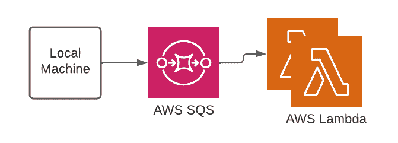
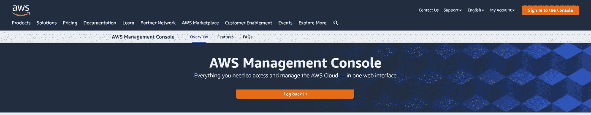
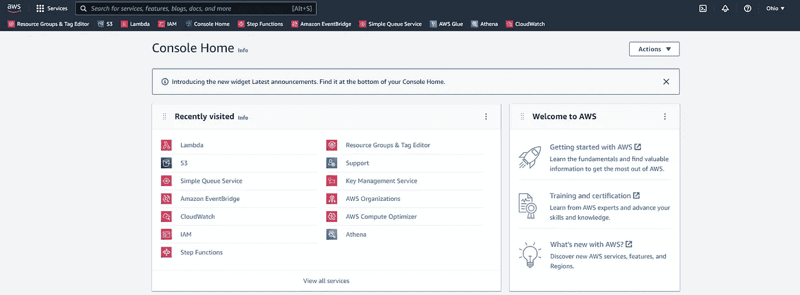
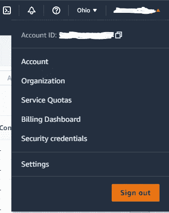

# 构建云原生多处理框架

> 原文：<https://betterprogramming.pub/build-a-cloud-native-multiprocessing-framework-b33cfc2c02b9>

## 如何将本地多处理框架转换到云


卢卡·布拉沃在 [Unsplash](https://unsplash.com?utm_source=medium&utm_medium=referral) 上的照片

云技术继续困扰着我。功能、易用性和成本都是有利的—工作负载完成速度提高了 100 倍，web 界面和编程交互性为新手和专家提供了手段，免费的层级、培训和示例降低了前期成本和学习曲线。有许多云平台，亚马逊网络服务(AWS)可能是最好的起点。

# 目录

1.  回顾
2.  背景
3.  两个服务
4.  AWS 入门
5.  设置 SQS
6.  设置λ
7.  总和

# 1.回顾

在本文中，我们将介绍如何在云中创建一个多处理框架。我希望扩展我以前写的一篇文章的内容，在那篇文章中，我讨论了 PC 或笔记本电脑上的多处理。您可能会发现，首先阅读那篇文章会给您带来额外的背景，它被称为[Python](https://towardsdatascience.com/a-simple-multiprocessing-framework-within-python-9497bdf9b42b)中的一个简单的多处理框架。

# 2.背景

AWS 提供了两种服务，当串联使用时，就像一个多处理引擎，可以完全自动化——如果您的工作足够小，那么您将不会因为它们的免费层而支付一分钱。

## PC 上的多重处理

假设您的笔记本电脑或 PC 最多只有 4 个内核和 8 个逻辑处理器。这将允许你(如果你不同时在你的电脑上做任何事情)同时运行 8 个任务。因此，您只能使用逻辑处理器。更不用说，根据您要实现的目标，您还可能会遇到内存(RAM)限制。让我们假设你的电脑也有 8 GB 内存。

## 云中的多重处理

关于云中的“处理器”和 RAM，您被限制为同时运行 1K 个“处理器”和每个“处理器”10 GB 的内存——也就是 10K GB。你在任何地方都比不上。

因此，从速度的角度来看，云版本的多处理是有利的，因为如果您必须处理 100K 个独特的任务，并且每个任务需要两分钟完成，那么 PC 进程将需要大约 17 天才能完成，而云进程最多需要三个小时才能完成。

# 3.两个服务

## 一个队列

你听说过排队服务吗？如果不是，就想象一下像赌场发牌员一样的排队服务。庄家收到一副新牌开始游戏。她/他向每个玩家分发预先定义的纸牌子集。按照规则的规定，玩家可以随心所欲地使用这些牌来增加成功的可能性。一旦所有必要的牌都发了，所有的玩家都玩了他们的牌，玩家将向庄家展示他们的牌，最后，他/她决定谁赢了谁输了。

队列服务的工作方式类似于我们的类比。在收到消息之前，队列服务处于空闲状态。然后，队列服务将消息传递给“处理器”，就像庄家分发一副牌一样。基于预定义的逻辑步骤，处理器只对它们接收到的消息做它们被允许做的事情，然后它们将信息发送回队列以了解它是否成功。如果成功，太好了。如果失败了，可以采取其他步骤来重试或警告用户。

## 我们将讨论的第一个服务是一个队列服务，称为简单队列服务(简称 SQS)

## 一个λ

从个人计算机的角度来看，处理器是一种硬件，它运行由应用程序或编程语言定义的一系列代码，向硬件发送启动、运行和停止信号。处理器是一种服务或技术，它按照用户(你和我)的定义简单地处理数据/信息。

在 AWS 云世界中，处理器被称为 Lambda。它们做的正是 PCs 处理器的设计目的:运行由应用程序或编程语言定义的一系列代码。

## 我们将讨论的第二个服务是 AWS 中一个名为 Lambda 的处理器服务。

## 视觉

视觉帮助我，可能你也是。这里有一个流程图，展示了我们今后将努力做的事情(我们将按一口大小讨论这些组件):



📸由[我](https://www.linkedin.com/in/dylancunningham/)

# 4.AWS 入门



📸由[我](https://www.linkedin.com/in/dylancunningham/)

你需要一个 AWS 账户。请遵循以下步骤:

1.  打开 Chrome 或其他网络浏览器，输入这个网址:【https://aws.amazon.com/console/[。](https://aws.amazon.com/console/)
2.  单击“登录控制台”(右上角)。
3.  单击“创建新的 AWS 帐户”。
4.  完成所有必要的步骤，从他们注册，验证电子邮件，所有这一切。

遇到困难，或者这些步骤足够了吗？请在评论中告诉我。

# 5.设置 SQS

有多种方法可以浏览到 SQS 设置页面。这是我的样子:



📸由[我](https://www.linkedin.com/in/dylancunningham/)

您没有看到简单队列服务选项卡、按钮或链接吗？当你做的时候，点击一个。您应该看到一个“创建队列”选项，单击该按钮。现在，请遵循以下步骤:

1.  在细节和类型下:选择“标准”选项(我们不担心 FIFO 选项)。
2.  在 Details and Name 下:给你的队列起一个独特的名字，这个名字与它将要发送给 Lambdas(即“处理器”)的独特消息相关。
3.  在“配置和可见性超时”下:将选项更改为 15 分钟。(为简单起见，将此设置为您希望 Lambdas 运行的最大时间。Lambda 的最长时间是 15 分钟，仅供参考。)
4.  在“配置和消息保留期”下:将选项更改为 1 小时。(这告诉队列在设定的时间内保留消息；你需要时间来处理所有的信息。)
5.  滚动到页面底部，然后单击“创建队列”。

## 如何给 SQS 发信息

让我们假设你希望从你的笔记本电脑或个人电脑发送消息到 SQS。

首先，导入 Python 库 boto3。

```
import boto3
```

接下来，我总是有一个 settings.json 文件，我将它作为 Python 中的一个字典导入。它看起来像这样:

```
{
    "local": true,
    "account": "123456789012",
    "role": "developer"
}
```

本地键告诉我的进程我正在从我的机器上运行，如果我想把这个本地进程转换成 AWS，那么我已经准备好这样做了。帐户密钥位于 AWS 页面的右上角。角色是另一种动物，它可以单独成为一篇文章:[这里有一篇](https://medium.com/panther-labs/aws-identity-and-access-management-iam-fundamentals-a4f0e80b87fd)供参考。(如果你喜欢我解释事情的方式，并且想要一篇文章来讲述这个过程，那么请在评论中告诉我。)



📸由[我](https://www.linkedin.com/in/dylancunningham/)

现在，我们需要一种本地认证的方法(向 AWS 显示我们应该向我们的队列发送消息。这里有一个函数可以帮助你。

仅供参考，AWS 有一个特性，您可以在给定区域创建资源。在上图中，你会看到单词 Ohio。俄亥俄州是 us-east-2 地区，如下面的代码所示(小箭头帮助您了解这一点)。根据您的情况进行必要的调整。

现在我们需要向队列发送消息的功能。这里有两个携手合作的例子:

上面的 send_message_to_sqs 函数由下面的 create _ messages _ and _ send _ to _ SQS 函数使用。你也可以看到上面的 send_message_to_sq 函数使用了我们刚才讨论过的 get_resource 函数。

此功能以 10 条或更少的数量批量发送消息。我在我的过程中使用这个函数来查询来自 [Public](https://share.public.com/dylanstorm) ，或 [Webull](https://a.webull.com/8ksM6IWDJzPqU4WyiX) ，或 [Robinhood](https://join.robinhood.com/dylanc150) 等平台的股票行情数据；然而，我使用 [Tiingo](https://www.tiingo.com/) 作为我所有的股票价格/基本面数据(日内和日末)。因此，这个函数接受一个 tickers 列表，这就是为什么您将它视为函数的一个参数。根据您的过程进行必要的更改，但是在我的例子中，这个列表是一个字典列表。每个字典都包含 SQS 将发送给 Lambda 的核心信息，以便 Lambda 处理 ticker 数据(从 Tiingo 查询并保存到另一个名为简单存储服务(Simple Storage Service，简称 S3)的 AWS 服务)。

最后，您的最后一步是使用 create _ messages _ and _ send _ to _ SQS 函数，如前所述，将您的消息发送到您的队列。

除非你把 Lambda 函数和 SQS 连接起来，否则什么都不会发生。请继续阅读，了解如何访问本文的第二部分，了解如何配置 Lambda。

# 6.设置λ

让您的 AWS Lambda 为部署做好准备可能需要很多时间，但也可能很快。根据您对使用容器、CDK、CI/CD 和其他自动部署方法的需求，您将需要进一步探索。在本文中，我将向您展示如何通过 AWS 的在线门户/GUI 浏览重要的部分。

有多种方法可以浏览 Lambda 设置页面。这是我的样子:


📸由[我](https://www.linkedin.com/in/dylancunningham/)

你没看到 Lambda 标签、按钮或链接吗？当你做的时候，点击一个。您应该看到一个“创建函数”选项，单击该按钮。现在，请遵循以下步骤:

1.  选择“从头开始创作”选项(我们不会担心其他选项)。
2.  在基本信息下:命名您的函数。
3.  在基本信息下:选择运行时下拉列表，然后选择 Python 3.7。
4.  滚动到页面底部，点击“创建功能”。
5.  在下一个窗口，一直滚动到底部，到层部分，并点击“添加层”
6.  在“选择图层”下:选择“指定 ARN”。
7.  在“选择图层:将此 ARN 粘贴到”下的文本框中:arn:AWS:lambda:us-east-2:113088814899:layer:Klayers-python 37-pandas:22。
8.  滚动到页面底部，然后单击“添加”。

## 如何将 SQS 与 Lambda 联系起来

为了让您的 lambda 接收和处理消息，您必须通过选择 Function overview 部分下的“+ Add trigger”来添加一个触发器。一旦你遵循这些步骤:

1.  在触发器配置下:选择下拉菜单，输入 SQS，然后点击“SQS”。
2.  出现更多选项后，在 SQS 队列下:选择您之前创建的队列名称。
3.  在批次大小下:键入数字 1。(我们将假设每个 lambda 只处理一条消息。如果需要，你可以增加。)
4.  滚动到页面底部，然后单击“添加”。

## 如何配置 Lambda

我只在我的 lambdas 的 Configuration 选项卡中调整了两个设置:常规配置和环境变量。在常规配置下，我编辑内存大小和超时。对于这两者，我高估了我的 lambdas 需求，只有一点点。在这里运用你的判断力。在环境变量下，我一般只添加 API 键等。在这里运用你的判断力。

## 如何设置您的代码

当你的 lambda 在收到 SQS 消息后执行时，它将运行一个 lambda_handler 方法。确保您已经定义了这个方法。这是我的 lambda，我称之为 worker _ lambda _ daily _ EOD _ historical。这个函数遍历来自 SQS 的消息——同样，它遍历 ticker——从 [Tiingo](https://www.tiingo.com/) 的 API 为每个 ticker 检索数据，将数据写入 AWS 的简单存储解决方案(S3 ),最后返回 200 或 400 作为响应。

我的函数中的另一个方法是我如何将数据保存回 S3。见下文:

使用我在这一节中教授的内容作为一个框架，而不是作为一个终极的方法。我介绍的概念是 lambda 调用运行的方法，你可以添加和引用任何类、函数、全局变量、环境变量等等。，你需要从你的`lambda_handler`方法。最后要指出的是，这个方法应该以事件和上下文作为参数。

# 总和

在本文中，我们讨论了如何帮助您在云中应用多处理，并释放所有必要的功能——增强的计算能力、易用性，以及零到极低的成本。我们讨论了 AWS SQS(一种排队服务)，如何向 SQS 发送消息，如何设置 AWS Lambda(一种处理服务)，以及如何将队列连接到 Lambda。最终，您可以在云中轻松实现多处理。