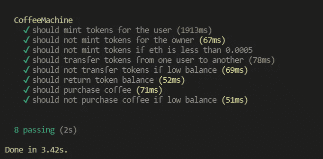
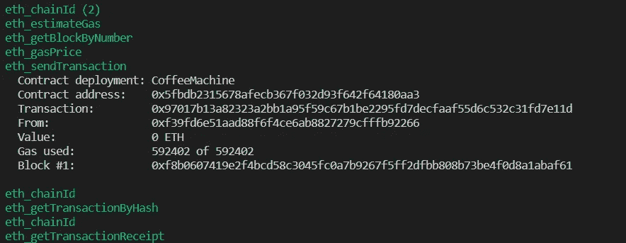
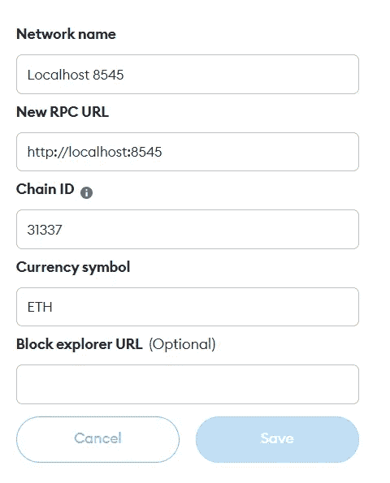

# 建立一个咖啡自动售货机 dApp 与固体，安全帽，并作出反应

> 原文：<https://betterprogramming.pub/build-a-coffee-vending-dapp-with-solidity-hardhat-and-react-b9336d34f7f6>

## 构建全栈 dApps 的基础


照片由 [Shubham Dhage](https://unsplash.com/@theshubhamdhage?utm_source=medium&utm_medium=referral) 在 [Unsplash](https://unsplash.com?utm_source=medium&utm_medium=referral) 上拍摄

# 介绍

我们将了解如何创建 dApp。我们将使用 [Solidity](https://docs.soliditylang.org/en/v0.8.17/) 编写智能合约，使用 [Hardhat](https://hardhat.org/) 作为开发工具并与智能合约交互，使用 [React](https://reactjs.org/) 和 [Ethers](https://docs.ethers.io/v5/) 库作为前端。

我们还将为智能合同编写单元测试，并将合同部署到一个现场测试网上。

如果你想看结果，这里是现场项目。开始吧！

# 安全帽设置

编译、部署和测试智能合约需要硬件。没有 Hardhat 也可以做到这些，但是 Hardhat 通过提供 API 和 CLI 抽象了这些步骤。

创建一个新目录并执行`npm init`来初始化`package.json`。

使用`yarn`或`npm`安装安全帽。这将把 Hardhat 及其附属设备添加到`package.json`。

```
yarn add -D hardhat
```

Hardhat 提供了一个 CLI 命令来初始化和设置样板文件项目。下面的命令给出了三个选项供选择，`A JavaScript project`、`A TypeScript project`或一个空的`hardhat.config.js`文件。我们会选择`A JavaScript project`。

```
npx hardhat
```

运行上述命令后，会生成以下文件夹结构和文件:

```
/
  contracts/
    Lock.sol
  node_modules
  scripts/
    deploy.js
  test/
    Lock.js
  .gitignore
  hardhat.config.js
  package.json
  README.md
  yarn.lock or package-lock.json
```

文件夹结构是自我描述的。`contracts`文件夹将包含您所有的`.sol`智能合同文件，`scripts`用于编写可能会派上用场的实用程序，通常包含部署脚本。`test`文件夹将包含智能合同的测试脚本。

另一个需要研究的重要文件是`hardhat.config.js`文件。该文件用于自定义 Hardhat 将如何使用工具、网络、文件夹结构等。当我们更改这个文件时，我们将会研究更多的细节。

我们将需要 Hardhat 助手包来部署、测试智能合约并与之交互。通过以下命令安装它们:

```
yarn add -D @nomicfoundation/hardhat-toolbox @nomicfoundation/hardhat-network-helpers @nomicfoundation/hardhat-chai-matchers @nomiclabs/hardhat-ethers @nomiclabs/hardhat-etherscan chai ethers hardhat-gas-reporter solidity-coverage @typechain/hardhat typechain @typechain/ethers-v5 @ethersproject/abi @ethersproject/providers
```

这就是设置。让我们开始写智能合同吧！

# 撰写智能合同

默认情况下，Hardhat 在`contracts`文件夹中搜索智能合约。如果你按照上面的设置，你可能已经有一个样本智能合同文件`Lock.sol`。我们将用我们的智能合同替换它。

我们将在`contracts`文件夹中创建一个扩展名为`.sol`的新文件。我把它命名为`CoffeeMachine.sol`。

在写代码之前，我们先来重温一下`hardhat.config.js`文件。solidity 编译器版本可以在配置文件中定义。您可能已经看到编译器版本被设置为`0.8.x`(在我写这篇文章的时候)。您可以将这个版本更新为您想要的任何编译器版本。

另外，`@nomicfoundation/hardhat-toolbox`被导入到文件的顶部。这个导入会导入我们作为依赖项添加的所有 Hardhat 助手包。这些工具是编译、部署和测试智能合约所必需的。

```
require("@nomicfoundation/hardhat-toolbox");
```

```
/** @type import('hardhat/config').HardhatUserConfig */
module.exports = {
  solidity: "0.8.17",
};
```

让我们开始在`contracts/CoffeeMachine.sol`文件中写一些代码。添加许可证标识符和 pragma 指令，以指定智能协定的编译器兼容性。

```
// SPDX-License-Identifier: UNLICENSED
pragma solidity ^0.8.9;
```

如果你使用另一个版本，比如`0.7.*`，它不会编译并返回`Source file requires different compiler version (current compiler is 0.8.17+commit.8df45f5f.Emscripten.clang)`。

接下来，我们定义契约体并定义变量。

我们正在让业主`payable`将收到的 ETH 从合同中转入业主账户。

接下来，我们定义契约函数。我们将有四个功能:

*   `mintTokens` —为呼叫者创建令牌以交换 ETH
*   `transferTokens` —将代币转移到另一个帐户
*   `getTokenBalance` —返回呼叫者账户中的代币数量
*   `purchaseCoffee` —减去代币，给你一杯咖啡(不是真的)

我们已经准备好合同了。为了测试我们是否做对了一切，通过运行下面的命令来编译契约:

```
npx hardhat compile
```

这将编译合同并将合同 ABI 信息保存在`artifacts/contracts`文件夹中。这将在以后用于连接我们的前端应用程序。

# 编写单元测试

测试是验证代码模块化功能的重要步骤。用 Hardhat 写测试会感觉很 JavaScript-ey 如果那是一个术语的话:)

安全帽在幕后使用[摩卡](https://mochajs.org/)和[柴](https://www.chaijs.com/)进行测试。如果您习惯于用 Mocha 编写 JavaScript 测试，那么为智能合约编写测试会感觉很琐碎。

在`test`目录下创建一个名为`CoffeeMachine.js`的新文件。我们将进口`expect`和`ethers`用于测试。我们也将以通常的方式描述使用`describe`和`it`模块的测试。

```
const { expect } = require("chai"); // used to assert test results
const { ethers } = require("hardhat"); // used to deploy and interact with the contract
```

```
describe("CoffeeMachine", function () {
  it("should mint tokens for the user", async function () {
    const [owner, addr1] = await ethers.getSigners(); // getting the available accounts
    const CM = await ethers.getContractFactory("CoffeeMachine"); // fetch the contract
    const cm = await CM.deploy(owner); // deploy the contract
    await expect(
      cm.connect(addr1).mintTokens({
        value: ethers.utils.parseEther("0.0012"),
      }) // connect to addr1, and mint tokens 
    )
      .to.changeEtherBalance(owner, ethers.utils.parseEther("0.001")) // expect the owner to have received 0.001 (the remainer 0.0002 is sent back to the user)
      .to.changeEtherBalance(addr1, ethers.utils.parseEther("-0.001")); // expect the user to have 0.001 less ETH

    expect(await cm.connect(addr1).getTokenBalance()).to.equal(2); // expect user to gain 2 tokens (0.001 / 0.0005 = 2 tokens)
  });
})
```

注意我们在 Chai 中是如何使用方法`changeEtherBalance`的。这是 Hardhat 注射的，Chai 包装上没有。这些方法被 Hardhat 的`@nomicfoundation/hardhat-chai-matchers`注入到 Chai 包中。

如果有多个测试，我们应该恢复已部署的契约，而不是重复编写前三行。Hardhat 提供了部署契约一次并在每次测试前重置契约状态的装置。

Fixtures 是一些函数，您可以在其中定义契约部署代码(或者您想要重用的任何代码)。然后，这个 fixture 将在每个测试中被调用，以使用来自`@nomicfoundation/hardhat-network-helpers`的`loadFixture`获取契约实例。

```
const { expect } = require("chai");
const { ethers } = require("hardhat");
const { loadFixture } = require("@nomicfoundation/hardhat-network-helpers");
```

```
describe("CoffeeMachine", function () {
  // fixture to be called from tests
  async function deployCoffeeMachineFixture() {
    // write your deployment code
    const addresses = await ethers.getSigners();
    const CM = await ethers.getContractFactory("CoffeeMachine");
    const cm = await CM.deploy(addresses[0].address);
    // return the instances to be used by tests
    return { cm, addresses };
  }

  it("should mint tokens for the user", async function () {
    // rewritten to use fixtures
    const { cm, addresses } = await loadFixture(deployCoffeeMachineFixture);
    const [owner, addr1] = addresses;
    await expect(
      cm.connect(addr1).mintTokens({
        value: ethers.utils.parseEther("0.0012"),
      })
    )
      .to.changeEtherBalance(owner, ethers.utils.parseEther("0.001"))
      .to.changeEtherBalance(addr1, ethers.utils.parseEther("-0.001"));
    expect(await cm.connect(addr1).getTokenBalance()).to.equal(2);
  });
  it("should not mint tokens for the owner", async function () {
    // rewritten to use fixtures
    const { cm } = await loadFixture(deployCoffeeMachineFixture);
    await expect(
      cm.mintTokens({
        value: ethers.utils.parseEther("0.001"),
      })
    ).to.be.revertedWith("cant mint tokens for the owner");
  });
}
```

您可以在 [GitHub repo](https://github.com/rajgaur98/coffee-vending-machine) 上查看整个测试文件。这个智能合约还有其他测试。

要运行测试，运行`npx hardhat test`命令，如果您做的一切都正确，您应该会看到下面的输出。



# 部署合同

Hardhat 提供了运行不同脚本的环境，这些脚本是使用`npx hardhat run scriptname.js --network networkname`运行的。提供了一个示例部署脚本，这是编写助手脚本的良好起点。

我们将使用代码更改`scripts/deploy.js`脚本，以部署我们的智能合约。

```
const path = require("path");
```

```
async function main() {
  // ethers is available in the global scope
  const [deployer] = await ethers.getSigners();
  console.log(
    "Deploying the contracts with the account:",
    await deployer.getAddress()
  );
  const CM = await ethers.getContractFactory("CoffeeMachine");
  const cm = await CM.deploy(deployer.address);
  await cm.deployed();
}
main()
  .then(() => process.exit(0))
  .catch((error) => {
    console.error(error);
    process.exit(1);
  });
```

代码可能看起来非常熟悉，因为我们在测试中部署契约时使用了类似的代码。注意，我们在这里没有导入`ethers`，当脚本使用`npx hardhat run script.js`运行时，它被注入到`global`对象中。但是，如果您想使用`node script.js`运行脚本，那么就添加`ethers`导入。

部署的契约包含用于连接前端应用程序或与契约交互的契约地址和工件。当连接到我们的前端时，我们会看到这一点。

# 连接前端

我们将在前端使用 React，在前端使用 ethers.js 库与契约进行交互。

使用`npx create-react-app frontend`命令创建一个新的 React 应用。我正在我们项目的根目录下创建`frontend`文件夹。文件结构如下所示:

```
/
  contracts/
  test/
  scripts/
  frontend/
  others...
```

将 ethers.js 库安装到依赖项中。这是我们与智能合约交互所需的唯一库。如果您想知道这是不是我们之前在测试和脚本文件中看到的同一个库，那么您是对的。但这有一点不同，因为 Hardhat 通过抽象代码简化了它。

```
yarn add ethers
```

我们将在我们的`App.jsx`文件中导入`ethers`，并开始与契约进行交互。我认为，对于这篇文章，我们应该只浏览我们使用`ethers`的地方，而不是浏览所有的代码，除此之外，纯粹的 React 和 CSS。

`ethers`将需要契约的工件和地址来连接到已部署的契约。我们可以从我们之前编写的部署脚本中获得这一点。让我们重温一下，将契约工件和地址保存到我们的前端。

```
const path = require("path");
const fs = require("fs");
```

```
async function main() {
  // ethers is available in the global scope
  const [deployer] = await ethers.getSigners();
  console.log(
    "Deploying the contracts with the account:",
    await deployer.getAddress()
  );
  const CM = await ethers.getContractFactory("CoffeeMachine");
  const cm = await CM.deploy(deployer.address);
  await cm.deployed();
  saveFrontendFiles(cm);
}
// we add this part to save artifacts and address
function saveFrontendFiles(cm) {
  const contractsDir = path.join(__dirname, "/../frontend/src/contracts");
  if (!fs.existsSync(contractsDir)) {
    fs.mkdirSync(contractsDir);
  }
  fs.writeFileSync(
    contractsDir + "/contract-address.json",
    JSON.stringify({ CM: cm.address }, null, 2)
  );
  // `artifacts` is a helper property provided by Hardhat to read artifacts
  const CMArtifact = artifacts.readArtifactSync("CoffeeMachine");
  fs.writeFileSync(
    contractsDir + "/CM.json",
    JSON.stringify(CMArtifact, null, 2)
  );
}
main()
  .then(() => process.exit(0))
  .catch((error) => {
    console.error(error);
    process.exit(1);
  });
```

运行`npx hardhat run scripts/deploy.js`脚本后，前端文件夹中会生成两个文件。`CM.json`提供合同的元数据。只有该文件和合同地址必须与合同交互。

智能契约可以部署在任何地方，但是前端将只关心这两个文件。当重新部署智能合同时，请确保这些文件也得到更新。

```
{
  "_format": "hh-sol-artifact-1",
  "contractName": "CoffeeMachine",
  "sourceName": "contracts/CoffeeMachine.sol",
  "abi": [
    {
      "inputs": [
        {
          "internalType": "address payable",
          "name": "_owner",
          "type": "address"
        }
      ],
      "stateMutability": "nonpayable",
      "type": "constructor"
    },
    {
      "inputs": [],
      "name": "MinimumValue",
      "type": "error"
    },
    {
      "inputs": [],
      "name": "getTokenBalance",
      "outputs": [
        {
          "internalType": "uint256",
          "name": "",
          "type": "uint256"
        }
      ],
      "stateMutability": "view",
      "type": "function"
    },
    {
      "inputs": [],
      "name": "mintTokens",
      "outputs": [],
      "stateMutability": "payable",
      "type": "function"
    },
    {
      "inputs": [],
      "name": "owner",
      "outputs": [
        {
          "internalType": "address payable",
          "name": "",
          "type": "address"
        }
      ],
      "stateMutability": "view",
      "type": "function"
    },
    {
      "inputs": [
        {
          "internalType": "uint256",
          "name": "price",
          "type": "uint256"
        }
      ],
      "name": "purchaseCoffee",
      "outputs": [],
      "stateMutability": "nonpayable",
      "type": "function"
    },
    {
      "inputs": [
        {
          "internalType": "address",
          "name": "to",
          "type": "address"
        },
        {
          "internalType": "uint256",
          "name": "amount",
          "type": "uint256"
        }
      ],
      "name": "transferTokens",
      "outputs": [],
      "stateMutability": "nonpayable",
      "type": "function"
    }
  ],
  "bytecode": "0x608060405234801561001057600080fd5b50604051610a60380380610a608339818101604052810190610032919061008d565b806000806101000a81548173ffffffffffffffffffffffffffffffffffffffff021916908373ffffffffffffffffffffffffffffffffffffffff160217905550506100ff565b600081519050610087816100e8565b92915050565b60006020828403121561009f57600080fd5b60006100ad84828501610078565b91505092915050565b60006100c1826100c8565b9050919050565b600073ffffffffffffffffffffffffffffffffffffffff82169050919050565b6100f1816100b6565b81146100fc57600080fd5b50565b6109528061010e6000396000f3fe60806040526004361061004a5760003560e01c806382b2e2571461004f5780638da5cb5b1461007a578063bec3fa17146100a5578063ee3f3c00146100ce578063eeb9635c146100f7575b600080fd5b34801561005b57600080fd5b50610064610101565b60405161007191906106d8565b60405180910390f35b34801561008657600080fd5b5061008f610148565b60405161009c919061067d565b60405180910390f35b3480156100b157600080fd5b506100cc60048036038101906100c791906105b4565b61016c565b005b3480156100da57600080fd5b506100f560048036038101906100f091906105f0565b61029e565b005b6100ff610379565b005b6000600160003373ffffffffffffffffffffffffffffffffffffffff1673ffffffffffffffffffffffffffffffffffffffff16815260200190815260200160002054905090565b60008054906101000a900473ffffffffffffffffffffffffffffffffffffffff1681565b80600160003373ffffffffffffffffffffffffffffffffffffffff1673ffffffffffffffffffffffffffffffffffffffff1681526020019081526020016000205410156101ee576040517f08c379a00000000000000000000000000000000000000000000000000000000081526004016101e5906106b8565b60405180910390fd5b80600160003373ffffffffffffffffffffffffffffffffffffffff1673ffffffffffffffffffffffffffffffffffffffff168152602001908152602001600020600082825461023d919061078b565b9250508190555080600160008473ffffffffffffffffffffffffffffffffffffffff1673ffffffffffffffffffffffffffffffffffffffff16815260200190815260200160002060008282546102939190610704565b925050819055505050565b80600160003373ffffffffffffffffffffffffffffffffffffffff1673ffffffffffffffffffffffffffffffffffffffff168152602001908152602001600020541015610320576040517f08c379a0000000000000000000000000000000000000000000000000000000008152600401610317906106b8565b60405180910390fd5b80600160003373ffffffffffffffffffffffffffffffffffffffff1673ffffffffffffffffffffffffffffffffffffffff168152602001908152602001600020600082825461036f919061078b565b9250508190555050565b60008054906101000a900473ffffffffffffffffffffffffffffffffffffffff1673ffffffffffffffffffffffffffffffffffffffff163373ffffffffffffffffffffffffffffffffffffffff161415610408576040517f08c379a00000000000000000000000000000000000000000000000000000000081526004016103ff90610698565b60405180910390fd5b6601c6bf52634000341015610449576040517fa2c48c2a00000000000000000000000000000000000000000000000000000000815260040160405180910390fd5b60006601c6bf526340003461045e919061075a565b905060006601c6bf5263400034610475919061080d565b905060008054906101000a900473ffffffffffffffffffffffffffffffffffffffff1673ffffffffffffffffffffffffffffffffffffffff166108fc82346104bd919061078b565b9081150290604051600060405180830381858888f193505050501580156104e8573d6000803e3d6000fd5b503373ffffffffffffffffffffffffffffffffffffffff166108fc829081150290604051600060405180830381858888f1935050505015801561052f573d6000803e3d6000fd5b5081600160003373ffffffffffffffffffffffffffffffffffffffff1673ffffffffffffffffffffffffffffffffffffffff168152602001908152602001600020600082825461057f9190610704565b925050819055505050565b600081359050610599816108ee565b92915050565b6000813590506105ae81610905565b92915050565b600080604083850312156105c757600080fd5b60006105d58582860161058a565b92505060206105e68582860161059f565b9150509250929050565b60006020828403121561060257600080fd5b60006106108482850161059f565b91505092915050565b610622816107d1565b82525050565b6000610635601e836106f3565b91506106408261089c565b602082019050919050565b60006106586016836106f3565b9150610663826108c5565b602082019050919050565b61067781610803565b82525050565b60006020820190506106926000830184610619565b92915050565b600060208201905081810360008301526106b181610628565b9050919050565b600060208201905081810360008301526106d18161064b565b9050919050565b60006020820190506106ed600083018461066e565b92915050565b600082825260208201905092915050565b600061070f82610803565b915061071a83610803565b9250827fffffffffffffffffffffffffffffffffffffffffffffffffffffffffffffffff0382111561074f5761074e61083e565b5b828201905092915050565b600061076582610803565b915061077083610803565b9250826107805761077f61086d565b5b828204905092915050565b600061079682610803565b91506107a183610803565b9250828210156107b4576107b361083e565b5b828203905092915050565b60006107ca826107e3565b9050919050565b60006107dc826107e3565b9050919050565b600073ffffffffffffffffffffffffffffffffffffffff82169050919050565b6000819050919050565b600061081882610803565b915061082383610803565b9250826108335761083261086d565b5b828206905092915050565b7f4e487b7100000000000000000000000000000000000000000000000000000000600052601160045260246000fd5b7f4e487b7100000000000000000000000000000000000000000000000000000000600052601260045260246000fd5b7f63616e74206d696e7420746f6b656e7320666f7220746865206f776e65720000600082015250565b7f6163636f756e742062616c616e6365206973206c6f7700000000000000000000600082015250565b6108f7816107bf565b811461090257600080fd5b50565b61090e81610803565b811461091957600080fd5b5056fea2646970667358221220b4d914b8ae953fe3146979c85d8f16a3d5aeadd3db91fd0da9a6381e7da4c75e64736f6c63430008040033",
  "deployedBytecode": "0x60806040526004361061004a5760003560e01c806382b2e2571461004f5780638da5cb5b1461007a578063bec3fa17146100a5578063ee3f3c00146100ce578063eeb9635c146100f7575b600080fd5b34801561005b57600080fd5b50610064610101565b60405161007191906106d8565b60405180910390f35b34801561008657600080fd5b5061008f610148565b60405161009c919061067d565b60405180910390f35b3480156100b157600080fd5b506100cc60048036038101906100c791906105b4565b61016c565b005b3480156100da57600080fd5b506100f560048036038101906100f091906105f0565b61029e565b005b6100ff610379565b005b6000600160003373ffffffffffffffffffffffffffffffffffffffff1673ffffffffffffffffffffffffffffffffffffffff16815260200190815260200160002054905090565b60008054906101000a900473ffffffffffffffffffffffffffffffffffffffff1681565b80600160003373ffffffffffffffffffffffffffffffffffffffff1673ffffffffffffffffffffffffffffffffffffffff1681526020019081526020016000205410156101ee576040517f08c379a00000000000000000000000000000000000000000000000000000000081526004016101e5906106b8565b60405180910390fd5b80600160003373ffffffffffffffffffffffffffffffffffffffff1673ffffffffffffffffffffffffffffffffffffffff168152602001908152602001600020600082825461023d919061078b565b9250508190555080600160008473ffffffffffffffffffffffffffffffffffffffff1673ffffffffffffffffffffffffffffffffffffffff16815260200190815260200160002060008282546102939190610704565b925050819055505050565b80600160003373ffffffffffffffffffffffffffffffffffffffff1673ffffffffffffffffffffffffffffffffffffffff168152602001908152602001600020541015610320576040517f08c379a0000000000000000000000000000000000000000000000000000000008152600401610317906106b8565b60405180910390fd5b80600160003373ffffffffffffffffffffffffffffffffffffffff1673ffffffffffffffffffffffffffffffffffffffff168152602001908152602001600020600082825461036f919061078b565b9250508190555050565b60008054906101000a900473ffffffffffffffffffffffffffffffffffffffff1673ffffffffffffffffffffffffffffffffffffffff163373ffffffffffffffffffffffffffffffffffffffff161415610408576040517f08c379a00000000000000000000000000000000000000000000000000000000081526004016103ff90610698565b60405180910390fd5b6601c6bf52634000341015610449576040517fa2c48c2a00000000000000000000000000000000000000000000000000000000815260040160405180910390fd5b60006601c6bf526340003461045e919061075a565b905060006601c6bf5263400034610475919061080d565b905060008054906101000a900473ffffffffffffffffffffffffffffffffffffffff1673ffffffffffffffffffffffffffffffffffffffff166108fc82346104bd919061078b565b9081150290604051600060405180830381858888f193505050501580156104e8573d6000803e3d6000fd5b503373ffffffffffffffffffffffffffffffffffffffff166108fc829081150290604051600060405180830381858888f1935050505015801561052f573d6000803e3d6000fd5b5081600160003373ffffffffffffffffffffffffffffffffffffffff1673ffffffffffffffffffffffffffffffffffffffff168152602001908152602001600020600082825461057f9190610704565b925050819055505050565b600081359050610599816108ee565b92915050565b6000813590506105ae81610905565b92915050565b600080604083850312156105c757600080fd5b60006105d58582860161058a565b92505060206105e68582860161059f565b9150509250929050565b60006020828403121561060257600080fd5b60006106108482850161059f565b91505092915050565b610622816107d1565b82525050565b6000610635601e836106f3565b91506106408261089c565b602082019050919050565b60006106586016836106f3565b9150610663826108c5565b602082019050919050565b61067781610803565b82525050565b60006020820190506106926000830184610619565b92915050565b600060208201905081810360008301526106b181610628565b9050919050565b600060208201905081810360008301526106d18161064b565b9050919050565b60006020820190506106ed600083018461066e565b92915050565b600082825260208201905092915050565b600061070f82610803565b915061071a83610803565b9250827fffffffffffffffffffffffffffffffffffffffffffffffffffffffffffffffff0382111561074f5761074e61083e565b5b828201905092915050565b600061076582610803565b915061077083610803565b9250826107805761077f61086d565b5b828204905092915050565b600061079682610803565b91506107a183610803565b9250828210156107b4576107b361083e565b5b828203905092915050565b60006107ca826107e3565b9050919050565b60006107dc826107e3565b9050919050565b600073ffffffffffffffffffffffffffffffffffffffff82169050919050565b6000819050919050565b600061081882610803565b915061082383610803565b9250826108335761083261086d565b5b828206905092915050565b7f4e487b7100000000000000000000000000000000000000000000000000000000600052601160045260246000fd5b7f4e487b7100000000000000000000000000000000000000000000000000000000600052601260045260246000fd5b7f63616e74206d696e7420746f6b656e7320666f7220746865206f776e65720000600082015250565b7f6163636f756e742062616c616e6365206973206c6f7700000000000000000000600082015250565b6108f7816107bf565b811461090257600080fd5b50565b61090e81610803565b811461091957600080fd5b5056fea2646970667358221220b4d914b8ae953fe3146979c85d8f16a3d5aeadd3db91fd0da9a6381e7da4c75e64736f6c63430008040033",
  "linkReferences": {},
  "deployedLinkReferences": {}
}
```

```
{
  "CM": "0x5FbDB2315678afecb367f032d93F642f64180aa3"
}
```

我们之前使用`npx hardhat run scripts/deploy.js`命令部署了我们的契约，但是让我们深入一些细节，看看我们应该如何正确地部署契约以便在前端使用它。

当我们使用`hardhat run`运行任何脚本时，默认的`hardhat`网络被使用，它与`hardhat`包一起提供，可以在本地进行测试。为了监听来自前端的请求，我们希望这个`hardhat`网络启动并监听。我们通过运行以下命令启动一个本地`hardhat`节点:

```
npx hardhat node
```

这将在`http://localhost:8545`或`[http://127.0.0.1:8545](http://127.0.0.1:8545.)`启动一个 JSON-RPC 服务器。这个节点将监听来自前端的请求，我们希望将我们的代码部署到这个特定的节点。为此，使用我们之前使用的相同部署脚本，但包括如下所示的网络标志:

```
npx hardhat run scripts/deploy.js --network localhost
```

提供网络作为`localhost`非常重要。否则，它将使用新的`hardhat`网络实例来部署代码，而不是我们已经在运行的`hardhat`节点。它将在我们节点的终端中给出以下输出:



我们已准备好连接到此智能合约！让我们返回到前端，导入契约构件和地址进行连接。同样，让我们在 React 功能组件中编写`connectWallet`方法。

```
import React, { useEffect, useState } from "react";
import contractAddress from "./contracts/contract-address.json"; // address generated from the deploy script
import CMArtifact from "./contracts/CM.json"; // artifacts generated from the deploy script
import { ethers } from "ethers";
```

```
function App () {
  // other state management code...

  const connectWallet = async () => {
    // `ethereum` property is injected by Metamask to the global object
    // This helps to interact with wallet accounts, balances, connections, etc
    const [selectedAddress] = await window.ethereum.request({
      method: "eth_requestAccounts", // get the currently connected address
    });
    setSelectedAddress(selectedAddress);

    // provider provides a read-only abstraction of the blockchain
    // it provides read-only access to contract, block, and network data
    const provider = new ethers.providers.Web3Provider(window.ethereum);
    // the signer is required, so that the transactions are done on behalf of
    // the selected address. `ethers.Contract` returns a `Contract` object
    // that is used to call the available functions in the smart contract
    const cm = new ethers.Contract(
      contractAddress.CM, // contract address
      CMArtifact.abi, // contract abi (meta-data)
      provider.getSigner(0) // Signer object signs and sends transactions
    );
    setCm(cm);
  };

  // we want to connect the wallet after page loads
  useEffect(() => {
    connectWallet()
  }, [])
}
```

如果你还没有安装[元掩码](https://metamask.io/)，那么[从 chrome 网上商店](https://chrome.google.com/webstore/detail/metamask/nkbihfbeogaeaoehlefnkodbefgpgknn)安装它，并设置登录凭证。

下一步是将`localhost`网络添加到元掩码中。点击右上角的圆形图标并导航至`Settings > Networks > Add Network`，这将打开一个询问网络配置的新页面。导航到`Networks > Test Networks > Localhost 8545`并将链 ID 更新为`31337`，如下所示:



`Network Name`只是网络的一个标识符，所以它可以是任何名称。`RPC URL`是我们在`localhost`上运行的 RPC 节点的 URL。`Chain ID`用于区分同一网络上的不同链。下一步是从 MetaMask 主菜单的网络下拉菜单中选择`localhost`网络。

在浏览器中打开我们的 React 网页，会弹出 MetaMask，要求连接这个页面上的钱包。点击`Next`，然后点击`Connect`，允许连接。我们已经成功地将我们的钱包连接到我们的`localhost`网络！

现在，我们希望能够从前端调用契约的方法。我们将在 React 组件中创建其他函数，并在它们各自的`onClick`事件上调用这些函数。

```
import React, { useEffect, useState } from "react";
import contractAddress from "./contracts/contract-address.json"; // address generated from the deploy script
import CMArtifact from "./contracts/CM.json"; // artifacts generated from the deploy script
import { ethers } from "ethers";
```

```
function App () {
  // other state management code...

  // This error code means the user clicked on close or cancel
  // when MetaMask promptes for approving the transaction.
  const ERROR_CODE_TX_REJECTED_BY_USER = 4001;

  const fetchTokenBalance = async () => {
    // call Contract's methods using the `Contract` instance we created
    // when connecting to the wallet.
    const balance = await cm.getTokenBalance();
    setBalance(balance); // to show the token balance to the user
  };

  const buyTokens = async () => {
    try {
      // call Contract's methods using the `Contract` instance we created
      // when connecting to the wallet.
      const tx = await cm.mintTokens({
        // ETH is sent in the transaction using the value property in an object
        value: ethers.utils.parseEther((0.0005 * tokensToBuy).toString()),
      });
      setTxBeingSent(tx.hash); // transaction hash to show user (optional, just for user-friendly-ness)
      const receipt = await tx.wait(); // wait for transaction to get executed
      if (receipt.status === 0) {
        throw new Error("Transaction failed");
      }
      fetchTokenBalance(); // update the balance after success
    } catch (err) {
      if (err.code !== ERROR_CODE_TX_REJECTED_BY_USER) { // check if user rejected the transaction
        console.error(err);
        setTransactionError(err);
      }
    } finally {
      setTxBeingSent(undefined);
    }
  };

  const transferTokens = async () => {
    try {
      // Pass the arguments to Contract's methods as we pass to any normal function.
      // It takes a last optional parameter { value: ... } as we saw in the `buyTokens` function
      // As we dont need to send any ETH for this trnasaction we can omit that argument
      const tx = await cm.transferTokens(giftAddress, giftTokens);
      const receipt = await tx.wait();
      if (receipt.status === 0) {
        throw new Error("Transaction failed");
      }
      fetchTokenBalance();
    } catch (err) {
      if (err.code !== ERROR_CODE_TX_REJECTED_BY_USER) {
        console.error(err);
        setTransactionError(err);
      }
    } finally {
      setTxBeingSent(undefined);
    }
  };
}
```

上面的代码让我们与契约进行交互。我们需要从我们的 dApp 中调用其他函数，但是我没有在上面的要点中包括这些函数，因为逻辑保持不变，这是多余的。

我认为应该解释一下 React 组件中的其他辅助功能/状态管理。代码如下:

```
import React, { useEffect, useState } from "react";
import contractAddress from "./contracts/contract-address.json"; // address generated from the deploy script
import CMArtifact from "./contracts/CM.json"; // artifacts generated from the deploy script
import { ethers } from "ethers";
```

```
function App () {
  // other state management code...

  // we want to connect the wallet after page loads
  useEffect(() => {
    connectWallet()
  }, [])

  // Fetch new token balance everytime the contract is changed.
  // It will only change when the account is changed and contract is redeployed with the new signer
  useEffect(() => {
    if (cm) {
      fetchTokenBalance();
    }
  }, [cm]); // Listen for account changed event
  window.ethereum.on("accountsChanged", (accounts) => {
    if (accounts[0] && accounts[0] !== selectedAddress) {
      connectWallet(); // connect wallet and redeploy the contract with the new signer
    }
  }); // Check if MetaMask is installed
  if (window.ethereum === undefined) {
    return <div>No wallet detected</div>;
  }
}
```

这涵盖了我们的前端部分。当然，还有 CSS、JSX 和状态管理之类的东西。但是这些超出了本文的范围。我会添加 [GitHub repo](https://github.com/rajgaur98/coffee-vending-machine) ，你可以在那里找到完整的代码。

# 连接到测试网络

在`localhost`网络上测试您的合同后，您通常会想要连接到主网络或测试网络。Hardhat 提供了一种在 Hardhat 配置文件中配置网络的方法。这些网络可用于将合同部署到那些相应的网络。

部署到一个活动网络将需要该远程 RPC 节点的 URL 和至少一个帐户，以用作契约的部署者或所有者。

让我们从像 [Alchemy](https://www.alchemy.com/) 或 [Infura](https://www.infura.io/) 这样的服务提供商那里获取 RPC 节点 URL。我将使用炼金术。在 Alchemy 上登录或创建一个新帐户，并在仪表盘上创建一个新的`App`。创建应用程序时选择链为`Etehreum`和网络为`Goerli`，因为我们将部署到 Goerli 测试网络。

点击该应用的`View Key`按钮，从应用信息中获取 HTTPS 网址。

像我们将`localhost`网络添加到元掩码一样添加`Goerli`网络。确保您在 MetaMask 上的 Goerli 网络上，从 MetaMask 中的帐户导出私钥，并复制它。

我们现在将这些值插入到我们的安全帽配置中，如下所示:

```
require("@nomicfoundation/hardhat-toolbox");
```

```
const ALCHEMY_API_KEY = "REPLACE_THIS_WITH_YOUR_KEY";
const GOERLI_PRIVATE_KEY = "REPLACE_THIS_WITH_YOUR_GOERLI_ACCOUNT";// You need to export an object to set up your config
// Go to [https://hardhat.org/config/](https://hardhat.org/config/) to learn more/**
 * @type import('hardhat/config').HardhatUserConfig
 */
module.exports = {
  solidity: "0.8.4",
  networks: {
    // the network name
    goerli: {
      url: `https://eth-goerli.g.alchemy.com/v2/${ALCHEMY_API_KEY}`, // the node URL
      accounts: [GOERLI_PRIVATE_KEY], // the accounts accessible via `ethers`
    },
  },
};
```

**重要提示**:千万不要和任何人分享你的 API 密匙和账户私钥，也不要把它们交给 GitHub 这样的平台。如果有人可以访问您的私钥，这本质上与访问您的帐户是一样的。使用`.env`文件存储私钥，不要将文件提交给 git。

注意，`accounts`属性在数组中可以有多个帐户。这并不意味着 Goerli 网络上的其他帐户不能与合同进行交互。这意味着这些帐户在部署和测试期间可以被`ethers.getSigners()`访问。

我们必须传递在 Hardhat 配置文件中配置的网络名称，以便将合同部署到该网络。例如，在运行 deploy 命令时，您需要传递`--network goerli`标志。

```
npx hardhat run scripts/deploy.js --network goerli
```

您还需要在您的 Goerli 测试帐户上添加一些 ether，以便在 Goerli 网络上部署和测试您的智能合同。免费 GoerliETH 可从以下水龙头兑换。

*   [戈利水龙头](https://goerlifaucet.com/)
*   [链环戈利水龙头](https://faucets.chain.link/)

如果您在运行上述部署脚本后刷新我们的 React 页面，您应该能够看到连接的 Goerli 帐户，并与 Goerli 网络上的合同进行交互。

您可能还会注意到，在部署到 Goerli 网络之后，事务需要一些时间来执行。这是因为`localhost`网络是由 Hardhat 模拟的，但现在我们在一个真实的网络上签了合同，交易需要时间来完成。

# 部署前端

前端可以像平台上的任何 React 应用程序一样部署，如 [Heroku](https://www.heroku.com/) 或 [Netlify](https://www.netlify.com/) 。只要确保你包括合同地址和合同 ABI 在前端。

我在 Netlify 上部署了这个，方法是将整个代码推送到 GitHub(不仅仅是前端文件夹)，并在 Netlify 部署设置上将基础目录声明为`/frontend`，将构建目录声明为`/frontend/build`。

每当您重新部署合同或对代码进行任何更改时，请记住将其推送到 GitHub，这样它将使用最新的合同 ABI 和地址信息重新部署前端。

# 结论

我们已经了解了如何编写、测试和部署智能合约。我们还将我们的前端连接到合同，并开发了一个全栈 dApp。如果你有任何问题，请在评论中告诉我。感谢阅读！

# 有用的链接

*   [GitHub 回购](https://github.com/rajgaur98/coffee-vending-machine)
*   [直播网站](https://coffee-machine-dapp.netlify.app/)
*   [安全帽文档](https://hardhat.org/docs)
*   [醚类文件](https://docs.ethers.io/v5/)