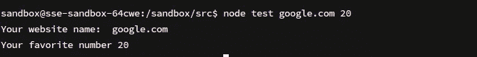
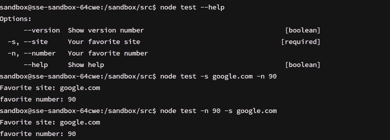
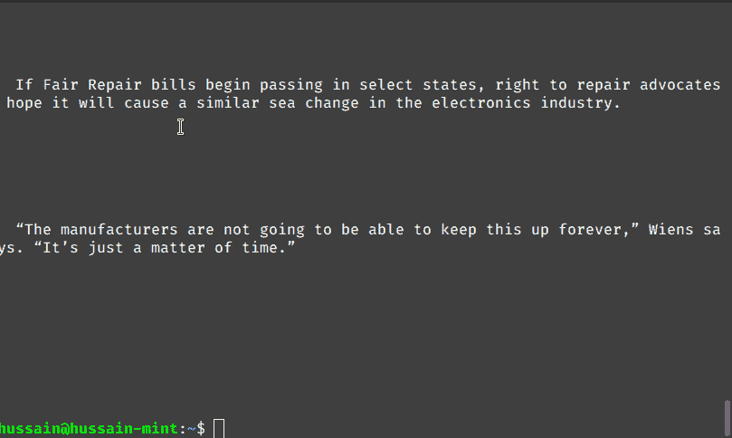
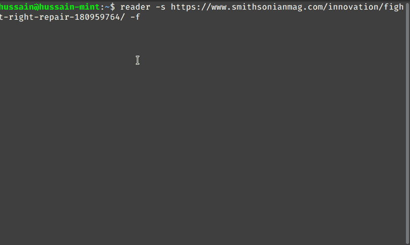
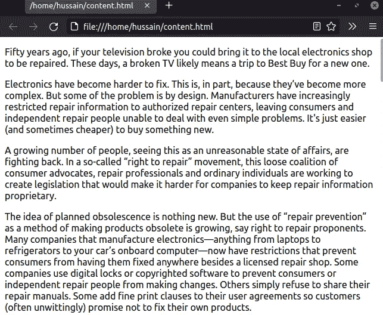
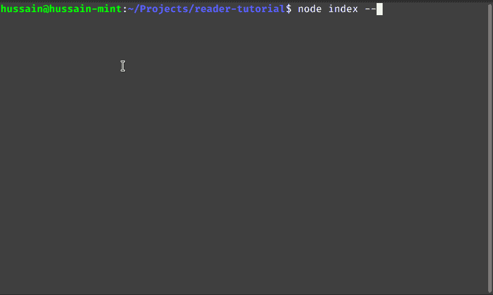
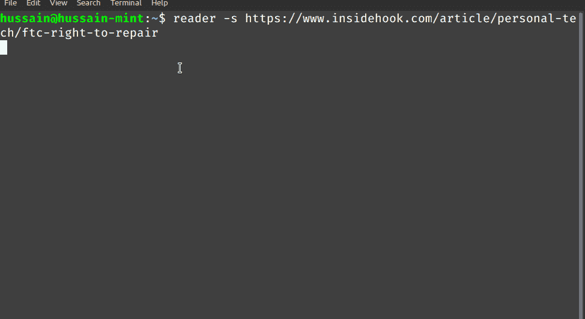

# 用 Yargs 在 Node.js 中构建命令行应用程序

> 原文：<https://betterprogramming.pub/build-a-command-line-app-in-node-js-with-yargs-a6d06e61e9c4>

## 如何在 Node.js 中构建基于终端的应用


来源: [Amy Hirschi](https://unsplash.com/@amyhirschi) 在 [Unsplash](http://unsplash.com)

考虑使用 Node.js 构建终端项目的情况。解析参数的一种方法是使用`process.argv`数组，如下所示:

```
var myArgs = process.argv.slice(2);
console.log("Your website name: ", myArgs[0]);
console.log("Your favorite number", myArgs[1]);
```

这将是输出:



上述代码的输出

虽然这可能行得通，但是代码中有一个小缺陷。通过数组索引引用你的参数不是很干净。如果客户端以错误的顺序传入参数会怎样？


参数顺序不正确

这就是 Yargs 的用武之地。它允许开发人员毫无困难地构建交互式命令行工具。此外，该库还支持接受标志和构建帮助屏幕。



Yargs 能做什么

既然已经谈了它的成果，那就开始吧！

在本文中，您将构建一个程序，该程序将使用 [Mozilla 的可读性 API](https://github.com/mozilla/readability) 从任何网站获取内容。该应用程序也将是全球性的；它可以从任何地方运行。



本文的结果

如果用户传入`-f`标志，它将下载所需页面的 HTML。



保存到文件

保存的 HTML 将如下所示:



保存的 HTML

# 入门指南

## 项目初始化

要使用 NPM 搭建项目，请运行以下 bash 命令:

```
mkdir reader 
cd reader
touch index.js
mkdir utils 
npm init -y
```

## 模块安装

对于这个项目，我们需要以下包:

*   `@mozilla/readability`:这个包会从想要的页面中提取文本内容。
*   `chalk`:向终端输出彩色文本。
*   `got`:获取网站的 HTML 代码。
*   `dompurify`和`jsdom`:删除页面源代码中的恶意 JavaScript。因此，这阻止了 XSS 的攻击。
*   `yargs`:读取命令行参数。

要获取这些依赖关系，请运行以下终端命令:

```
npm i @mozilla/readability chalk got dompurify jsdom yargs
```

完成后，就该编写我们的应用程序了。

# 构建项目

## 显示帮助屏幕

如果用户输入了错误的参数或者使用了`--help`参数，那么我们的程序应该向控制台输出可用的选项。

为此，在`index.js`中编写以下代码:

*   第 2–4 行:描述`--site`选项。它将有一个别名`-s`。
*   第 6–8 行:描述`--file`参数。它的更短的选择将是`-f`。
*   第 10 行:告诉 Yargs`--site`选项将是强制性的。没有它，计划将无法进行。
*   第 13 行:出于调试目的，将客户端的参数输出到终端。

这将是代码的输出:



守则的结果

太好了！我们的代码有效。现在，让我们编码我们的效用函数。

## 解析网站

在你的`utils`文件夹中，创建一个名为`readerUtils.js`的文件。这里，从编写以下代码开始:

*   第 7 行:将我们的`JSDOM`实例传递给`DOMPurify`。我们将用它来净化传入的 HTML 代码。

接下来，在该文件中添加以下代码:

让我们一点一点地解构这段代码。

*   第 2 行:从期望的页面获取 HTML。
*   第 3 行:出于安全原因，净化这个响应。这将给我们一个干净的 HTML。
*   第 5–13 行:如果站点是可读的，将这个纯化的 HTML 传递给可读性 API 并返回结果。
*   第 14–15 行:否则，告诉客户端发生了错误。

## 将 HTML 保存到磁盘

如果用户使用`--file`选项，我们希望我们的应用程序下载页面的 HTML。

将以下代码添加到您的`utils/readerUtils.js`文件中:

*   第 1 行:我们的函数将接受一个参数。这是页面的 HTML。
*   第 2 行:将源代码写入`content.html`文件并保存。
*   第 3 行:最后，通知用户文件已保存。

## 发送解析的数据

既然我们已经解析了数据，剩下的工作就是将它呈现给终端。

为此，将这段代码追加到`utils/readerUtils.js`中:

从这段代码中可以得出一些推论:

*   第 2 行:执行对象析构，从`parseSite`函数中获取`html`、`title`、`text`和`error`属性。
    要了解更多关于对象析构的知识，[请看这篇由](/3-practical-uses-of-object-destructuring-in-javascript-a2c34ce3367b) [太好了！运行代码。这将是结果:

    代码的输出

    我们完事了。

    最后，`index.js`应该是这样的:

    # 额外资源](https://medium.com/u/4d76f5fc17a8#!/usr/bin/env node</span></pre><p id=) 

    [](https://medium.com/u/4d76f5fc17a8#!/usr/bin/env node</span></pre><p id=)[GitHub 上该项目的源代码](https://github.com/HussainArif12/reader-tutorial)

    *   [Node.js 密码生成器— Traversy Media](https://www.youtube.com/watch?v=3Xx83JAktXk)
    *   [Yargs 的海盗式介绍！](https://levelup.gitconnected.com/a-pirate-y-intro-to-node-cli-apps-and-yargs-4af9410f034d) — [尼古拉斯·费特尔](https://medium.com/u/119e2121a688?source=post_page-----a6d06e61e9c4--------------------------------)
    *   [用 Node.js — Okta Developer 构建命令行应用](https://developer.okta.com/blog/2019/06/18/command-line-app-with-nodejs)

    # 结论

    如果您想用 Node.js 构建强大的终端应用程序，那么只需看看 Yargs 就行了。它会让你相对容易和快速地完成工作。

    非常感谢你坚持到最后！编码快乐！