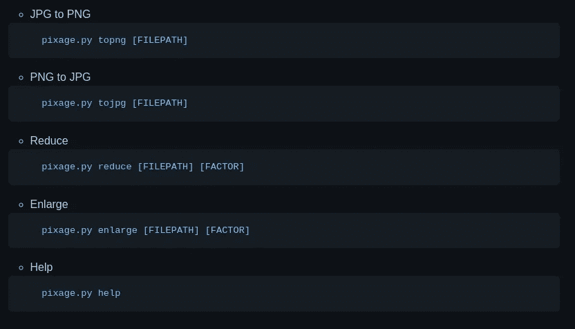

# 使用 Python 构建一个命令行工具来调整图像大小和更改图像格式

> 原文：<https://betterprogramming.pub/build-a-command-line-tool-to-resize-and-change-formats-of-images-using-python-40c1149ea80e>

## 看看像素工具


当我们上传一些文件到任何网站时，图像大小限制是最糟糕的部分之一。有许多免费网站允许你免费调整图片大小，但是我们不能因为上传图片到任何网站而失去隐私。

作为由[小叮当基金会](https://medium.com/u/8ea5869c4112?source=post_page-----40c1149ea80e--------------------------------)主办的黑客马拉松的一部分。 [Ajmal Mohad](https://medium.com/u/2bbd0f527267?source=post_page-----40c1149ea80e--------------------------------) 和我已经建立了一个 Python CLI 工具，用于调整图像大小和改变图像格式。

# 那么，Pixage 是什么？

Pixage 是一个命令行图像格式工具，我们可以使用它来转换图像格式，调整图像大小，以及其他可选的预处理。它支持所有常见的格式，包括 PNG，JPEG 和 JPG。Pixage 提供了一个简单的界面来定制各种参数，如分辨率、压缩等。

# *特性*

1.  放大和降低图像分辨率
2.  转换图像格式

# 使用的库

1.  colorama==0.4.4
2.  枕头==9.0.1
3.  typer==0.4.0

# 源代码解释

首先，您需要导入所有的基本包并初始化它们

由于这是一个 CLI 工具，我们需要创建一个函数，在运行脚本时充当参数

举个例子，

我们正在创建一个函数来改变图像格式从 JPG/JPEG 到 PNG

类似地，我们正在创建多个函数，这些函数将在终端中执行脚本时充当参数。

1.  巴布亚新几内亚到 JPG

2.缩小图像的尺寸

3.放大图像的尺寸

4.帮助命令

现在你一定想知道`options()`函数在前面的代码块中会做什么。

那么，现在让我们定义选项函数:

最后，让我们定义一下`main()`函数:

if 条件将检查在执行脚本时是否传递了参数:

# 运行脚本

打开终端，将位置更改为包含 Python 文件的文件夹。

运行以下命令来看看神奇之处:



# 例子

```
pixage.py topng /home/arjun-ms/Documents/Pixage/cat.jpegpixage.py reduce /home/arjun-ms/Documents/Pixage/cat.jpeg 2
```

你可以在我的 [GitHub 库](https://github.com/arjun-ms/Pixage)中找到开源项目(它对贡献开放)。

```
**Want to Connect?**Follow me on [Twitter](https://twitter.com/Arjun_M_S_).
```