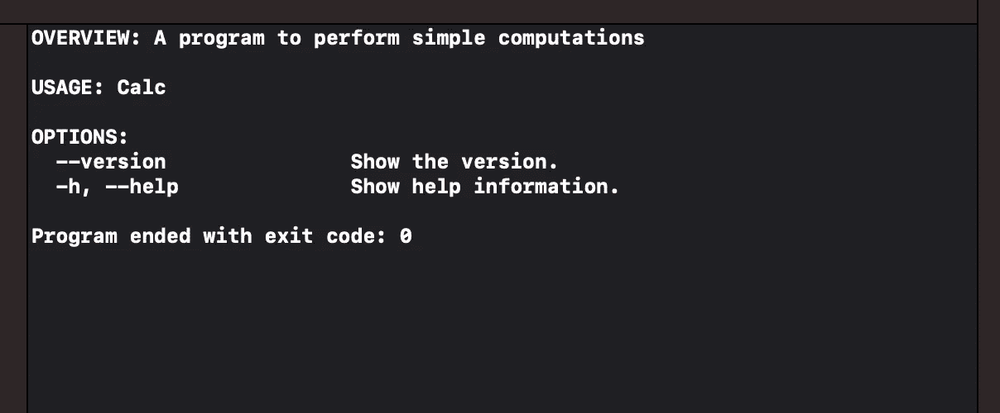
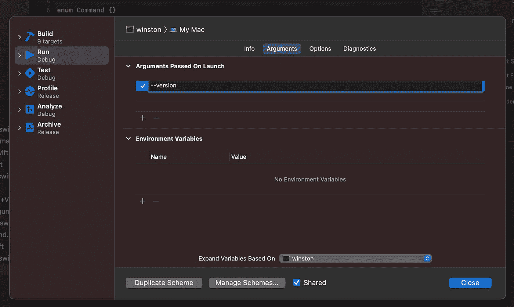
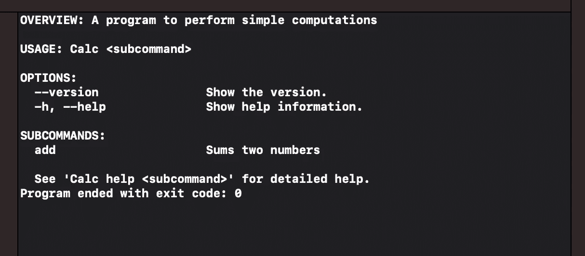
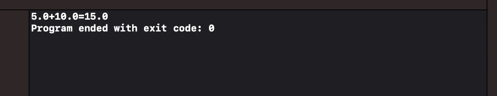

# 使用 Swift 参数解析器构建命令行工具

> 原文：<https://betterprogramming.pub/build-a-command-line-tool-using-swift-argument-parser-f7d9443b785>

## 如何使用 SPM 和参数解析器创建结构良好的 CLI 应用程序

照片由[阿苏尔·西里亚克·阿杰](https://unsplash.com/@athulca?utm_source=medium&utm_medium=referral)在 [Unsplash](https://unsplash.com?utm_source=medium&utm_medium=referral) 上拍摄

Swift 是一种非常全面的语言，并且每天都在被更多地使用。它主要用于 iOS 和 macOS 应用程序，但也用于脚本、命令行工具(CLI)，甚至用于[后端](https://vapor.codes/)和 [web 开发](https://github.com/pointfreeco?q=html&type=&language=&sort=)。

在本文中，我将探索由苹果公司提供的一个库来创建一个 CLI 应用程序:Swift 参数解析器。这个库封装了在终端中发布命令时解析用户输入的逻辑。该库通过使用属性包装器来实现这一点。Swift 的类型系统使一切安全。

多亏了这个库，我们现在可以将注意力集中在工具的实际逻辑上，而不是浪费时间在如何解析这些输入上。

# 创建项目

让我们从创建一个新项目开始。我们可以使用 Swift 包管理器 (SPM)以编程和声明的方式创建项目。

有了 Xcode 12.5，我们甚至不再需要`xcodeproj`文件:Xcode 现在可以通过直接读取`Package.swift`文件来创建项目。

要创建新项目，让我们按照以下步骤操作:

1.  打开一个终端。
2.  新建一个文件夹:`mkdir Calc`。
3.  移动到新文件夹:`cd Calc`。
4.  运行软件包初始化:`swift package init --name Calc --type executable`。
5.  用 Xcode: `open Package.swift`打开`Package.swift`文件。

这几行代码创建了一个新的 Xcode 项目，这是一个适用于 Mac 的命令行应用程序。现在让我们打开 Xcode 中的`Package.swift`文件，添加 Swift 参数解析器依赖项。

结果文件应该如下所示。

第 6 行添加了参数解析器库作为依赖项。这个包是直接从 GitHub 获取的。然后，我们通过在`dependencies`字段(第 15 行和第 16 行)中指定主目标来连接依赖项。

第 16 行的产品的`name`是我们将用于在 Swift 文件中`import`包裹的信息。对于这个项目，我选择称之为`ArgumentParser`。

# 创建主

如果我们现在运行应用程序，我们可以看到`main`只是打印“Hello，World！”到控制台。让我们通过使用参数解析器使它稍微有趣一点。

让我们导入新的库并创建`Command`名称空间。这个名称空间是实现[命令模式](https://en.wikipedia.org/wiki/Command_pattern)的基础。这个模式定义了我们工具的架构。

在命令名称空间中，我们可以创建一个符合`[ParsableCommand](https://github.com/apple/swift-argument-parser/blob/main/Sources/ArgumentParser/Parsable%20Types/ParsableCommand.swift)`协议的`Main`结构。这是参数解析器库的入口点，为我们提供了许多实用工具和自动化。

我们必须实现的唯一需求是一个静态的`[configuration](https://github.com/apple/swift-argument-parser/blob/main/Sources/ArgumentParser/Parsable%20Types/CommandConfiguration.swift)` var，库用它来读取一些信息。

最后，我们只需实例化`Main`结构，并在其上调用`main`函数。这是整个 app 的切入点。最终代码如下所示。

如果我们现在运行这个程序，我们会得到一个非常有趣的输出。

首先，我们可以看到有一个格式很好的帮助。我们没有编写它，但是参数解析器库为我们处理了这个问题。其次，已经有几个免费实现的命令:`--version`和`--help`。

`--version`选项只返回我们在配置的`version`属性中指定的内容。`--help`选项打印出与我们在这里看到的相同的输出。

为了测试我们的命令，我们需要知道如何通过 Xcode 向我们的应用程序传递一些参数。我们可以通过方案描述中的命令行参数面板来实现这一点。

1.  点击 Xcode 的“播放”和“停止”按钮右侧的计算名称。
2.  选择“编辑方案...”。
3.  选择运行。
4.  选择“参数”选项卡。

在这里，我们可以使用+和-按钮添加或删除任何参数。

**Pro 提示:**我们可以在同一行传递多个参数。我们不局限于一次一个论点。

# 执行第一个命令

我们的第一个命令是`Add`命令。它取两个数并求和。

我们可以创建一个新的 Swift 文件，并将其命名为`Add`。这个文件将扩展`Command`名称空间，添加一个新的`ParsableCommand`结构。

这个结构必须实现`run()`方法。这是 ArgumentParser 库在解析`add`命令时调用的方法。

像任何其他`ParsableCommand`一样，`Add`命令也必须进行配置。在标准配置之后，我们可以添加几个属性，`factor1`和`factor2`，用`@Argument`属性包装器进行注释。属性包装定义了运行该命令所需的参数。

代码如下所示:

该命令需要添加到`Main`结构中。添加它的适当位置是将命令附加到`subcommand`属性。如果我们忘记了它，我们的程序将不能运行这个新命令，因为它不知道它。

注意第 13 行有新的 Add 命令。

如果我们在没有参数的情况下运行应用程序，Help 会告诉我们一个新的子命令已经创建并可供使用。

然后我们可以从“编辑方案...”中插入一些新的参数。屏幕。例如，我们可以尝试将 5 和 10 相加。

如果我们运行我们的 CLI 应用程序，我们将获得以下输出。

# 结论

本周，我们探讨了如何使用 SPM 并利用由 [Swift Argument Parser](https://github.com/apple/swift-argument-parser) 库提供的一些自动化来创建 CLI 应用程序。

我们研究了如何使用[命令模式](https://en.wikipedia.org/wiki/Command_pattern)构建我们的应用程序，以及如何实现我们的第一个命令。

参数解析器库提供的远不止这些。它提供了参数的自动验证，指定标志和选项的可能性，并让我们将常见的选项组合在一起。

下周我们将探讨这些更高级的话题，敬请关注！