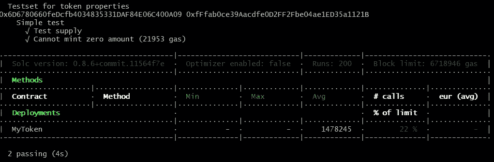

# 构建一个完整的环境来保护智能合同的开发

> 原文：<https://betterprogramming.pub/build-a-complete-environment-to-secure-smart-contracts-development-50c1531f32ce>

## 为您的协议开发打下坚实的基础

由[马文·迈耶](https://unsplash.com/@marvelous?utm_source=medium&utm_medium=referral)在 [Unsplash](https://unsplash.com?utm_source=medium&utm_medium=referral) 拍摄的照片

欢迎来到我的*区块链无处不在*系列的另一块。这是我分享我在软件开发和区块链技术领域五年经验的地方。我假设你可能已经看到了关于[插件的文档](/lets-talk-about-smart-contract-unit-testing-1317a2d2365a#config-options)构建的。

插件也包含在 Truffle 配置文件中:

总的来说，这些特性让我们在单元测试运行后看到了如此美丽的画面:

# 棉短绒

当然，没有代码风格和质量验证的工具，就不能进行开发。这就是为什么 repo 包含一组 linters: [solhint](https://www.npmjs.com/package/solhint) 用于智能契约(带有`.solhint.json`配置)，而 [eslint](https://www.npmjs.com/package/eslint) 用于测试和附加脚本的 JS 代码(带有`.eslintrc.yml`配置)，以及[prettle plugin](https://github.com/prettier-solidity/prettier-plugin-solidity)兼容 Solidity 语法(带有`.prettierrc.json`配置)。

此外，我们还为每个工具在包文件中添加了适当的命令。因此，我们可以手动检查和更新代码风格，甚至将这些步骤包含到 CI/CD 流中。

顺便说一下，所有的语法和代码检查都已经包含在预提交钩子中了。

# 提交前挂钩

这些都是非常标准的——我们检查代码风格，修复所有我们能修复的问题，并遵循[标准约定](https://www.conventionalcommits.org/en/v1.0.0/)进行提交。因此，我们使用[commit list](https://commitlint.js.org/#/)包来确认 git-flow 中消息的正确性。

所有预提交操作都由`husky` 执行—因此，我们有了 linters 运行的配置文件:

和提交消息检查:

# 证明文件

Solidity 没有像文档一样的 Doxygen 内置支持。此外，对其支持的原生插件实际上非常薄弱和原始。

尽管如此，还是有一个完美的解决方案——[solidity-doc gen utility](https://github.com/OpenZeppelin/solidity-docgen)。这个工具有一个本地标记语言，可以通过特殊的模板解析 Solidity 文件来找到 Doxygen 字符串。因此，我们可以向智能合同添加适当的文档:

文档的完整降价由特殊命令(包含在软件包中)生成，该命令使用了几个提供的模板:

`npx solidity-docgen -i ./contracts -o ./docs -t docgen — solc-module solc -H docgen/helpers.js`

尽管使用 docgen 也有不好的一面:它需要一个 solc (Solidity 编译器)作为一个单独的包安装。

# 安全性

智能合约开发之后总是会进行一些安全检查。因此，有几种静态分析器和测试工具来获取没有漏洞的代码。

没有必要在本文中描述所有这些工具(因为许多这样的工具只针对审计人员)，尽管在每个项目的推荐列表中都有一个。我们正在谈论的是[Slither](https://github.com/crytic/slither)——一个流行的静态分析器，可以帮助发现代码中的一些标准错误和问题。

我更喜欢它作为一个单独的工具安装，配置包含在项目中。配置文件(根据文档的[构建)将包括异常、正确的编译和要检查的文件列表。因此，它甚至可以构建到 CI/CD 中。](https://github.com/crytic/slither/wiki/Usage#configuration-file)

# 包装

因此，为了有一个开箱即用的解决方案，我通常将所有需要的开发工具放入包文件中。

例如，我们已经包括了 Ganache、Truffle 本身、mocha 和 chai 测试框架。这样的配置允许我们克隆软件包、安装 npm 软件包并立即开始开发，而不需要任何额外的步骤。

当然，包文件还包括几个用于单元测试的基本库，如前面提到的插件、linters 和 docgen 实用程序。最后，我们有了一个独立的解决方案，在一个命令中安装组件。

还要注意，该解决方案包括两个 OpenZeppelin 库(普通库和可升级库)。

# 这组命令

说到包中包含的命令，它们可以分为三类。

1.  安装。实际上，只有两个命令遵循“npm 安装”脚本——`postinstall`步骤和准备步骤(都是根据 npm 文档提供的)。第一个编辑合同，为开发做准备。第二个为最后的开发步骤设置 husky 钩子。

2.发展。它涵盖了智能合约开发的所有主要阶段——代码编译、工件生成和本地 Ganache 节点上的测试。

注意 generate-abi 命令——它提供了可以被前端使用的 abi 工件。Truffle 也需要它来进行单元测试。

3.外围。它是插件使用的一组命令(例如，单元测试覆盖的契约大小)，linters，安全工具使用等。你可以把它理解为一套提高开发质量的附加工具。

因此，它完成了开发环境。我们已经包含了所有需要的元素:开发和测试脚本、linters 集、安全开发的实用工具等。通用回购是完整的，可以很容易地克隆或分叉，并为您的协议开发做好了准备。

我发现区块链世界非常迷人。每天，我都在这个领域里寻找更多令人兴奋的东西。如果你和我一样对区块链发展感兴趣，就等着看下一期*区块链无处不在*。

和往常一样，您可以在我的 GitHub 上找到一个完整的工作示例:

 [## GitHub-mid vel/contracts-test-project:智能合同测试项目

### 出于开发目的，您将需要 Node.js 和包管理器- npm。对于开发，以下…

github.com](https://github.com/Midvel/contracts-test-project) 

请务必不要错过查看之前的文章:

 [## 使用 ECDSA 签名保护和测试合同

### 签署和验证消息—为您的合同增加更多安全级别

better 编程. pub](/secure-and-test-the-contract-with-ecdsa-signature-3ff368a479a6)