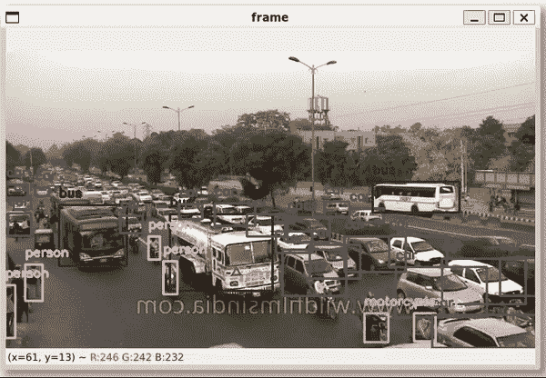
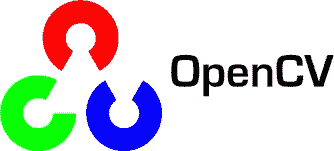
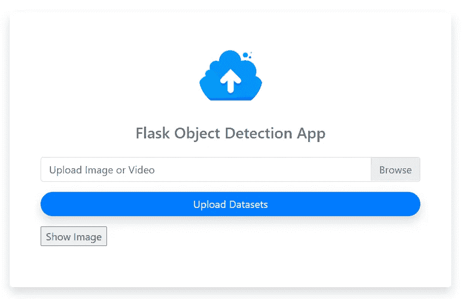
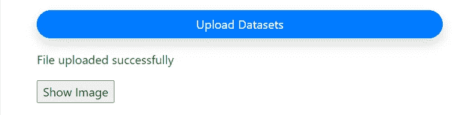
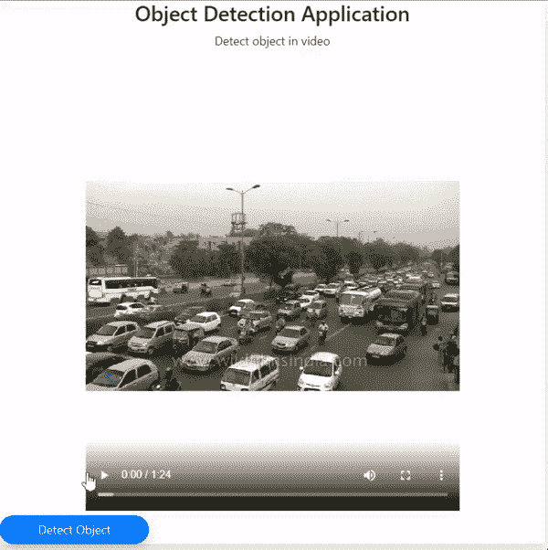
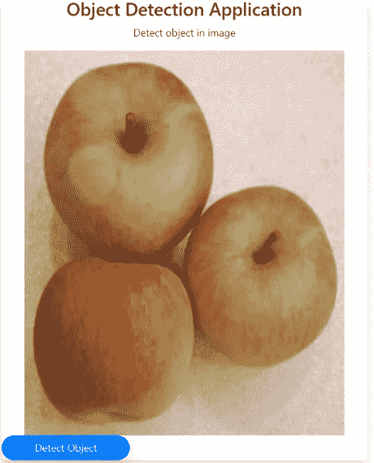
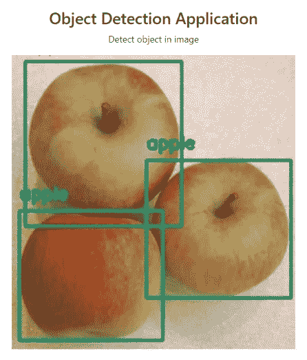
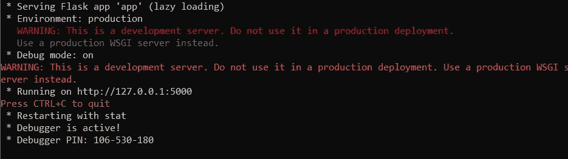
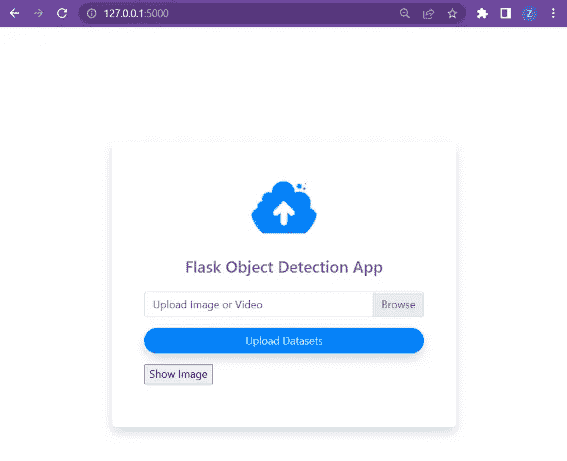

# 构建一个计算机视觉网络应用——Flask、OpenCV 和 MongoDB

> 原文：<https://betterprogramming.pub/build-a-computer-vision-webapp-flask-opencv-and-mongodb-62a52d38738a>

## 具备一些软件工程技能已经成为就业市场上一项非常重要的技能。如果你能建立一个模型，我建议你提高简单的应用程序开发和模型部署技能。



# 该项目

我最近接到一个带回家的任务，在一周内使用 Flask、 [OpenCV](https://learnopencv.com/getting-started-with-opencv/) 和任何 NoSQL 数据库平台创建一个对象检测应用程序。我最后一次使用 Flask 是在 2 年前，当时我还是一名数据科学家，所以这是一个很好的复习项目。

该应用程序允许用户上传图像或视频，对上传的文件进行对象检测，并将结果输出到 [MongoDB](https://www.mongodb.com/nosql-explained) 或 [AWS DynamoDB。](https://docs.aws.amazon.com/amazondynamodb/latest/developerguide/Introduction.html)

如果你是 Windows 用户，我建议你下载 Ubuntu 子系统，它允许你使用 Linux 终端/cmd 来运行应用程序脚本。

# 瓶


> Flask 是一个允许使用 Python 无缝开发 web 应用程序的框架。

与其他框架不同，Flask 非常 Pythonic 化。所以它没有很长的学习曲线，而且非常清晰，增加了可读性。

要使用 Flask，我建议查看一下简单易懂的 [HTTPS 请求方法](https://assertible.com/blog/7-http-methods-every-web-developer-should-know-and-how-to-test-them#put)。它们为您的应用程序(使用 flask)提供了一种与您创建的网页进行通信的方式。它们指定是否将数据发布到您的网站、从您的网站获取数据等等。

# OpenCV



> OpenCV(开源计算机视觉库)是一个开源的计算机视觉和机器学习软件库。OpenCV 旨在为计算机视觉应用提供一个公共基础设施。

通过我们将要浏览的代码，我们将看到 OpenCV 的一个实现，它带有帮助理解的注释。如果你已经熟悉深度学习和计算机视觉，你将能够更快地理解代码。

# MongoDB


> **MongoDB** 是一个面向文档的 NoSQL 数据库，用于大容量数据存储。MongoDB 不像传统的关系数据库那样使用表和行，而是使用类似 JSON 的文档。

常见的关系数据库具有带固定模式(指定数据类型)的表，并使用 SQL(结构化查询语言)来管理数据。

使用 NoSQL，您可以将非结构化或半结构化数据存储在一起，而不是连接规范化的数据表；通常在键值对或 JSON 文档中。NoSQL 在易用性、可伸缩性、弹性和高效可用性方面表现出色。

## **连接到 MongoDB Atlas** :

这允许我们在云中使用 MongoDB。

1.  在这里创建一个免费账户[，点击**“免费试用”**。](https://www.mongodb.com/atlas/database)
2.  点击`<Databases>` **，** <创建数据库> 并选择自由层。
3.  通过选择所需的云服务提供商、集群层和集群名称，创建一个启动集群。
4.  创建一个用户，选择使用一个本地环境，然后点击`<Add My Current IP Address>`使事情变得简单。
5.  点击 <databases>**，**在刚刚创建的集群上点击`<Browse Collections>`。</databases>
6.  点击`<Add My Own Data>`，添加数据库名称和集合名称，创建。
7.  回到你的集群，点击`<connect>`，会弹出一个窗口:
8.  选择`<Connect your application>`并选择你的驱动和版本——对我来说，是 Python 和 3.6 版或更高版本。
9.  创建一个空的 python 文件，将其命名为`db.py`粘贴这段代码，并用您创建的值/名称替换`<username>`、`<password>`、`<your_db_name>`和`<your_collection_name>`。

要了解我们如何使用这个`db.py`文件，请阅读文章末尾标题为`utils.py`中的>帮助函数

# 项目结构

```
├── app.py       
├── utils.py     
├── db.py        
└── setup/
│       ├── requirements.txt 
│       ├── setup.sh 
└── static/
│     ├── images 
│     ├── videos 
│     ├── output 
│     ├── uploads 
└── templates/
│    ├── index.html
│    ├── show_file.html
└── README.md
```

我们上面提到了 HTTPS 请求方法，现在让我们简单地浏览一下 html 网站模板。

## **模板**

Flask 使用 [Jinja2](https://codeburst.io/jinja-2-explained-in-5-minutes-88548486834e) ，允许我们使用 Python 生成`html`网页(即模板)。

> 模板包含的变量是替换值，当模板通过我们在`@app.routes()` 下创建的函数 渲染**时，这些变量被传入(我们将在下一节进一步解释路径)*。***

这里有一个如何创建模板的指南→ [点击这里](https://jinja.palletsprojects.com/en/3.1.x/templates/)。

我们为应用程序创建的模板有:

*   我们将用于用户上传的登陆/主页。
*   `show_file.html:`我们将用于显示用户上传的图像或视频的页面。

要查看模板的完整代码，请访问我的`templates/`目录下的[GitHub repo](https://github.com/ZaheedaT/computer-vision-flaskapp)→[这里](https://github.com/ZaheedaT/computer-vision-flaskapp)。

在本教程中，我将只强调 html 页面的重要部分。为了以互动的方式学习更多关于 HTML 的知识，我建议使用 W3schools。

## 应用代码

让我们从实际的 Flask 应用程序创建开始，然后我们将浏览对象检测代码。我们首先创建一个空的 python 文件，并将其命名为`app.py`，导入 flask 及其库，然后创建一个 App 对象。

```
from flask import Flask, render_template, request, sessionapp = Flask(__name__)
```

`app = Flask(__name__)`在我们正在创建的当前 Python 文件中创建一个 **Flask 应用对象**。`app`变量是一个名为 Flask 的 Python 类的*实例*，我们在文件的顶部导入了它。现在拥有 Flask 的所有功能、方法和属性。

我们还指定了环境变量来显示上传和输出数据的存储路径。

```
UPLOAD_FOLDER = os.path.join('staticFiles', 'uploads')
OUTPUT_FOLDER = os.path.join('staticFiles', 'output')
```

然后我们创建路线。

## **路线**

路径将网站 URL 附加或映射到 python 代码或函数，这些代码或函数决定了在特定路径(URL)上会发生什么。我们将创建这些功能。

对于我们将创建的每一个`@app.route(' ')`，我们将加载特定路由将使用的 html 模板/页面。我们写的任何路线名称都附在我们网站 URL 的末尾。

我们将创建的示例路线将以`https://ourwebapp.com/`、`https://ourwebapp.com/show_file`或`https://ourwebapp.com/detect-obect`结束。请记住，在每条路线上，我们的应用程序都会执行与路线相关的代码。

## `**1\. @app.route( '/' )**`

这是我们将创建的第一条路线，它将把我们带到我们的主页。

我们可以看到这个主页路由仅由一个空的`'/'`表示，因为它的 URL 仅停留在登录页面上。

在这里，我们声明了与这个路径`def main():`相关的函数，我们将其命名为 main，因为它是我们网站的主页，它可以被命名为任何您喜欢的名称。我们告诉该函数返回`render_template("index.html")`，它将加载`index.html`模板/页面，并使其显示在我们的网站上。

`**index.html**` **模板** —这是所有网站中用于主页的页面。在我们的网站上，我们将使用它从用户那里获取输入文件，所以我们需要使用一个 html 表单。

*   `action=”/”`调用我们刚刚创建的@app.route( '/')。
*   `method="POST"`我们指定 POST 请求方法，因为用户将在我们的网站上发布数据。
*   `name = "file-uploaded"`指定上传文件的名称。这将在我们创建 Flask 应用程序时派上用场，因为我们将使用上传的文件来执行对象检测。
*   `action="/show_file"`调用我们稍后将创建的`@app.route('/show_file')`。它将用户带到`show_file.html`页面。当用户点击“显示文件”提交按钮时，就会发生这种情况。

当`index.html`被渲染时，这将是我们的结果(让它看起来漂亮的代码再次出现，在我的 [GitHub repo](https://github.com/ZaheedaT/computer-vision-flaskapp) 的`static/css/main.css`下，在 [W3schools](https://www.w3schools.com/css/) 了解更多关于 css 的信息):



我们的 index.html 页面

## **2。** `**@app.route('/', methods=[“POST”])**`

我们创建允许用户上传文件的路径。

我们看到了在主页路径中看到的相同的`'/’`,这意味着我们停留在主页上，但是这次我们指定了`method="POST"`,因为我们将创建用户将他们的文件发布到我们站点的部分。

*   `_img = request.files['file-uploaded']`允许我们拍摄用户上传的图像或视频，`request.files`是包含所有上传文件的字典对象。回想一下，在我们的 index.html 模板中，我们将用户上传的文件命名为`name = "file-uploaded"`，因此我们在这里使用相同的名称。
*   我们从上面的`request.files`对象中获取文件名，然后将它传递给一个简短的帮助函数(在本教程的末尾),该函数决定我们的应用程序中是否允许该文件类型。
*   然后，我们将图像保存到我们之前指定的上传文件夹路径中。
*   `session[‘uploaded_img_file_path’] = …`一个[会话](https://en.wikipedia.org/wiki/Session_(computer_science))(从上面的 flask 导入)用于存储用户与 web 应用程序交互时的相关信息。在其中，我们存储了上传文件的路径。我们以后还会用到它。
*   就像其他路线一样，我们返回`render_template ( )`——这次是`inde.html`页面，但是我们使用我们创建的`Bool = True`变量`success`。这个变量将帮助 index.html 页面知道，当文件成功上传时，使用 Jinja2 加载一个绿色的成功消息。

`**index.html**` **模板(成功部分)**

它与`index.html`模板完全相同，只是这次我们添加了以下 html 行:

```
<p style="color:green;">File uploaded successfully</p>
```

这是渲染成功模板的一部分:



## 3.`@app.route( ‘/show_file’)`

接下来是`show_file`路线:

*   `session.get(‘uploaded_img_file_path’, None)`允许我们提取/获取会话数据，即上传的图像路径，我们将其放入上面创建的`uploadFile`路径中。
*   我们为`show_file.html`返回`render_template()`来显示上传的文件。
*   为了知道要显示的文件是否是图像，我们创建了一个`Bool`变量`is_image`来与使用 Jinja2 的模板进行通信，我们创建了另一个变量`is_show_button`来告诉模板加载一个按钮来单击，这样我们就可以执行对象检测。
*   `user_image`是我们创建的一个变量，允许我们将图像插入到渲染的网页中，并使用 Jinja2 显示它。

`**show_file.html**`模板**模板**

在 Jinja2 中，双花括号允许我们计算 Python 表达式、变量或函数调用，并将结果打印到模板中。

我们使用 Jinja2 代码来创建关于在这个模板上显示哪种文件类型的`if statements`。我们应该能够理解代码，因为它是 Pythonic 式的:

*   外部的`if statement`是加载一个图像:
*   `</img>`使用``标签让 html 知道期待一个图像，使用`{{ user_image }}`变量显示`user_image` 变量，即上传的图像。
*   和`<button type=”submit” style=”width:200px”>Detect Object</button>`显示“检测物体”按钮
*   当我们点击上面的按钮时，我们创建的`action = 'detect-object'`路线会加载。`else`我们只是在完成对象检测后显示图像。
*   外层的`else`是加载一段视频:
*   `<video src=”{{ user_image }}” controls=”controls” > </video>`使用`<video>`标签让 html 知道期待一个视频，我们使用相同的`button`和表单`action`，当点击时加载`'detect-object'`路径。

上传文件并渲染`show_file.html`模板后，我们得到的结果如下:



## 4.`@app.route( ‘/detect_object’)`:

我们创建将执行计算机视觉任务的路线:

*   我们再次从会话中获得`uploaded_image_path`，然后运行我们的对象检测函数 `def detect_and_draw_box()`:我们将很快检查它。
*   从中，我们得到保存图像结果的`output_image_path`和让我们的 route 函数知道文件输出是“图像”还是“视频”的`file_type`，以便可以呈现相应的模板。
*   同样，我们创建一个`Bool`变量`is_image`来将文件类型传递给模板，创建另一个变量`is_show_button`来告诉模板**而不是**加载一个按钮，因为这是最后一个路径`'detect_object'`。

我们将在前面的上传中得到这个输出。可爱！！



让我们来看看计算机视觉代码！！

# 目标检测代码

我们创建一个名为`utils.py`的 python 文件。这是代码的核心，我们将在这里编写实际的对象检测和辅助函数。

导入我们将需要的所有库:

```
import os
import cv2
import cvlib as cv
from cvlib.object_detection import draw_bbox
```

## 图像检测功能

它采用了我们从`@app.route(‘/detect_object’)`路线节省下来的`img_filepath`。

您可以选择是使用`yolo.h5`还是`yolov3`模式，并设置`confidence`值，通常为 0.5(使用 50%)。

置信度是模型有多“确信”它将正确的标签分配给检测到的对象。编码器设置其阈值或截止点，以决定在哪个点上应该给预测对象一个正标签。

*   `img = cv2.imread(img_filepath)` : OpenCV 将图像读入一个 numpy 数组，以便我们的模型能够理解。
*   `bbox, label, conf = cv.detect_common_objects(img,confidence, model)` : `detect_common_objects`使用预训练的来检测 80 个常见对象。
*   它返回边界框坐标(检测到的对象周围的框)、相应的预测标签以及图像中检测到的对象的置信度得分。
*   `output_image = draw_bbox(img, bbox, label, conf)`:然后我们在图像上画出方框和标签，得到一个输出图像。
*   `output_image_path = os.path.join(OUTPUT_FOLDER, 'output_image.jpg')`:我们声明图像输出名称和保存路径。
*   `cv2.imwrite(output_image_path, output_image)`用于将图像保存到任何存储设备或路径。

代码的其余部分使用我们创建的 helper 函数在本地将模型输出保存为 JSON(我们称之为“响应”)，并以如下格式将其推入 MongoDB:

## **视频检测**功能:

*   `cap = cv2.VideoCapture(video_filepath):`创建一个视频捕获对象，它将允许我们读取上传或流式视频。
*   `fourcc = cv2.VideoWriter_fourcc(*’MJPG’):`以 MJPG 格式保存输出视频。

**FourCC** (“四字符码”)是由四个[字节](https://en.wikipedia.org/wiki/Byte)(通常为 [ASCII](https://en.wikipedia.org/wiki/ASCII) )组成的序列，用于唯一标识[数据格式](https://en.wikipedia.org/wiki/File_format)。

*   `while cap.isOpened()`:在您捕捉到视频后，您可以使用此方法来检查您的视频是否成功打开。否则你会得到一个错误信息。
*   `ret, frame = cap.read():`用于通过创建循环并一次读取一帧来捕获视频的每一帧。它返回一个元组 bool 和 frame，如果 ret 是`True`，那么就有一个视频帧要读取。

如果`ret`返回`False`，那么`print(“Can’t receive frame (stream end?). Exiting …”)`则中断循环。

*   然后我们翻转图像，因为它可能会上下颠倒。
*   类似于`image`检测代码，我们使用`detect_common_objects`模型和`draw_bbox`函数来显示每个检测到的对象的边界框和预测标签。
*   `out = cv2.VideoWriter(out_path, fourcc, 10.0, (width, height)):`声明如何保存视频。指定输出文件夹，fourcc 格式，帧率(每秒帧数)为 10.0，我们设置一个理想的大小。
*   `out.write(output_frame):`将帧写入输出文件。

*   我们可以使用`imshow()`方法在窗口中显示输出帧。如前所述，我们保存响应 JSON。
*   `waitKey()`声明视频之间暂停多长时间，并监控用户输入的键盘。当用户按下`q`键时(当窗口在屏幕上打开时),我们退出循环并结束流式传输。

*   我们使用助手函数`add_data()`将数据推送到 MongoDB Atlas。
*   `cap.release()`一旦视频流被完全处理或用户过早退出循环，就释放视频捕获，
*   `out.release()`释放视频写入对象，并
*   `cv2.destroyAllWindows()`关闭窗口。最后，我们在本地保存模型输出`response` JSON。

## utils.py 中的帮助器函数:

*其余可以在* [*GitHub 回购*](https://github.com/ZaheedaT/computer-vision-flaskapp) *** 上找到

```
import db # imports the MongoDB db.py file we created earlier 
```

# 运行应用程序

按照 [*GitHub Repo*](https://github.com/ZaheedaT/computer-vision-flaskapp) 上的设置和安装步骤之后，我们在 Ubuntu cmd 中运行应用程序:

```
$ python3 app.py
```

我们得到:



在您的网络浏览器上复制并粘贴本地主机:**[**http://127 . 0 . 0 . 1:5000/**](http://127.0.0.1:5000/)**

**`index.html`页面将显示:**

****

**尝试应用程序并研究你想更好理解的方面。**

**感谢阅读！！**

# ***参考文献***

*   **[https://pythonbasics.org/what-is-flask-python/](https://pythonbasics.org/what-is-flask-python/)**
*   **[https://python-adv-we b-apps . readthedocs . io/en/latest/flask . html](https://python-adv-web-apps.readthedocs.io/en/latest/flask.html)**
*   **[https://tedboy.github.io/flask/](https://tedboy.github.io/flask/)**
*   **[https://www.python-engineer.com/posts/opencv-videos/](https://www.python-engineer.com/posts/opencv-videos/)**