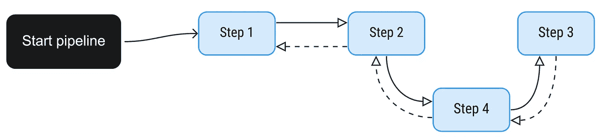
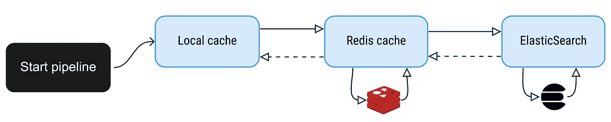
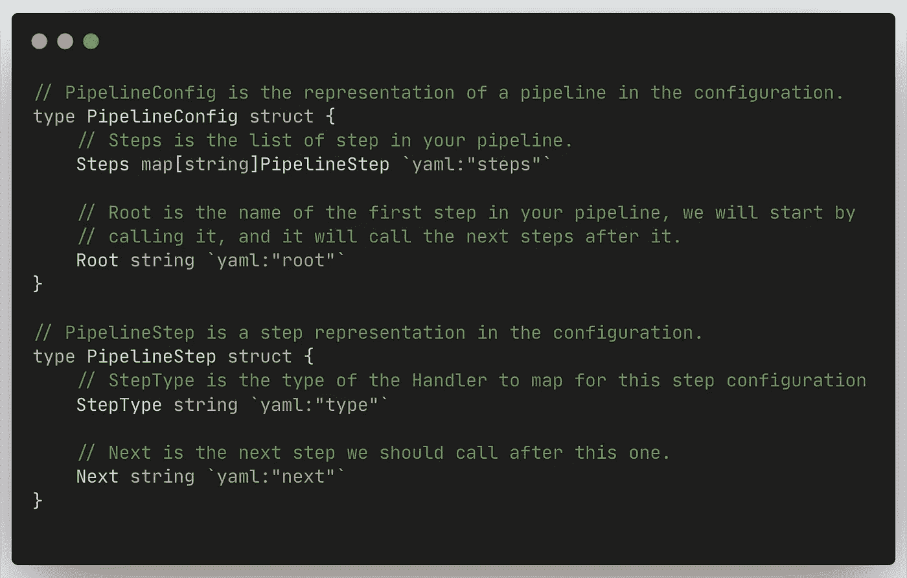
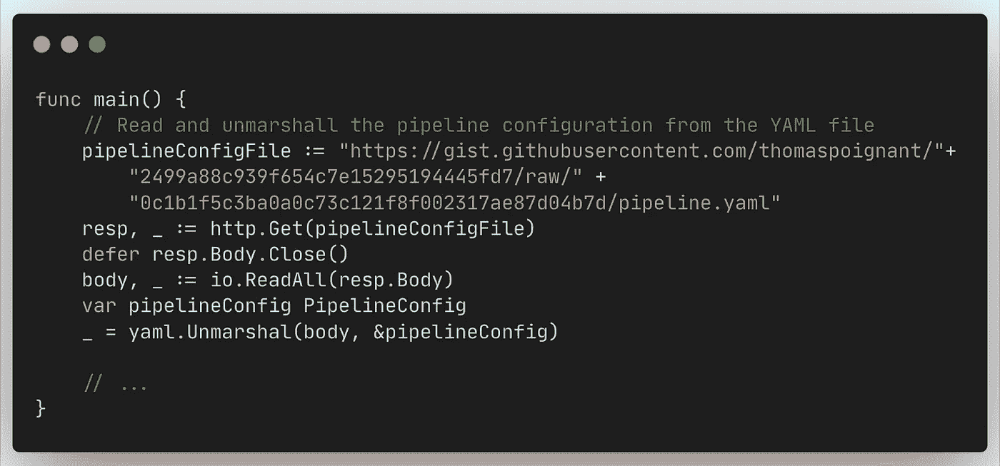
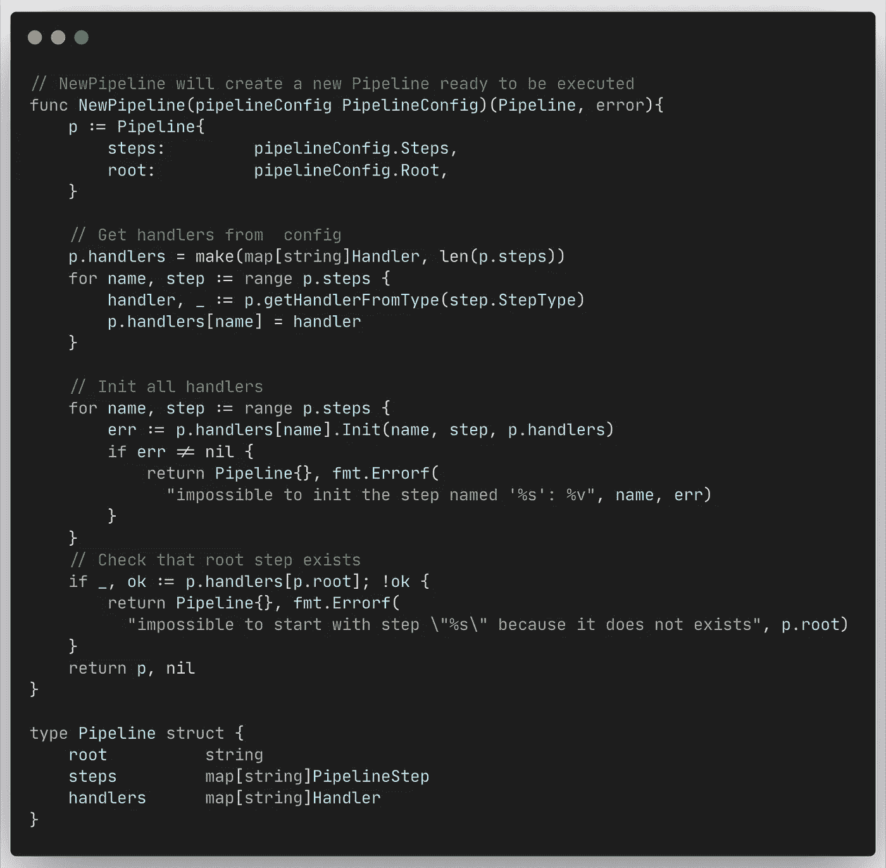
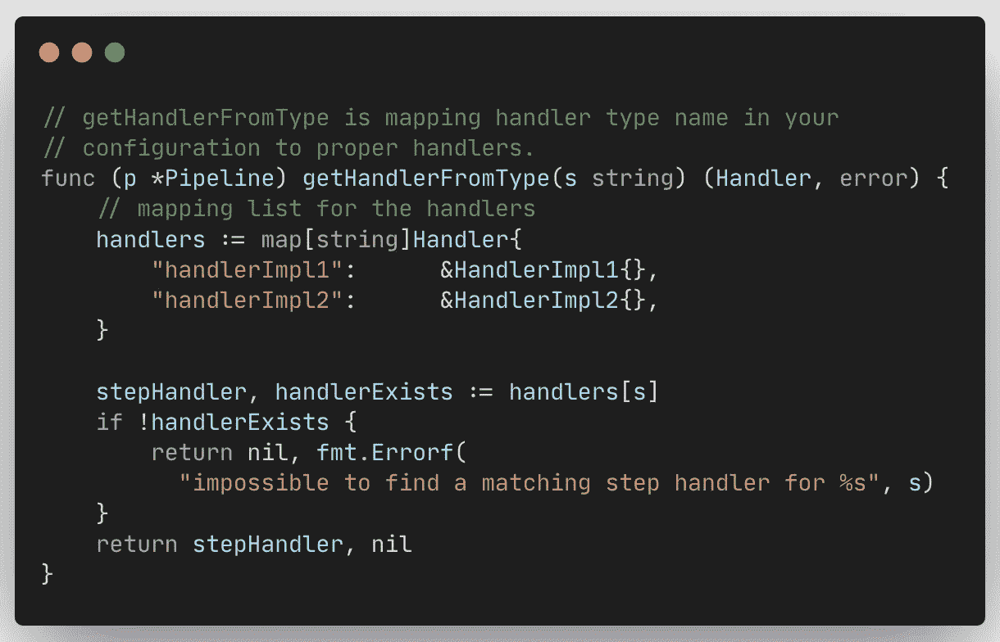
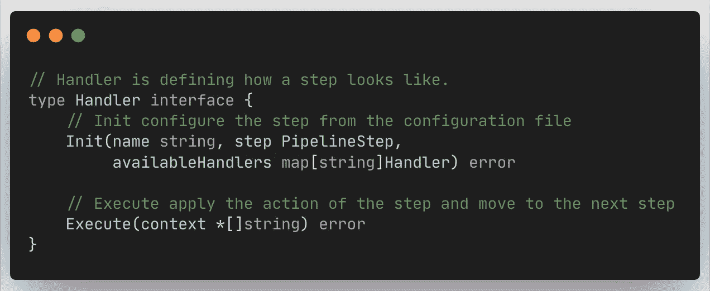
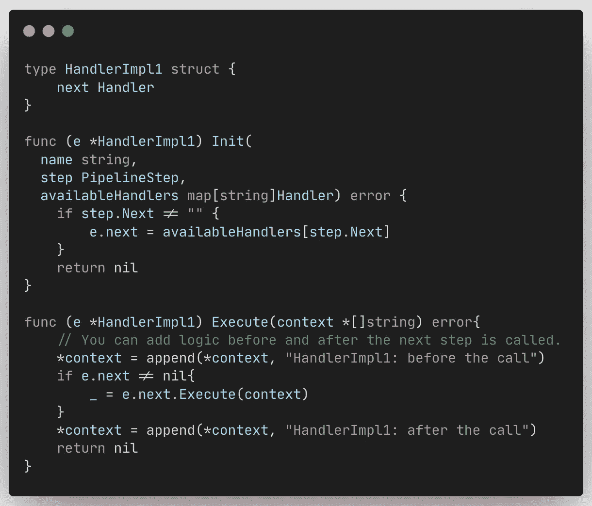
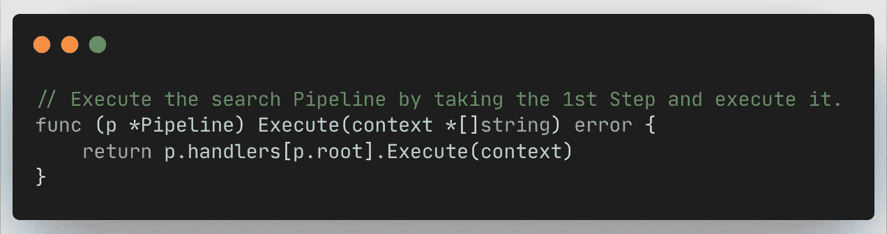

# 在 Go 中建立一个可配置的责任链

> 原文：<https://betterprogramming.pub/build-a-configurable-chain-of-responsibility-in-go-80a7cdcd1ab2>

## 使用责任链设计模式根据配置变更修改应用程序行为


Erik Mclean 在 [Unsplash](https://unsplash.com?utm_source=medium&utm_medium=referral) 上拍摄的照片。

责任链或指挥链是一种[设计模式](https://refactoring.guru/design-patterns/chain-of-responsibility)，它让你沿着`Handlers`链传递请求。每个`Handler`决定处理请求并丰富它，或者将它传递给下一个`Handler`。

它允许您在每个步骤之间有很大的隔离，避免在一些技术逻辑中间有业务逻辑。如果你的应用程序应该做的事情发生了变化，它也给你重新排序你的链的可能性。

这很好，但是为什么我们希望它是可配置的呢？

背后的原因是能够快速改变你的应用程序的行为，而无需部署代码。

假设我们有一组`Handlers`可用于我们的服务:


初始管道。作者照片。

正如您所看到的，我们这里有一个简单的管道，在这里我们链接了`Handlers`来处理请求。它可以很容易地用如下所示的配置来表示:

```
**root**: step1
**steps**:
  **step1**:
    type: handlerImpl1
    next: step2

  **step2**:
    type: handlerImpl2
    next: step3 **step**3:
    type: handlerImpl3
```

但是，假设您处于生产环境中，并且希望在调用步骤 3 之前添加一个缓存层。您很幸运，因为管理您的缓存解决方案的`Handler`已经存在于另一个管道中。

通过更改配置，您可以很容易地通过这个缓存步骤获得不同的管道:



```
**root**: step1
**steps**:
  **step1**:
    type: handlerImpl1
    next: **step2**

  **step2**:
    type: handlerImpl2
    next: **step4****step3:**
    type: handlerImpl3**step4:**
    type: RewriteHandler
    next: **step3**
```

## 现实生活中的用例

假设您正在构建一个搜索 API。基本上，它接收搜索请求并通过响应进行回答。

API 在 Elasticsearch 之上，所以我们做的是直接从 API 调用 ES(超级简单)。一段时间后，您发现一些顶级搜索查询的命中率有点过高，因此您决定在调用 es 之前引入 Redis 缓存。
假设在某个时候，你想要更快，在你的应用中建立一个本地缓存，以超快的速度响应这些顶级查询。

所以你能做的就是有如下三个`Handlers`。每个`Handler`负责一个动作，可以根据是否需要进入下一步；



可配置性还允许您在不更改任何代码的情况下随时删除缓存步骤。例如，如果您发现您的本地缓存消耗了太多的内存，并且您想要清除它，您可以只更改您的配置文件，您的请求将能够直接进入 Redis 缓存。

# 如何实施

如果你想看完整的代码，你可以跳到下一节。
本节将详细介绍代码的所有部分。

## 处理配置文件

第一步是从配置文件加载配置。在这个例子中，我将使用一个托管在 [gist](https://gist.github.com/thomaspoignant/2499a88c939f654c7e15295194445fd7) 上的 YAML 文件。

格式如下:

```
**root**: handler1_name
**steps**:
  handler1_name:
    **type**: handlerImpl1
    **next**: handler2_name

  handler2_name:
    **type**: handlerImpl2
```



[参见完整要点](https://gist.github.com/thomaspoignant/a8cd2ea31630b249ebc17418168d60b6)

作为函数`main`的第一步，我们将解组到我们的结构中:



[见完整要旨](https://gist.github.com/thomaspoignant/a8cd2ea31630b249ebc17418168d60b6)

## 创建管道

我们有配置。这样，我们将创建管道本身。我们将在我们的`main`函数中调用`NewPipeline`:

```
**pipeline, _ := NewPipeline(pipelineConfig)**
```

`NewPipeline`函数将把配置文件转换成一个带有初始化的`Handler`的管道结构实例，以便在您的请求中使用。

为此，它会将`StepType`转换为实际的`Handler`，如果该步骤有下一步，则使用现有的`Next` `Handler`为每个`Handler`调用`init` 函数:



[见完整要旨](https://gist.github.com/thomaspoignant/a8cd2ea31630b249ebc17418168d60b6)

使用的`StepType`和`Handler`之间的映射在`getHandlerFromType()`函数中完成:



[见完整要旨](https://gist.github.com/thomaspoignant/a8cd2ea31630b249ebc17418168d60b6)

## 创建处理程序

创建一个`Handler`很简单。它遵循以下接口:



[见完整要旨](https://gist.github.com/thomaspoignant/a8cd2ea31630b249ebc17418168d60b6)

`Init`功能主要用于根据配置初始化该步骤的下一个`Handler`。

调用`Execute`函数来应用真正的逻辑。这是我们决定是否要进行下一步的函数。如你所见，它需要一个`context` 参数。这是一个给每个`Handler`的参数，可以在每一步中丰富。在示例中，这是一个`*[]string`，但它可以是任何东西上的指针。

一个`Handler`的例子:



[参见完整要点](https://gist.github.com/thomaspoignant/a8cd2ea31630b249ebc17418168d60b6)

如您所见，我们在从`next` `Handler`调用`Execute()`函数时给出了上下文。我们也可以在得到下一步的结果后做一个动作。

## 执行管道

最后一步是调用管道本身的`Execute()`函数:



[见完整要旨](https://gist.github.com/thomaspoignant/a8cd2ea31630b249ebc17418168d60b6)

它执行`root` 步骤并执行相关的`Handler`。通过这样做，整个链将被执行，因为每个`Handler`都知道下一步是什么。

# 代码

下面是完整的实现。在这个例子中，`Handlers`是微不足道的，但是你可以在它上面有更复杂的逻辑，并开始链接东西:

# 结论

正如你所看到的，在 Go 中使用责任链或指挥链设计模式可以非常强大，并且给你一个很好的解耦逻辑的方法。

如果您的`Handlers`足够通用，可以移动到链中的不同位置，那么能够从代码外部配置它会给您带来很多潜在的改进。

从经验来看，如果你有一个可以针对不同客户定制的产品，会对你有很大帮助。您将在开始时花费时间来开发您的处理程序，但最终，您将拥有一套完整的处理程序，允许您只需选择正确的链，而无需开发任何东西。