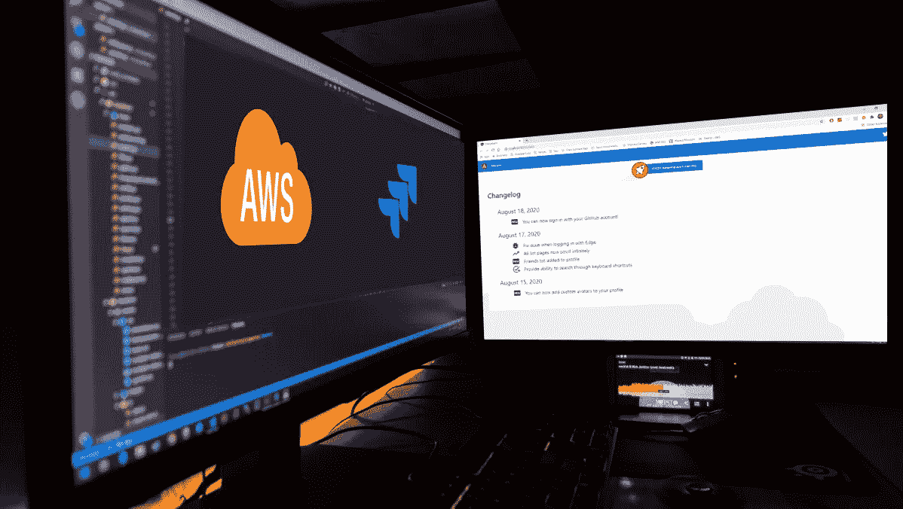
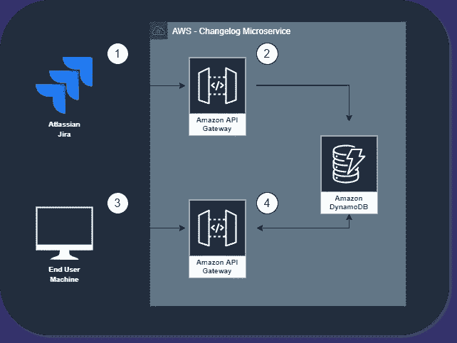
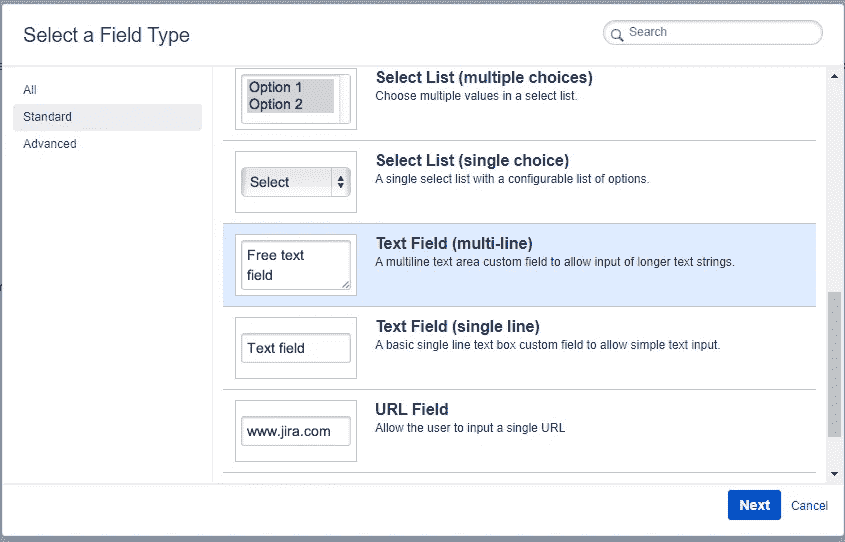
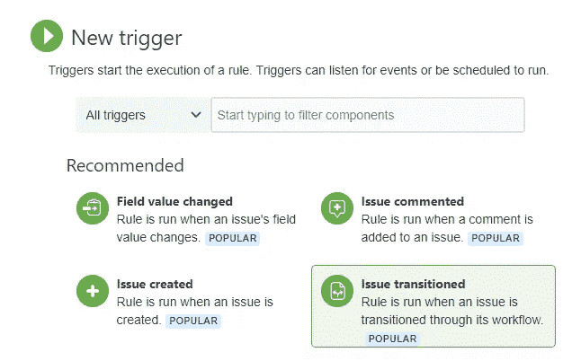
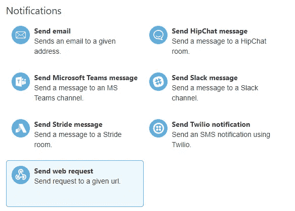
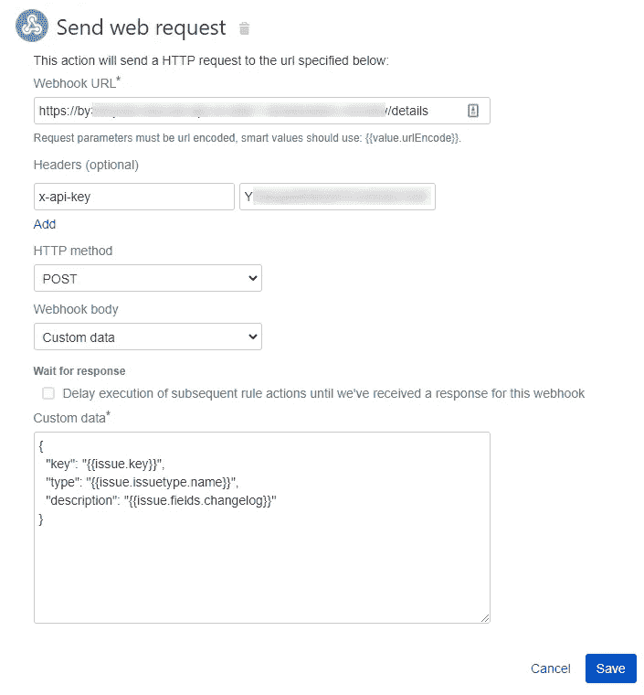
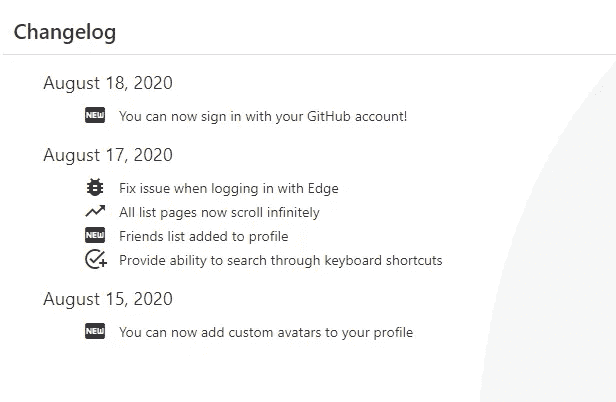

# 用 AWS 和吉拉构建一个连续的变更日志

> 原文：<https://betterprogramming.pub/build-a-continuous-changelog-with-aws-and-jira-cbf0f10776bb>

## 您如何使用 CI/CD 管理您的发行说明？当然是用自动变更日志！

作者照片。

所以你决定去 CI/CD。你阅读了[关于组织变革的所有内容](https://medium.com/better-programming/are-you-really-ready-for-ci-cd-9a8bf6d01b8a)，了解了开发流程的来龙去脉，并对自己能完成这件事充满信心。

恭喜你！

在您设置好管道、记录您的开发实践并开始推进生产之后，仍然有一个主要的难题需要解决:变更日志。

你是怎么做到的？你会给你的开发团队增加一个每天能跟上 5、10、20 次生产的技术作家吗？你可以。但是如果有一种自动化的方法呢？

您已经有了一个问题跟踪系统。我们在我的办公室使用吉拉。无论你是使用[吉拉](https://www.atlassian.com/software/jira)、 [GitHub](https://github.com/) 还是[特雷罗](https://trello.com/)来跟踪问题，它们都有一个共同点:webhooks。

当系统中发生某些动作时，这些系统中的每一个都会触发事件。我们将使用它们来自动化我们的变更日志。

# 建筑

连续变更日志有三种系统:

*   问题跟踪系统(在本演练中，吉拉)
*   用于收集、存储和检索变更日志的后端 API(内置于 AWS 中)
*   用户界面

作者照片。

在我们的自动化中，事件是这样流动的:

1.  开发团队将吉拉问题转移到*完成*状态。吉拉发布到一个包含已关闭问题详细信息的 webhook。
2.  [AWS API 网关](https://aws.amazon.com/api-gateway/)直接代理 [DynamoDB](https://aws.amazon.com/dynamodb/) 来存储细节。
3.  最终用户加载变更日志页面。该页面请求加载最近的更改。
4.  AWS API Gateway 直接代理 DynamoDB 从数据库加载详细信息，并在响应中返回它们。

看似简单？确实是！

从长远来看，这种整合会带来 1000 倍的回报。这是一个低成本的实施与高回报的价值整合。

# AWS 配置

在 [my GitHub repo](https://github.com/allenheltondev/cicd-changelog) 中，我从上面的架构图中提供了部署微服务的源代码。它使用 AWS API Gateway 和 DynamoDB 作为存储和检索数据的两个主要服务。

后端只有两个端点:一个用来在 changelog 中创建项目，另一个用来从中加载项目。

保存和加载在 [VTL](https://docs.aws.amazon.com/apigateway/latest/developerguide/api-gateway-mapping-template-reference.html) 完成，完全省略了对 lambda 函数的需求。这给了我们最快的响应时间。

因为我们不希望恶意用户发现我们的 API，并在我们的 changelog 中发布虚假或不适当的更改，所以我们需要添加一个 API 密钥。我们不能添加标准身份验证来验证我们的用户，因为这些请求将通过 webhook 发出。

吉拉提供了在发布到 webhook 时包含头的能力，所以我们将利用这一点并包含一个 AWS API 键。这个键包含在存储库中的 CloudFormation 脚本中。

如果您按照 GitHub repo 中的自述文件进行操作，您将不费吹灰之力就可以开始运行。它是预先设置好的，所以除了部署到您的 AWS 帐户之外，不需要任何设置。

# 吉拉构型

现在我们已经启动并运行了 API，是时候配置吉拉来提供 changelog 数据了。

## 添加自定义字段

我们需要添加一个自定义字段到我们的吉拉问题。在吉拉中，导航至设置>吉拉管理>问题。

查看问题管理页面后，导航至字段>自定义字段>添加自定义字段。

吉拉可用的自定义字段类型。

Changelog 描述可能有点冗长，所以选择一个文本字段(多行)，将其命名为`Changelog`，并添加一个描述，让用户知道他们应该在更改细节中键入的格式。

接下来，选择您希望 changelog 字段可见的屏幕。如果你想在你所有的吉拉项目中使用它，选择它们！

## 构建 webhook

定制字段就绪后，就该构建向 webhook 发送的自动化触发器了。

在您的吉拉项目中，进入项目设置>项目自动化>创建规则。

可用的触发器类型。

在下一个屏幕上，选择*问题转换为*触发类型，并可选地将*从状态*和*设置为状态*。

注意:*至状态*字段应设置为您工作流程中的最终状态。在我的项目中，我们最终的工作流状态是*完成*。

一旦配置好触发器，就该为吉拉设置要采取的动作了。点击*新动作*调出选项列表。

可用的通知操作类型。

选择*发送 web 请求*动作，调出配置屏幕。

## 从 AWS 获取 API 详细信息

现在我们需要回到 AWS 控制台。首先，我们需要获得我们创建的 webhook 的 URL。

1.  导航到 [API 网关控制台](https://console.aws.amazon.com/apigateway/main/apis)并选择 Changelog API。
2.  点击左侧导航栏上的*阶段*链接，然后点击*开发*阶段。
3.  页面顶部会有一个调用 URL。获取该值并将其添加到吉拉的 Webhook URL 字段中。一定要在末尾加上`/details`。
4.  接下来，单击左侧导航栏上的 API Keys 链接，然后单击 *cicd-ApiKey…* 值。
5.  点击*显示*链接，复制屏幕上显示的数值。
6.  回到吉拉，添加一个标题`x-api-key`并将 API 键粘贴到 value 字段中。
7.  接下来，配置 webhook 主体以匹配下图，并点击*保存*。

在吉拉完成 webhook 配置。

在下一个屏幕上给你的自动化起一个有意义的名字，点击*打开*按钮，完成你的集成！

# 查看您的新变更日志

此时，集成和 API 已经连接，您可以开始关闭问题了！它会自动添加变更日志详细信息以及问题类型和完成日期。

一旦你有一些问题转移了，让我们看看它是什么样子的。我已经在 GitHub repo 中提供了一个框架角度前端，所以你可以马上查看变更日志。

变更日志按天分组，并在基于已关闭的吉拉类型的详细信息旁边有一个图标。对于我的项目，一个*新特性*吉拉类型将显示*新*图标，而一个 *Bug* 问题类型显示一个 Bug 图标。

这些可以根据您的项目进行定制，所以您可以随意使用图标和问题类型。

# 获得贵组织的支持

我可以在这里打断你，但如果我不谈论这需要的组织治理，我会是什么样的负责任的作家呢？

遵循这一路线会留下一些问题，您需要由您的组织回答:

*   谁写变更日志的细节？科技作家？开发商？
*   关闭问题前是否需要查看变更日志详细信息？
*   你能信任开发人员编写面向客户的笔记吗？
*   您希望在变更日志中包含哪些问题类型？
*   你应该以不同的方式显示主要特征吗？

这些是你和你的组织要解决的问题。当然，让开发人员添加细节并完成它是最容易的，但是这是最安全的吗？您希望记录所有更改以供公众查看吗？

# 试试看！

这是一个快速的集成设置，并导致一些非常有趣的结果。我希望你尝试一下，给你的项目带来一个连续的变更日志。

你做这样的事情吗？你会做一些完全不同的事情吗？让我知道你的想法和意见！

感谢阅读！