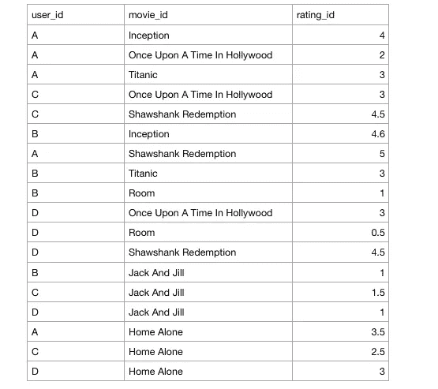
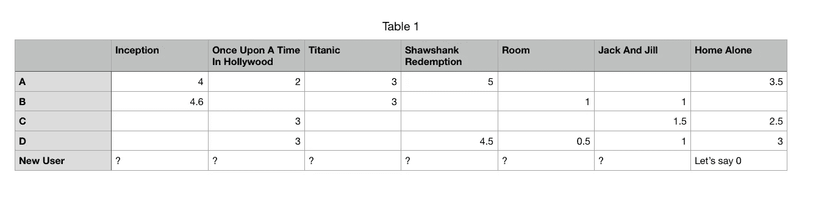
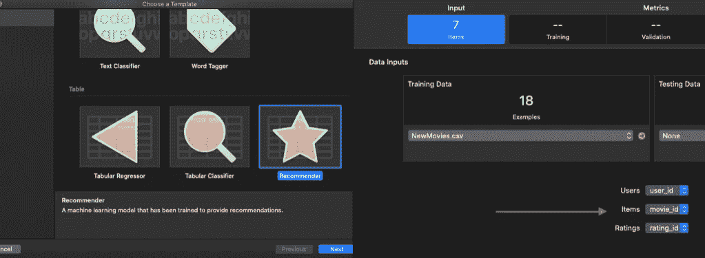
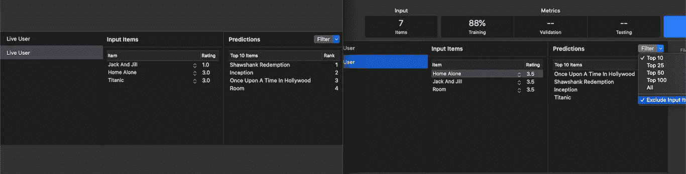
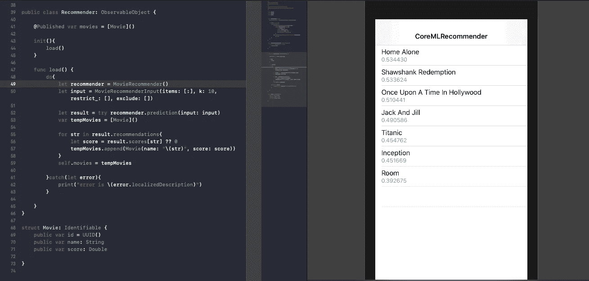
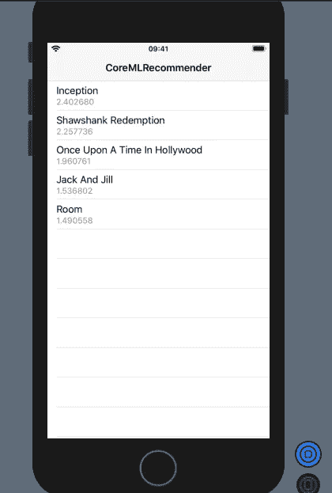

# 使用 Create ML 构建一个核心 ML 电影推荐器 SwiftUI 应用程序

> 原文：<https://betterprogramming.pub/build-a-core-ml-recommender-engine-for-ios-using-create-ml-e8a748d01ba3>

## 一种电影推荐系统


[GR Stocks](https://unsplash.com/@grstocks?utm_source=medium&utm_medium=referral) 在 [Unsplash](https://unsplash.com?utm_source=medium&utm_medium=referral) 上拍照

由于每个产品都提供大量的内容和信息，推荐系统在今天是必不可少的。期望用户按需消费和过滤这些丰富的信息是不公平和不现实的；因此，出现了对推荐引擎的需求。

几乎每个平台——从亚马逊、网飞、YouTube 到脸书、Spotify，甚至 Medium 都有自己的推荐系统来个性化、过滤和呈现用户可能喜欢的信息和内容。

推荐系统是一种秘密武器，许多产品和服务投入大量资金，以向用户提供相关内容，从而提高用户参与度和流量。对于电子商务产品来说，这一点至关重要。一个好的推荐系统可以促进他们的销售，最终带来更好的利润。

# 推荐系统的类型

通常，推荐系统是使用以下范例构建的:

*   基于内容
*   协同过滤
*   基于内容的方法依赖于项目相似性，基于用户/项目具有的各种共同属性。例如，对于电影推荐，诸如流派、导演和发行年份的标签是在向用户推荐电影时起作用的一些关键属性。

另一方面，协同过滤基于其他用户的偏好向用户推荐项目。基于用户喜欢的项目种类，它推荐具有相似偏好的用户过去喜欢的新项目。

这两类都有各自的优缺点。基于内容的推荐依赖于用户和项目信息(从而在一定程度上威胁到侵犯用户的隐私)，而协同过滤只依赖于用户和项目的交互。协同过滤需要大量的历史数据来构建精确的推荐引擎。

将推荐系统引入移动设备是保护用户隐私的一大进步。通过确保用户的信息保留在设备上，用户对与之交互的内容更有信心。另外，任何没有数据的工作都是一个巨大的奖励。

## 创建 ML 的新推荐模板

Create ML 使模型训练和部署变得超级容易和有趣，因为它不需要任何机器学习专业知识。Xcode 11.3(在撰写本文时目前处于测试阶段)引入了新的推荐器模板来快速构建推荐模型。

或者，或者对于以前的 Xcode 版本，您可以在 macOS playgrounds 中使用 Create ML 以编程方式使用`[MLDataTable](https://heartbeat.fritz.ai/working-with-create-mls-mldatatable-to-pre-process-non-image-data-424f916a093e)`和`MLRecommender`类来训练推荐系统。

> 核心 ML 推荐模型通过保持在设备上和数据自由，不需要依赖服务器，帮助保护用户隐私。

## 我们的目标

本教程的想法是展示移动机器学习开发者可以使用 Create ML 轻松构建推荐系统。

*   我们将使用**协同过滤**来演示一个使用小数据集的简单电影推荐系统原型。
*   利用 Create ML 应用程序中的推荐模板来训练我们的模型。此外，我们还将通过编程构建相同的模型。
*   使用构建的核心 ML 模型，我们将根据使用 Combine 框架的基于 SwiftUI 的 iOS 应用程序中的用户评级来预测前 K 部电影推荐。

# 我们的数据集

我创建了自己的小数据集，由我和我的朋友们评价的一些电影组成。我们的想法是向我们团队的新成员推荐电影。根据他是否同意我们的电影推荐，我们将决定他/她的成员资格期限！

CSV 数据集是使用 Excel 表构建的，它由三列组成:`user_id`、`item_id`(电影标题)和`rating_id`(用户评级)。以下是一瞥:



给出的评级或多或少是随机的，以显示推荐是如何工作的。

协作过滤使用 K-最近邻算法，根据新用户给出的评分来查找相似用户。随后，计算新用户尚未评级的电影评级的加权和，以便找到前 K 个最推荐的电影。

这是用户-项目(电影)矩阵的一个示例，根据四个用户的预测和新用户的评级，我们的模型应该预测最相似的用户。如果用户没有对电影进行评级，则认为该电影为 0。



# 构建我们的 Create ML 模型

现在让我们启动 Create ML 应用程序，它是 Xcode 11.3 和更高版本的一部分，并选择推荐器模板。在其中，我们之前看到的 CSV 文件将作为输入被提供。Create ML 自动识别唯一项目的数量。

但是，您需要将适当的列名指向用户、项目和评级输入，如下图右侧所示:



左边是创建 ML 模板选择器。右手边是训练屏幕。

接下来，只需按下训练按钮。鉴于数据集的规模很小，我们的模型应该很快准备好。然后，您可以在“输出”面板中创建实时用户并测试建议，如下所示:



在右侧，我们可以看到如何过滤推荐，甚至选择在其中显示用户选择。

在上面两个基于我们给某些输入项的评级的输出中，我们根据输入与过去数据的相似性来获得推荐的电影。

评级采用大于零的整数值。设置零值相当于什么都没有。

## 以编程方式训练我们的模型

如果您没有使用 Xcode 11.3 或想要以编程方式训练模型，请启动一个新的 macOS playground，将 CSV 添加到`MLDataTable`并在您的 Xcode playground 中创建 MLRecommender Core ML 模型，如下所示:

```
import Cocoa
import CreateMLlet trainingData = try MLDataTable(contentsOf: URL(fileURLWithPath: "/Users/anupamchugh/Downloads/MoviesList.csv"))let model = try MLRecommender(trainingData: trainingData, userColumn: "user_id", itemColumn: "movie_id", ratingColumn: "rating_id")let metrics = model.evaluation(on: trainingData, userColumn: "user_id", itemColumn: "movie_id")let recs = try model.recommendations(fromUsers: ["D"])
print(recs)let metadata = MLModelMetadata(author: "Anupam Chugh", shortDescription: "A model trained to handle recommendations", version: "1.0")try model.write(to: URL(fileURLWithPath: "/Users/anupamchugh/Desktop/MovieRecommender.mlmodel"), metadata: metadata)
```

`MLRecommender`需要`MLDataTable`和三列参数作为输入。

`MLDataTable`可用于 CSV 解析，也可用于拆分、添加、合并、删除表格、行和列。对于非 Pythonic 移动应用程序开发人员来说，这相当于熊猫。

现在我们的核心 ML 模型已经准备好了(通过模板或以编程方式生成)，我们将创建基于 SwiftUI 的 iOS 应用程序。

# 构建我们的 SwiftUI 核心 ML 应用程序

我们将构建一个基于 SwiftUI 的应用程序，它使用 Combine 框架来显示核心 ML 模型建议。只需将我们在上一节中创建的模型拖放到您的新 Xcode 项目中就可以开始了。

对于那些不了解上述框架的人，这里有一个简短的总结:

*   **SwiftUI** 是一个声明式的、状态驱动的框架，它使得构建和修改我们的 iOS 13 及以上应用的 UI 变得很容易。
*   **Combine** 是苹果新推出的基于反应式编程的框架，它让我们可以随时发出值并倾听它。

我们将把核心的 ML 框架融入其中，来制作我们的定制电影推荐应用程序。让我们开始吧。

## 构建我们的用户界面

我们的用户界面包括一个 SwiftUI 列表，用于根据分数显示前 K 部电影推荐。以下代码展示了我们的应用程序的用户界面:

`ObservedObject`是一个属性包装器，是组合框架的一部分。它负责根据从`Recommender`类中的核心 ML 模型返回的预测更新 SwiftUI 列表，我们接下来将看到这一点。

在此之前，让我们看一下我们的数据结构模型，它填充了每个 SwiftUI 列表行。

```
struct Movie: Identifiable {public var id = UUID()
public var name: String
public var score: Double}
```

在上面的代码中，Swift 结构实现了一个`Identifiable`协议，该协议负责将每个 SwiftUI 列表行标识为唯一的一行。

> 注:`ContentView_Previews`负责实时显示 SwiftUI 视图。由于 SwiftUI，我们可以直接在预览画布中查看我们的模型预测，而无需在模拟器或设备上构建项目。

## 运行我们的核心 ML 推荐模型

`Recommender`类是我们基于用户输入运行推荐器模型预测的地方。以下代码片段负责运行模型预测并在 SwiftUI 列表中更新它们:

在上面的代码中，我们做了相当多的事情。让我们列出它们:

*   `MovieRecommenderInput`是从我们的核心 ML 模型中自动生成的类。我们在这里传递用户输入，这是一个项目评级对的字典。
*   `k`参数将模型输出返回的相似项目的数量作为一个值。
*   在`restrict`参数中，我们传递我们希望在推荐输出中看到的项目。我们不想看到的项目在`exclude`参数中传递。
*   从推荐器模型返回的结果由项目`recommendations`和`scores`组成，它们表明这些项目与用户选择的项目有多相似。
*   最后，我们将结果及其分数添加到结构的`movies`数组中。
*   `ObservableObject`是一个协议，是 Combine 框架的一部分。`PublishedObject`是一个属性包装器，用于更新 SwiftUI 视图的属性。

因为在上面的代码中，我们没有传递任何用户输入，所以我们的推荐模型根据数据集中的所有用户评级返回最佳电影推荐。



由于《盗梦空间》在数据集中仅被 4 个用户中的 2 个用户评价，所以它的推荐值很低。

为了将新用户的选择传递给推荐模型，您可以在每个 SwiftUI 列表上添加 Picker 视图，以便为每部电影选择分级。为了本文的简单起见，我们将跳过美学部分。

下面的代码显示了用户的输入，这是传递到核心 ML 模型输入中的项目评级对的字典:

```
let ratings : [String: Double] = ["Home Alone": 3.0, "Titanic": 3.5]let input = MovieRecommenderInput(items: ratings, k: 5, restrict_: [], exclude: [])let result = try recommender.prediction(input: input)
```

作为回报，我们在 SwiftUI 模拟器预览版中获得了以下建议:



基于用户输入的数据集中的前 5 项建议。

考虑到我们的小数据集，输出看起来相当不错。上述 SwiftUI 核心 ML 推荐器应用程序的完整源代码，包括数据集，可在这个 [GitHub 存储库](https://github.com/anupamchugh/iowncode/tree/master/CoreMLRecommender)中获得。

# 结论

使用新的 Create ML Recommender 模板，我们看到在 SwiftUI 应用程序中构建和发布我们自己的推荐系统是多么容易。我们使用 Combine 框架和 Core ML，根据模型预测，被动地更新 SwiftUI 视图。

Create ML 一直在移动机器学习领域取得良好进展，允许移动开发者在没有太多机器学习专业知识的情况下交互式地构建自己的模型。

从这里开始，你可以试着建立你自己的推荐系统。在 [Kaggle](https://www.kaggle.com/) 上有大量关于[网飞](https://www.kaggle.com/netflix-inc/netflix-prize-data)、[歌曲](http://millionsongdataset.com/)、[书籍](https://www.kaggle.com/philippsp/book-recommender-collaborative-filtering-shiny)等等的数据集。

这一个到此为止。我希望你喜欢阅读。