# 构建一个带有获取功能的 CRUD JavaScript 应用程序

> 原文：<https://betterprogramming.pub/build-a-crud-js-app-with-fetches-f82143a48b6d>

## 组织你的过程，写干净的代码，像老板一样测试


K. Mitch Hodge 在 [Unsplash](https://unsplash.com/s/photos/fetch?utm_source=unsplash&utm_medium=referral&utm_content=creditCopyText) 上拍摄的照片

在本教程中，我将讲述在使用`fetch`用 JavaScript 构建 CRUD 应用程序时，如何编写干净、有条理、易读的代码。

我们将构建一个简单的应用程序，允许我们在一个虚构的动物园中浏览动物，并通过点击切换它们的档案。我不仅要解释 fetch 是如何工作的，还要解释如何将代码模块化成可重用的组件。

对于本教程，我将使用你可以在本报告中找到的[文件。**确保让服务器运行**(查看](https://github.com/sylwiavargas/zoo-review)[自述文件](https://github.com/sylwiavargas/zoo-review/blob/master/README.md))。

# 步骤 1:读取 HTML 文件

假设这是一个给我们的 HTML 文件:

我们看到我们有三个主要部分:`zoo-animals`，在这里我们的动物将被列出，`animal-info`，这将是一个被点击的动物的档案卡，和一个`create-animal`表单。

花时间检查是否:

1.  id 是唯一的——这将帮助您定位具有`querySelector`功能的节点。
2.  表单中的 name 属性与 JSON 文件中的键相同——这将帮助您顺利地进行 POST/PATCH 获取。
3.  如果有一个指向正确文件的脚本标记，没有它，您的 JS 将无法工作。

如您所见，我们的表单名称属性与我们在 db.json 文件中看到的没有重叠:不是“凶性”，而是“野性”。

此外，由于已经创建了一个提交按钮，我们需要向它添加一个事件侦听器。您的文件现在应该如下所示:

完美。让我们来看看 JS 文件。这是我们的应用程序现在的样子:

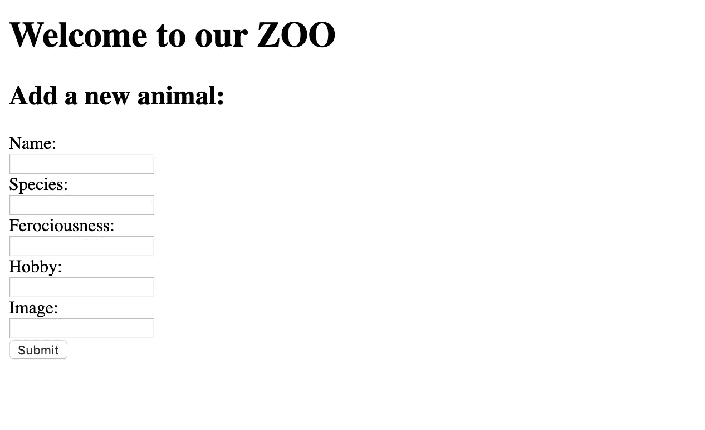

# 步骤 2: DOMContentLoaded

我喜欢设计我的应用程序，因为我喜欢把我所有的 JS 放在一个`DOMContentLoaded`事件监听器中。

让我们这样做，并且让我们包含一个`console.log`来查看 JS 文件是否被连接——如果我们在浏览器中刷新页面，我们应该会看到一个控制台消息。

```
document.addEventListener('DOMContentLoaded', (event) => {
    console.log('DOM fully loaded and parsed');
});
```

让我们检查一下控制台:

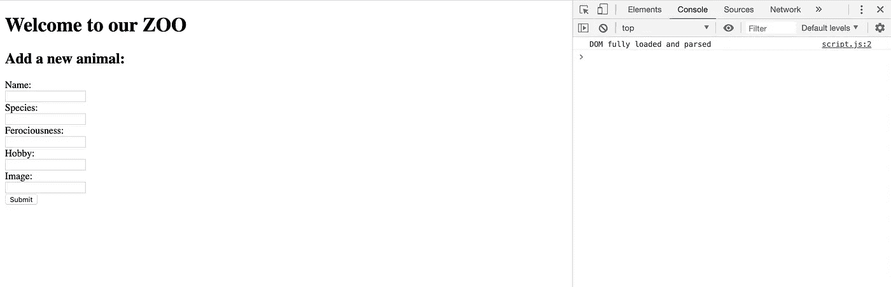

好了，现在我们知道我们的 JS 文件工作了，让我们按照流程来。

# 该过程

1.  将所有必要的`querySelectors`保存到最顶层的变量中。一旦设置了变量，就在控制台中运行它。如果应用程序需要一些切换，为它创建一个`let`。如果任何现有的元素必须有一个事件侦听器，您可以继续添加它！
2.  编写第一个 fetch(这是一个 GET，遵循这样的结构:URL，then，then + `slapItOnTheDom`)。
3.  `Console.log`查看返回的数据。
4.  写`slapItOnTheDom`的方法。创造新元素。给这些元素数据集和`innerHTML` / `innerText`。将`eventListeners`添加到它们应该在的地方，并记住写一个助手函数`appendChild`。
5.  对它进行碰撞测试和调试。
6.  添加其他获取(确保头部和主体发出正确的数据)。
7.  确保`preventDefault`在您想要的位置！

# 步骤 3:查询选择器

让我们保存所有的元素，我们稍后会提到变量:

*   `ul#zoo-animals` —那就是我们将拥有动物列表的地方。
*   `div#animal-info` —那是动物简介。
*   `form#create-animal`。
*   `input#submit-new` —这是我们的提交按钮。

此外，因为动物的轮廓是可切换的，所以让我们用一个`let`语句创建一个`seeAnimal`变量，因为我们将改变它的值。

最后但同样重要的是，我们知道提交需要一个事件监听器，所以让我们用一个回调函数来添加它，我们将命名为`createNewAnimal`。

注意:我喜欢将这些元素保存为具有高级别范围的变量，因为我假设我会在不止一个地方使用它们。你可以把它们放在它们所属的函数中，但是这样会把它们的范围缩小到只有一个函数。

您的代码应该如下所示:

让我们来看看`console.log`所有的变量。您知道`console.log`可以接受任意多的参数吗？我喜欢描述性的，见下文:

哦，你弄错了！

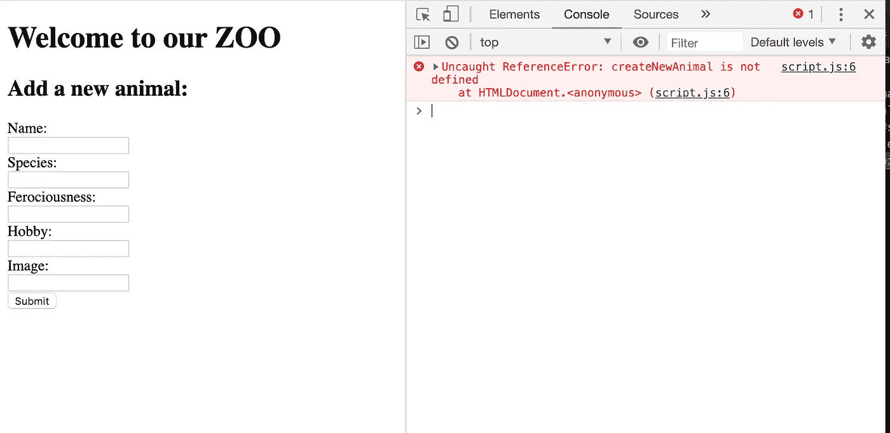

如果您查看错误，您会发现它指向我的编辑器中文件`script.js`的第 16 行。错误提示`createNewAnimal`未定义。没错。

在我的`eventListener`中，我调用了一个尚不存在的函数。为了让错误消失，代码不会中断，您可以暂时注释掉这一行，或者用`null`或`console.log(“submitted!”)`替换函数名。

我选择带有控制台日志的匿名箭头回调函数:

这是我得到的:

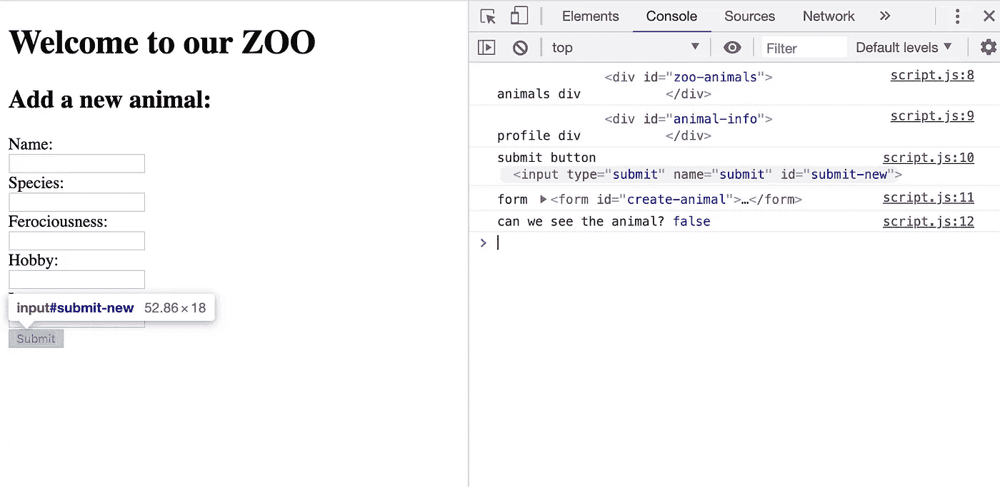

现在，如果一个变量有效，您不仅应该在控制台中看到 HTML 节点，而且，如果您在右侧的控制台中将鼠标悬停在它上面，所选的元素应该在左侧的 DOM 中高亮显示。

检查每一个元素，看看你认为你应该得到的实际上是什么选择。如果你看到任何未定义的，那是检查你的假设的信号。

好的建议是在控制台中尝试使用`querySelector`来查看即时结果，然后复制实际带来预期结果的代码。

# 步骤 4:第一次获取(GET)

好了，让我们邀请动物吧！我们将编写我们的第一个 fetch，它将在变量被声明/定义后立即运行。

我发现 GET fetch 非常有价值——它简单、快速，并且几乎能带来立竿见影的效果。让我们把它写下来:

```
fetch('http://localhost:3000/animals')  
.then(response => response.json())  
.then(animal => animal.forEach(slapItOnTheDiv))
```

好的。现在让我们一行一行地介绍它。我们首先调用带有 URL 参数的函数`fetch`——在本例中，我们从服务器上运行的 JSON 文件中获取数据。

由于`fetch`返回未解决的[承诺](https://developer.mozilla.org/en-US/docs/Web/JavaScript/Reference/Global_Objects/Promise)而不是数据，我们需要接下来的步骤来解决承诺。因为`fetch`是一个异步函数，我们想告诉 JavaScript 等到它完成获取后再继续下一步——这就是我们使用`.then`的原因。

如果我们不这样做，当 JS 跳到下一行时，`fetch`还没有完成，代码会中断。`.then`方法接受前一个方法的返回值并对其进行操作。

让我们通过引入一个`console.log`来看看返回值是什么:

```
fetch('http://localhost:3000/animals')  
.then(console.log) 
```

我们得到的是回应。也就是说，我们向服务器发送请求，服务器将数据发回给我们。但是，请看下面响应中的`body`属性:

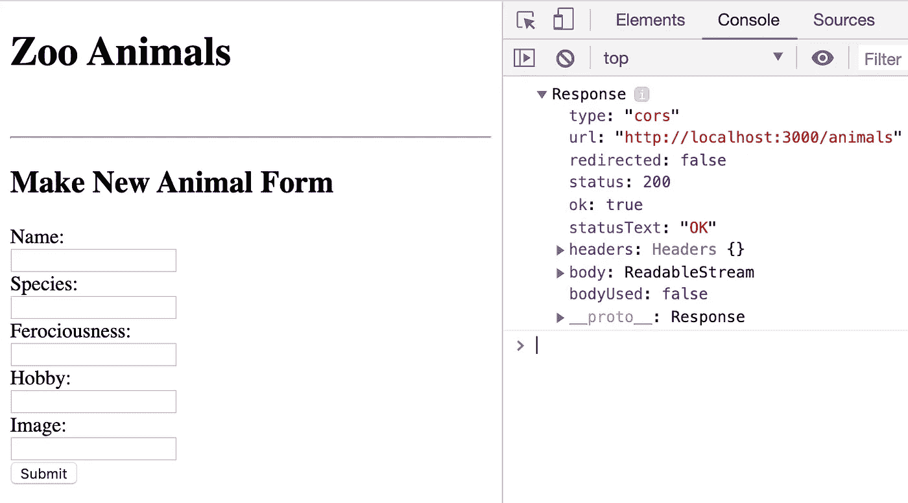

它是一个`ReadableStream`，也就是[一个可读的字节数据流](https://developer.mozilla.org/en-US/docs/Web/API/ReadableStream)。让我们将它转换成我们可以使用的东西，一个 JSON 响应，然后再次检查控制台。

```
fetch('http://localhost:3000/animals')  
.then(response => response.json())
.then(console.log)
```

太好了，我们拿回了对象数组。现在是检查所有对象是否都有所有键的时候了。

如果您无法在页面上呈现某些数据，这个问题可能会有所帮助——例如，`image_url`可能不是真正的字符串或 URL，因此不会有图片。

所以，我们来看看…好像最后一个对象有不同的键？

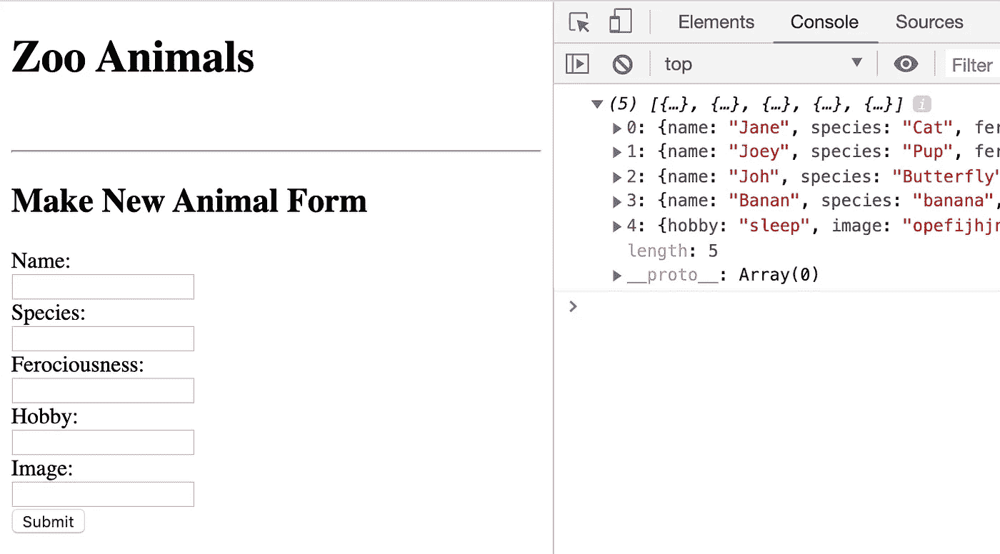

经过检查，您可以看到它的键以不同的顺序出现，但这没关系，因为 JavaScript 中的对象是一个无序的集合，所以键出现的顺序与编程无关。

不过，我确实注意到它的图片 URL 是错误的，所以我知道以后会发生什么。

现在我们有了对象，让我们遍历它们并使用委托来创建动物列表。

```
fetch('[http://localhost:3000/animals'](http://localhost:3000/animals'))
  .then(response => response.json())
  .then(animals => animals.forEach(animal => animal(slapItOnTheDOM)))
```

我们可以把它缩短:

```
fetch('http://localhost:3000/animals')
.then(response => response.json())
.then(animals => animals.forEach(slapItOnTheDOM))
```

`slapItOnTheDOM`函数将作用于迭代数组的每个元素。

现在让我们创建`slapItOnTheDOM`函数，它接受一个动物对象作为参数，并伪代码我们的下一步:

让我们来关注一下`li`并添加 console.logs 来检查它是否工作:

这是控制台:

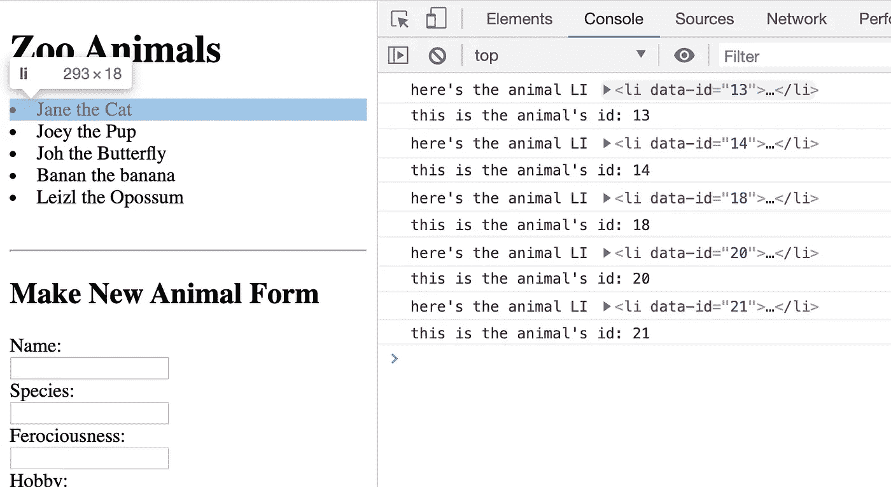

完美。控制台对我们在获取中收到的每个元素做出反应。现在，让我们处理按钮任务，并检查它们是否正确呈现:

请注意动态 ID。这将有助于我们稍后在删除动物及其`li`和按钮时移除该按钮。这是控制台:

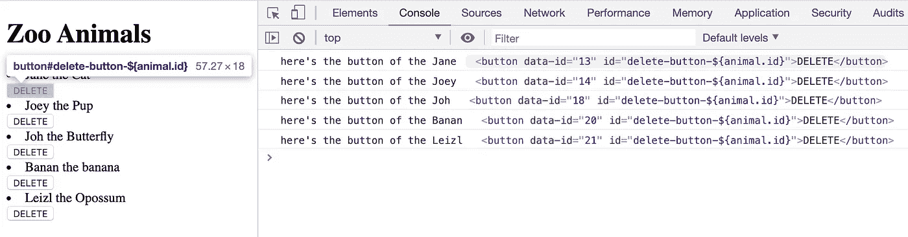

最后但同样重要的是，让我们添加事件监听器。我们将利用这样一个事实，即我们在函数中可以访问动物对象，因此，我们将把动物进一步传递给删除函数(我们还没有写)。

```
buttond.addEventListener('click', () => {deleteAnimal(animal) })
```

出于测试的目的，让我们用一个控制台临时替换这个函数。

```
buttond.addEventListener('click', console.log(animal)})
```

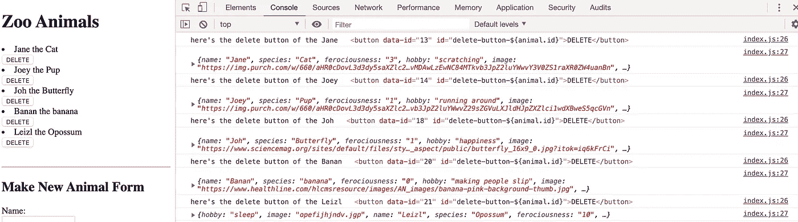

我们知道这是可行的，但是…由于这个方法不是回调，所以当页面没有被点击的时候，这个方法就被激活了。让我们记住将函数作为回调函数:

```
buttond.addEventListener('click', () => console.log(animal))
```

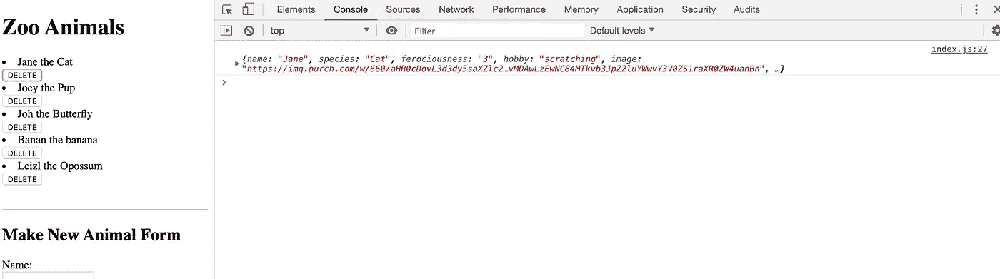

为了记录起见，最好也检查一下第一个元素和最后一个元素是否都有效(特别是，如果您在获取或一般情况下使用闭包`getElementById`或`querySelector`)。所以，让我们这样做:

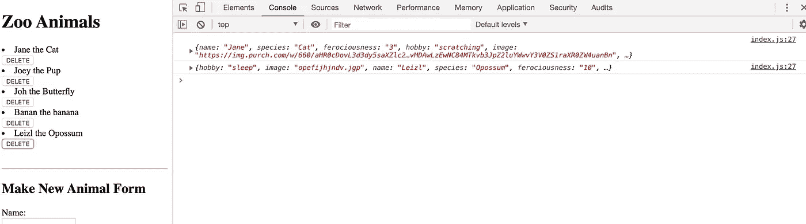

太好了。现在，让我们用 update 按钮做同样的事情。然后，让我们取消对`createAnimal`的注释，现在编写`updateAnimal`和`deleteAnimal`，因为我们已经有了它的`eventListener`。

我们可以把 console.logs 放在函数中，这样代码就不会中断。

此时，您的代码应该如下所示:

太好了。

# 第五步:创建

现在让我们编写`createAnimal`函数。在我们冒险开始编码之前，让我们伪代码化我们的步骤:

```
# include preventDefault;
# create a helper function that will gather the data from the form;
# save the form inputs to a variable;
# fetch;
```

我们需要包含`preventDefault`,因为默认情况下表单提交会刷新页面，虽然这可以工作，但不是最好的用户体验。

所以，我们想要的是有一个从表单中收集所有数据的函数。我强烈建议使用这种方法，因为我们将在以后更新动物时使用相同的函数。

我们的助手函数将如下所示:

我们只是收集表单输入的名称，并将它们保存为一个对象。

因为这个函数将在另一个函数中被调用，所以它可以访问调用者的事件。现在，我们可以将这个新的动物对象保存到`createAnimal`函数中的一个变量中:

```
function createAnimal(event){
     event.preventDefault();
     let newAnimal = gatherFormData();
}
```

`newAnimal`现在由 helper 函数的返回值定义。太好了。让我们开始捡球吧。

这一次，我们的获取将采用两个参数:

1.  网址。
2.  带有请求、指定方法、头(也是对象)和主体的对象；因为它是一个对象，所以每个键后面都需要一个逗号。

让我们一步一步来:

1.  这个获取的方法将是“POST”——记住引号。
2.  请求的头指定了我们发送的内容和我们想要得到的内容——请记住，头中的键和值都应该用引号括起来。
3.  我们从 JSON(对象)转换成字符串的主体。

该方法现在将如下所示:

现在，还记得承诺和异步的东西吗？是的，添加这两个`.then`,并且，猜猜看…我们将再次使用相同的方法在 DOM 上发布新的动物，就像我们使用 GET fetch 一样— `slapItOnTheDOM`！

让我们创建一个新的动物——打开“开发工具网络”选项卡，查看您的动物是否已创建:

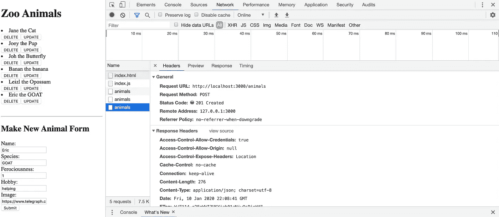

呜哇！我们动物园现在有一只叫埃里克的山羊。

# 第六步:更新

有没有注意到我们有一个更新按钮但是功能叫`editAnimal`？嗯，那是因为这个函数实际上会让编辑表单出现，然后调用 update 函数进行更新。

这个函数只接受动物对象的对象，以便能够在窗体上显示动物的数据。

现在，让我们看看当我们单击 update 按钮时会发生什么——我将首先添加一个 console.log，以查看我在 DOM 上单击的内容是否会给出我所认为的动物对象:

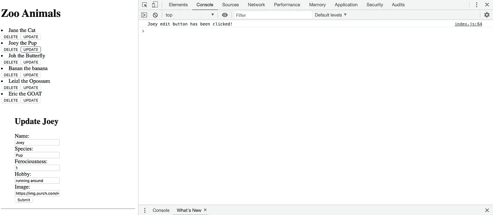

看来成功了！现在，让我们编写更新函数。这个函数将使用 helper 方法来收集数据，然后调用两个方法来更新后端和前端的动物。

我们不带参数调用`updateOnFrontEnd`,因为在这种情况下，默认情况下，它将接受前一个函数的返回值。

```
function updateAnimal(event, animal) {
    event.preventDefault();
    let updatedAnimal = gatherFormData()
    updateOnBackend(updatedAnimal, animal.id)
    .then(updateOnFrontEnd)
  }
```

好的，让我们进行后端更新。如您所见，`updateOnBackend`方法接受两个参数:一个来自收集的数据的对象和我们需要添加到 URL 的动物 ID。

这个语法应该不会让你感到困惑，因为它非常类似于 *create* 语法。

让我们引入一个 console.log 来看看获取是否有效:

是啊！现在，记得用 console.log 取出`.then`,因为虽然它对测试这部分很好，但是它改变了这个函数的返回值。

我们看到代码运行顺畅:


让我们检查“响应”选项卡，看看请求是否通过:

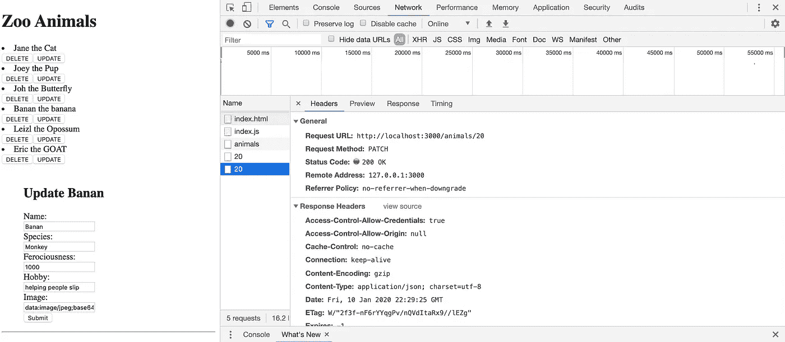

太好了。如果我们刷新了页面，我们会看到不同之处。然而，我们希望 DOM 上的更新即时发生。让我们实现它。

该函数将操纵 DOM 来编辑我们的`li`。请注意`querySelector`,它不仅通过数据集动态查找合适的动物 ID，还查找属于它的跨度。

```
function updateOnFrontEnd(animal){
    const animalSpan = animals.querySelector(`li[data-id="${animal.id}"]>span`)
    animalSpan.innerText = `${animal.name} the ${animal.species}` 
  }
```

让我们在函数的开头包含一个 console.log，看看它是否曾经运行过(以防它没有更新 DOM ),并检查:

现在让我们把乔伊改成乔吧。查看表单、控制台和 DOM。

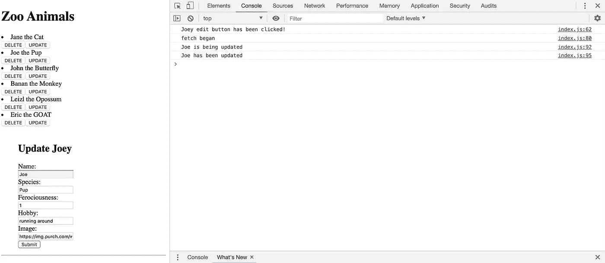

耶！乔伊现在是乔了。

您的代码现在应该是这样的:

# 第七步:删除

现在，让我们想象我们想让一只蝴蝶进入野生世界。

我们需要一个删除函数，首先定位与动物相关的所有元素，然后发送一个删除获取请求，最后删除动物在 DOM 中的存在。

约翰走了。

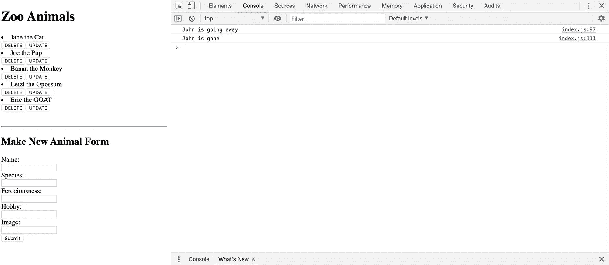

到目前为止，您的代码如下所示:

继续添加许多 CSS 魔法吧！或者，让更新表单在更新完成后消失。

或者，在提交之后，使表单再次具有空白输入区域。分享你的成果！