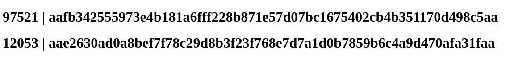

# 在 Rust 中构建一个加密货币挖掘器，并在您的浏览器上运行它

> 原文：<https://betterprogramming.pub/build-a-cryptominer-in-rust-and-run-it-on-your-browser-300662204131>

## 了解黑客如何利用 WASM 进行区块链采矿


阿尔伯特·希塞尼在 [Unsplash](https://unsplash.com?utm_source=medium&utm_medium=referral) 上拍摄的照片

我在做 bug bounty 的时候，一直很好奇那些没有极高流量，也没有 Bug Bounty 计划或者责任披露计划的网站的安全性。我经常感到失望:通过最少的测试，我通常很有可能发现安全问题，至少在应用程序的一个功能上。我还应该提到，我只是一个足够体面的猎人。我无法想象优秀的黑客能够找到什么。

这是一个重要的互联网问题:有着不错流量的网站却没有坚实的安全保障。恶意方喜欢利用这些类型的域。最近，我看到了关于黑帽黑客[利用](https://thehackernews.com/2022/07/hackers-increasingly-using-webassembly.html)注入漏洞在网站访问者的浏览器上运行他们自己的矿工的新闻。

这立即引起了我的注意，所以我在这里与你的浏览器挖掘区块链动手文章。我相信这篇文章可以帮助读者了解区块链矿业基础知识，一些铁锈，以及 WebAssembly 的威力。

# 简单挖掘概述

众所周知，密码可以保护你的钱包，但如果没有一个中央实体可以确定我不能给你 10 BTC，因为我没有持有它们，或者我不能在没有你签署交易的情况下从你的钱包给自己发送资产，会发生什么？

拥有一个分布式分类帐解决了这个问题:如果所有验证者之间达成共识，独立的计算机验证被批准的交易(这个阶段因网络而异)。在许多链中，这些人被称为矿工，因为他们有机会挖掘交易块，并在验证交易后收集交易块的奖励。

# 为什么是 WASM

也就是说，使用工作一致性算法的证明来挖掘块需要挖掘者解决数学计算，作为挖掘者已经努力验证块中的事务的证明。黑客很聪明，他们更喜欢让你在浏览器上完成繁重的工作，然后收取报酬。

但是繁重的计算和 Javascript 并不匹配。

进入 wasm 模式，在这里你可以运行 Rust、C、C++、Zig 以及任何可以在大多数浏览器中编译成 WASM 二进制文件的语言。这加快了速度，允许浏览器端更快的计算。现在你可以明白为什么黑客选择 WebAssembly 来执行这些计算了。

# 实现简单的挖掘机制

现在让我们构建自己的“特洛伊”矿工。因为我们不想挖掘真正的加密，我们将构建我们自己的块表示。我们的区块表示将非常简单:

```
{
  "ts": <timestamp>,
  "nonce": <nonce integer>,
  "prev_block_hash": <hash of previous block>,
  "txs": <set of transactions within the block>
}
```

为了简单起见，我们将不在本教程中介绍事务的验证，因此我们的挖掘“特洛伊木马”所要做的唯一任务就是找到正确的`nonce`作为工作证明。如果你还记得的话，挖矿者必须执行繁重的计算，才能获得区块奖励。当谈到矿工必须解决的散列问题时，就像试图破解散列密码一样。过程如下:

1.  我们把区块搞得一团糟
2.  看看散列是否遵守我们的条件，使其有效
3.  如果是这样，挖掘任务就成功了，矿工现在可以添加一个新区块并收集区块奖励。
4.  否则，更改`nonce`(这是矿工可更改的唯一字段，同时仍保持块有效)，然后重试。

例如，我们可能需要解决的一个任务是确保我们在修改`nonce`时试图生成的散列是一个大于前一个块的散列的数字。不过，这样做的计算代价会非常高，所以我决定使用一个更简单的条件:哈希的开头和结尾必须为`aa`，这种条件的代价要低得多，而且更适合于概念证明。

## 设置并定义我们的区块

首先，我们必须创建一个新的 WASM 项目。如果不知道怎么才能看懂[这个基本的 Rust+WASM 介绍](/get-started-with-wasm-in-rust-2347056bab4) ( `cargo generate — git [https://github.com/rustwasm/wasm-pack-template](https://github.com/rustwasm/wasm-pack-template)`)。

然后我们把一些配置和依赖关系放到`Cargo.toml`文件中，在你的`[dependencies]`下添加:

```
serde_json = "1.0"
serde = { version = "1.0", features = ["derive"] }
rust-crypto-wasm = "0.3.0"
```

并且在文件的末尾，添加 web-sys 和它的一些特性，以便能够修改 DOM(正如[在这里更好地解释](https://medium.com/r?url=https%3A%2F%2Fbetterprogramming.pub%2Fget-started-with-wasm-in-rust-2347056bab4)):

```
[dependencies.web-sys]
version = "0.3.4"
features = [
  'Document',
  'Element',
  'HtmlElement',
  'Node',
  'Window',
]
```

最后，我们定义了`Block`和`Transaction`结构(注意，我们使用 serde 的`derive`宏为`Block`和`Transaction`生成`Serialize`的实现):

## 加上我们的工作条件证明

正如我前面说过的，散列有效的条件是它必须以`aa`开始和结束。我们可以简单地用下面的函数实现它:

```
fn is_valid(hash: &str, to_match: &str) -> bool {
    hash.starts_with(to_match) && hash.ends_with(to_match)
}
```

## 实现基本块行为

接下来，我们想为我们的`Block`结构实现一些基本行为，比如:

*   返回链的第一个块(或起源块)—第 13–26 行。
*   创建新块—第 4–11 行
*   [将块序列化为 JSON](/how-to-work-with-json-in-rust-35ddc964009e) —第 28–30 行
*   散列块—第 32–36 行。注意，这里我们使用的是从`rust-crypto-wasm`依赖项导入的`Sha256`散列函数。
*   开采区块—第 38–42 行。一个非常简单的 while 循环(虽然不是很有效，但是对于这样一个简单的数学任务来说非常合适),它只是改变块的`nonce`,直到散列被验证(还记得我们在“添加我们的工作条件证明”一节中定义的`is_valid`函数)。

## 其他一些帮助者

我们的采矿机制现在都准备好了。为了完整性和修改 DOM，我们只需要几个额外的帮助函数。代码如下:

我们有三个新的函数:前两个，正如评论中所描述的，只是为了完整和展示如何在真实的链上实现这个挖掘器(你也应该实现链的块结构和解决区块链需要的数学难题)。另一方面，`add_heading_block`函数将只在主体中添加一个标题，其中包含正确的 nonce 和相应的事务哈希。

# 主要功能

最后，我们将所有这些打包成一个可以从 JS 调用的函数:

我们只是找到两个后续块的有效 nonce，并在找到它们时将它们添加到页面主体中。

# 将它们包装在一起并进行测试

[这个](https://gist.github.com/heytdep/e270cdddc7f960a3ac2e7ad4eef21f49)是我们剩下的`lib.rs`文件。我还想你会想看看我们在过去几分钟里所做的工作的结果，所以我将快速地引导你编译到 WASM，并在一个网页上从 JS 调用`rust_mine`函数:

1.  用 wasm-pack 编译到 WASM 用于浏览器:`wasm-pack build --target web`。
2.  在板条箱的根目录下创建和`index.html`文件，如下所示:

3.服`index.html`文件，比如我用`snowpack dev`。

这是你应该在浏览器上看到的，两个新解决的哈希难题:



# 黑客部分

这篇文章源于作者的好奇心，想探索黑客如何利用 WebAssembly 从日常 web 访问者的浏览器中挖掘密码。虽然我不知道他们的矿工长什么样，但这是使用我们构建的矿工在我们部分实现的虚拟区块链上采矿的工作流程:

1.  在网站上找到一个注入漏洞，比如一个存储的跨站点脚本漏洞，在页面上加载我们的`wasm_miner.js`文件。
2.  随着计算和进程通过 Websocket 消息或 fetch 调用将我们为块找到的`nonce`发送回服务器。
3.  服务器现在应该会收到挖掘新区块所需的数据，并获得区块奖励。

根据我们希望矿工工作的链，有无尽的定制要做。本文的目的是通过 Rust 实践教程让您更熟悉加密挖掘的概念。此外，有趣的是，WebAssembly 在网络安全领域也能发挥作用。

*感谢阅读！*