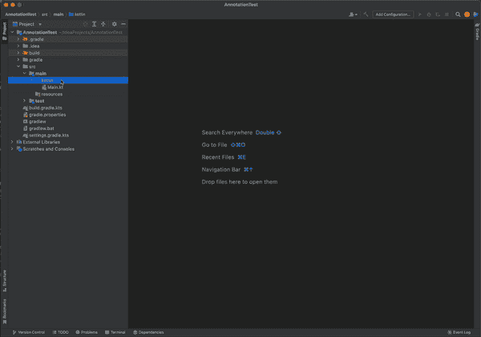
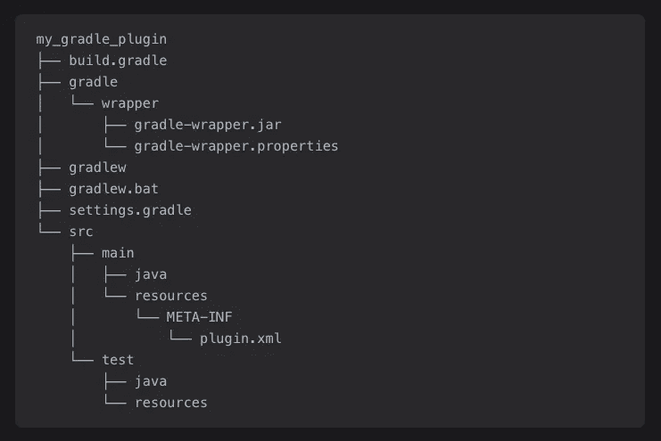
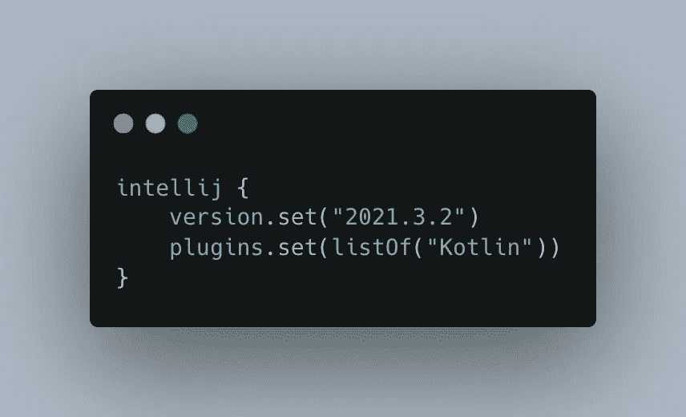
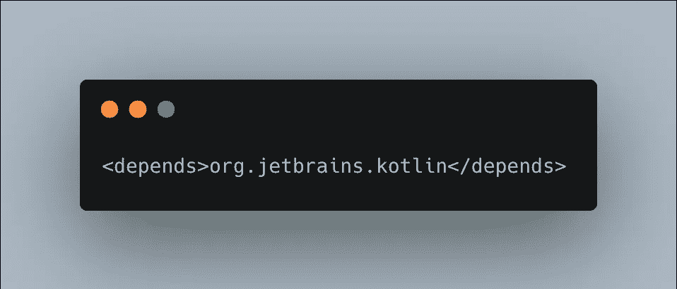
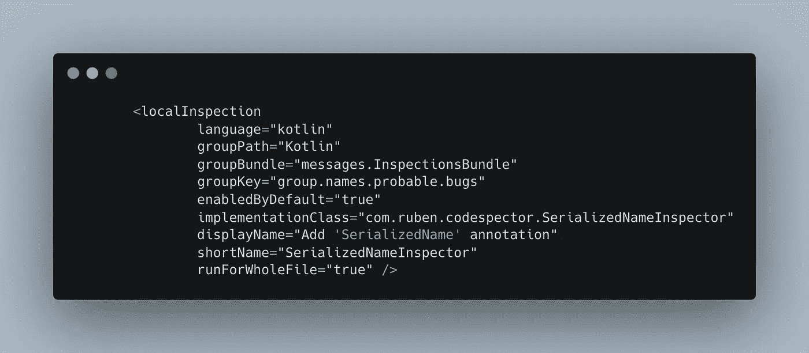
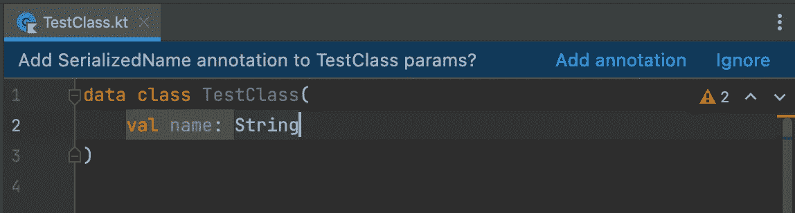
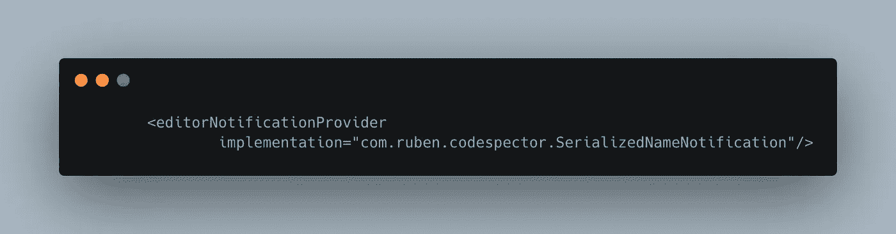
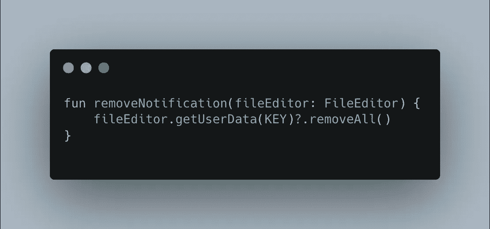
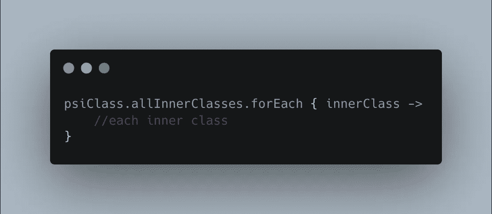

# 构建自定义 IntelliJ 代码检查插件

> 原文：<https://betterprogramming.pub/build-a-custom-intellij-code-inspection-plugin-c6973a6d3f3>

## 创建一个检查 Kotlin 数据类的插件


来源:[https://www.behance.net/binalogue](https://www.behance.net/binalogue)

## 介绍

IntelliJ 平台完全支持插件，他们提供了 API 来创建你自己的定制插件。根据他们的[文件](https://plugins.jetbrains.com/docs/intellij/basics.html) : *基于 IntelliJ 平台的产品可以通过添加插件*进行修改和调整以满足定制目的。

到本文结束时，您将拥有一个检查 Kotlin 数据类的插件，并在您缺少 [*SerializedName*](https://www.javadoc.io/doc/com.google.code.gson/gson/2.6.2/com/google/gson/annotations/SerializedName.html) 注释时发出警告。这一切都是实时发生的！看看这个:



数据类别检查器

## 灵感

我是一名 Android 开发人员，如果你熟悉 Android 开发，所有发布的应用都会有某种形式的[代码混淆](https://en.wikipedia.org/wiki/Obfuscation_(software))。大多数时候，你使用 Gson 解析 JSON 响应，或者用它将 JSON 转换成对象，反之亦然。

如果您没有用 *SerializedName* 注释来注释您的数据类参数，那么由于代码混淆，Gson 将无法将响应解析到您的对象中，解析将会失败。这种情况在我们的团队中发生过几次(有一次也是我)，我想对此做些什么。

如果你想知道，是的皮棉检查是另一种方式，但我想有一些实时更新用户！我确实尝试过制定一个定制的 android lint 规则，但是它并没有像预期的那样工作。

我们来编码吧！

## 项目设置

从 IntelliJ IDEA 项目向导创建新的 IntelliJ 平台插件项目。您将拥有以下结构:



来源:[插件开发文档](https://plugins.jetbrains.com/docs/intellij/gradle-prerequisites.html#components-of-a-wizard-generated-gradle-intellij-platform-plugin)

这里最重要的文件是`plugin.xml`。该文件用于配置插件。

首先，让我们继续添加所需的依赖项。对于代码检查插件，我们只需要 Kotlin 依赖。我们必须在 gradle 文件以及插件配置文件 *plugin.xml* 中添加依赖关系。



将 Kotlin 依赖项添加到 build.gradle 文件



将 Kotlin 依赖项添加到 plugin.xml

既然我们已经设置了我们的项目，让我们进入代码检查的有趣部分！

## 申报检查员

可以有以下两种类型的检查员:

*   本地检查器—*`*com.intellij.localInspection*`*扩展点用于一次操作一个文件的检查，也可在用户编辑文件*时“即时”操作。*
*   *全局检查器—*`*com.intellij.globalInspection*`*扩展点用于跨多个文件操作的检查，例如，相关的修复可能会在文件之间重构代码*。**

**在我们的例子中，我们需要`localInspection`,因为每个数据类都需要单独检查，当它被编辑时也是如此。**

**让我们将这个扩展添加到插件配置文件中。**

****

**添加`localInspection in plugin.xml`**

**现在我们的 plugin.xml 文件如下所示:**

**plugin.xml**

**让我们试着理解`localInspection`中的关键。**

**`groupPath` —用于在 IDE 设置界面显示的父组名称。
在我们这里:*设置/编辑/科特林***

**`groupBundle` —从该包中获取显示消息。您可以指定自己的包来显示自定义消息。**

**`groupKey` —用于在 IDE 设置 UI 中显示的组名。
在我们这里:*设置/编辑器/kot Lin/可能的 bug***

**`implementationClass` —对应的检验实现类。**

**其余的键是不言自明的。**

## **创建检查器**

**现在我们已经在插件配置文件中声明了代码检查器，让我们继续执行同样的操作。**

**实现如下:**

**SerializedNameInspector.kt**

**Extensions.kt**

**让我们试着理解实现中发生了什么。**

**为了检查一个 Kotlin 类，实现类应该扩展`AbstractKotlinInspection`。这个类提供了检查类、字段和方法的方法。**

**接下来，我们可以覆盖`buildVisitor`方法来确定文件的元素是否是需要检查的。这里，我们检查数据类参数是否用所需的 *SerializedName* 注释进行了注释。如果没有，我们将它注册为一个问题，以便 IDE 可以向用户突出显示它。**

**很简单，你不同意吗？**

## **创建编辑器通知**

**为了让用户更容易地向整个类添加注释，让我们继续提供一个带有相关操作的通知。**

****

**编辑通知**

**基本上，如果缺少 *SerializedName* 注释，除了突出显示缺少的参数，我们还会显示一个通知。**

**此通知有两个操作:**

*   **添加注释—这将为整个类添加所有缺少的注释**
*   **忽略—忽略对该特定文件的检查**

**首先，我们必须将通知扩展添加到插件配置文件中。**

****

**在 plugin.xml 中添加 editorNotificationProvider**

**实现如下:**

**SerializedNameNotification.kt**

**要显示编辑器通知，实现类应该扩展`EditorNotifications.Provider<T>`。我们可以使用`EditorNotificationPanel`,因为它提供了显示消息和相关动作所需的 UI。**

**`getKey()`方法返回这个通知的唯一键。此键可用于删除通知。**

**首先，我们检查是否有任何参数缺少所需的注释(与我们的检查器相同)，如果有，我们创建一个通知。如果类参数得到了所需注释的更新，我们将删除正在显示的通知。**

**`createPanel(..)`方法用于创建将要显示的通知。我们来看看实现。**

**创建通知**

**这里，我们提供了要显示的消息以及操作。此外，只有当缺少注释并且用户没有忽略对该文件的检查时，才应该显示该通知。**

***添加注释*和*忽略*动作如下:**

**添加缺少的注释**

**忽略对文件的检查**

**最后，要删除正在显示的通知，我们可以执行以下操作:**

****

**如果显示通知，则删除通知**

**您可能还想检查内部类。你可以很容易地得到一个`PsiClass`的内部类，如下:**

****

**检查内部类**

**您可以在这个资源库中找到这个插件的完整源代码。**

**[](https://github.com/rubenquadros/codespector) [## GitHub-rubenquadros/code spector:IntelliJ 产品的代码检查插件

### 这是一个做代码检查的 IntelliJ 插件。它检查 Kotlin 数据类并检查每个参数是否…

github.com](https://github.com/rubenquadros/codespector)** 

## **下一步是什么？**

**在这篇文章中，我们看到了如何创建我们自己的定制代码检查插件。在接下来的文章中，让我们探索并编写这个插件的测试，并最终将它部署到市场上！**

**[](/integrate-settings-into-a-custom-intellij-code-inspection-plugin-47d845b1c9f5) [## 将设置集成到自定义 IntelliJ 代码检查插件中

### 将设置 UI 添加到 Kotlin 数据类检查插件

better 编程. pub](/integrate-settings-into-a-custom-intellij-code-inspection-plugin-47d845b1c9f5)** 

**感谢阅读！**

```
****Want to Connect?**You can also connect with me on [LinkedIn](https://www.linkedin.com/in/ruben-quadros-b87995173/).We at ShareChat are constantly working on making our apps better across all our clients: Android, iOS and Web. If you are interested in building ShareChat/Moj or solving interesting problems, [let us know by applying here](https://sharechat.hire.trakstar.com/)!**
```

## **额外资源**

*   **[IntelliJ 文档](https://plugins.jetbrains.com/docs/intellij/welcome.html)开始插件开发。**
*   **IntelliJ 文档深入研究代码检查。**
*   **[IntelliJ 文档](https://plugins.jetbrains.com/docs/intellij/notifications.html#editor-banner)深入编辑器通知。**
*   **[插件开发论坛](https://intellij-support.jetbrains.com/hc/en-us/community/topics/200366979-IntelliJ-IDEA-Open-API-and-Plugin-Development)查看问题并寻求帮助。**
*   **[众多开源插件的 GitHub repo](https://github.com/JetBrains/intellij-plugins) 。**