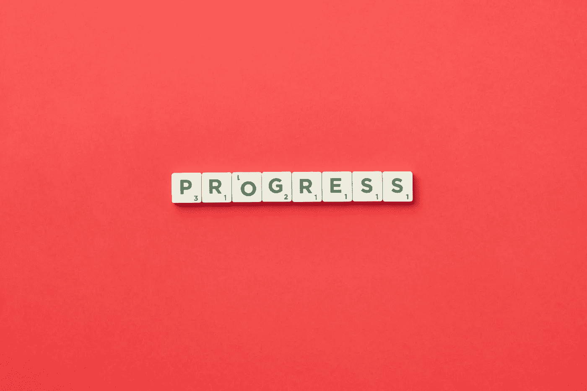

# 用两个 div 构建一个自定义进度条

> 原文：<https://betterprogramming.pub/build-a-custom-progress-bar-with-two-divs-34d274e72d3b>

## 创建有用的组件

图片由 DS stories:[https://www . pexels . com/photo/motivative-text-on-red-background-6005262/](https://www.pexels.com/photo/motivational-text-on-red-background-6005262/)

进度栏。简单但令人满意的用户界面，让用户感觉他们在进步。所以，如果你发现自己在开发一个前端，并且需要一个进度条，你有两个选择:一，导入一个已经为你预制好的库。第二，自己造。

这篇文章将向你展示如何做第二个选择。创建一个漂亮的进度条比你想象的要容易。我将向你展示如何只用两个

标签来实现。

> TL；如果你想跳过解释，请滚动到代码沙箱的末尾，这里有我做的一个例子。

# 代码

# **Div # 1:progress bar container**

这个元素将为你的进度条定义两个主要的东西:显示进度条未填充部分的中性色背景和进度条的高度。

# **Div #2: barStyle**

这个 div 负责进度条的一部分，它将作为进度条的填充部分。因为这个 div 位于容器 div 内部，所以我们给它 100%的高度，这样它就填充了`progressBarContainer`的高度。

让你的进度条动态显示进度的关键是`barStyle` div 的 Width 属性。根据您的用例，您可以决定在进度条中填充多少内容的逻辑。一旦你有了这个计算，确保你把它作为一个百分比输入到`barStyle` div 元素中，瞧，你就有了一个全功能的进度条！

***注意*** *:两个 div 元素应该有相同的 border-radius 设置，这样两个元素之间就不会有奇怪的重叠。这就产生了* `*barStyle*` *div 直接覆盖在容器 div 之上的效果。*

# 演示

拖动滑块，看看如何影响进度条！

注意，我使用 Chakra UI 框架编写了这个 codesandbox。但是它和我上面描述的是完全一样的解决方案。代替两个 div，我使用了脉轮等价物，也就是`<Flex>`。样式是完全一样的，虽然我确实很喜欢，把进度条的颜色做成了渐变，因为我觉得这很有趣。

最后要注意的是滑块。我添加它是为了更容易的可视化你的进度条将如何随着条样式的宽度增加和减少而填充。

我希望这个组件是有用的，如果你将来需要一个进度条，你可以使用它！你也可以把它做得更花哨，但这是一个非常简单的解决方案！