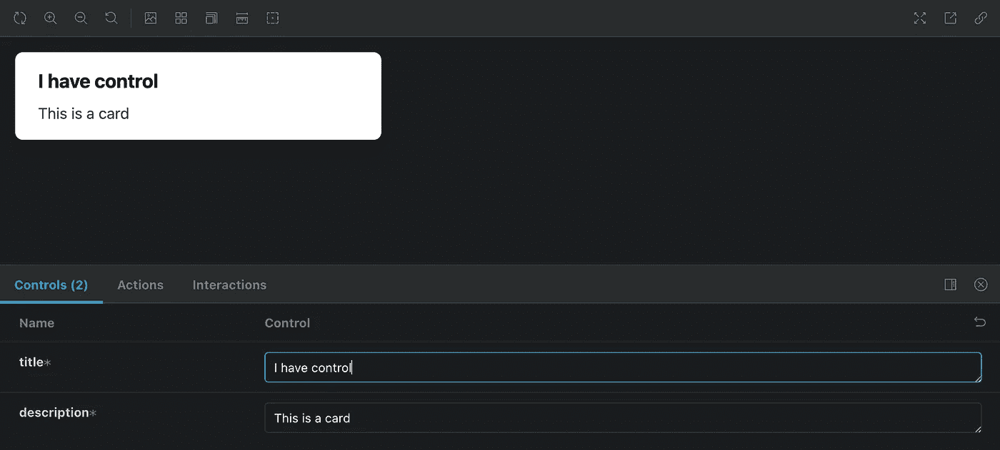

# 2023 年用 Storybook 7 Beta 和 Vite 4 构建自定义 React 组件库

> 原文：<https://betterprogramming.pub/build-a-custom-react-component-library-with-storybook-7-beta-and-vite-4-in-2023-c52db4d733c0>

## 用 React 中的 Storybook 7 和 Vite 4 创建可重用组件库


React 组件库盒—中途

# 什么是组件库？

React 组件库是可重用组件的集合，可用于快速构建用户界面。它们通常作为 NPM 包分发，可以包含各种不同类型的组件，如按钮、表单元素和布局组件。使用 React 组件库有助于加快开发速度，并确保用户界面是一致的，并遵循既定的设计模式。

# 使用组件库的优势

1.  可重用组件:组件库提供了一组预构建的、可重用的组件，这些组件可以轻松地集成到许多应用程序中，从而节省时间和精力。
2.  一致性:通过使用组件库，更容易确保用户界面在应用程序的不同部分保持一致。这可以改善整体用户体验，使用户更容易浏览应用程序。
3.  提高性能:设计良好的组件库可以通过提供针对性能进行优化的组件来提高应用程序的性能。
4.  社区支持:许多组件库有一个庞大的用户和贡献者社区，这意味着通常有大量的资源和支持可用于使用该库。
5.  改进的可维护性:使用组件库有助于提高应用程序的可维护性，因为它提供了一组稳定的、经过良好测试的组件，可以随着时间的推移轻松地进行更新和维护。

# 为什么您可能不需要创建自己的组件库

无论你是公司还是个人，创建一个组件库都需要时间，所以考虑时间投资以及对你的项目或组织来说是否值得是很重要的。从头开始构建需要大量的工作，但是利用现有的库或框架可以减少工作量。考虑开发组件库的好处是否超过时间投入。对于有多个开发人员的大型长期项目，组件库可以节省时间并提高一致性。对于生命周期较短的小型项目，这可能不值得努力。

# 项目设置概述

*   用 TypeScript 设置 Vite React 项目
*   用 React 和 TypeScript 设置故事书
*   使用 Tailwind 设置样式并导入生成的文件
*   设置库构建脚本和故事书构建
*   安装程序包发布

设置 Vite React project with TypeScript 确保将`react-component-library`重命名为您想要的库名称

`npm create vite@latest react-component-library -- --template react-ts`

**注意:**如果你使用的是 NPM 6 或更低版本，那么你可能不需要额外的破折号(`--`)

一旦将 Vite app cd 生成到目录中，

初始化故事书测试版:

`npx sb@next init`

# 设置顺风

如果你从未用过顺风，以下是我的电梯营销:

Tailwind 是一个实用优先的 CSS 框架，与传统的 CSS 解决方案相比，它提供了许多优势。

与提供一组预定义组件和样式的传统 CSS 框架不同，Tailwind 使用“实用程序优先”的方法，提供底层实用程序类，如`text-red-600`或`p-4`，它们可以组合起来构建复杂的组件。

这种方法允许更大的灵活性和定制，允许开发人员快速创建定制组件，而无需编写定制 CSS。这也使得跟踪样式变得更加容易，因为所有的样式规则都在一个文件中定义。Tailwind 的捆绑系统被设计成只包含项目中使用的类。

当生成 Tailwind 配置文件时，它会创建一个所有可用类的列表，当生成 Tailwind CSS 包时，只有项目中引用的类才会包含在包中，从而减小包的大小并使其更有效。

这使得开发人员可以使用 Tailwind，而不必担心包含未使用的类或增加包的大小。此外，Tailwind 是完全可定制的，并支持主题化，因此开发人员可以轻松地为他们的应用程序创建自己的定制主题。

为顺风安装必要的软件包:

`npm install -D tailwindcss postcss autoprefixer concurrently`

一旦安装了包，我们需要初始化 Tailwind:

`npx tailwindcss init`

它将生成一个`tailwind.config.js`，并需要更新为以下内容:

```
module.exports = {
  content: [
    "./app/**/*.{js,ts,jsx,tsx}",
  ],
  theme: {
    extend: {},
  },
  plugins: [],
}
```

创建一个文件`src/tailwind-entry.css`并添加以下内容:

```
@tailwind base;
@tailwind components;
@tailwind utilities;
```

接下来，我们需要更新`package.json`脚本，它们应该如下所示:

```
"scripts": {
    "build": "concurrently \\"npm run build:css\\" \\"tsc --emitDeclarationOnly && vite build\\"",
    "build:css": "tailwindcss -m -i ./src/tailwind-entry.css -o ./dist/index.css",
    "storybook": "concurrently \\"npm run storybook:css\\" \\"storybook dev -p 6006\\"",
    "storybook:css": "tailwindcss -w -i ./src/tailwind-entry.css -o ./src/index.css",
    "build-storybook": "concurrently \\"npm run build-storybook:css\\" \\"storybook build\\"",
    "build-storybook:css": "tailwindcss -m -i ./src/tailwind-entry.css -o ./src/index.css"
  },
```

让我们回顾一下这里发生了什么:

由于我们正在构建一个组件库，你会注意到我们删除了`dev`和`preview`脚本，这将是运行 Vite 应用程序，这被 Storybook 所取代 Storybook 7 运行 Vite。

你会注意到`:css`脚本，在运行 Storybook 的情况下，它将启动一个观察器，当添加新的 Tailwind 类时，该观察器将生成一个新的 CSS 文件。构建脚本将为构建创建 CSS 包。在开发过程中，Tailwind 接收`./src/tailwind-entry.css`文件并正常输出`./src/index.css`。在`./src/tailwind-entry.css`文件中，你会看到`@tailwind base;`,它是 Tailwind 的规格化器。

CSS 规范器是一组规则，用来确保所有的 HTML 元素在不同的浏览器中保持一致。它的工作原理是将应用于 HTML 元素的所有默认样式(如边距、填充和字体大小)重置为一致的基线。

这有助于确保无论在哪个浏览器中查看，用户界面看起来都是一样的。我正在将它添加到项目中，但你可能不一定想要它，我只是想确保你知道它正在被添加。

现在我们正在生成顺风 CSS 文件，我们需要将该文件导入到 Storybook stories 中，为了做到这一点，我们需要更新`.storybook/preview.js`文件并导入生成的 CSS 文件，`preview.js`现在应该如下所示:

```
import '../src/index.css';

export const parameters = {
  actions: { argTypesRegex: "^on[A-Z].*" },
  controls: {
    matchers: {
      color: /(background|color)$/i,
      date: /Date$/,
    },
  },
}
```

`.storybook/main.js`文件用于配置 Storybook 的各个方面，比如源文件的位置、构建过程和应该使用的附加组件。我们的`.storybook/main.js`文件应该是这样的:

```
module.exports = {
  "stories": [
    "../src/**/*.mdx",
    "../src/**/*.stories.@(js|jsx|ts|tsx)"
  ],
  "addons": [
    "@storybook/addon-links",
    "@storybook/addon-essentials",
    "@storybook/addon-interactions"
  ],
  "framework": {
    "name": "@storybook/react-vite",
    "options": {}
  },
  "docs": {
    "docsPage": true
  }
}
```

**注意:**设置`framework > name`被设置为`"@storybook/react-vite"`这是启动 Storybook 时使 Vite 运行的原因。

# Package.json 设置

在`package.json`中，我们想要添加一个名为`peerDependencies`的新字段，并将`react`和`react-dom`从`dependencies`移至`peerDependencies`。NPM 对等依赖项是程序包所需的程序包，但在安装程序包时不会自动安装。相反，它们必须由用户手动安装。

这允许包依赖于其他包，而不需要将它们包含在包的实际代码中。例如，如果一个包使用 React，它可以将 React 列为对等依赖项，因此该包的用户必须单独安装 React，以便该包能够正常工作。从依赖关系中移除`react`和`react-dom`。

```
"peerDependencies": {
  "react": "^18.2.0",
  "react-dom": "^18.2.0"
}
```

`package.json`文件中的`type`、`main`、`module`、`types`、`files`和`name`字段用于指定发布到 NPM 时包中应该包含哪些文件。`type`字段指定包的类型，如库或应用程序。`main`字段指定包的入口点或主文件。`module`字段指定用于包的 es 模块版本的文件。`types`字段指定包的 TypeScript 声明文件。

最后，`files`字段指定在发布包时应该包含哪些文件和目录。`package.json`文件中的`name`字段用于指定包的名称。该名称将在软件包发布到 NPM 以及使用`npm install`命令安装时使用。它应该是唯一的、小写的、用破折号分隔的字符串，并且不应包含任何空格或特殊字符。

我们需要将这些字段添加到我们的`package.json`:

```
"type": "module",
"main": "dist/react-component-library.cjs.js",
"module": "dist/react-component-library.es.js",
"types": "dist/index.d.ts",
"name": "react-component-library",
"files": [
  "/dist",
  "/dist/style.css"
],
```

# 最终 Package.json:

```
{
  "name": "react-component-library",
  "private": true,
  "version": "0.0.0",
  "type": "module",
  "main": "dist/react-component-library.cjs.js",
  "module": "dist/react-component-library.es.js",
  "types": "dist/index.d.ts",
  "files": [
    "/dist",
    "/dist/style.css"
  ],
  "scripts": {
    "build": "concurrently \\"npm run build:css\\" \\"tsc --emitDeclarationOnly && vite build\\"",
    "build:css": "tailwindcss -m -i ./src/tailwind-entry.css -o ./dist/index.css",
    "preview": "vite preview",
    "storybook": "concurrently \\"npm run storybook:css\\" \\"storybook dev -p 6006\\"",
    "storybook:css": "tailwindcss -w -i ./src/tailwind-entry.css -o ./src/index.css",
    "build-storybook": "concurrently \\"npm run build-storybook:css\\" \\"storybook build\\"",
    "build-storybook:css": "tailwindcss -m -i ./src/tailwind-entry.css -o ./src/index.css"
  },
  "devDependencies": {
    "@babel/core": "^7.20.5",
    "@storybook/addon-essentials": "^7.0.0-beta.12",
    "@storybook/addon-interactions": "^7.0.0-beta.12",
    "@storybook/addon-links": "^7.0.0-beta.12",
    "@storybook/blocks": "^7.0.0-beta.12",
    "@storybook/react": "^7.0.0-beta.12",
    "@storybook/react-vite": "^7.0.0-beta.12",
    "@storybook/testing-library": "^0.0.13",
    "@types/react": "^18.0.26",
    "@types/react-dom": "^18.0.9",
    "@vitejs/plugin-react": "^3.0.0",
    "autoprefixer": "^10.4.13",
    "babel-loader": "^8.3.0",
    "concurrently": "^7.6.0",
    "postcss": "^8.4.20",
    "storybook": "^7.0.0-beta.12",
    "tailwindcss": "^3.2.4",
    "typescript": "^4.9.3",
    "vite": "^4.0.0"
  },
  "peerDependencies": {
    "react": "^18.2.0",
    "react-dom": "^18.2.0"
  }
}
```

现在一切都准备好了，让我们开始吧！要运行该应用程序，只需执行以下命令:`npm run storybook`。Storybook 应该会在项目中生成一些默认的故事。

我已经删除了默认的故事，但是你可以设置你想要的文件夹结构，但是我设置了项目有`components`文件夹和`src`文件夹下的`stories`文件夹。首先让我们创建一个卡组件。创建一个文件`src/components/card.tsx`，让我们创建下面的组件:

```
type CardProps = {
  title: string;
  description: string;
};

export const Card = ({ title, description }: CardProps) => {
  return (
    <div className="bg-white rounded-lg shadow-lg overflow-hidden">
      <div className="px-6 py-4">
        <h2 className="font-bold text-xl mb-2">{title}</h2>
        <p className="text-gray-700 text-base">{description}</p>
      </div>
    </div>
  );
};
```

因为我们正在构建一个组件库，所以我有一个`src/index.ts`文件，它可以导出我计划用组件库导出的任何组件。您可以将该文件视为组件库的入口点。在该文件中，我们需要导入/导出`Card`组件

之后，就是创造故事的时候了。故事就像你的应用程序的缩小版，它被用来创建你的组件的孤立的例子。故事书可以用来创建、查看和组织这些故事。要创建一个故事，只需在`stories`目录中创建一个新文件。让我们为`Card`组件创建一个故事，并创建一个名为`card.stories.js`的文件。

```
import type { Meta, StoryObj } from "@storybook/react";
import { Card } from "../";

const meta = {
  title: "Example/Card",
  component: Card,
  tags: ["docsPage"],
  argTypes: {
    title: {
      control: { type: "text" },
    },
    description: {
      control: { type: "text" },
    },
  },
} satisfies Meta<typeof Card>;
export default meta;
type Story = StoryObj<typeof meta>;
export const Primary: Story = {
  args: {
    title: "Card Title",
    description: "This is a card",
  },
};
```

`argTypes`字段允许我们指定故事书控件允许哪些道具。这意味着在观看故事时，我们可以看到对道具的控制，并且可以在观看故事时根据需要调整它们。你可以用这个功能做很多事情，如果你还没有，我强烈建议你阅读故事书文档。

`Primary`导出允许我们建立一个故事的例子，包括传入默认的属性值。这使我们可以看到实际情况，并可以用来调试和检查组件是否按预期工作。如果你一直在关注，希望你能去`localhost:6006`看看我们新的`Card`故事，你可以更新标题和描述道具来测试一下。



卡组件示例。

太好了，我们可以构建和查看组件，但是现在您可能想知道“我如何构建和分发我的组件？”

# 设置构建过程

以下所有文件都在项目的根目录下。

# Vite 配置设置

`vite.config.ts`

```
import react from "@vitejs/plugin-react";
import { resolve } from "path";
import { defineConfig } from "vite";
import dts from "vite-plugin-dts";
import tsConfigPaths from "vite-tsconfig-paths";
import * as packageJson from "./package.json";

export default defineConfig((configEnv) => ({
  plugins: [
    react(),
    tsConfigPaths(),
    dts({
      include: ["src"],
    }),
  ],
  build: {
    lib: {
      entry: resolve("src", "index.ts"),
      name: "react-component-library",
      formats: ["es", "umd"],
      fileName: (format) => `react-component-library.${format}.js`,
    },
    rollupOptions: {
      external: [...Object.keys(packageJson.peerDependencies)],
    },
  },
}));
```

该文件从导入配置中使用的许多模块开始。`react`模块是一个用于构建 React 应用程序的 Vite 插件。来自`path`模块的`resolve`函数用于解析文件路径。`defineConfig`函数是 Vite API 的一部分，用于定义构建的配置。`dts`模块是用于生成类型脚本声明文件的 Vite 插件，`tsConfigPaths`模块是用于在配置中使用类型脚本路径的 Vite 插件。

然后，该文件导出一个默认配置对象，该对象是通过调用`defineConfig`函数并传入一个接收`configEnv`对象的函数而生成的。配置对象有两个属性:`plugins`和`build`。

属性是一个应该被加载的 Vite 插件的数组。在这种情况下，配置包括`react`插件、`tsConfigPaths`插件和`dts`插件。

`build`属性有一个`lib`子属性，它指定了构建库的配置选项。属性是库的入口点，属性是库的名称。`formats`属性指定应该生成的输出格式，而`fileName`属性是一个为输出文件生成文件名的函数。

`build`属性还有一个`rollupOptions`子属性，它为 Vite 使用的汇总捆绑器指定选项。`external`属性是一个依赖关系数组，应该被视为包的外部。

`tsconfig.json`

```
{
  "compilerOptions": {
    "target": "ESNext",
    "useDefineForClassFields": true,
    "lib": ["DOM", "DOM.Iterable", "ESNext"],
    "allowJs": false,
    "allowSyntheticDefaultImports": true,
    "strict": true,
    "forceConsistentCasingInFileNames": true,
    "module": "ESNext",
    "moduleResolution": "Node",
    "resolveJsonModule": true,
    "isolatedModules": true,
    "noEmit": true,
    "jsx": "react-jsx",
    "declaration": true,
    "skipLibCheck": true,
    "esModuleInterop": true,
    "declarationMap": true,
    "baseUrl": ".",
    "paths": {
      "react-component-library": ["src/index.ts"],
    },
    "typeRoots": ["node_modules/@types", "src/index.d.ts"]
  },
  "include": ["src"],
  "references": [{ "path": "./tsconfig.node.json" }]
}
```

如果你想知道每个属性是什么，我把它分解如下:

*   `"compilerOptions"`:为 TypeScript 编译器指定各种选项的对象。
*   `"target"`:指定编译代码的 ECMAScript 目标版本。在这种情况下，值是`"ESNext"`，这意味着代码将被编译成 TypeScript 编译器支持的最新版本的 ECMAScript。
*   `"useDefineForClassFields"`:控制类字段的`defineProperty`调用的发出。
*   `"lib"`:编译器应该包含在编译输出中的库文件数组。在这种情况下，包括库`"DOM"`、`"DOM.Iterable"`和`"ESNext"`。
*   `"allowJs"`:控制编译器是否允许编译 JavaScript 文件。在这种情况下，值为`false`，意味着编译器将不允许编译 JavaScript 文件。
*   `"allowSyntheticDefaultImports"`:控制输入文件中是否允许合成默认导入。
*   `"strict"`:启用所有严格的类型检查选项。
*   `"forceConsistentCasingInFileNames"`:不允许对同一文件的大小写不一致的引用。
*   `"module"`:指定编译代码的模块类型。在这种情况下，值是`"ESNext"`，这意味着代码将被编译为 ECMAScript 模块。
*   `"moduleResolution"`:指定编译器的模块解析策略。在这种情况下，值为`"Node"`，这意味着编译器将使用 Node.js 模块解析策略。
*   `"resolveJsonModule"`:控制 TypeScript 编译器是否应该将`.json`文件解析为模块。在这种情况下，值是`true`，意味着编译器将把`.json`文件解析为模块。
*   `"isolatedModules"`:控制输入文件是否被视为独立的模块。
*   `"noEmit"`:告诉编译器不要发出输出。
*   `"jsx"`:指定编译 JSX 代码时使用的 JSX 工厂函数。在这种情况下，值是`"react-jsx"`，这意味着编译器将使用`React.createElement`函数作为 JSX 工厂函数。
*   `"declaration"`:告诉编译器为每个输入文件生成相应的`.d.ts`文件。
*   `"skipLibCheck"`:告诉编译器跳过声明文件的类型检查。
*   `"esModuleInterop"`:控制编译器是否应该在生成的代码中的顶级导入/导出语句中添加名称空间。
*   `"declarationMap"`:控制编译器是否为每个对应的声明文件生成一个源映射。
*   `"baseUrl"`:指定编译器在解析非相对模块名时使用的基本 URL。在这种情况下，值是`"."`，这意味着编译器将使用当前目录作为基本 URL。
*   `"paths"`:用于指定应由 TypeScript 编译器解析的导入的别名。这些别名可用于简化代码中的导入，也可用于简化代码的移动，而无需更改导入。例如，在这个配置中，`react-component-library`别名用于指向`src/index.ts`文件，因此使用这个别名的任何导入都将被解析到`src/index.ts`文件。
*   `“typeroots”`:解析模块导入时，TypeScript 编译器将用来搜索类型声明的路径数组。这些路径可用于指定编译器应该在何处查找第三方模块的类型声明，以及自定义模块的类型声明。通过将`src/index.d.ts`路径添加到`typeRoots`数组，我们可以确保 TypeScript 编译器能够为我们的定制模块找到类型声明。
*   `"include"`:用于指定编译过程中应该包含哪些文件和文件夹。默认情况下，TypeScript 编译器将只编译扩展名为`.ts`或`.tsx`的文件。属性可以用来指定编译过程中应该包含的附加文件和文件夹。在这种情况下，`"include"`属性被设置为`"src"`，这意味着编译器将在编译过程中包含`src`文件夹中的所有文件和文件夹。
*   `“references”`:用于指定编译项目时需要引用的其他`tsconfig`文件。这可以用于包含来自多个文件的配置，这使得跨多个项目维护和共享配置变得更加容易。例如，在这个配置中，`references`属性被设置为`"./tsconfig.node.json"`，这意味着来自`tsconfig.node.json`文件的任何配置都将包含在编译过程中。

`tsconfig.node.json`

```
{
  "compilerOptions": {
    "composite": true,
    "module": "ESNext",
    "moduleResolution": "Node",
    "allowSyntheticDefaultImports": true,
    "resolveJsonModule": true,
  },
  "include": ["vite.config.ts","package.json"],
}
```

`tsconfig.json`和`tsconfig.node.json`文件用于配置项目的 TypeScript 编译器。`tsconfig.json`文件用于指定项目的一般配置，而`tsconfig.node.json`文件用于指定特定于 Node.js 的配置。为一般配置和 Node.js 特定配置提供单独的文件有助于保持配置的有序性，并使在多个项目间维护和共享配置变得更加容易。

*   `composite`:一个布尔值，告诉编译器启用复合模式。在复合模式下，TypeScript 编译器会将`tsconfig.json`文件中指定的所有项目合并成一个复合项目。如果您想要一起构建多个项目，或者如果您想要避免多次构建项目，这可能会很有用。

# 测试版本

一旦你设置了`tsconfig.json`、`tsconfig.node.json`、`package.json`和`vite.config.ts`。让我们通过运行来测试以确保构建实际工作

`npm run build`

库应该会成功构建，现在您应该会在项目中看到一个`dist`文件夹。这是您的库的最终版本。但是在你把这个包放到 NPM 之前，明智的做法是在一个本地项目上进行测试。

# 将库链接到本地应用程序

NPM 链接是一个命令行实用程序，是节点程序包管理器(NPM)的一部分。它允许开发人员在本地包和项目之间创建一个符号链接，这样就可以在项目中测试对本地包的更改，而不必发布包。

要使用 NPM 链接，请在项目中运行`npm link`。这将在软件包和全局 NPM 安装目录之间创建一个符号链接。现在转到您想要测试这个库的一个单独的项目。然后，在项目目录中，运行`npm link react-component-library`在包和项目之间创建一个符号链接。最后，在项目目录下运行`npm install`来安装链接包。现在，您应该能够对组件库代码进行更新了，这些更改将反映在它所链接的项目中。

# 发布图书馆

向 NPM 发布 NPM 套餐时，您首先需要在 NPM 上创建一个帐户。一旦您有了一个帐户，您就可以使用`npm publish`命令将您的包发布到 NPM 注册中心。在运行该命令之前，确保您已经更新了`package.json`文件中的版本号，并且您的代码已经过适当的测试和记录。一旦软件包发布，您就可以使用`npm install`命令来安装它。

我想专注于用提到的技术创建一个组件库，所以我没有包括像 ESLint 或 Prettier 这样的东西，如果需要的话，我可以随时修改帖子。但我绝对可以把它们包含在 GitHub 项目中。

感谢阅读这篇博文！我希望这对您有所帮助，并且您对使用 Storybook 7 和 Vite 4 构建自定义 React 组件库充满信心。使用这些工具可能会令人生畏，但是我希望这篇文章对你有用。如果你有问题或需要帮助，不要犹豫，伸出援手。如果有什么困惑，请在评论中告诉我，这样我就可以更新帖子了。我一直在努力使这篇文章有帮助和全面，所以任何反馈都是非常感谢的。

## **GitHub 回购链接**

[](https://github.com/brandon-schabel/react-component-lib-template) [## GitHub-Brandon-schabel/react-component-lib-template

### Storybook、React、Tailwind 和 TypeScript 都是强大的工具，可以结合起来创建一个强大的 web…

github.com](https://github.com/brandon-schabel/react-component-lib-template) 

## **演职员表**

感谢 [Bigyan Poudel](https://medium.com/u/7f11188da0fc?source=post_page-----c52db4d733c0--------------------------------) 关于设置构建步骤的内容丰富的[文章](https://articles.wesionary.team/react-component-library-with-vite-and-deploy-in-npm-579c2880d6ff)。