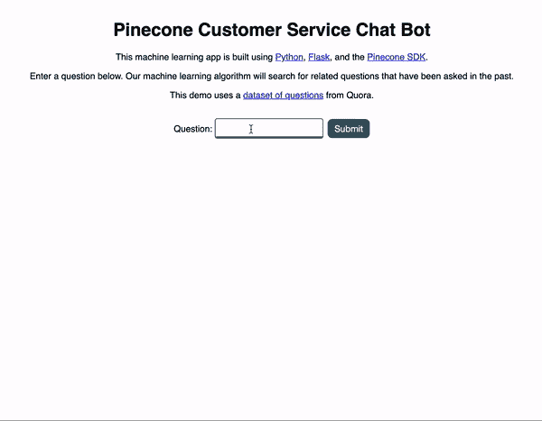
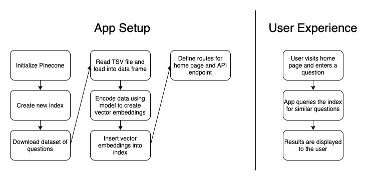

# 使用 Python、Flask 和 Pinecone 构建一个客户服务聊天机器人

> 原文：<https://betterprogramming.pub/build-a-customer-service-chatbot-using-python-flask-and-pinecone-85c151aa6b0>

## 使用 AI/ML 应用相似性搜索

在 [Unsplash](https://unsplash.com?utm_source=medium&utm_medium=referral) 上由 [kimi lee](https://unsplash.com/@kimileee?utm_source=medium&utm_medium=referral) 拍摄的照片

相似性搜索是机器学习领域的一个子集，用于查找与原始输入密切相关的项目。对于产品、音乐或电影推荐来说，它非常有用。你看了网飞电视台的*办公室*，所以这里有一些你可能喜欢的其他节目。你经常在 Spotify 上听 Bayside，所以去看看其他的流行朋克乐队吧。

相似性搜索也可用于自动化客户支持。如果当客户提问时，您可以很容易地找到以前问过的类似问题和答案来帮助他们，会怎么样？

在本文中，我们将构建一个 Python Flask 应用程序，它使用[松果](https://www.pinecone.io/)——一个托管相似性搜索服务——来完成这一任务。

# 动机和实际应用

在我们进入演示应用程序之前，让我们花一分钟来检查一下我们试图解决的问题。

假设你是一家拥有数千甚至数百万客户的大公司的高管。您的客户支持团队日复一日地被反复询问同样的问题。为了节省时间和金钱，您可以通过拥有良好的面向公众的文档和 FAQ 页面来简化您的支持流程。

但是您如何确保客户找到他们需要的信息呢？毕竟，创建文档只是成功的一半。

许多公司采用的一种方法是使用客户服务聊天机器人。当顾客第一次发起对话时，他们是在和机器人聊天。客户输入他们的问题，机器人试图帮助解决他们的问题。如果机器人能够以准确、相关的问题和答案做出响应，那么客户也许能够自己解决他们的问题。

如果这不起作用，那么客户可以要求与能够提供帮助的真人交谈。人工智能和机器学习不能解决我们所有的问题——至少现在还不能。

# 演示应用概述

现在让我们来看看我们的演示应用程序。下面你可以看到该应用程序如何工作的简短动画。用户输入一个问题并提交表单，然后出现相关的问题，希望能够回答用户最初的问题。

演示应用程序—客户服务聊天机器人

很漂亮，对吧？那么这一切是如何运作的呢？

在开发这个应用的过程中，我们首先从 Quora 上找到了一个由问题和答案组成的数据集。这个数据集包含数十万个问题，但我们只使用了前 5 万个。

然后我们把这些问题放在一个嵌入模型中，来创建所谓的向量嵌入。

一个[矢量嵌入](https://www.pinecone.io/learn/vector-embeddings/)本质上是一个数字列表，为机器学习算法提供元数据，以确定各种输入之间的相似性。

我们使用了[平均单词嵌入模型](https://nlp.stanford.edu/projects/glove/)。然后，我们将这些向量嵌入到由松果管理的索引中。

现在，当用户提交他们的问题时，会向一个 API 端点发出请求，该端点使用 Pinecone 的 SDK 来查询矢量嵌入的索引。

端点返回五个类似的问题，这些结果在应用程序的 UI 中显示给用户。

换句话说，pine cone——作为一个可管理的相似性搜索解决方案——提供了返回推荐的引擎。你只需要带来你的矢量嵌入，它是通过嵌入模型运行数据生成的。

如果你想自己尝试一下，你可以在 GitHub 上找到这个应用的代码。`README`包含如何在您自己的机器上本地运行应用程序的说明。

# 演示应用程序代码演练

现在，我们已经理解了项目背后的动机，并对应用程序的工作方式有了一个较高的概述，让我们深入实际代码，看看在引擎盖下发生了什么。

为了简单起见，所有的后端代码都在`app.py`文件中，我们在下面完整地复制了它:

让我们一个方法一个方法一行一行地分析这里发生的事情。

在第 1–11 行，我们导入了应用程序的依赖项。我们的应用依赖于以下内容:

*   `dotenv`用于从`.env`文件中读取环境变量
*   `flask`用于 web 应用程序设置
*   `json`用于使用 JSON
*   `os`也用于获取环境变量
*   `pandas`用于处理数据集
*   `pinecone`用于使用松果 SDK
*   `requests`请求 API 下载我们的数据集
*   `sentence_transformers`对于我们的嵌入模型

在第 13 行，我们提供了一些样板代码来告诉 Flask 我们的应用程序的名称。

在第 15–18 行，我们定义了一些将在应用程序中使用的常量。其中包括松果索引的名称、存储问题数据的目录、数据集的文件名以及下载数据集的 URL。

在第 20–23 行，我们的`initialize_pinecone`方法从`.env`文件中获取我们的 API 密钥，并使用它来初始化松果。

在第 25–27 行，我们的`delete_existing_pinecone_index`方法在松果实例中搜索与我们正在使用的名称相同的索引(“问答聊天机器人”)。如果找到一个现有的索引，我们就删除它。

在第 29–33 行，我们的`create_pinecone_index`方法使用我们选择的名称(“问答聊天机器人”)、“余弦”接近度度量和一个碎片创建了一个新的索引。

在第 35–41 行，如果需要的话，我们的`download_data`方法下载 Quora 问答对的数据集。如果文件已经存在于`tmp`目录中，那么我们就使用那个文件。

在第 43–50 行，我们的`read_tsv_file`方法使用`pandas`库读取 TSV 文件，并将每一行插入数据帧。我们还会删除数据集中发现的任何重复问题。

在第 52–57 行，我们的`create_and_apply_model`方法使用`sentence_transformers`库来处理平均单词嵌入模型。然后，通过使用我们的模型对每个问题进行编码，我们为每个问题创建一个向量嵌入。向量嵌入然后被插入松果索引。

到目前为止，当后端应用程序启动时，我们描述的每个方法都在第 77–82 行被调用。这项工作为我们基于用户输入实际查询松果索引的最后一步做准备。

在第 84–94 行，我们为我们的应用程序定义了两条路径:一条到主页，一条到 API 端点。主页提供了`index.html`模板文件以及 JS 和 CSS 资产，API 端点提供了查询松果索引的搜索功能。

最后，在第 59–75 行，我们的`query_pinecone`方法获取用户的输入，将其转换为矢量嵌入，然后查询松果索引来查找类似的问题。当点击`/api/search`端点时调用该方法，这在用户提交新的搜索查询时发生。

对于视觉学习者来说，这里有一个图表概述了该应用程序的工作原理:

应用架构和用户体验

# 示例场景

那么，把这些放在一起，用户体验是什么样的呢？

用户可以访问我们的网站，输入问题“如何学习 Python”，找到过去被问过的类似问题，然后点击链接查看 Quora 上的问题和答案。

按照我们的客户服务场景，用户可能会问一个关于如何使用我们公司产品的问题，找到类似的问题，单击一个链接，并被定向到一个有帮助的支持页面来回答他们的问题，所有这些都不需要与支持代表进行交互。

# 结论

我们现在已经创建了一个简单的 Python 应用程序来解决现实世界中的问题。为了让这个应用程序更好，我们可以在每次提问时在我们的索引中加入新的问题和答案。

我们还可以使用客户反馈来微调模型，以了解返回的结果是否相关。毕竟，反馈有助于模型更好地提供有用的结果。

这个故事的寓意应该很清楚:相似性搜索有助于为你的客户提供更好的结果。作为一项托管服务，Pinecone 使得基于向量的推荐系统易于生产。