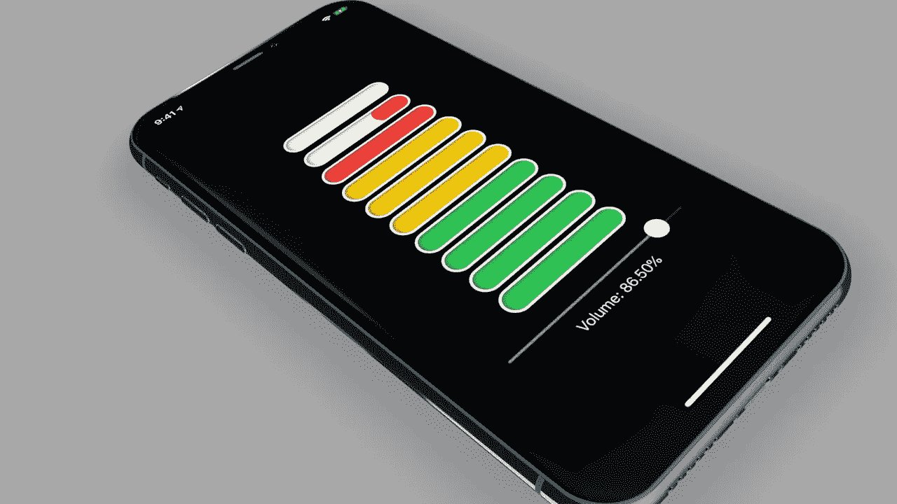
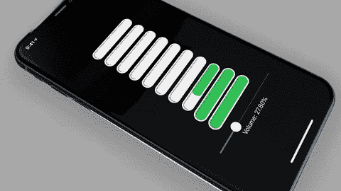
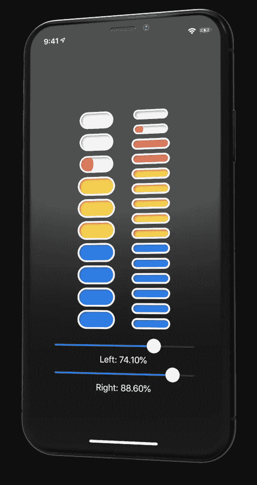

# 在 SwiftUI 中构建可定制的仪表

> 原文：<https://betterprogramming.pub/build-a-customizable-meter-in-swiftui-a44fabeb08c2>

## 为初学者体验 SwiftUI



作者照片。

SwiftUI 为开发人员提供了快速模拟和调整设计元素的能力。使用故事板、UIViews 和核心图形需要几个小时或几天的创作现在只需要几分钟。由于结果完全在代码中，它们可以高度重用。



# 设置

启动 Xcode 并选择新项目。选择单视图 iOS 应用程序。然后选择 Swift 作为语言，SwiftUI 作为用户界面。

删除`ContentView.swift`文件中的所有内容。然后将下面的实现复制并粘贴到`ContentView.swift`文件中:

在上面的代码中，我们创建了一个 LevelMeter 视图及其包含的 MeterCell 视图。LevelMeter 视图是可重用的，并且可以通过改变显示的条的数量和它所绑定的值来定制。

要么构建并运行，要么在画布中预览。通过调整滑块，您应该能够看到仪表在工作。当指示器达到峰值时，您会看到文本从顶部开始显示。您可以通过调整跟随文本的修改器(“BOOM”)中的值来轻松试验动画:

```
.animation(.interpolatingSpring(stiffness: 100.0, damping: 5.0))
```

使用 SwiftUI，可以很容易地试验小细节，并在画布中近乎实时地看到结果。这可以大大减少开发时间。

对于那些不熟悉 Swift 应用于范围的模式匹配操作符(`~=`)的人来说，`colorForLower()`函数可能会令人困惑。

`~=`操作符只是让我们知道范围是否包含传递给函数的“下限”变量。

蛇行动画是在将 MeterCell 视图添加到 LevelMeterView 中的仪表时，通过简单地更改该视图的 alignment 属性而产生的。动画从对齐的一侧开始生长。

```
 .alignment: number.isMultiple(of: 2) ? .leading : .trailing)
```

为了获得不同的效果，您可以将上面的内容更改为:

```
.alignment: .trailing
```

非常简单的变化会产生非常大的影响。可重用组件允许我们以一种几乎像复制和粘贴一样简单的方式进行大的修改。例如，我添加了第二个指示器条、一个滑块和另一个文本标签。我还把较低范围的颜色改成了蓝色。大约花了一分钟。看起来是这样的:



新面貌

# 挑战

1.  匹配上面的更改。
2.  使滑块垂直。
3.  将百分比标签和动画“BOOM”文本移动到水平仪视图中。

4.添加更多不同的颜色范围。