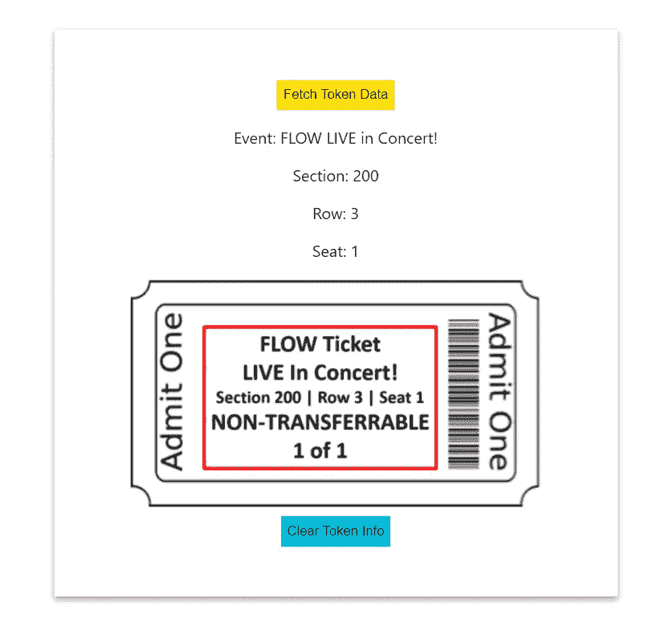

# 使用流量区块链构建去中心化的票据交换

> 原文：<https://betterprogramming.pub/build-a-decentralized-ticket-exchange-using-the-flow-blockchain-ed0eaf7745d0>

## 使用 Dapper Labs 前景广阔的新平台为 NFTs 添加实用程序


艺术家帕克的作品《立方体》([来源](https://niftygateway.com/itemdetail/primary/0xc7cc3e8c6b69dc272ccf64cbff4b7503cbf7c1c5/4))

自 2017 年 ERC-721 标准问世以来，不可替代令牌(NFT)已经从一个交易虚拟猫的实验平台发展成为一个主流采用的大规模产业。

[NBA Top Shot 已经筹集了 3.05 亿美元](https://www.nba.com/news/dapper-labs-creators-of-nba-top-shot-get-305m-in-funding)向其 80 多万用户出售代表篮球集锦的 NFT，[苏富比刚刚以 1700 万美元的价格拍卖了一件数字艺术品](https://www.sothebys.com/en/articles/17-million-realized-in-sothebys-first-nft-sale-with-digital-creator-pak)。

很明显，NFT 会一直存在，但即使作为一个加密迷，我仍然对数字艺术模型的价值定位感到困惑。

当你购买 NBA 顶级投篮收藏品时，你并不拥有该集锦的商业权利。你甚至没有独家分享的权利。事实上，这是一件价值 1700 万美元的艺术品，免费赠送。

但是让我们来谈谈你用 NFT 得到了什么:一个独特资产的可加密验证的所有权和出售或转移所述资产的智能合同定义的能力。

许多资产类型将受益于可加密验证的所有权:成绩单、证书和知识产权浮现在脑海中(想象一下用区块链取代美国专利商标局……跳过律师，以先到先得的方式提交申请)。

正是在一个朋友的建议下，我开始考虑将活动门票作为 NFT 资产类别的候选品种，这很有意义。机票市场最大的问题是什么？仅举几个例子:

*   仿冒品
*   巨额交易费(我们都知道看到标价 50 美元的门票，但不知何故在 Ticketmaster 拿到提成时花了 72.5 美元的感觉)
*   不受监管的二级市场

如果我们使用智能合约来管理我们的资产，这些问题就会消失。确定 NFT 的真实性是微不足道的。如果我们使用正确的区块链，交易费用可以大大减少。

对我来说，最令人兴奋的好处是票据发行商能够设定二级市场的条款。你可以让你的资产不可转让，确保它们只能以低于标价的价格出售，甚至在任何二次销售中给表演者提成。

在这个去中心化的系统中，每个人都有更公平、更透明的体验。所以让我们开始建造吧。

# 概观

我们必须做出的第一个决定是使用哪个区块链平台。我们可以使用以太坊，但是交易费用可能会有点高(尽管随着 ETH 2.0 的推出，这种情况会有很大的改变)。

Flow 是一个新的区块链，有一个对开发者友好的生态系统，交易费用可以忽略不计，这听起来是一个很好的起点。

事实上，Dapper Labs 的 NBA Top Shot 使用了 [Flow smart contracts](https://github.com/dapperlabs/nba-smart-contracts/tree/master/contracts) ，与我们将在这里部署的没有什么不同。

从较高的层面来看，下面是我们创建一个基本但功能性的票证“市场”所要做的事情(我们不会实现完整的购买/销售功能，但这有望成为未来演示的主题)。

1.  在 Flow smart 合同中定义我们的不可转让“不可替换票证”的条款
2.  创建虚拟账户，允许发行人和参与者与我们的 NFTs 互动
3.  使用事务安全地演示常见功能，如铸造和转让门票
4.  用 React.js 为一个简单的 web 界面构建一个准系统前端

# 设置

我使用了来自[流程文档](https://docs.onflow.org/cadence/tutorial/01-first-steps/)的教程，作为熟悉他们的智能合约编程语言、Cadence 和他们的标准 NFT 模板的一个很好的起点。如果您继续进行，您将需要[为您的操作系统安装 Flow CLI](https://docs.onflow.org/flow-cli/install/) 。

当然，我们可以将我们的合同部署到 Flow mainnet 或 testnet，但是我们将利用 [Flow emulator](https://docs.onflow.org/emulator#gatsby-focus-wrapper) 进行快速本地开发。使用以下命令启动模拟器:

```
flow emulator start
```

# 不可替换的票证智能合同

我们的不可替代票证智能合同需要定义我们的 NFT 的特征，以及铸造、存储、传输和检查它们的功能。

一些功能将被公开，如存款(即，我不需要您的明确许可就可以向您发送票证)或获取元数据，而其他功能，如提取和铸造，将被授予特权(原因显而易见)。

我还想确保我们的票是不可转让的，所以我们将应用一个条件，不允许它被存放超过一次。让我们看看我们的 Cadence 智能合同。

流文档将提供比我更清晰的解释，但在高层次上，Cadence 使用称为资源和能力的概念来定义谁可以访问什么。

例如，我们将`NFTCollection`和`NFTMinter`资源保存到部署帐户的`/storage/`路径中，这意味着它们是私有的，但是我们在`/public/`路径中发布了一个到`NFTReceiver`功能的链接。还要注意，我们的 NFT 只是由它们的整数 ID 和一个`numTransfers`计数器定义的，这个计数器将在每次存放 NFT 时进行迭代。

在这种情况下，如果有人试图第二次转让我们的机票，交易将失败。将合同保存到名为`cadence/contracts/`的目录中。

在我们部署我们的契约之前，我们需要创建我们的`flow.json`文档来指定正在部署什么，由谁部署，以及它将在哪里结束(例如在模拟器中)。要在项目目录中初始化该文件，请运行以下命令:

```
flow init
```

这也给了我们一个初始帐户和一个私钥。我们一会儿会看一下`flow.json`文件，但是首先，我们需要为我们的与会者创建第二个帐户。运行以下代码以获取公钥/私钥对:

```
flow keys generate
```

保存两个密钥，然后运行:

```
flow accounts create ATTENDEE_PUB_KEY
```

用您刚刚生成的公钥替换`ATTENDEE_PUB_KEY`。

记下地址，从 0x 开始。现在我们拥有了完成`flow.json`文件所需的一切。

注意:按照惯例，您永远不应该共享您的私钥。在这种情况下，您看到的任何键只在我的模拟器会话的特定实例上有效。

您将看到我们添加了一个指向我们的`NonFungibleTicket`合同的指针，我们的新参与者帐户，以及模拟器帐户(代表我们的票据发行者)对模拟器的合同部署。此时，我们可以部署我们的合同:

```
flow project deploy
```

如果一切顺利，您应该会看到如下输出:

```
Deploying 1 contracts for accounts: emulator-accountNonFungibleTicket -> 0xf8d6e0586b0a20c7✨  All contracts deployed successfully
```

# 铸造我们的 NFT

现在是时候真正创造我们的第一个 NFT 了。同样，我们将使用 Cadence，但我们将使用事务，而不是定义合同。交易是我们如何使用智能合约中定义的功能来对区块链进行更改。

对我来说，有趣的部分是 NFT 元数据。我创建了一个演示票，带有一些属性，如 section 和 row，以及一个链接到票图像的 URI。

这提出了一个问题，我不知道很多 NFT 的普通用户是否了解他们是如何工作的。

区块链将出色地追踪 NFT 及其相关元数据的所有者。但是，数字资产的常见做法是使用外部存储来存储它们所代表的实际内容。

作为存储图像的 S3 存储桶的所有者，没有什么能阻止我删除或更新文件！

想象一下，如果你花了 30，000 美元买了一个斯蒂芬·库里赢得比赛的三分球，而 Dapper Labs 决定用它换来亚历克斯·卡鲁索的罚球。希望像 IPFS 这样的分散存储选项能解决这类问题。

我们的票证发行帐户部署了该合同，因此，他们的私有存储中有 NFTMinter 资源。所以这个账户必须是签署这个交易的账户:

```
flow transactions ./cadence/transactions/MintTicket.cdc send --signer emulator-account
```

如果我们尝试与`attendee-account`签约，交易将会失败。接下来，让我们使用 Cadence 脚本(一个只读事务)来检查我们的发卡行帐户的余额。

使用以下命令运行脚本:

```
flow scripts execute ./cadence/scripts/CheckTicketBalance.cdc
```

您应该看到一个数组，其中包含所有拥有的 NFT 的 ID:

```
Result: [1]
```

这意味着发行者现在拥有我们新铸造的 NFT！

# 转移我们的 NFT

现在我们只需要把我们的票交到一个热切的音乐会观众手中。首先，我们将在与会者的存储中创建一个`NFTCollection`资源。

这带来了 Flow 基础设施的一个有用的方面。

在以太坊，如果你发送 ETH 到一个无效的钱包地址，它就会消失。有了 Flow，资源就不能在没有明确目的地的情况下被挂起，否则整个事务就会恢复。如果我们不小心把这张票送到一个无效的地址，我们不会丢失它。

使用以下命令运行上述事务:

```
flow transactions send .\cadence\transactions\SetupEmptyCollection.cdc --signer attendee-account
```

现在，我们的与会者已经准备好领取门票了。我们将通过 Cadence 交易来实现这一点，在该交易中，发卡行帐户从其存储中提取 NFT，并将其存入参与者的集合中。

请记住，每次存款时，它都会迭代存储在 NFT 中的`numTransfers`参数。本次交易后，`numTransfers = 1`。这份合同是这样的:

使用下面给出的命令转移票证:

```
flow transactions send ./cadence/transactions/TransferTicket.cdc --signer emulator-account
```

您可以为两个帐户再次运行`CheckTicketBalance`脚本，并验证`getIDs()`为发卡行帐户返回一个空数组，而`[1]`为我们的参与者返回一个空数组！让我们看看，如果我试图将票*转让回*给发行人(或任何其他人)，会发生什么:

```
❌ Transaction Error
execution error code 100: Execution failed:
error: panic: Ticket is non-transferrable!
  --> f8d6e0586b0a20c7.NonFungibleTicket:59:16
   |
59 |                 panic("Ticket is non-transferrable!")
   |                 ^^^^^^^^^^^^^^^^^^^^^^^^^^^^^^^^^^^^^
```

我们的智能合同正在被正确执行。我们的票不能在二级市场上转让。

# React 应用

我不打算深入讨论前端应用程序的细节(我是 JS 新手，所以代码很大程度上改编自[这篇优秀的博客](https://medium.com/pinata/how-to-display-your-nft-collection-like-nba-top-shot-with-flow-and-ipfs-6ba75048bf8a))，它利用 Flow Javascript 库与我们的契约进行交互。

我们实际上是在应用程序中运行 Cadence 事务。在这个基本示例中，我们将只检索元数据，但是任何 Cadence 代码都可以以这种方式执行。

这是它的样子:

通过以下方式在本地运行我们的应用:

```
npm run start
```

我们将被引导到简单而强大的分散式购票网页。



作者图片

完整的项目代码可在[这里](https://github.com/evandiewald/flow-ticket-transfer)获得。我希望你喜欢它。

# 参考

[流转单据](https://docs.onflow.org/cadence/tutorial/04-non-fungible-tokens/)

[如何展示你的 NFT 收藏品，如 NBA 顶级投篮和 IPFS](https://medium.com/pinata/how-to-display-your-nft-collection-like-nba-top-shot-with-flow-and-ipfs-6ba75048bf8a)