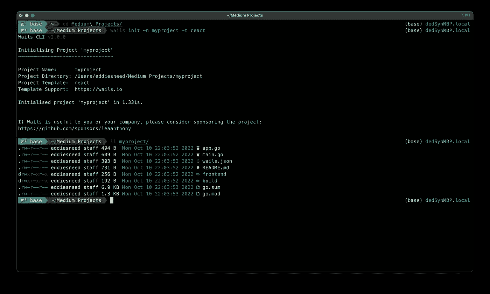
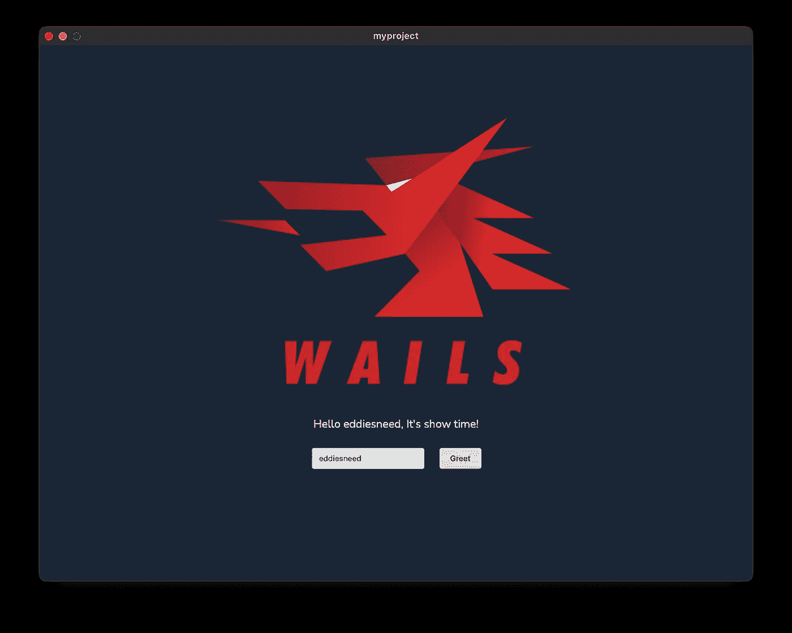
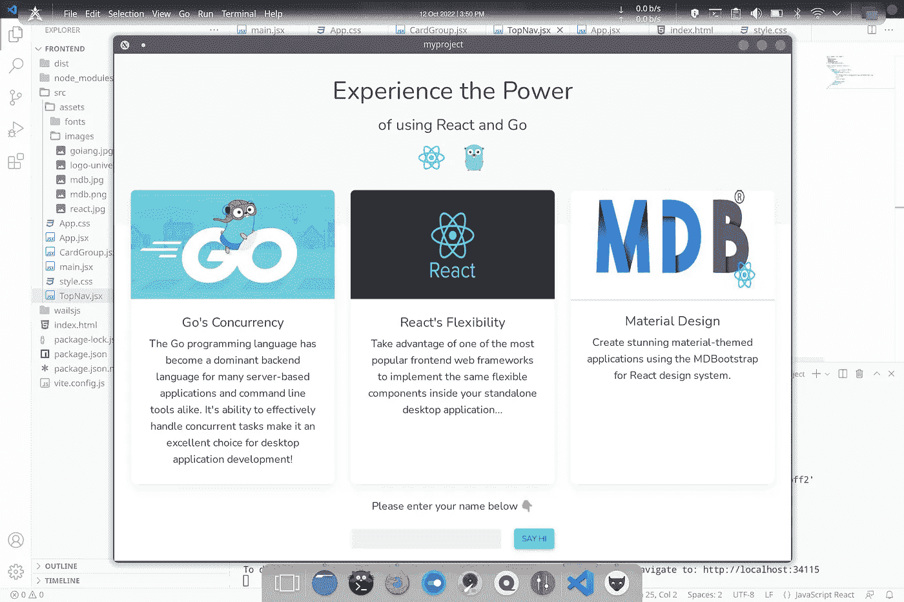

# 使用 Wails 和 React 构建一个桌面应用程序

> 原文：<https://betterprogramming.pub/build-a-desktop-app-using-react-and-go-13c425bf2dba>

## 围棋遇上网络技术


由[劳塔罗·安德烈亚尼](https://unsplash.com/@lautaroandreani?utm_source=unsplash&utm_medium=referral&utm_content=creditCopyText)在 [Unsplash](https://unsplash.com/s/photos/programming?utm_source=unsplash&utm_medium=referral&utm_content=creditCopyText) 上拍摄

我们中的许多人投入时间和精力使用 React 或另一个前端框架构建了一个优秀的 web 应用程序，通常在我们的脑海中不时会有这样的想法:“我想知道创建一个这样的桌面应用程序会有多难？”。

让我们面对现实吧，我们每天都在使用网络，对于许多开发人员来说，这是我们开始编程的方式。虽然 web 应用程序是开始构建您的技能和专业组合的绝佳方式，但有时我们希望加快步伐，进入独立应用程序的领域……甚至可能针对多种平台和设备进行打包和分发。

没有比使用您最熟悉的 web 框架从新的或现有的项目创建桌面应用程序更好的开始方式了！现在，您可以通过 Go 和 Wails 框架将这些前端与一个超级快速、易于学习、并发和静态类型的后端一起使用！

我们开始吧，好吗？首先，在着手做任何项目之前，设置好所有的依赖关系总是很重要的。幸运的是，当使用 Wails 来设置东西时，没有太多要担心的。两个关键的必需品是:

*   go 1.18+版
*   npm

如果你想象自己是一个`yarn`人(像我一样),那么继续前进，确保你也有这样的人……如果你已经完成了 web 应用程序的构建，你很可能会这样做。

如果你在 Mac 上构建应用程序，确保你已经安装了 Xcode 命令行工具，在终端上运行`xcode-select --install`。Wails 利用原生设备浏览器 API 来避免将整个浏览器捆绑到最终的二进制文件中，因此，不运行 Windows 11 的开发者*将需要确保安装 **WebView2** 运行时。*

所有这些都解决了，剩下唯一要做的就是通过运行`go install github.com/wailsapp/wails/v2/cmd/wails@latest`来安装 Wails 框架。对于那些计划在基于 Linux 的系统上进行开发的人，请确保运行`wails doctor`来检查您是否安装了正确的依赖项。

## 项目设置

一旦您准备好了，最简单的开始方式就是在您的终端(或者 Windows 版的 PowerShell)中导航到您想要创建项目的目录。根据您计划使用的框架，Wails 提供了一些不同的模板，但是对于这个例子，我们将使用 React。要创建项目结构，只需运行以下命令，并传递您希望使用的模板:

```
wails init -n myproject -t react
```

在命令运行完毕后，您会发现自己有了一个很好的新的结构化项目！



我们的新项目结构

如果你看一下我们的新项目结构，你会注意到 Wails 创建了一个单独的`frontend`目录，我们所有的 UI/框架文件都放在那里；这有助于保持整个项目的整洁，并提供所需的前端和后端代码的分离。

所有与应用程序相关的版本控制细节都保存在`wails.json`文件中，我们的后端功能代码可以在适当命名的`app.go`中找到。窗口大小的配置和其他与平台相关的设置都在`main.go`中声明，这是我们应用程序的主要入口点:

## 决定，决定

在这一点上，我们准备好了！像许多框架一样，Wails 利用 Vite 进行持续开发和快速重载。对于许多开发人员来说，这通常有它的好处，但是如果你已经有了一个既定的项目，这在技术上并不是必需的…你是否决定使用它完全取决于你。

如果你想让聚会开始，看看模板应用程序是如何工作的，打开你的终端，导航到你的项目目录的根目录，运行`wails dev`。这将捆绑和构建一个非优化的应用程序，并启动它以供您查看运行情况，并在启用热重装的情况下进行代码更改:



我们的基本模板应用

这将是一个很好的时机来指出小“问候”输入框和功能。使用 Wails 的最大特点之一是声明后端函数和从 UI 调用它们的整体简单性。在`app.go`项目文件中可以找到 Wails 在项目创建过程中提供的标准“问候”功能。这是您声明所有后端函数的地方:

您可以看到上面为`Greet`声明的函数定义。这个特殊的函数是特定于`App`结构的，但是随着项目复杂性的增加，创建额外的结构也是很好的。如果/当你决定这样做的时候，重要的是要记住，你必须在应用程序创建期间在`main.go`文件中创建该结构的一个新实例。如果您碰巧需要额外的指导，Wails 文档会对此做进一步的说明。

每次构建项目时，Wails 都会生成适当的 JavaScript 和 TypeScript 翻译，您可以在`wailsjs`目录中找到它们。正是这一点神奇，允许 up 将函数调用直接导入我们的前端代码，而不需要任何额外的第三方库导入。

在这一点上，你的选择是无限的。现在，您已经有了项目结构来扩展您认为合适的新应用程序，并且有了文档来了解 Wails 提供的更深入的特性。如果您在本文开始时的目标是将 web 应用程序迁移到桌面上，那么您基本上已经完成了！剩下的就是用你的 web 应用程序替换默认的`src`目录。根据您的其他项目的结构，您可能需要调整应用程序的入口点，并相应地更新您的`package.json`文件。

## 还有一件事…

如果我没有概述如何为您的新应用程序添加和定制 React 组件，那么这个演练将是不完整的！

为了保持简洁明了，我们将创建两个新组件用于我们的应用程序，这两个组件利用了用于 Bootstrap UI 的[材质设计。有太多的 UI 套件和框架，但是我倾向于在我的许多应用程序中使用 MDB 或](https://mdbootstrap.com/) [MUI](https://mui.com/) 。这样做的好处是为您的桌面应用程序以及您以后可能会开发的其他移动版本提供一个干净一致的外观/感觉！

下面是我们将添加到`frontend`项目文件夹的`src`目录中的两个单独的组件文件:

**注意**:上面有几个导入的图像文件，我必须把它们放在`assets`文件夹中才能使用，*它们已经不在那里了！*

我们现在要做的就是更新我们的主`App.jsx`文件，以包含我们的新组件，并将它们放在调用我们的`Greet`后端函数的输入框上方:

## 我们的新应用

随着我们的改变到位，我们可以在我们的终端上运行一个新的`wails dev`(除非你已经运行了它),看看我们的新应用程序是什么样子的:



我们新的桌面应用程序！

# 我们走吧！

你还在等什么？让那些创造性的汁液流动起来，尽情释放吧！一旦您已经准备好进行生产测试，只需在项目的根目录下运行`wails build`即可为您当前的平台创建一个优化的二进制文件。因为你有优势，构建另一个平台只需要给`build`命令传递一个额外的参数，表明你的目标的拱门和操作系统。

与往常一样，请务必查看 Wails [支持页面](https://wails.io/docs/introduction)上不断增长的文档，以获得关于其他构建参数、平台清单和一般功能的指针！

如果您对这个演示应用程序的完整结构感兴趣，可以在我的 GitHub 上查看完整的源代码:

[](https://github.com/dedSyn4ps3/wails-react-demo) [## GitHub-ded syn 4 PS 3/wails-react-demo

### 这是一个演示应用程序，利用 Wails CLI 工具生成的官方 React 模板。这是命中注定的…

github.com](https://github.com/dedSyn4ps3/wails-react-demo)