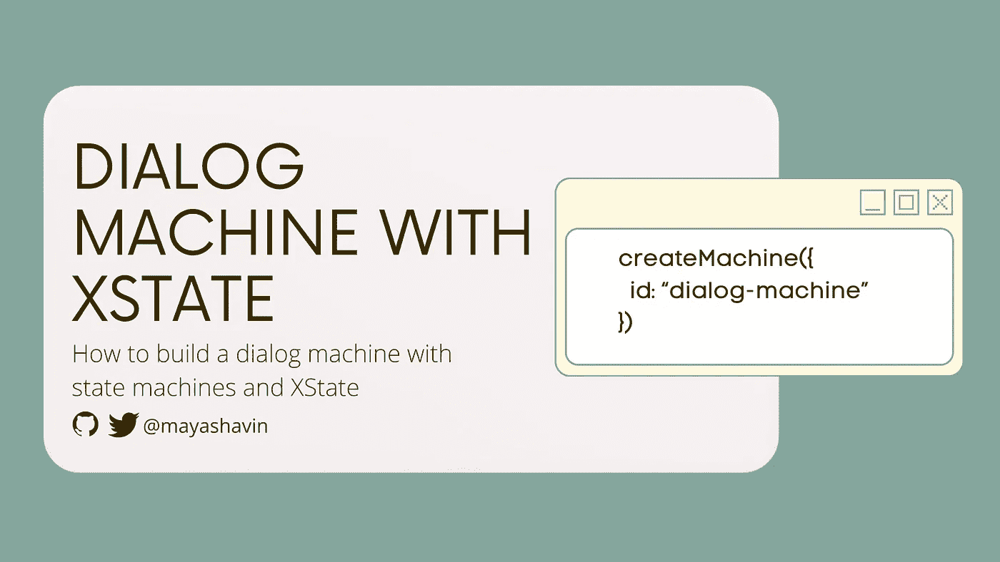
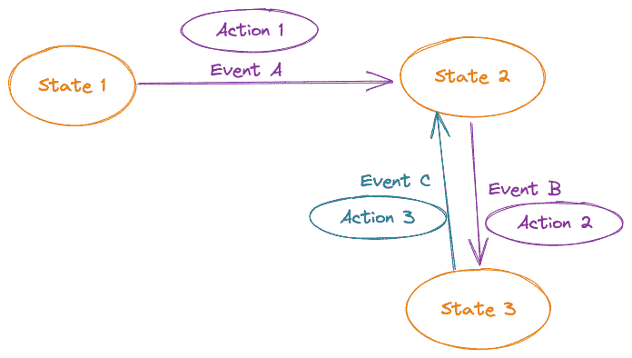
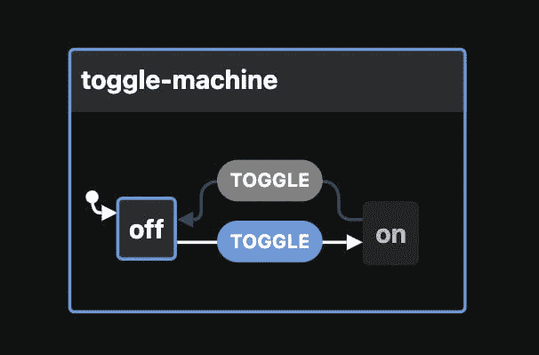
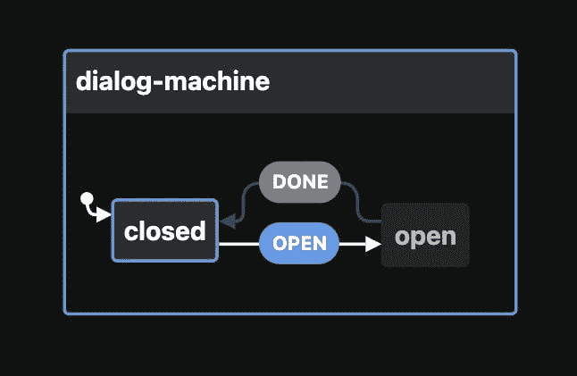
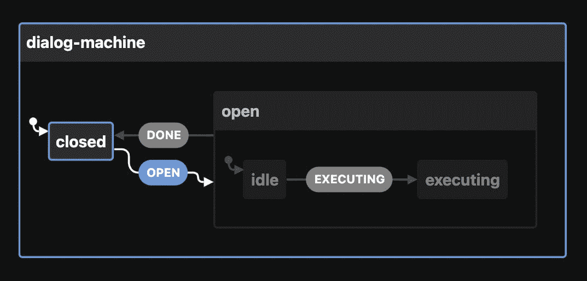
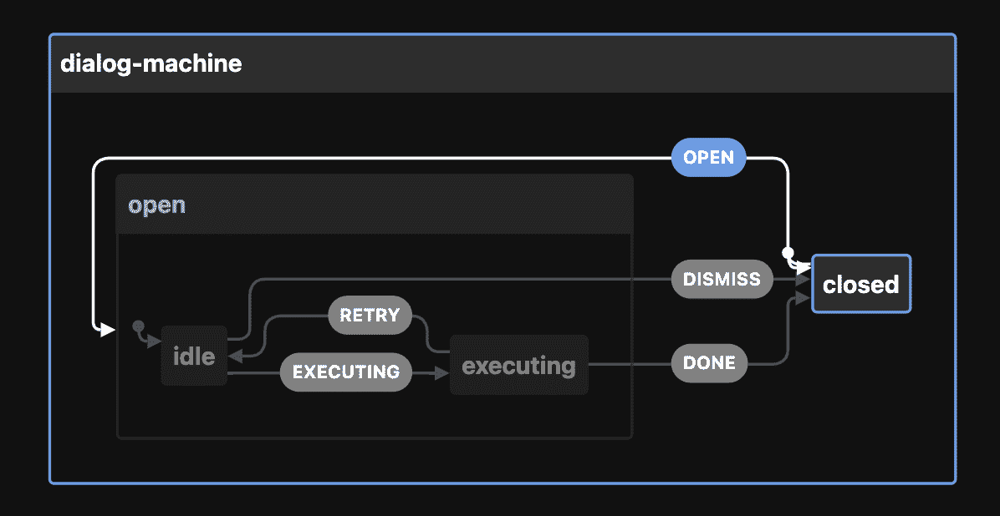
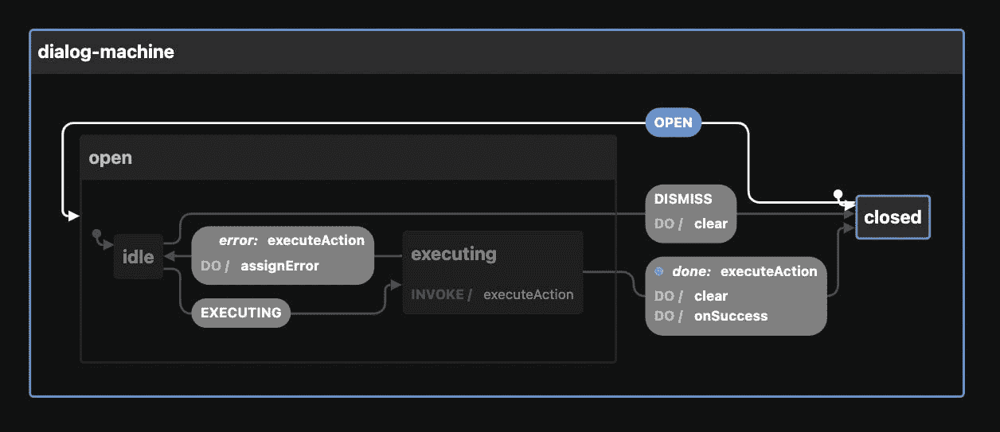
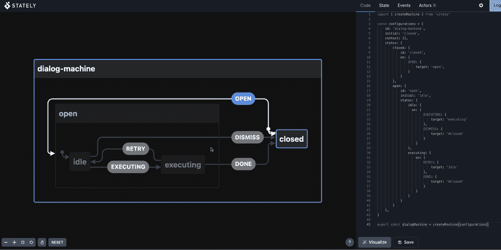
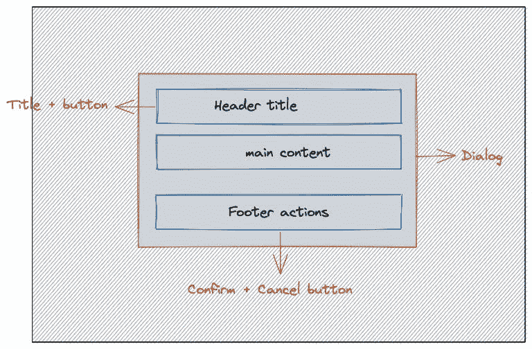
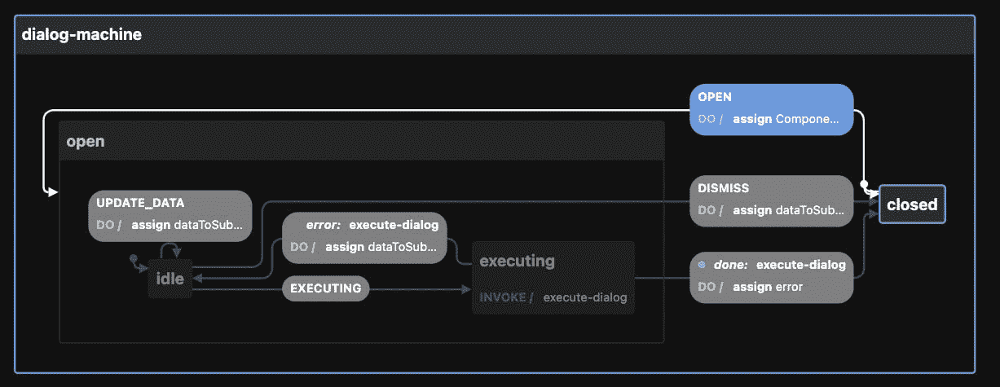

# 用 JavaScript 中的状态机和 XState 构建一个对话管理器

> 原文：<https://betterprogramming.pub/build-a-dialog-manager-with-state-machines-and-xstate-in-javascript-4002e7f03d92>

## 带有 XState 的对话管理器



*我们使用对话框通知用户可能需要他们执行额外操作或任务的特定和关键信息。大多数应用程序对话框都是动态的，我们通常负担不起将所有对话框作为占位符添加到主根元素中。因此，我们需要一个系统来管理，在运行时为单个对话框实例呈现适当的内容，并相应地触发打开/关闭和相关的动作。*

为了实现这个目标，我们使用状态机和状态图。

# 什么是状态机？

状态机或有限状态机包含有限数量的状态，代表机器在给定时间对一系列事件的反应。状态机一次只能存储一种状态，并且可以根据给定的事件输入从一种状态转移到另一种状态。

我们使用状态图来演示状态机的流程，每个节点代表一个状态，每个边代表从一个状态到另一个状态的事件转换。此外，对于每个事件边缘，我们可以在状态改变时执行动作来控制机器的内部数据上下文。



下面是一个带有两个状态节点(开/关)的切换状态机的例子，一个使用`TOGGLE`事件连接到另一个。



接下来，让我们定义我们的对话状态图流程。

# 定义对话状态图流程

对话框的本质是从用户打开它的那一刻起，直到他关闭它或完成对话框上的一个所需动作，它都是可见的和焦点的。

因此，对话机有两种主要状态:`closed`和`open`。`closed`代表用户看不到对话框，`open`则不然。我们使用`OPEN`事件从`closed`移动到`open`，使用`DONE`事件从`open`移动到`closed`，如下图所示:



注意，这个流程图只适用于简单的对话框，在这种情况下，用户除了打开/关闭对话框之外，不需要执行任何额外的操作。

在用户必须执行确认的情况下，在关闭对话框之前，对话框将触发附加的动作，通常是附加到对话框的自定义动作。

在其`open`状态中，它必须在内部从`idled`(等待用户点击确认按钮)转换到`executing`模式(在确认后触发自定义动作)。自定义动作执行完成后，进入`closed`状态。在这种情况下，我们将打开状态分为两种内部状态:`idle`和`executing`，如下图所示:



事实上，我们可以从`executing`状态转换到`idle`，反之亦然。我们通过`open`的嵌套状态`executing`从初始状态`open`过渡到`closed`。因此，我们的图表包含以下状态节点:

我们通过以下事件(边)连接每个状态节点:

*   `OPEN` -(关闭、打开、闲置)
*   `EXECUTING` -(打开.空闲，打开.执行)
*   `DISMISS` -(打开、闲置、关闭)
*   `RETRY` -(打开.执行，打开.空闲)
*   `DONE` -(打开.执行，关闭)

我们用大写字母命名每个事件，代表源状态和目的状态节点之间的流。我们现在可以展示我们的状态机图如下:



对于每个事件转换，我们希望触发一些额外的动作来控制对话框的数据上下文，例如:

*   基于输入打开对话框时初始化上下文数据。
*   解除或关闭对话时重置数据上下文。
*   对话框确认时调用自定义动作(在`executing`状态时)。
*   将错误消息分配给上下文，以显示调用确认时的错误。

我们的对话状态机图现在变成了:



我们现在可以通过把我们的对话需求分解成一个有代表性的图形来看对话机制应该是什么样子。

下一步是在 XState 库的帮助下将这个图转化成代码。

# 用 XState 构建对话机

XState 是一个使用状态机和状态图的 JavaScript 状态管理库。

但是我们不要把它与 VueX、Redux 或其他标准的状态管理库混淆。

在我看来，XState 是一个显式的 UI 状态管理库，这意味着它有助于管理不同 UI 控件之间的状态流，同时还在侧面执行数据控件。

您可以使用以下命令在项目中安装 XState:

```
npm i xstate#*OR*yarn add xstate
```

安装完成后，您可以使用来自`xstate`包的`createMachine`创建一个状态机，并将所需的机器配置作为方法的输入参数传递。

```
import { createMachine } from 'xstate'export const dialogMachine = createMachine({
  /* configurations */
})
```

XState 库接受的配置 API 有很多字段。在本文中，我们将只采用以下主要配置来设置我们的机器:

*   `id` -状态机的唯一标识符。
*   `initial` -机器所需的启动状态(入口点)。
*   `context`——机器的内部数据。我们使用这个字段来存储我们的自定义`action`处理程序和自定义对话框选项，如`title`、`dataToSubmit`等。
*   `states` -该对象包含机器所有可能状态的定义。我们用一个`[key, value]`对来表示每个状态，其中`key`是状态的名称，`value`是状态的配置对象。

下面是我们的对话机的示例结构:

让我们在`states`下设置每个状态对象。根据之前的图表，我们定义了两个主要状态- `closed`和`open`，并将初始状态定义为`closed`:

对于状态`open`，我们也将使用对象属性`states`定义其嵌套状态`idle`和`executing`，方法相同:

但是由于`open`有它的内部状态，我们需要确定它的默认状态(初始状态)。该步骤对于机器在转换到`open`状态后正确设置其状态至关重要。由于对话框是打开的，用户没有执行任何确认操作，我们将初始状态设置为`idle`。

现在，让我们给我们的状态添加一些事件。

# 在状态之间添加事件

每个状态对象都包含属性`on`，它代表事件的对象，这些事件被接受来触发从该状态到其他状态的转换。

XState 中的每个事件对象都有一个属性字段`target`，表示要转换的目标状态的`id`。对于`closed`州，`OPEN`事件的目标是`open`州。该事件允许对话从`closed`转换到`open.`

由于我们将`open`的默认内部状态设置为`idle`，从`closed`到`open`的转换将自动将状态机设置为`open.idle`状态。

我们需要创建的以下事件是用户提交(或确认)对话框时的`EXECUTING`和用户选择关闭对话框而不执行任何操作时的`DISMISS`。

注意，我们需要添加`#`来指示`DISMISS`事件的目标状态中的父级状态`closed`。没有它，XState 会将目标状态识别为`open`的内部状态之一。

类似地，对于`executing`状态，我们添加以下两个事件:

*   `RETRY`，如果执行对话框动作时出现错误，将机器状态移回`idle`状态
*   `DONE`当动作执行成功完成时关闭对话框。

到目前为止，一切顺利吗？我们刚刚为我们的机器设置了基本配置。完整的工作代码如下:

为了可视化我们的状态机并验证流程，XState 团队(或庄严团队)开发了一个很棒的[可视化工具](https://stately.ai/viz)。该工具允许您对您的状态机进行实时编码，进行可视化调试，并查看转换流是如何工作的。

下面是我们如何用这个工具测试我们新创建的`dialog-machine`机器的流程。



此工具允许您使用右侧窗格中的“状态”选项卡和“事件”选项卡，查看当前状态及其在您从一种状态切换到另一种状态时触发的事件。这个可视化器被证明在可视化状态机流和在早期验证我们的机器逻辑方面非常有用。

接下来，我们需要添加动作来控制每个事件转换的机器数据上下文。

# 添加事件的动作

正如在开始时所讨论的，我们希望为我们的对话机器执行以下数据控制动作:

*   基于输入打开对话框时初始化上下文数据。
*   解除或关闭对话时重置数据上下文。
*   对话框确认时调用自定义动作(在`executing`状态)。
*   将错误消息分配给上下文，以便在调用确认时出现错误时显示。

让我们研究每个行动要求。

打开时，我们的对话框组件应该在其模板中动态显示内容，除了标题头和页脚操作，如下图所示:



它还包括每当用户确认对话框时绑定到正确的外部动作执行。因此，对话机器应该接收并保存其上下文中的一些基本数据，例如:

*   一个组件`instance`来呈现对话框中的内容。如果没有可用的组件，对话框将呈现默认的“对话框机器”文本。
*   `Title` 的对话
*   对话框按钮`labels` (确认/提交，取消)
*   `Executor` 用于在用户确认对话框时触发。
*   如果需要，外部`data` 将传递给执行者。
*   `Error` 如果需要，在对话框中显示。

我们将这个数据对象作为它的`context`保存在状态机中。为了更新状态机的上下文，我们使用来自`xstate`包的`assign` API 方法和状态事件的属性字段`actions`。

`assign`接收一个对象，该对象定义了机器应该如何更新当前`context`的每个字段。每个字段都是一个函数，它接受以下两个参数，并返回适当的值以分配给该上下文字段:

*   当前`context`
*   电流`event`触发

对于我们的`OPEN`事件，我们基于用`event`对象传递的`data`更新上下文，如下所示:

接下来，正如我们之前在状态机流中定义的，我们希望每当用户关闭对话框时(通过`DISMISS`或`DONE`)清除所有保存的数据上下文。

由于我们对两个事件执行相同的操作，我们可以创建一个通用操作`clear`，如下所示:

```
const clear = assign({
   dataToSubmit: (_, event) => undefined,
   error: (_, event) => '',
   Component: (_, event) => undefined,
   executor: (_, event) => undefined,
})
```

然后将它作为数组的一部分传递给两个事件的`actions`字段，如下所示:

由于它指示了`RETRY`事件的错误，我们希望在返回到`idle`状态时更新`context.error`字段。我们继续使用`assign`来相应地设置我们的`context.error`:

此外，我们想要更新`dataToSubmit`而不在状态之间转换。在我们想要触发一个定制动作的场景中，比如对话框内容组件的表单提交，这个更新是必不可少的。为了实现这个目标，我们为`idle`状态创建一个新的事件`UPDATE_DATA`，只需一个动作，如下所示:

我们已经完成了设置打开和关闭对话框所需的动作，在需要时分配错误，以及更新保存的数据以传递给自定义动作。

现在我们来看看我们的`executing`状态，在这里我们必须调用我们的自定义`executor`。

# 对状态调用服务操作

在 XState 中，我们使用`actions`来执行上下文更新。我们还可以用它来调用一个自定义操作。然而，如果定制动作是异步的，并且需要根据动作执行状态转换到不同的状态，我们必须创建一个专用的状态来处理这个问题。在我们的对话机中，`executing`就是这样一种状态。

XState 为状态的配置对象提供了一个`invoke`属性对象字段，以调用状态中的附加逻辑。一旦对话框处于`executing`状态，需要立即用`dataToSubmit`触发自定义`executor`。在执行状态下，它会将机器重定向回`idle`状态(如果错误)或`closed`(如果执行成功)。

下面是我们用于对话机的`invoke`字段的结构示例:

```
invoke: {
  src: 'executeAction', //the source for the invoking service, can be a string or function
  id: 'execute-dialog', //required identifier for the invoke logic source
  onDone: {}, //transition event object when service action's returned promise resolves
  onError: {} //transition event object when action returned promise rejects
},
```

`src`是我们定义调用逻辑的地方。它可以是一个字符串，表示在创建过程中传递给机器的服务动作的名称，也可以是一个函数方法，它接收`context`和`event`作为其参数并返回一个`Promise`。

让我们定义`executeAction`如下:

```
const executeAction = async (context, event) => { const { dataToSubmit } = context; return context.executor?.(dataToSubmit);}
```

然后将其绑定到`src`字段:

```
invoke: {
  src: executeAction, 
  id: 'execute-dialog', 
  onDone: {}, //transition event object when service action's returned promise resolves
  onError: {} //transition event object when action returned promise rejects
},
```

使用`invoke`的一个显著好处是，它自动为异步函数提供到`onDone`和`onError`的绑定。一旦函数解析，机器将触发`onDone`转换。否则，它相应地启动`onError`。

之前，我们为`executing`状态定义了`DONE`和`RETRY`事件。使用`invoke`，我们可以将`DONE`内的内容分别移动到`onDone`内，从`RETRY`移动到`onError`内，并完全删除`on`字段。`executing`状态的代码现在变为:

下面是我们的对话机的完整工作代码:

# 用 createMachine 的第二个输入参数创建一个可扩展的机器

至此，我们的对话机已经可以使用了。然而，由于某些动作如`clear`和`executeAction`是本地定义的，如果不直接对原机器进行更改，我们将无法扩展机器并定制这些动作以备将来使用。

幸运的是，`createMachine`接受第二个参数，这是一个包含额外选项的对象，如在机器中使用的标准`services`(用于调用服务)、`guards`和`actions`(用于事件数据操作)。

让我们将`clear`和`executeAction`移动到这个对象中它们各自的位置，如下图所示:

在我们的机器状态中，我们可以通过传递名称`clear`和`executeAction`来替换直接函数绑定，XState 将处理其余的绑定:

就是这样。下面是最终的工作代码:

如果您使用的是 TypeScript，下面是对话机上下文的数据接口示例:

```
export interface DialogMachineContext {
  Component?: Component | string;
  executor?: (data?: any) => Promise<any>;
  title?: string;
  confirmBtn?: string;
  cancelBtn?: string;
  dataToSubmit?: any;
  error?: string;
}
```

可视化工具生成的整个对话图如下:



我们的对话机现在是完整的和可扩展的。我们可以继续在对话框管理器组件中使用它，或者在 React 中使用`@xstate/react`，或者在 Vue 中使用`@xstate/vue`钩子。

# 资源

*   [x state 的 API 文档在此处](https://xstate.js.org/docs)
*   【XState 的优秀教程
*   [使用 XState 和 Vue 的 Vurian 组件库项目](https://github.com/mayashavin/vurian-wizard)
*   [状态机可视化工具](https://stately.ai/viz)

# 摘要

使用状态机既有趣又具有挑战性。这需要一点学习曲线，并且在你通常处理一个新特性/组件的方式上有很大的改变。

要构建一个合适的状态机，您必须提前定义和计划您的组件/特性流，将其模块化，然后编码。我发现它非常有助于组织我的代码和创建一个状态系统来管理我的 UI 组件，比如对话框。

现在我们知道了如何用 XState 创建一个对话框管理器，让我们在 Vue 或 React 中创建一个可重用的通用对话框组件，以及`dialog`元素，好吗？

*最初发表于*[*https://mayashavin.com*](https://mayashavin.com/articles/state-management-dialog)*。*

```
**Want to Connect?**If you’d like to catch up with me sometimes, follow me on [Twitter](https://twitter.com/MayaShavin).
```