# 用 AWS Lambda + API 网关构建一个 Discord Bot

> 原文：<https://betterprogramming.pub/build-a-discord-bot-with-aws-lambda-api-gateway-cc1cff750292>

## 赶上无服务器时代


亚历山大·科瓦奇在 [Unsplash](https://unsplash.com?utm_source=medium&utm_medium=referral) 上拍摄的照片

# 介绍

最近，Discord 引入了**交互**和**斜线命令**来缓解用户对机器人的体验。部分原因是为了保护用户的隐私——机器人现在稍微被迫放弃在不和谐服务器中读取消息的标志——这是以前关于机器人开发者非法数据处理的一个关注点。

这些是最广为人知的特性，但是除此之外，更新还增加了通过交互端点 URL 与提到的交互进行交互的可能性。

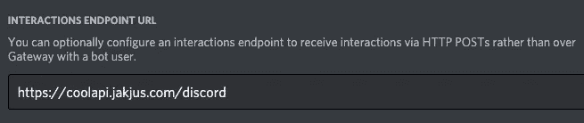

开发人员仪表板的交互端点 URL 字段。

这使得我们可以从服务器上托管的传统**监听器**应用程序转移到**无服务器**应用程序** plateau **，在每次交互调用时运行 Lambda 函数。

# 将 AWS Lambda 连接到 Discord

在编码过程中，我们会在“AWS”、“Code”和“Discord Developer Portal”之间跳转。

## 自动警报系统

我们将使用 AWS API 网关和 AWS Lambda 来完成我们的任务。它是 AWS 上无服务器架构的基础工具集。函数将在 Node.js 中编写。

1.  在[https://aws.amazon.com](https://aws.amazon.com)创建账户并登录
2.  使用顶部导航栏转到 API Lambda 服务
3.  选取边栏中的“功能”部分(如果尚未选取)
4.  点击“创建功能”


AWS Lambda 主页。

如果你足够勇敢，插上信用卡马上点击它——你可能以前用过 AWS 或 AWS Lambda。

如果你犹豫不决，现在是让你冷静下来的时候了:AWS Lambda 免费层包括每月 100 万个免费请求和每月 400，000 GB 秒的计算时间。远远超过你在本教程中所需要的，或许以后也是如此(尽管我希望你能超越极限！).

5.选择您的函数名，选择 Node.js 14.x 并单击“创建函数”

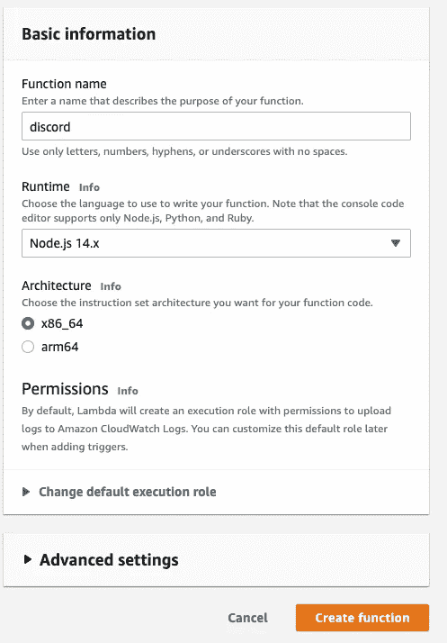

创建功能面板。

创建后，您应该会看到下面的仪表板。

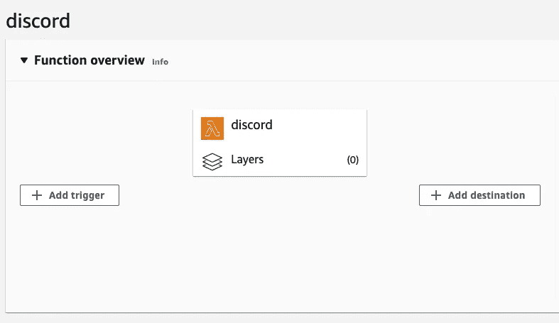

初始 Lambda 仪表板。是的，我们会像那样点击。现在不是实施 IaC 的时候。

太好了！我们有一个带有样板代码的 lambda。现在添加一个 API 触发器——我们需要一些 URI 传递给 Discord 门户，对吗？

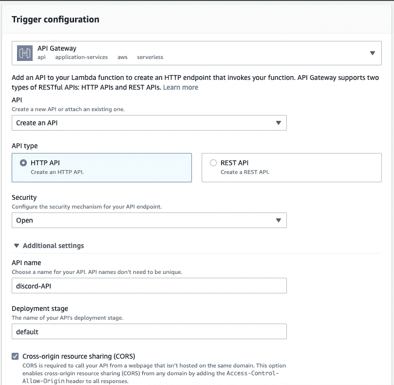

触发配置。

让 CORS 允许不和的主机来源。在未来的某一天，你可能希望改变 API 端点和 CORS 允许的域的开放性，这样你就不会收到僵尸垃圾邮件(虽然这在 AWS 资源中并不常见)。

结果是:

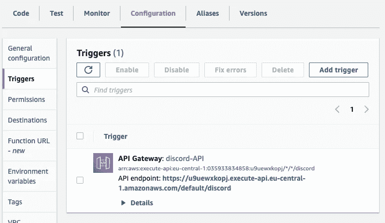

触发器已创建。

点击 API 端点的 URL:您应该看到“Hello from Lambda！”

## 密码

创建项目目录`serverless_discord/`。在里面，创建一个子目录`lambda_bot/`和`index.js`。使用以下代码:

在上面的代码中，我们遵循你已经可以在 AWS Lambda 样板代码中看到的结构(`exports.handler`函数)。

接下来，我们满足由[文档](https://discord.com/developers/docs/interactions/receiving-and-responding#receiving-an-interaction)中的 Discord 设置的端点需求(有效负载验证和 ping 应答)。验证是用`tweetnacl`包完成的，那个我们还没有。我们来装吧！

最好的情况是如果你的`node --version`接近 Lambda 运行时的版本(我们选择了`14.x`)——理想情况下，如果它是相同的。如果它和`npm`相隔太远，打包的模块可能无法在 Lambda 中工作。

```
npm i tweetnacl
```

很好。现在，让我们(用`node_modules`)把所有这些都关掉吧！)并放回我们的 Lambda 中。在您的目录中，键入:

```
zip -r ../lambda_bot.zip *
```

## 自动警报系统

上传 Lambda dashboard 中的 zip 文件——“代码”部分。

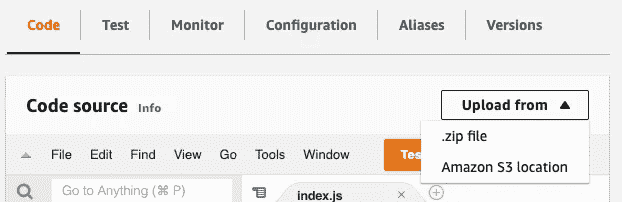

Lambda 仪表盘。

**或**通过 CLI，如果您安装并配置了 AWS CLI:

```
aws lambda update-function-code \
    --function-name discord \
    --zip-file fileb://../lambda_bot.zip
```

一切看起来都很棒。快速创建不和谐的应用程序，三，二，一，开始！

## Discord 开发者门户

转到 [Discord 开发者门户](https://discord.com/developers/applications)，选择新应用并选择一个名称。将以前创建的 API 端点复制到下面 bot 配置中的交互端点 URL 字段。

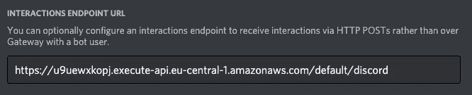

我真正的 AWS API 网关 URL。

然后点击保存！

Saving 对它们的需求执行不一致端检查——它们向您的端点发送一组 POST 请求。

滚动到页面顶部的通知，你有它！巨大的绿色成功栏-您的机器人是活的！你成功了！

啊？什么？你弄错了吗？嗯，错误信息是什么？

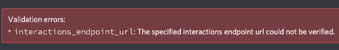

你给我发了这个没用的截图。

当我只知道“某些东西”是错误的时候，我如何修复端点？我们最多可以假设，他们的两个要求中有一个没有满足。

## 自动警报系统

要从 AWS 端调试它，您可以制作一些测试片段，并针对您的代码运行它们。不幸的是，不容易从 Discord 中找到一个确切的调用示例来模拟这一点。

您也可以通过在自己的计算机上运行代码来快速调试它(只需从处理函数中剥离`index.js`中的代码)，但是您需要外部域重定向到您的本地 ip，这有其自身的风险。

让我们添加控制台日志来了解一下，请求是否到来，以及我们是否正确地解释了它。

在`index.js`的第一行添加日志记录

```
const nacl = require('tweetnacl');exports.handler = async (event) => {
  console.log(event)
  // Checking signature (requirement 1.)
  ...
```

并单击“部署”。

在 Discord 开发者门户中，“保存”Discord 应用程序设置(提醒一下，它将重新运行 Discord 的 POST 请求到我们的 Lambda)。随着事件(希望)被记录，在 CloudWatch 中检查它。


Lambda 仪表盘—导航至 CloudWatch。

我发现了这条错误消息:

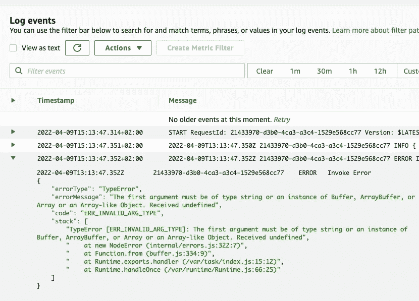

错误消息。

*(事件本身被记录在一个更高的字段中，这可能有所帮助)*

错误指向`index.js`中的第 15 行，该行指出:

```
Buffer.from(PUBLIC_KEY, 'hex')
```

理所当然的。我们没有传递`PUBLIC_KEY`环境变量，该变量事先被赋给了变量`PUBLIC_KEY`。

```
const PUBLIC_KEY = process.env.PUBLIC_KEY;
```

从 [Discord Developer Portal](https://discord.com/developers/applications) 获取应用的公钥，并插入 AWS Lambda:配置→环境变量→编辑… →添加… *(不要对环境变量使用引号)*

```
Key: PUBLIC_KEY, Value: 55ff1c234...
```

立即运行“保存更改”!

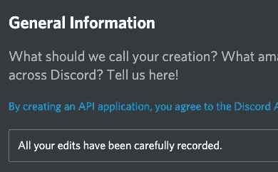

你所有的编辑都被仔细记录了下来。

# 注册和创建斜杠命令

在`index.js`的末尾，为一个命令添加处理程序，这样我们很快就会注册。

我想要一个回复“bar”的斜杠命令`/foo`(好吧，不要太令人瞠目结舌)。

将更新后的代码复制粘贴到 AWS Lambda 代码编辑器或者压缩后像上次一样上传。单击“部署”。

## 正在注册/foo 命令

在`serverless_discord/`中创建第二个子目录，名为`register_commands/`，并导航到其中。

```
**➜  serverless_discord** mkdir register_commands && cd register_commands
```

用以下内容创建一个新文件`register.js`:

要添加缺少的模块，请运行:

```
npm i axios dotenv
```

但是，为什么我们现在有两个不同的包(文件夹)？

实际上，这个不会在 AWS Lambda 上，也不需要在任何遥远的地方。理想情况下，注册命令应该在 CI/CD 管道期间发生，此时命令会发生变化。如果没有 CI/CD，在开发新的东西之后，完全可以在本地 PC 上手动运行脚本。

创建`.env`文件并将值更改为您的值:

对于`GUILD_ID`，进入[不和谐 App](https://discord.com/channels/@me) ，创建不和谐公会(俗称不和谐服务器)。在您的用户设置→高级→开发者模式中打开。回到主界面，右键点击你的公会，然后点击复制 ID。

然后，进入 [Discord 开发者门户](https://discord.com/developers/applications)，选择你的 app → Bot →添加 Bot →重置令牌→复制——就是你的`BOT_TOKEN`。

在一般信息部分找到`APP_ID`。

转到 OAuth2 部分→ URL 生成器。选择范围:`bot`，`application.commands`。Bot 权限:`Use Slash Commands`。

复制下面生成的 URL 并访问它——选择您刚刚创建的公会。

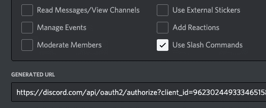

生成的 URL。

你说得对，我们把范围限制在一个公会(你的)。斜线命令不会出现在你邀请机器人加入的其他公会中。当创建具有公会范围的 Slash 命令时，它会立即应用更改——这就是为什么它总是在开发过程中使用，直到 bot 非常就绪。创建或更改全局命令将在 0-60 分钟内为每个公会推出。

稍后将范围更改为 Global，使用[官方文档](https://discord.com/developers/docs/interactions/application-commands#making-a-global-command)大约需要 5 分钟。

说够了，让我们部署命令吧！

```
**➜  register_commands** node register.js**➜  register_commands**
```

没有错误就意味着成功！快速进入你的不和谐公会聊天室，开始输入`/foo`并按回车键。

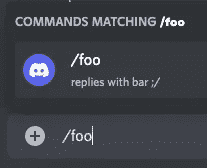

鼓声…

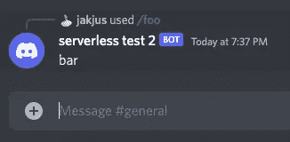

吧！

恭喜你！[🏆](https://emojipedia.org/trophy/)

你的无服务器机器人正在 u̶p̶ ̶a̶n̶d̶ ̶r̶u̶n̶n̶i̶n̶g̶等待事件:)

# 摘要

## 优势:

1.  低成本
2.  易于实施
3.  非常好的可扩展性—不需要分片(只有线性成本增加！)

## 缺点:

1.  锁定到 AWS(供应商锁定)(此特定解决方案)
2.  可能比“服务器”选项更需要 CI/CD 实施—否则，改变 AWS 资源可能会很繁琐
3.  这种体系结构需要在客户端和服务器端正确地记录日志和调试消息，才能有效。

## 在本文中，您已经了解到:

1.  AWS 上的基本无服务器工具包
2.  不和谐机器人编程的现状
3.  AWS Lambda 面临的挑战—开发、部署、调试
4.  使用`nacl`验证有效载荷，并使用`axios`发出请求

## 其他来源:

*   代码与完整的解决方案可在我的回购:[https://github.com/jakjus/discord-aws-lambda-article](https://github.com/jakjus/discord-aws-lambda-article)
*   另一口井制作了关于该主题的教程，但差别不大(即使用 Python 更为详尽):[https://oo zio . medium . com/server less-discord-bot-55f 95 f 26 f 743](https://oozio.medium.com/serverless-discord-bot-55f95f26f743)
*   Discord 开发者文档[https://discord . com/developers/Docs/interactions/application-commands](https://discord.com/developers/docs/interactions/application-commands)(另请查看“接收和响应”部分)
*   宇宙 X 是我的不和谐银河 RPG 机器人！https://cosmosx.fun/

在我的下一篇文章中爬得更高:

[](/aws-sam-setting-local-serverless-development-with-lambda-and-dynamodb-5b4c7375f813) [## AWS SAM-使用 Lambda 和 DynamoDB 设置本地无服务器开发

### AWS SAM 及其流程概述

better 编程. pub](/aws-sam-setting-local-serverless-development-with-lambda-and-dynamodb-5b4c7375f813) 

正如你新制作的函数所说，是时候在*酒吧*庆祝了！

*(现在文章介绍图片感觉没那么古怪了吧？)*