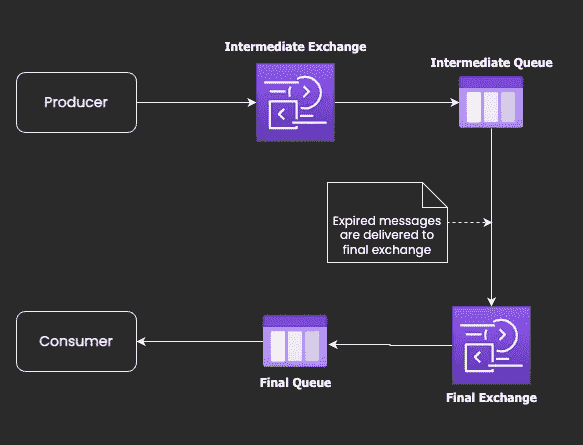
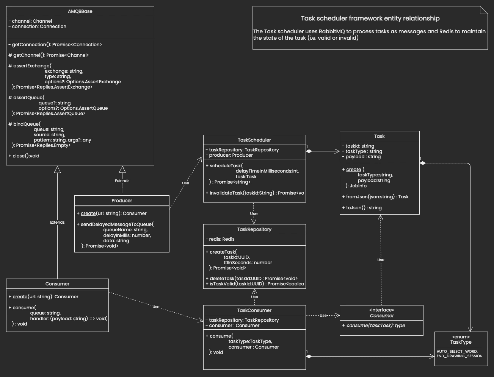

# 使用 RabbitMQ 和 Redis 构建分布式任务调度器

> 原文：<https://betterprogramming.pub/build-a-distributed-task-scheduler-using-rabbitmq-and-redis-8ee1310cfc8>

## 使用 RabbitMQ deadLetterExchange 延迟任务执行


调度程序

您对使用 RabbitMQ 构建任务调度器感兴趣吗？

您可能想知道为什么要使用 RabbitMQ 构建任务调度程序，因为它是一个消息代理，没有理由充当调度程序。

嗯，一年前，我在做一个业余爱好项目，我想使用 RabbitMQ，我碰巧有一个在一定时间后执行一段代码的要求。我们可以称之为。

这就是我好奇的地方，想知道是否有可能延迟消息的执行。换句话说，假设一条消息在`x`时间被发送到一个队列，我想在`x+y`时间使用它，这里`y`是可以为每条消息/任务配置的。

我能够使用`deadLetterExchange`来实现这一点。这是 RabbitMQ 的一个特性。通过使用这个 RabbitMQ 特性作为核心逻辑，我能够指定消费者在消费任务或消息之前应该经过多长时间。
但它还不是一个任务调度器，它只是一个延迟的任务执行。一个任务调度器应该能够`schedule`和`cancel`任务。这就是 Redis 发挥作用的地方，让它成为一个任务调度器。

希望以上内容有助于在此设定脉络。让我们开始吧。

# 先决条件

作为这篇文章的一部分，我们不打算讨论 RabbitMQ 和 Redis 的介绍。假设您至少对 RabbitMQ 和 Redis 有基本的了解。这里讨论的示例项目是在 NodeJS 上编写的。了解 NodeJS 会有所帮助，但这不是必需的。

# 如何实现延迟任务执行

一旦消息可用，RabbitMQ 就会将它们转发到相应的队列。我们无法直接告诉 RabbitMQ 将消息保存在某个地方，并在`y`时间后将其发送到预期队列。
让我们看看如何通过使用`deadLetterExchange`来实现这一点。

## 死信交流

当发生以下任何事件时，队列中的消息可以被`dead-lettered`(即，重新发布到交换):

*   消费者否定了该消息。
*   ***由于每条消息的 TTL，消息过期。***
*   消息被丢弃，因为其队列超过了长度限制。

我们将使用第二个选项(即每个消息的 TTL)来触发`deadLetterExchange`。我们来详细看看。

> TTL 代表时间 **T** o **L** ive

让我们**为我们的每条消息**设置一个 `**TTL**` **，并将它们发送到一个队列中。姑且称之为`intermediate queue`。当声明一个`intermediate queue`时，我们设置一个选项，当这个队列中的消息过期时，它们应该被传递到另一个指定的交换。姑且称之为`final exchange`。**

**消息** `**TTL**`时间**就是我们要拖延的时间**。`final exchange`是我们的消费者消费来自指定队列的消息的地方。

因此，一旦消息`TTL`过期，我们的消费者就会收到消息。

现在的问题是，我们如何让消息过期？很简单。我们正在向`intermediate queue`发送消息。我们不允许任何人从这里消费它。如果这个`intermediate queue`中的消息直到指定的`TTL`才被使用，那么它们就是`dead-lettered`，消息将被传递给我们的消费者，他正在愉快地使用来自`final exchange`队列的消息。

通过将这个`TTL`设置为我们需要的延迟，并将消息发送到没有消费者的`intermediate queue`，我们可以在 RabbitMQ 上实现一个`delayed task execution`。

下面是使用`dead letter exchange`在 RabbitMQ 上实现`delayed task execution`的 UML 图。



RabbitMQ 使用死信交换延迟任务执行

但是延迟任务执行不是任务调度器，对吧。让我们看看如何构建一个任务调度器，它将提供使用 RabbitMQ 和 Redis 来调度和取消任务的选项。

# 任务调度程序

## Redis 的作用

Redis 用于跟踪计划任务的有效性。利用这一点，我们可以根据需要将任何调度的任务设置为无效，并且当该执行任务时，我们可以检查该任务是否可以执行。

因为我们将使用 Redis 只存储任务有效性信息，所以它可以用任何数据存储工具来代替。

## 体系结构



任务调度程序体系结构

我们用来构建这个任务调度器的列表实体如下。

*   [任务](https://github.com/sridhar-sp/task-scheduler/blob/main/src/task/task.ts) →任务定义。
*   [生产者](https://github.com/sridhar-sp/task-scheduler/blob/main/src/rabbitmq/producer.ts) →基类提供发送延迟消息的选项。
*   [消费者](https://github.com/sridhar-sp/task-scheduler/blob/main/src/rabbitmq/consumer.ts) →从最终队列中消费消息的基类。
*   [任务仓库](https://github.com/sridhar-sp/task-scheduler/blob/main/src/task/repository/taskRepositoryImpl.ts) →仓库类检查任务有效性状态。
*   [任务调度器](https://github.com/sridhar-sp/task-scheduler/blob/main/src/task/scheduler/taskSchedulerImpl.ts) →类提供了调度和无效任务的选项。
*   [任务消耗者](https://github.com/sridhar-sp/task-scheduler/blob/main/src/task/consumer/taskConsumerImpl.ts) →从指定的`task type`队列中消耗任务的类。

## 工作

```
class Task {
  public taskId: string;
  public taskType: string; // queue name
  public ttlInSeconds: number;
  public payload: string;
}
```

*   `taskId` →标识该任务的唯一 id。
*   `taskType` →该任务的类型。这用作队列名称，因此生产者和消费者都可以从任务类型中推断出名称。
*   `ttlInSeconds` →我们希望任务执行的时间延迟。
*   `payload` →描述任务的 JSON 字符串；根据不同的任务类型，`taskType`将很方便地解析这个 json。

`taskType`起着重要的作用。它充当一个队列名，因此当任务调度器想要调度一个任务时，它可以使用`taskType`作为队列名，任何想要使用特定任务类型的人都可以从该队列中使用它。

> 以下是 taskType `send-sms, send-offer-notification, send-greetings`等的一些例子

## 生产者

Producer.ts

正如我们之前讨论的，我们需要两个队列来实现这个`delayed task execution.`

1.  中间队列→持有任务直到到期；post 到期将任务转发给`final exchange`。
2.  最终队列→这与`final exchange`相关。我们的任务消费者将监听这个队列。

队列及其相关的交换名称都是从`taskType`开始形成的，以便在调度程序和消费者之间引入某种契约。

从上面的代码中，我们可以看到中间队列作为`dead letter exchange`与最终交换相关联。

```
this.assertQueue(
    INTERMEDIATE_QUEUE, { deadLetterExchange: FINAL_EXCHANGE }
)
```

一旦任务到期时间过去，任务将被转发给`final exchange`，而`final exchange`将任务路由给`final queue`。

```
sendToQueue(INTERMEDIATE_QUEUE, Buffer.from(data), {
    expiration: delayInMills,
});
```

## 消费者

消费者将消费特定队列中的消息(即`taskType`)。

## 任务储存库

这提供了创建、删除和验证任务的选项。

## 任务调度程序

`Task Scheduler`在调度任务时会在 Redis 中创建一个任务条目。
当我们不再希望任务被执行时，可以删除该任务，将其标记为无效。`scheduleTask`返回一个`taskId`。如果需要，同样可以用来使任务无效。

## 任务消费者

`Task Consumer` 将监听特定的`taskType`并在任务仍然有效时执行它。即使我们通过删除任务使其无效。消费者将在预定的时间消费它。在使用来自`Task Repository`的`isTaskValid`功能执行任务之前，检查任务有效性将是`Task Consumer`的责任。

# 演示

演示包括两个消费者和两个生产者。
将消费者 1 和 2 视为电子邮件服务，每个微服务负责向客户发送`greetings`和`offer notification`。
`greeting`和`offer-notification`是两种不同的`task types`，分别由`Greeter-Service`和`Offer-Notification-Service`生产商生产。

演示显示`Email-Service-1`(即消费者 1)将处理`greet`和`offer-notification`任务，而 as `Email-Service-2`(即消费者 2)将仅处理`offer-notification`任务。

为了简洁起见，任务失效没有在演示中显示，而是在项目的 Readme 文件中进行了解释。

我尽力动画化并突出显示日志消息，以表明`scheduler`和`consumer`之间的事件流。日志消息包含一个时间戳，可用于断言使用者是否在预期的计划时间收到任务通知。每当`consumer`接收到`task`时，我都会在`scheduler`和`consumer`上突出显示时间戳。

演示

# 源代码

[](https://github.com/sridhar-sp/task-scheduler) [## GitHub-srid har-sp/Task-scheduler:使用 RabbitMQ 的分布式任务调度程序

### 使用 RabbitMQ 的分布式任务调度器。通过创建一个帐户，为 Sri dhar-sp/任务调度程序的开发做出贡献…

github.com](https://github.com/sridhar-sp/task-scheduler) 

# 参考

*   [https://www.rabbitmq.com/dlx.html](https://www.rabbitmq.com/dlx.html)
*   [https://github.com/sridhar-sp/draw-server](https://github.com/sridhar-sp/draw-server)(使用这个任务调度器的多人绘图游戏)
*   [https://play.google.com/store/apps/details?id=com.gandiva.draw](https://play.google.com/store/apps/details?id=com.gandiva.draw) (使用此任务计划程序的生产应用程序)