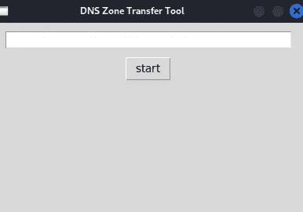

# 用 Python 构建 DNS 区域迁移软件

> 原文：<https://betterprogramming.pub/build-a-dns-zone-transfer-software-security-testing-toolkit-with-python-4546026bae7>

## 构建软件安全测试工具包的介绍


爱德华·豪厄尔在 [Unsplash](https://unsplash.com?utm_source=medium&utm_medium=referral) 上拍摄的照片

# 什么是 DNS，它是如何工作的

域名服务器(DNS)的存在是为了将给定的域名翻译成客户端正在寻找的服务器的 IP 地址。考虑到两台计算机建立连接需要一对 IP 地址，而且人们不会记住他们选择访问的每个网站的看似随机的数字串，所以当用户搜索网站时必须进行转换。DNS 系统已经到位，以方便翻译。

DNS 转换过程涉及四个不同的服务器，如下所示:

## DNS 递归程序

DNS 递归器面向客户端，设计用于接收请求。他们将进行额外的查询，以获取客户的信息。想想让图书管理员给你找一本书。数据通常缓存在该服务器中，以防止沿着整个链发送请求。

## 根名称服务器

如果互联网是一个图书馆，根域名服务器实现了等效的杜威十进制系统，存储所有网站名称和相应 IP 的索引。

## TLD 域名服务器

名称服务器寻址主机名的最后一部分(例如。example.com 中的“com”)。这是根域名服务器查询后的下一步。

## 权威名称服务器

权威域名服务器将整个 URL 转换成 IP，是这个过程的最后一步。


来源:https://www.cloudflare.com/en-ca/learning/dns/what-is-dns/

# 黑客和 DNS 区域迁移

DNS 区域转移是将域名服务器记录从一个 DNS 服务器复制到另一个 DNS 服务器。在 20 世纪 90 年代后期，只允许 DNS 服务器之间的区域转移成为行业最佳实践。然而，总是有后来者，你只需要在 DNS 链的一个环节被打破。

有了所有的 DNS 信息，就有可能确定使用该域的网络的许多信息。除了发现内部寻址方案，还可以确定哪些特定主机用于分析区域信息。此外，您可以找到目标的主要名称服务器。

# 创建安全测试工具

Bash 脚本和命令行工具可用于区域转移，但有时编写自己的安全工具更方便，也是一种有趣的学习体验。为了开始在 Python 中创建 DNS 区域转移工具，我们将导入两个密钥库，如下所示:

```
import dns.zone
import dns.resolver
```

这将允许我们查询一组名称服务器(名称服务器)并解析特定目标的 IP。我们将对域名服务器运行一次查询，然后进行两次循环，以解析每个 NS 中的 IP 列表并请求转让。

代码来源于此:[https://gist . github . com/gothburz/f 9805 f0b 10637 e 69 dcb 887d 3292 abee 3](https://gist.github.com/gothburz/f9805f0b10637e69dcb887d3292abee3)

因为我在网上找到了这段代码的一个很好的部分，所以我决定用一个小的 UI 组件来扩展它，以帮助将 URL 传递给区域传输代码，如下所示。



我的 UI 组件

完整的代码库可以在我的 GitHub 页面上找到:

[](https://github.com/AleksaZatezalo/DNSZoneTransfer) [## GitHub-AleksaZatezalo/DNSZoneTransfer

### 此时您不能执行该操作。您已使用另一个标签页或窗口登录。您已在另一个选项卡中注销，或者…

github.com](https://github.com/AleksaZatezalo/DNSZoneTransfer) 

我希望你在这里学到了有用的东西。黑客快乐。