# 用 Azure Bot 服务、语言理解和 Twilio SMS 构建一个医生预约机器人

> 原文：<https://betterprogramming.pub/build-a-doctor-appointment-bot-with-azure-bot-service-language-understanding-and-twilio-sms-5cc1311667bd>

## 一步一步的教程来建立一个预订系统


远程医疗服务可以改善生活在偏远地区的人们获得医疗保健的机会。偏远地区的一个常见问题是不可靠的互联网服务。对于偏远地区的患者来说，在网络服务很差或根本不可用的情况下，通过网络应用程序进行预约是一个挑战。

短信是联系偏远地区居民的一种可靠且低成本的替代方式。在本文中，您将学习如何构建一个允许用户通过短信预约的医生预约系统。

# 系统概况

短信预订系统的架构如下图所示:

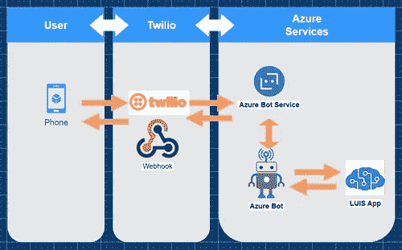

Twilio 是 Microsoft Azure Bot 服务和最终用户之间的通信渠道。该系统的核心是一个建立在[微软机器人框架](https://dev.botframework.com/)上的 [Azure 机器人](https://azure.microsoft.com/en-us/services/bot-services/)。当机器人收到消息时，它要求[语言理解(路易斯)](https://www.luis.ai/)来分析消息。LUIS 用消息的意图来响应，机器人用它来做出有帮助的回答。

# 先决条件

您将需要这些技术来跟进:

*   支持的操作系统。NET (Windows/macOS/Linux)
*   [。NET(核心)SDK](https://dotnet.microsoft.com/en-us/download)3.1 版或更高版本
*   [PowerShell Core](https://github.com/PowerShell/PowerShell#get-powershell) 或 Windows PowerShell(您可以使用任何 Shell，但需要做一些小的修改)
*   [Azure 订阅(获得免费订阅)](https://azure.microsoft.com/en-us/free/)
*   [一个免费的 Twilio 账户](https://www.twilio.com/try-twilio)
*   [Azure CLI 2.2.0 或更高版本](https://docs.microsoft.com/en-us/cli/azure/install-azure-cli)
*   答。NET IDE(推荐: [Visual Studio](https://visualstudio.microsoft.com/downloads/) 2019 或更高版本， [Visual Studio 代码](https://code.visualstudio.com/Download)带 [C#插件](https://marketplace.visualstudio.com/items?itemName=ms-dotnettools.csharp)，或 [JetBrains Rider](https://www.jetbrains.com/rider/download/) )。

# 创建语言理解服务应用程序

## Azure 配置

您需要创建一个资源组来存储您稍后将创建的 Azure 资源。

打开 PowerShell 并使用 Azure CLI 登录 Azure:

```
az login
```

运行以下命令创建新的资源组:

```
az group create --name rg-bot --location [AZURE_LOCATION]
```

将`[AZURE_LOCATION]`替换为您首选的 Azure 位置的名称。

> " EAzure 中的每一个资源都存储在一个资源组中，Azure 中的每一个资源和资源组都存储在一个特定的 Azure 区域或位置。选择不同地点的[有不同的原因](https://azure.microsoft.com/en-us/global-infrastructure/geographies/#overview)，但最常见的是你想选择离你和你的终端用户最近的地点。运行`az account list-locations -o table`可以找到所有地区。找到您的首选位置，并在创建 Azure 资源时使用来自`Name`列的值来指定位置。请记住，并非所有资源在所有 Azure 位置都可用。—微软文档

要与特定类型的 Azure 资源交互，需要启用这些资源类型的资源提供者。默认情况下，大多数[公共资源提供者是启用的](https://docs.microsoft.com/en-us/azure/azure-resource-manager/management/azure-services-resource-providers)，但是您将使用语言理解(LUIS ),它是默认情况下未启用的认知服务资源提供者的一部分。

您可以[在 Azure Portal](https://docs.microsoft.com/en-us/azure/azure-resource-manager/management/resource-providers-and-types#azure-portal) 中注册认知服务资源提供者，或者使用如下所示的 Azure CLI。

首先，使用以下命令检查认知服务资源提供者的状态:

```
az provider show --namespace Microsoft.CognitiveServices -o table
```

如果 RegistrationState 未注册，则运行以下命令进行注册:

```
az provider register --namespace Microsoft.CognitiveServices --wait
```

此命令可能需要一分钟才能完成。

# 创建 LUIS 应用程序并训练模型

语言理解(LUIS)是一个基于云的对话式人工智能服务，是 Azure[认知服务](https://azure.microsoft.com/en-us/services/cognitive-services/)的一部分。它可以处理自然语言文本以预测整体含义并提取相关的详细信息。

要学习如何使用 LUIS，您需要了解几个核心概念:

*   意图:用户在[话语](https://docs.microsoft.com/en-us/azure/cognitive-services/LUIS/concepts/utterances)中表达的目的或目标。
*   实体:与用户意图相关的项目或元素。
*   话语:言语单位。用户的每一句话都是一个话语。

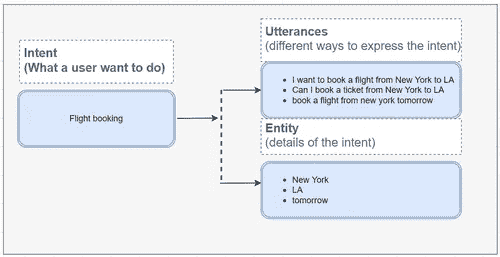

路易斯将充当机器人的大脑，帮助机器人理解传入的信息。

## 创建 LUIS 应用

使用您的 Azure 帐户登录到 [LUIS 门户网站](https://www.luis.ai/)。

如果你是路易斯的新用户，你将被提示**选择一个创作资源**。

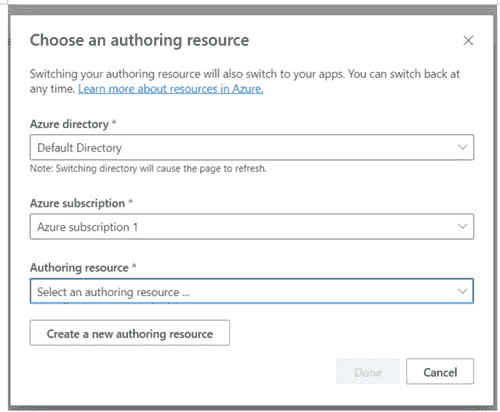

如果您以前没有创建过创作资源，请点击**创建一个新的创作资源**。

将出现另一个模式来创建新的创作资源。

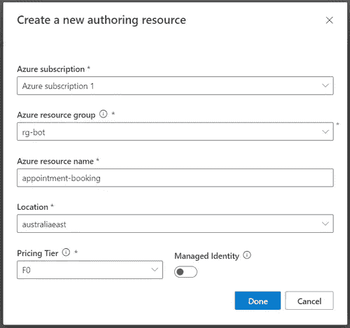

*   在 Azure 资源组下拉列表中选择“rg-bot”
*   在 Azure 资源名称字段中输入“appointment-booking”。
*   在位置下拉列表中选择您喜欢的地区
*   在定价层选择“F0”
*   单击完成

您将被重定向回上一个选择创作资源模式。现在，您可以单击“完成”按钮，然后您将被重定向到仪表板页面。

在仪表板页面上，单击创建新应用程序。将出现“创建新应用程序”模式。

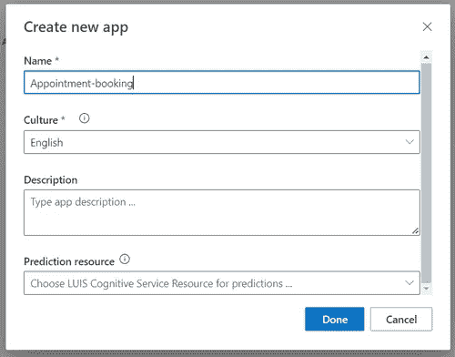

在“名称”字段中输入“预约”,然后单击“完成”。

创建应用程序后，将显示一个教程模式。在模式外部单击，转到新创建的应用程序详细信息页面。

你需要收集一些关键信息以备后用。

*   单击管理选项卡，然后单击设置链接。
*   记下应用程序 ID。
*   点击左边菜单上的 Azure 资源链接
*   单击创作资源选项卡

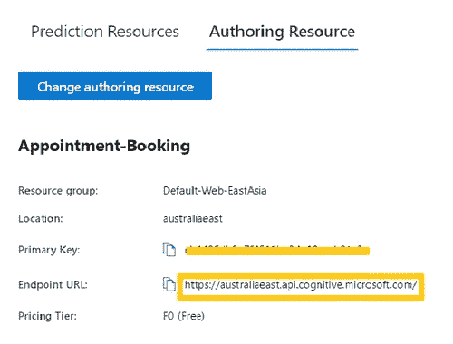

记下主键(LUIS API 键)和端点 URL。

现在，预约 LUIS 应用程序创建成功。下一步是创建应用程序的核心:LUIS 模型。

## 导入模型

有两种方法可以创建模型。您可以导航到应用程序的**构建**选项卡，然后[手动创建实体](https://docs.microsoft.com/en-us/azure/cognitive-services/luis/how-to/entities#create-a-list-entity)和[意图](https://docs.microsoft.com/en-us/azure/cognitive-services/luis/how-to/intents)。或者，您可以将预定义的模型文件导入应用程序。为了节省时间，可以下载这个 [LUIS model JSON 文件](https://raw.githubusercontent.com/sunnyy02/AppointmentBot/master/AppointmentBot/AppointmentBookingBot.LUISModel.json)并导入。

*   下载 JSON 模型文件后，通过 MANAGE > Versions 导航到 Versions 页面。
*   点击导入按钮
*   选择“导入为 JSON”以打开导入弹出窗口

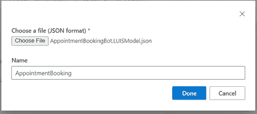

*   点击选择文件按钮
*   选择您的 JSON 文件
*   点击完成按钮

新模型将导入到应用程序中。

导航到构建>应用程序资产页面并选择“vAppointmentBookingBot”。LUISModel.json”。您可以在页面左上角的面包屑导航中找到它。

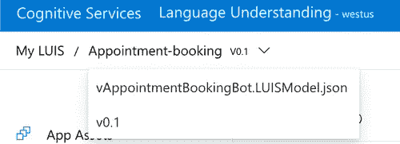

现在，您将看到新创建的意图和实体。

# 培训、测试和发布 LUIS 模型

导入意图和实体后，顶部导航栏中的 Train 按钮被启用。


单击培训按钮开始培训过程。

训练完成后，训练按钮将被禁用，测试按钮将被启用。

要测试新模型，请单击 test 按钮。右侧将出现一个测试弹出面板。您可以在测试面板中键入一个话语来进行测试。

在下面的截图中，“我想看凯西医生”的预约意向得分为 0.973，满分为 1 分。在 Inspect 窗口中，它还正确地将医生实体标识为“kathy”。

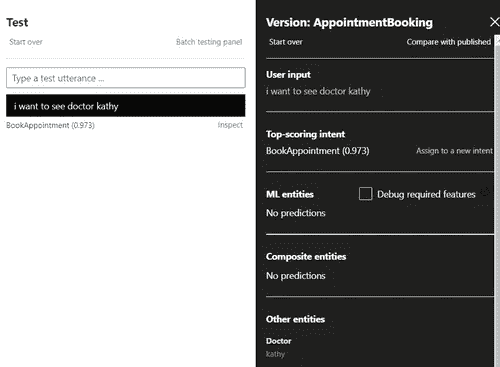

由于测试结果看起来相当不错，现在可以发布 LUIS 应用程序了。

*   单击导航栏上的发布按钮
*   选择生产插槽
*   单击完成

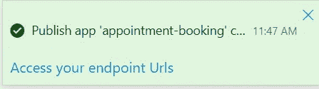

发布完成后，会显示如上所示的成功消息通知。这意味着 LUIS 应用程序已经可以使用了！

# 建造机器人

## 使用 bot 框架模板创建 Bot

在本教程中，您将使用 Bot Framework v4 SDK 模板来创建 Bot 项目。打开一个 shell 并使用。NET CLI 与这些命令:

```
dotnet new -i Microsoft.Bot.Framework.CSharp.EchoBot
dotnet new -i Microsoft.Bot.Framework.CSharp.CoreBot
dotnet new -i Microsoft.Bot.Framework.CSharp.EmptyBot
```

在本教程中，您将只使用 CoreBot 模板，但是可以随意探索`EchoBot`和`EmptyBot`模板。

现在，您可以使用新安装的模板来生成新的 bot 项目。运行以下命令创建 bot 项目:

```
dotnet new corebot -n AppointmentBot
```

*你也可以* [*使用 Visual Studio 中的 Bot 框架模板或者 VS 代码*](https://docs.microsoft.com/en-us/azure/bot-service/bot-service-quickstart-create-bot?view=azure-bot-service-4.0&tabs=csharp%2Ccli) *创建项目。*

使用前面的命令创建项目后，项目被创建到 AppointmentBot/CoreBot 文件夹中，并且根名称空间被设置为“CoreBot”。

这与 how 不一致。NET 模板通常是有效的，但是很容易纠正。下面的 PowerShell 脚本将内容移动到 AppointmentBot 文件夹中，重命名项目，并将所有名称空间更改为“AppointmentBot”。

使用 PowerShell 运行以下脚本:

```
$CorrectProjectName = "AppointmentBot"
Push-Location "./$CorrectProjectName"
Move-Item ./CoreBot/* ./
Remove-Item ./CoreBot
Move-Item ./CoreBot.csproj "./$CorrectProjectName.csproj"
Get-ChildItem * -Recurse -File | ForEach-Object { (Get-Content $_) -replace 'CoreBot', $CorrectProjectName | Set-Content $_ }
Pop-Location
```

使用您喜欢的打开项目。网络编辑。项目结构将如下所示:

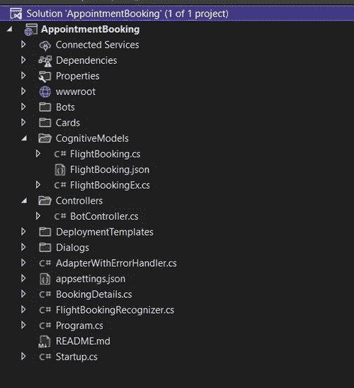

生成的项目附带了一个机票预订机器人示例。删除下面列出的相关模型和对话文件:

```
[projectRoot]\CognitiveModels\FlightBooking.cs[projectRoot]\CognitiveModels\FlightBooking.json[projectRoot]\CognitiveModels\FlightBookingEx.cs[projectRoot]\Dialogs\BookingDialog.cs[projectRoot]\Dialogs\MainDialog.cs[projectRoot]\BookingDetails.cs[projectRoot]\FlightBookingRecognizer.cs
```

为了节省时间，您可以运行下面的脚本来删除上述文件。通过执行以下操作，从项目根文件夹运行脚本:

```
rm CognitiveModels/FlightBooking.cs
rm CognitiveModels/FlightBooking.json
rm CognitiveModels/FlightBookingEx.cs
rm Dialogs/BookingDialog.cs
rm Dialogs/MainDialog.cs
rm BookingDetails.cs
rm FlightBookingRecognizer.cs
```

你还需要删除`Startup.cs`文件中的第 41 到 51 行。这些是被删除文件的引用。

清理之后，`Startup`类将如下所示:

清理后

# 预约认知模型

现在项目已经清理完毕，您可以开始实现自己的逻辑了。接下来，您将创建模型，LUIS 会将模型和分析数据返回给我们。

接下来，您将在`CognitiveModels` 文件夹下创建这些文件:

*   `DoctorBooking.cs`:这个文件将包含`DoctorBooking`类，它代表路易斯返回的数据。
*   `DoctorBookingEx.cs`:这个文件将使用一个分部类来扩展`DoctorBooking`，以简化对 LUIS 结果实体的访问

创建`CognitiveModels/Doctorbooking.cs`并添加以下代码:

我使用 [Bot Framework CLI](https://github.com/microsoft/botframework-cli) 生成了这个类，并为了您的方便提供了它，但是您也可以自己生成这个类。

> *如果你想自己生成* `*Doctorbooking.cs*` *，你需要先安装 node.js 和 BF CLI。*
> 
> 您可以使用以下命令安装 BF CLI:`*​​​​npm i -g @microsoft/botframework-cli*`
> 
> *将*[*LUIS model JSON 文件*](https://raw.githubusercontent.com/sunnyy02/AppointmentBot/master/AppointmentBot/AppointmentBookingBot.LUISModel.json) *下载到您的项目目录下，然后从项目根目录下运行以下命令:*
> 
> `*​​bf luis:generate:cs --in=AppointmentBookingBot.LUISModel.json --out=CognitiveModels/DoctorBooking.cs --className=AppointmentBot.CognitiveModels.DoctorBookin*`

创建`CognitiveModels/DoctorBookingEx.cs`文件并添加以下代码:

## 将机器人连接到 LUIS 应用程序

要将 bot 服务与 LUIS 应用程序集成，您需要将 LUIS 应用程序 ID、API 键和 API 端点 URL 添加到项目配置中。

用下面的 JSON 替换`appsettings.json`的内容:

```
{
  "MicrosoftAppType": "",
  "MicrosoftAppId": "",
  "MicrosoftAppPassword": "",
  "MicrosoftAppTenantId": "",
  "LuisAppId": "[YOUR_LUIS_APP_ID]",
  "LuisApiKey": "<SET_USING_USER_SECRETS>",
  "LuisApiEndpointUrl": "[LUIS_ENDPOINT_URL]"
}
```

用您的 LUIS 应用 ID 替换`[YOUR_LUIS_APP_ID]`,用您之前记下的 LUIS 端点 URL 替换`[LUIS_ENDPOINT_URL]`。

请注意，您不应该在源代码中存储敏感信息，包括 API 密钥或令牌。这就是为什么您将使用[秘密管理器工具](https://docs.microsoft.com/en-us/aspnet/core/security/app-secrets?view=aspnetcore-6.0&tabs=windows)来配置`LuisApiKey`。

通过在项目根目录下运行以下命令，为您的项目启用 Secret Manager 工具:

```
dotnet user-secrets init
```

运行以下命令，使用秘密管理器配置`LuisApiKey`:

```
dotnet user-secrets set "LuisApiKey" "[YOUR_LUIS_API_KEY]"
```

用您之前记下的 LUIS App 主键替换`[YOUR_LUIS_API_KEY]`。

bot 应用程序将检索您刚刚配置的设置，以在下面的`AppointmentBookingRecognizer`类中建立到您的 LUIS 应用程序的连接。新建一个文件`AppointmentBookingRecognizer.cs`，添加以下内容:

识别器用于识别用户输入并返回`DialogContext`中的意图和实体。在`AppointmentBookingRecognizer`类中，建立了到 LUIS API 端点的连接。它还实现了`RecognizeAsync`方法，对话框调用该方法从用户的话语中提取意图和实体。

## 使用对话控制对话流

你需要使用[对话框](https://docs.microsoft.com/en-us/azure/bot-service/bot-builder-concept-dialog?view=azure-bot-service-4.0)来管理用户和机器人之间的对话。

> “对话框是 SDK 中的一个核心概念，它提供了管理与用户的长期对话的方法。一个对话可以由其他对话组成。—微软文档

Bot 框架提供了一组丰富的对话框，使创建对话流变得更加容易。在这个例子中，您将创建一个`AppointmentBookingDialog`类来管理主对话。它由几个对话框组成，包括瀑布对话框和提示对话框。

瀑布对话框用于定义步骤的顺序。如下图所示，机器人通过线性过程与用户交互。

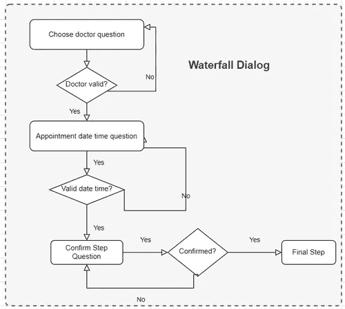

在项目根目录下创建一个新文件`AppointmentDetails.cs`，并添加以下代码:

`AppointmentDetails`类是对话框的模型类。接下来，在 Dialogs 文件夹中创建`AppointmentBookingDialog.cs`文件。`AppointmentBookingDialog`类将实现上面的过程。

将以下代码添加到文件中:

## 主对话框

`MainDialog`类管理主流程。在 Dialogs 文件夹中创建`MainDialog.cs`文件(你可以从[这里](https://github.com/sunnyy02/AppointmentBot/blob/master/AppointmentBot/Dialogs/MainDialog.cs)下载代码)。

这个图表向您概述了`MainDialog`类的作用。

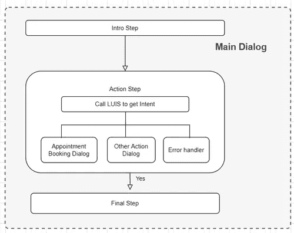

代码相当多，但是`MainDialog`类的重要部分如下:

简而言之，当收到一个消息活动时，机器人运行`MainDialog`。`MainDialog`提示用户使用`IntroStepAsync`方法，然后调用`ActStepAsync`方法。

在`ActStepAsync`方法中，机器人调用 LUIS 应用程序来获取包含用户意图和实体的`luisResult`对象。用户的意图和实体用于确定下一步，执行验证或调用其他对话框。

最后，机器人调用`FinalStepAsync`方法来完成或取消该过程。

## Twilio 适配器和控制器

默认情况下，Azure Bot 服务将连接到 web 聊天通道，该通道由默认的`AdapterWithErrorHandler`适配器处理。默认适配器被注入到默认的`BotController`类中，控制器公开一个端点 */api/messages* 。

为了将 bot 连接到 Twilio，您将创建一个新的从 [TwilioAdapter](https://docs.microsoft.com/en-us/dotnet/api/microsoft.bot.builder.adapters.twilio.twilioadapter?view=botbuilder-dotnet-stable) 类扩展而来的`TwilioAdapterWithErrorHandler`类。运行以下命令来安装[微软。bot . builder . adapters . twilio](https://www.nuget.org/packages/Microsoft.Bot.Builder.Adapters.Twilio/)n 获取包:

```
dotnet add package Microsoft.Bot.Builder.Adapters.Twilio --version 4.15.0
```

*确保* [*微软。bot . builder . adapters . twilio*](https://www.nuget.org/packages/Microsoft.Bot.Builder.Adapters.Twilio/)*NuGet 包使用的版本与 csproj 文件中指定的其他 Microsoft.Bot.Builder.*包相同。*

NuGet 安装完成后，在项目根目录下创建`TwilioAdapterWithErrorHandler.cs`文件，并添加以下代码:

为了处理来自 Twilio 的 HTTP webhook 请求，您需要添加一个`TwilloController`。在 Controllers 文件夹中创建一个新文件`TwilioController.cs`，并添加以下代码:

`TwilioController`的端点是 */api/twilio* 。添加新端点后，bot 可以通过 web 通道和 Twilio SMS 通道处理消息。

最后，您需要在`Startup`类中注册对话框和 LUIS 识别器。在`Startup.cs`文件中的`ConfigureServices`方法的末尾插入以下几行:

# 本地测试

您需要安装[机器人框架模拟器](https://github.com/Microsoft/BotFramework-Emulator/blob/master/README.md#download)来本地测试机器人。要安装 Bot 框架模拟器，请执行以下操作:

*   导航到 Bot 框架模拟器项目的 [GitHub 发布页面](https://github.com/Microsoft/BotFramework-Emulator/releases/latest)
*   单击操作系统的安装文件进行下载。
*   下载完成后，单击该文件开始安装。遵循安装向导，并使用默认选项来完成安装。

接下来，使用。NET CLI:

```
dotnet run
```

现在，启动 Bot 模拟器，单击 Open Bot 按钮，并在您的本地环境中输入 Bot 的 URL，默认情况下是`[*http://localhost:3978/api/messages*.](http://localhost:3978/api/messages.)`，然后单击 Connect 按钮。

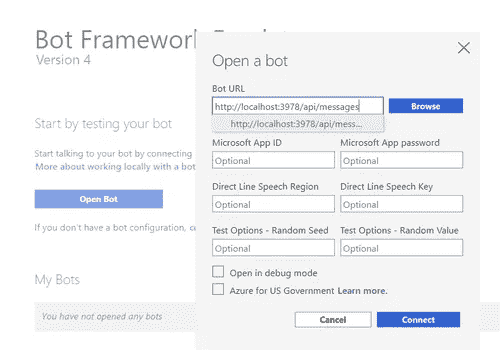

将会打开一个聊天窗口。您可以键入消息并开始测试。

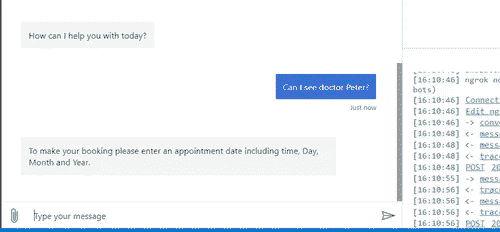

在您对测试结果感到满意之后，就可以将 bot 部署到 Azure 了。

# 将机器人部署到 Azure

来部署。NET bot 到 Azure，需要使用 Azure CLI 创建以下资源:

*   资源组:您之前已经创建了一个`rg-bot`资源组。
*   A [托管身份](https://docs.microsoft.com/en-us/azure/active-directory/managed-identities-azure-resources/overview):虽然这个资源不会用于 Twilio bot，但是 bot 框架部署模板需要它
*   一个 [App 服务计划](https://docs.microsoft.com/en-us/azure/app-service/overview-hosting-plans)和一个 [App 服务](https://docs.microsoft.com/en-us/azure/app-service/overview)
*   一个[机器人服务](https://azure.microsoft.com/en-us/services/bot-services/)

要创建新的应用服务计划，请运行以下命令:

```
az appservice plan create -g rg-bot -n asp-bot --location [AZURE_LOCATION] --sku F1
```

这些参数的作用如下:

*   `-g`或`— resource-group`:资源应该被放入的资源组，在本例中是您之前创建的“rg-bot”资源组。
*   `-n`或`— name`:App 服务计划的名称，即`asp-bot`。“asp”是 App 服务计划的简称。
*   `-l`或`— location`:资源应该驻留的 Azure 位置。将`[AZURE_LOCATION]`替换为离您或您的用户最近的位置，就像您之前创建资源组时所做的那样。
*   `— sku`:大小(CPU/RAM/等。)的应用服务计划，在这种情况下是 F1(免费)。

以确保。要正确部署. NET 项目，您需要生成一个部署文件。可以使用以下命令生成部署文件:

```
az bot prepare-deploy — lang Csharp — code-dir “.” — proj-file-path “AppointmentBot.csproj”
```

请注意`--code-dir`和`--proj-file-path`需要匹配来解析项目文件的路径。

使用以下命令创建受管身份:

```
az identity create --resource-group "rg-bot" --name "identity-appointment-bot"
```

该命令完成后，Azure 中已经添加了一个新的`identity-appointment-bot`托管身份，它将用于在下一步创建新的 App 服务和 Bot 服务。

应用服务和机器人服务可以使用现有的应用服务计划和 Azure 资源管理器(ARM)模板生成，该模板是“CoreBot”的一部分。NET 模板。

您使用的是 deployment templates/template-with-pre existing-rg . JSON ARM 模板，但是它需要很多参数，这就是您应该使用参数文件的原因。在项目根目录下新建一个`ParameterFiles`文件夹，并新建一个`RegisterAppParams.json`文件，内容如下:

有些参数已经用以前创建的资源的名称进行了配置，但是您仍然需要用您自己的特定设置更新一些参数:

*   `**appId**`:响应`create identity`命令时`clientId`的值。你也可以这样查询`clientId`:`az identity show -g rg-bot -n identity-appointment-bot --query clientId`
*   `**tenantId**`:响应`create identity`命令时`tenantId`的值。你也可以这样查询`tenantId`:`az account show --query tenantId`
*   `**appServicePlanLocation**`:您在创建应用服务计划时使用的 Azure 区域。
*   `**botId**`:你的 Bot 服务的名称。该名称必须是全局唯一的。用任何能使名字独一无二的东西代替`[UNIQUE_SUFFIX]`，比如“名字-姓氏 1234”。如果它不接受该名称，请更改它并重试。
*   `**newWebAppName**`:您的应用服务的名称。这个名字必须是全局唯一的，因为它将被用作*azurewebsites.net*的子域。用任何能使名字独一无二的东西代替`[UNIQUE_SUFFIX]`，比如“名字-姓氏 1234”。如果它不接受该名称，请更改它并重试。

参数文件更新后，运行以下命令生成 App 服务和 Bot 服务:

```
az deployment group create `
  --resource-group "rg-bot" `
  --template-file "./DeploymentTemplates/template-with-preexisting-rg.json" `
  --parameters "@ParameterFiles/RegisterAppParams.json"
```

Azure 需要一分钟来部署这个基础设施。生成应用服务后，运行以下命令获取应用服务主机名:

```
az webapp show -g rg-bot -n appointment-bot-[UNIQUE_SUFFIX] --query 'hostNames[0]'
```

用您在参数文件中使用的后缀替换`[UNIQUE_SUFFIX]`。**记下这个主机名**，因为您稍后会用到它。

既然已经提供了应用程序服务基础架构，您就可以部署您的本地。NET bot 项目。运行以下命令，该命令将创建一个 ZIP 文件并将该 ZIP 文件部署到应用服务:

```
az webapp up -g rg-bot -n appointment-bot-[UNIQUE_SUFFIX]
```

完成部署大约需要 30 秒。完成后，您将看到如下所示的成功响应:

# 为短信通信设置 Twilio

您已经使用网络聊天在本地测试了机器人，但是本教程的目标是使用 SMS 进行通信。若要接收和发送短信，您需要一个 Twilio 电话号码。

*   去 Twilio 买一个新的电话号码。如果您使用试用帐户，电话号码的费用将计入您的免费促销点数。
    确保**记下您的新 Twilio 电话号码。你以后会需要它的！**
*   如果您使用的是试用 Twilio 帐户，您只能向经过验证的来电显示发送短信。[验证您的电话号码](https://support.twilio.com/hc/en-us/articles/223180048-Adding-a-Verified-Phone-Number-or-Caller-ID-with-Twilio)或您想要发送短信的电话号码，如果该号码不在已验证的来电显示列表中。
*   最后，您需要找到您的 Twilio 帐户 SID 和 Auth Token。导航到您的 [Twilio 帐户页面](https://console.twilio.com/)和**记下您的 Twilio 帐户 SID 和位于页面左下方的认证令牌**。

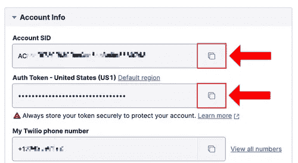

当您的 Twilio 电话号码收到短信时，Twilio 会将其转发到您的。托管在 Azure 应用服务上的 NET bot。

要进行配置，请导航至电话号码>管理>有效号码，然后单击您的 Twilio 电话号码以访问配置页面。

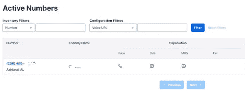

在 Messaging 部分，将 CONFIGURE WITH OTHER HANDLERS 下的下拉列表设置为“Webhook”，并在相邻的文本字段中输入“ *https://* ”，然后粘贴您之前记下的应用服务主机名，然后输入“ */api/twilio* ”。

该网址应该看起来像[*https://your-hostname.azurewebsites.net/api/twilio*。](https://your-hostname.azurewebsites.net/api/twilio.)

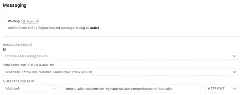

点击左下角的保存按钮。**记下这个 webhook URL** ，你很快会再次需要它。

最后，您需要向您的应用服务添加一些配置。运行以下命令来配置应用程序设置:

```
az webapp config appsettings set -g rg-bot -n appointment-bot-[UNIQUE_SUFFIX] --settings `
 LuisApiKey=[YOUR_LUIS_API_KEY] `
 TwilioNumber=[YOUR_TWILIO_PHONE_NUMBER] `
 TwilioAccountSid=[YOUR_TWILIO_ACCOUNT_SID] `
 TwilioAuthToken=[YOUR_TWILIO_AUTH_TOKEN] `
 TwilioValidationUrl=[YOUR_BOT_TWILIO_ENDPOINT]
```

运行该命令之前，请替换占位符。

*   用您之前记下的 LUIS 主键替换`[YOUR_LUIS_API_KEY]`。
*   将`[YOUR_TWILIO_PHONE_NUMBER]`替换为您之前购买的 Twilio 电话号码。使用看起来像`+11234567890`的 [E.164](https://www.twilio.com/docs/glossary/what-e164) 输入电话号码。
*   用您之前记下的 Twilio 帐户 SID 替换`[YOUR_TWILIO_ACCOUNT_SID]`。
*   用你之前记下的 webhook URL 替换`[YOUR_BOT_TWILIO_ENDPOINT]`。它应该看起来像 https://your-hostname.azurewebsites.net/api/twilio 的[T22。](https://your-hostname.azurewebsites.net/api/twilio)

您可以重新启动应用程序服务，以确保 bot 加载了应用程序设置。运行以下命令重新启动应用程序服务:

```
az webapp restart -g rg-bot -n appointment-bot-[UNIQUE_SUFFIX]
```

# 端到端测试

最后，您已经构建并组装了所有移动部件。来测试一下吧！

给你的 Twilio 手机号码发送一条短信，你应该会看到机器人的回复。在这里，你可以看到我发送了以下短信到我的 Twilio 手机号码，它的工作！

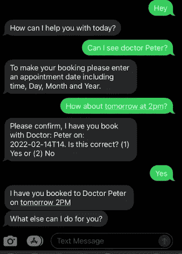

# 后续步骤

还有一些重要的 bot 特性没有在本文中介绍。在开发生产级机器人时，您可能想进一步探索。

*   身份验证:当 bot 需要代表用户访问资源时，您必须验证用户身份。用户身份验证可以由身份提供者处理，如带有 OAuth 2.0 的 Azure AD。您的 bot 将使用 Azure 生成的令牌来访问这些资源。关于如何将 Azure 广告认证添加到机器人的细节可以在微软的文档中找到[。](https://docs.microsoft.com/en-us/azure/bot-service/bot-builder-authentication?view=azure-bot-service-4.0&tabs=userassigned%2Caadv2%2Ccsharp)
*   [Bot Framework Composer](https://docs.microsoft.com/en-us/composer/introduction?tabs=v2x) :它是一个开源的可视化设计器和创作工具，使用 Azure Bot 服务创建 Bot。您可以使用它在 UI 中构建对话框，并向业务用户可视化流程。它还允许您在工具中训练 LUIS 模型，从而无需在不同环境之间切换。如果你的项目需要非技术人员参与 bot 开发，它绝对是一个值得考虑的好工具。

# 结论

在本文中，您通过 Twilio、Azure Bot Framework 和 LUIS 逐步构建了一个短信预订系统。您可以通过添加更多的频道、扩展 LUIS 模型以支持现实生活场景，以及合并其他功能(如图像识别或多语言支持)来扩展这一功能。

你可以在[这个 GitHub repo](https://github.com/sunnyy02/AppointmentBot) 中找到完整的源代码。