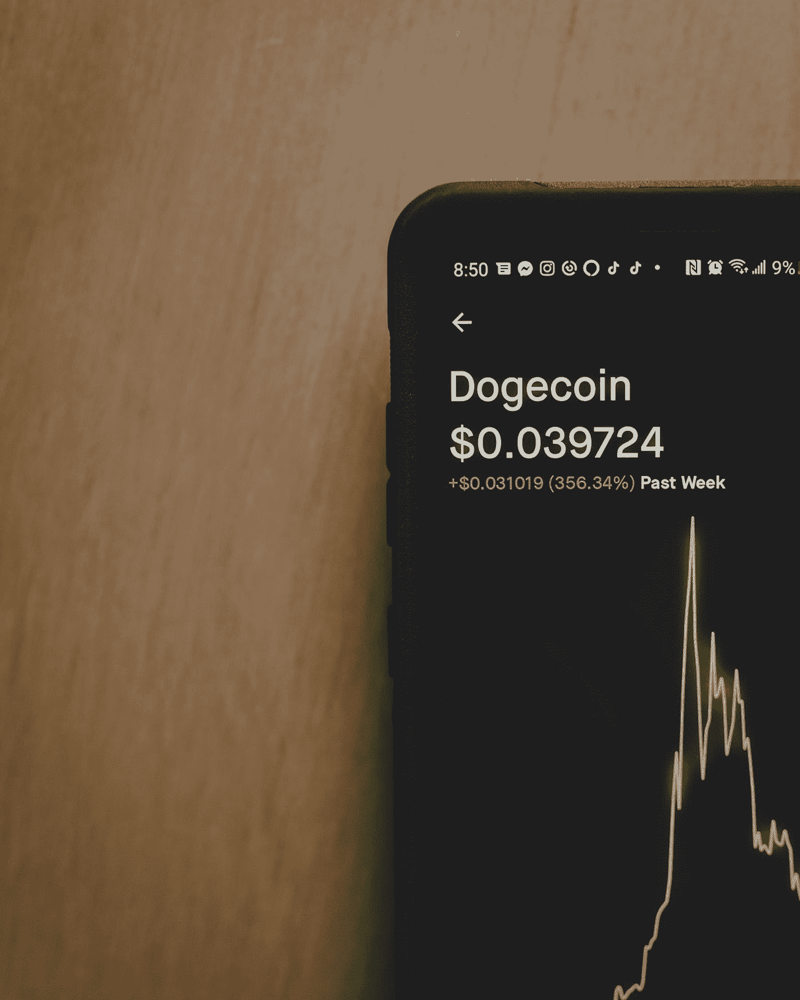
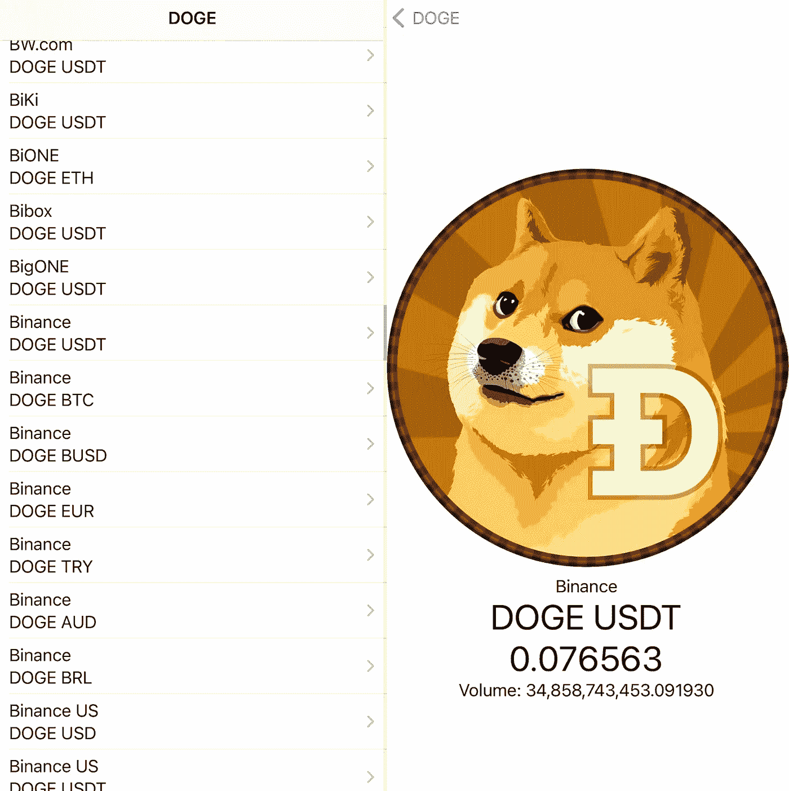
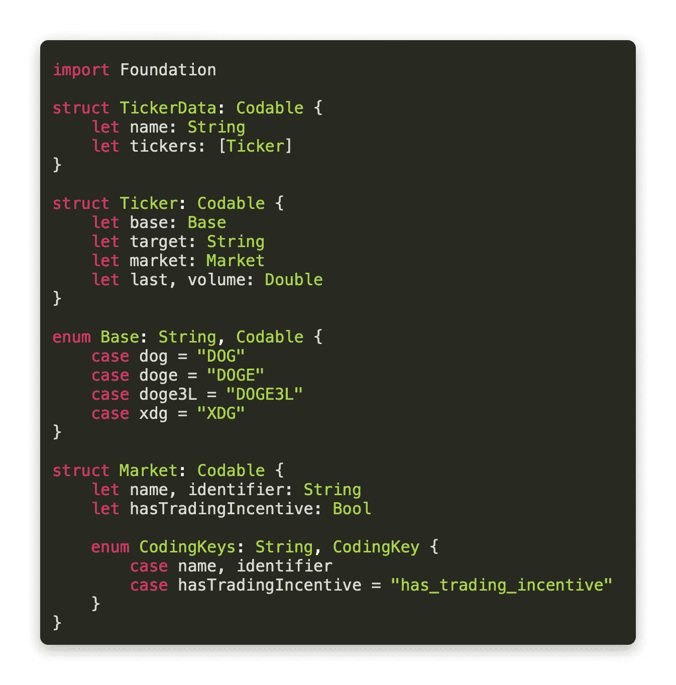
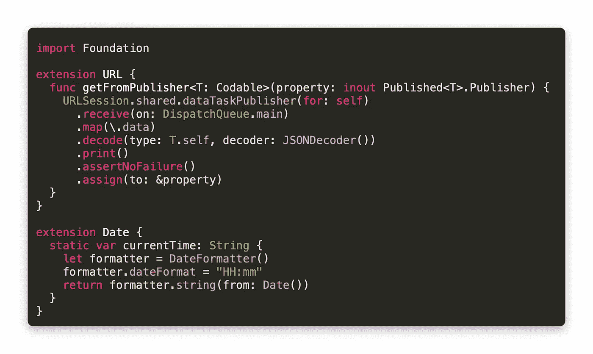
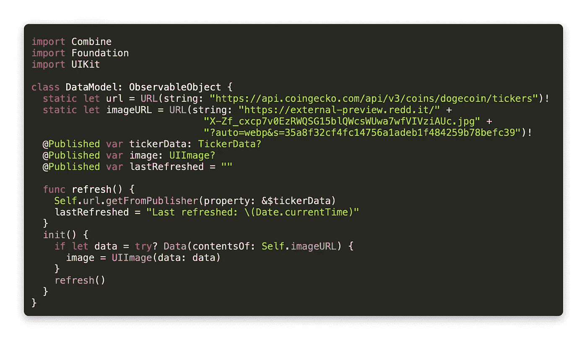
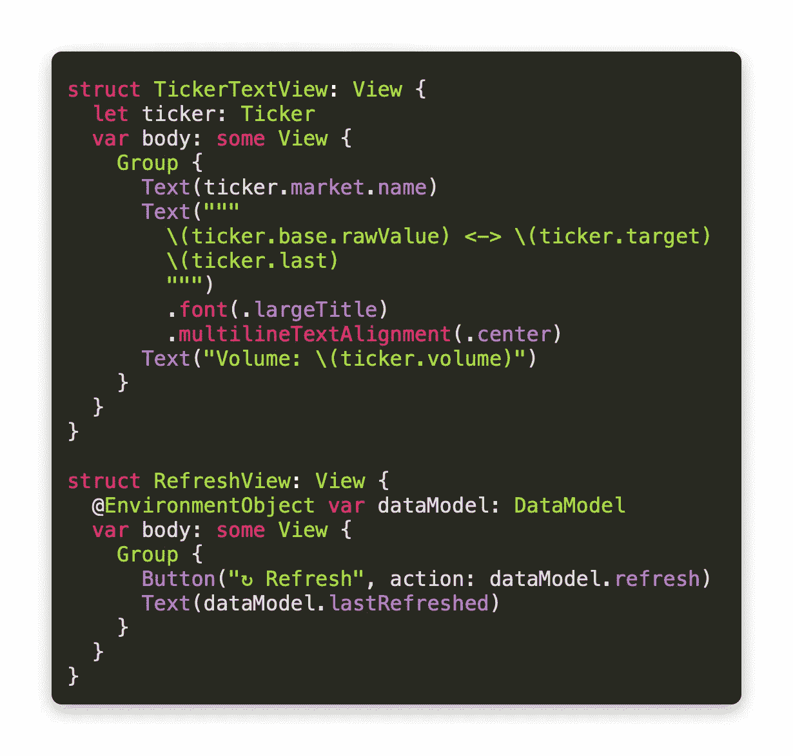
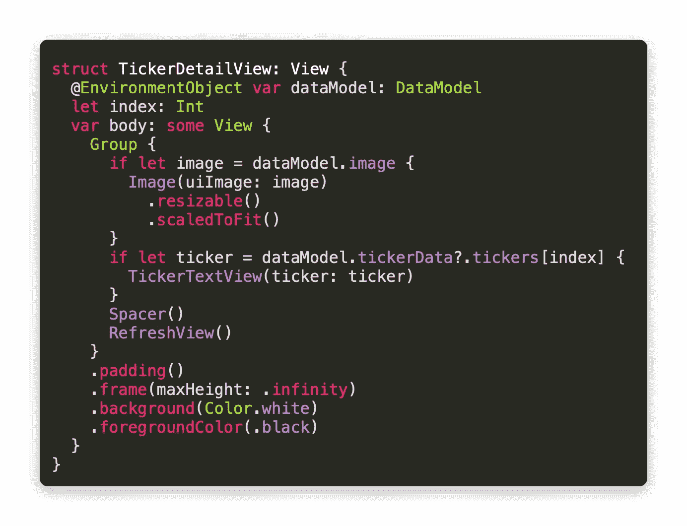
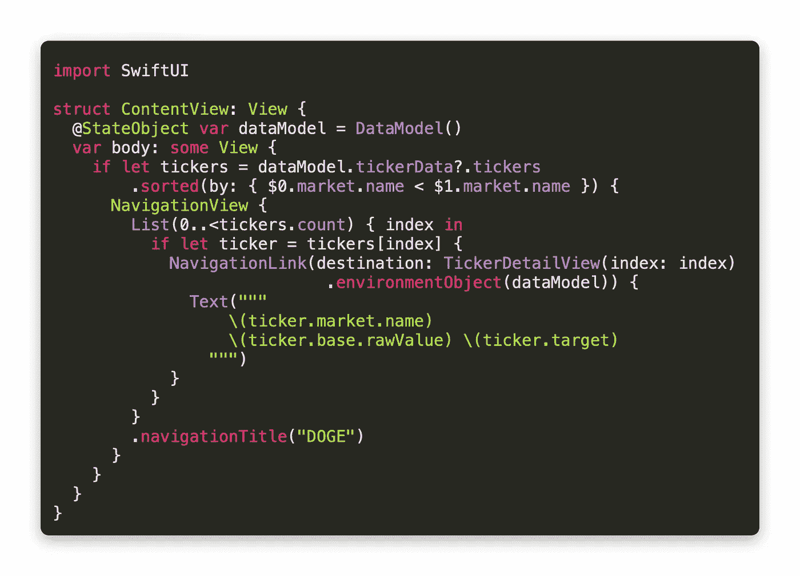

# 使用 SwiftUI 构建 Dogecoin 价格跟踪器

> 原文：<https://betterprogramming.pub/build-a-dogecoin-price-tracker-with-swiftui-7552bfbb078b>

## 加密货币硬币可能是一个迷因。所以让我们用 CoinGecko API 来享受它的乐趣吧

由[粘土银行](https://unsplash.com/@claybanks?utm_source=medium&utm_medium=referral)在 [Unsplash](https://unsplash.com?utm_source=medium&utm_medium=referral) 上拍摄

加密货币 [Dogecoin](https://www.coindesk.com/price/dogecoin) 本周经历了令人难以置信的运行，这完全是由炒作和名人代言推动的。与 GameStop 不同，在 GameStop 上可以提出公司被低估的论点，Dogecoin 确实没有提供任何新的实用工具。也许这并不重要，但我们可能很快就会知道了。不管你是否相信这种宣传，你可能会有兴趣知道如何使用 API 来检查价格。

这是该应用程序的两个屏幕的外观:

一个被删除的 Reddit 用户的 Dogecoin 标志

我们将从为我们关心的数据创建[可编码](https://developer.apple.com/documentation/swift/codable)结构开始。菜单中的每个选项代表一个滚动条，每个滚动条都有一对关联的加密货币。一个是基础货币，一个是目标货币。最后一个是硬币的最新价值，而数量是货币当前移动的数量。

源代码: [TickerData.swift](https://gist.github.com/67194f07a965db5d7e7271c38e0d097b)

我们将从 [CoinGecko API](https://www.coingecko.com/en/api) 获取数据，这是免费的，不需要创建凭证。我将带回一个 URL 扩展，它允许您设置一个`Published`属性来解码来自 API 的 JSON 响应。我也扩展了`Date`,因为稍后我将需要当前时间作为接口的字符串。

源代码: [CryptoTrackerExtensions，swift](https://gist.github.com/1b254ac182e3518ab8a7612c549aeca4)

我们将使用一个`EnvironmentObject`来存储 SwiftUI 视图之间共享的数据。当这个`DataModel`类被创建时，我们试图从 web 上获取一个图像，从 CoinGecko 上获取我们的 ticker 数据。有一个空字符串作为名为`lastRefreshed`的`Published`属性，我们在刷新函数中更改它。现在，我们可以刷新应用程序中的数据，并确保它更新成功。

源代码:[cryptotrackerdatamodel . swift](https://gist.github.com/95a3214c98e34f1096ade8038bf581d1)

我们需要一个详细视图，显示每个交易所和每个包含 Dogecoin 的加密货币对的价值。我们从 API 得到的`TickerData`结构有一组`Ticker`实例，我们需要做的就是访问那里的值。我们只需要中间两行中的一行很大，这就是为什么我使用了一个多行字符串来组合它们，并给它们一个特定的字体大小和对齐方式。

我们还有一个刷新按钮，这将显示来自`DataModel`的`lastRefreshed`字符串。

源代码:[tickertextrefreshview . swift](https://gist.github.com/d813db9bc7800f88dcbb03bcd3ce053d)

当我们把这些观点结合在一起，我们就有了`TickerDetailView`。这是一个单独的页面，当用户从菜单中选择一个加密货币对时，将导航到该页面。我提供的图像只是 Reddit 上某个人设计的 Dogecoin 徽标，我认为加载图像比请求您事先将它添加到 Xcode 项目更容易。这将内容隔开，因为我们将屏幕上显示的数据量保持在最小。我们对图像和滚动条使用可选的绑定，因为在用户导航到这个视图之前，可能两者都没有从网上下载。

源代码: [TickerDetailView.swift](https://gist.github.com/a0d6cc8bfc95215aa964603e8c3fae7e)

现在我们只需要显示主菜单，这很简单。我不确定 API 如何对 tickers 数组进行排序，但它不是按字母顺序排列的。我想按字母顺序对我的加密货币进行排序，因为这将把一个给定交易所的所有加密货币对放在同一个地方。之后，只需要显示一个链接到`TickerDetailView`的`NavigationLink`按钮的`List`，并作为`environmentObject`传递`DataModel`实例。虽然我们需要用`NavigationLink`来做这件事，但是对于我们在`TickerDetailView`上的后续子视图来说，这是不必要的，因为对象已经可以从那里访问了。

这允许包含在`TickerDetailView`中的刷新按钮刷新菜单中的所有内容，以及更新它自己。

源代码:[cryptotrackercontentview . swift](https://gist.github.com/aa9b1176ba70e44553eea76fcae8712f)

# 后续步骤

CoinGecko API 有许多有趣的端点，您不需要将自己限制为只显示当前价格。你可以研究历史数据，绘制图表，或者比较加密货币。每分钟 100 个请求的 API 有一个合理的限制，但如果您只是使用本教程来试验加密货币 API，那么您不太可能遇到问题。