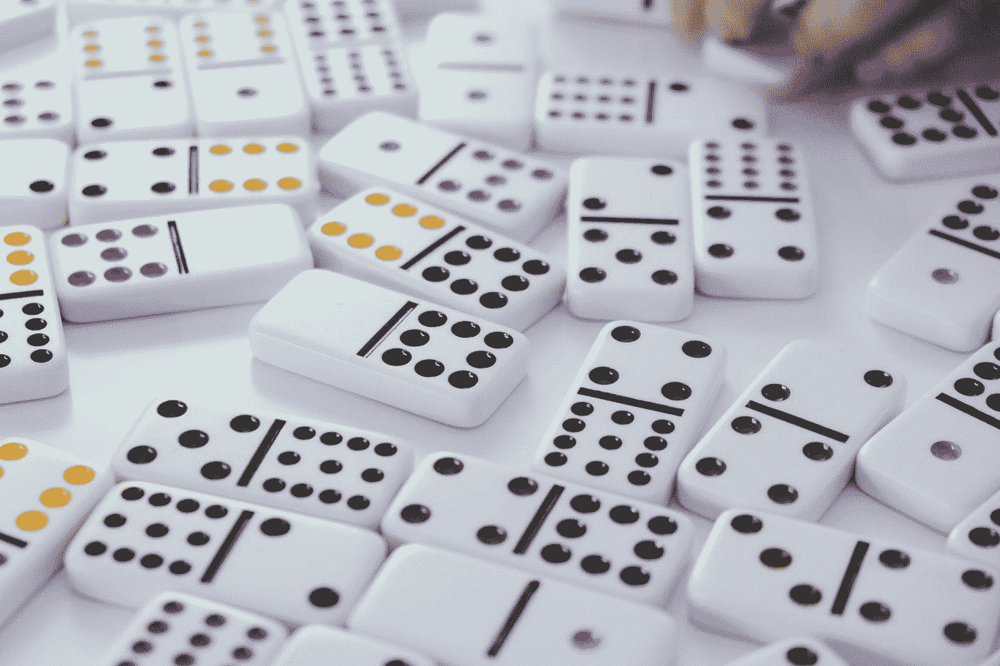
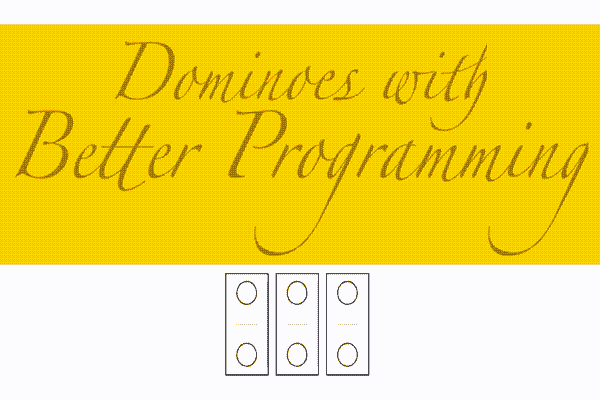
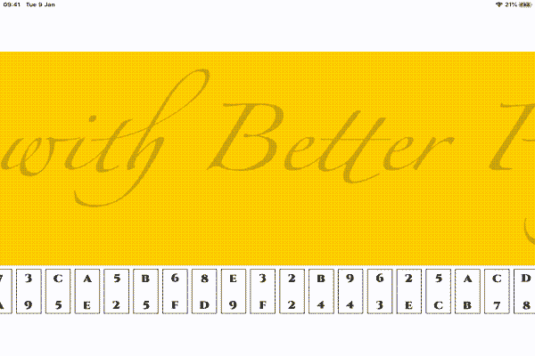

# 在 SwiftUI 中构建多米诺骨牌游戏(第 1 部分)

> 原文：<https://betterprogramming.pub/build-a-dominoes-game-in-swiftui-part-1-75656a98d5e3>

## 随着一些手势的加入



由[瑞安·昆塔尔](https://unsplash.com/@ryanquintal?utm_source=medium&utm_medium=referral)在 [Unsplash](https://unsplash.com?utm_source=medium&utm_medium=referral) 上拍摄的照片。

计划 A 是基于 2020 年 3 月下旬 iOS 11.4 发布的新[拖放。但是在进行了一个快速的概念验证后，很明显新的拖放功能还没有准备好投入使用——至少没有以我想在这个应用中使用的方式。所以我要在 SwiftUI 下用手势。当然，你至少需要 iOS 13。](https://medium.com/better-programming/build-a-board-game-without-the-politics-part-1-3f17f29eeb0b)

去看比赛。我们的目标是创建一个虚拟多米诺骨牌锦标赛的舞台。在本文中，我将创建一组多米诺骨牌，一种将它们放在棋盘上玩游戏的方法。中期计划是建立网络，这样我就可以和其他人一起玩，而长期计划是引进一台 AppleTV，这样我们就可以在大屏幕上一起玩了。

我们从多米诺骨牌开始。我最初用圆形和矩形构建了一个经典的多米诺骨牌。下面是粗略的、不完整的构建代码:

但是我真的不喜欢。我想要更有趣的东西。我没有计划设置得分，所以我决定使用图像。我选择了 1977 年电影*外星人*中的宇宙飞船 Nostromo 上使用的图形。可悲的是，由于版权原因，我不能在这里给你看我的版本。但这是它将用于图像的 domino 视图。我们将继续这个版本:

我需要每个多米诺骨牌在一个矩形内有两个图像，并有一点填充，使事情看起来不错。但是等等，事情没那么简单。我还需要一个边框和一些控件:

*   我需要能够在多米诺骨牌的轴上旋转。
*   我需要能够拖动它。
*   我需要能够隐藏最初的面值。

我还需要一个大的游戏区，我可以平移。足够的需求——让我们做更多的代码。当然，我构建了一个包装器来调用我的 domino 视图，并将其命名为`Domino Wrapper`。

一个重要的警告:旋转是在`ZStack`中添加的。阻力是在外面加上的。如果您将拖动+旋转添加到同一个容器，当您旋转它时，将会产生不希望的副作用。试试看。

但是我遇到了第二个障碍。如果我在棋盘前将多米诺骨牌添加到屏幕上，我需要使用一个`zindex`指令。但是如果我用循环在`HStack`中添加多米诺骨牌，我就不能使用`zindex`索引，因为它只适用于当前的堆栈容器。我喝了几杯。所以我先添加了棋盘，然后添加了多米诺骨牌，但是我遇到了另一个障碍:多米诺骨牌被添加到了棋盘的末尾。生活从来都不简单，不是吗？

我选定了剩下的唯一选择:a `VStack`。我用了一个长方形作为棋盘，并在它下面添加了多米诺骨牌。当然，董事会正处于`scrollView`——一个我会后悔的决定。我编辑了我的`dominoWrapper`和`domino View`,把要显示的图片包括进来。下面是此时主`ContentView`的代码:

我在这里也尝试了一些其他的东西。我试着在板上使用放大效果，但是效果不好，因为这使得界面难以使用/没有反应。我试着把长按改为旋转。这似乎也让界面过载了。这一切看起来有点可怕。

我改变了策略，开始了下一个挑战，那就是制作未发行多米诺骨牌的动画。扭曲的动画。我决定在所有瓷砖的背面使用相同的图像。我复制了我最初的 domino 代码，稍微做了一些调整:

我在`dominoWrapper`方法中编写了 flipper 动作，为两个 domino 视图添加了新视图和三维效果。我将动画链接到`backView`(不是正面，多米诺视图)上的点击手势。这里的秘密是如何定位视图。

*   后视图需要从 0 度开始，所以只需面朝上。
*   多米诺视图需要从 180 度开始，在这个角度上你我都看不到它。有点像从侧面看一张纸。

我在这个过程中发现，手势似乎对被扭曲的物体不起作用。精神食粮。无论如何…

该动画将由点击手势触发。它将增加后视图的度数，直到它是 180 度，这一事件将触发多米诺(前)视图下降到零。图像实际上会改变位置。一个翻牌效果。我用这段代码把它们拼凑在一起:

这里是`DoDomino`方法的代码:

当我到达 180 度时，我隐藏`backView`。对于教程来说，甚至对于产品来说，它都工作得很好。我们非常欢迎您对它进行调整，并提出一些建议来使它变得更好。



我对翻转多米诺骨牌的动画很满意。下一个挑战是找出如何混合和匹配 domino 图像。任务是产生最终能相互匹配的配对。我的诺斯托罗莫相机里有 35 张照片。相当多。

但是等等，我漏了一步。让我们回到计划上。我们正在建造一个多米诺骨牌游戏。这个游戏最终会让我们在锦标赛中挑战我们的朋友。

我的多米诺骨牌需要一个外部可寻址的数据结构。而不是一堆绑定的状态变量。不，我需要更多。我需要一个结构和一个可观察的对象，就像现在所说的那样。它需要从外部寻址，因为我需要与其他玩家对话，并在游戏中同步我们的多米诺骨牌集——当然还有移动。我全力以赴，用比我需要的更多的信息创建了这个超级结构…也可能没有。时间会证明一切。

和我的结构一起，还有一个`ObservableObject`:

需要注意的一点是:`willSet`，以及随后对`objectWillChange`(Combine 框架的一部分)的调用，是在创建一个可观察对象时免费获得的`PassThroughPublisher`。这里需要它，因为如果没有这个调用，类在更新结构时不会更新结构。

抱歉，你是对的。我还没有给你`allocateImagesV`。这是代码。这是为了找出谁在和谁约会:

这里有两个不同的阶段:

*   第一个是构建一个图像列表，并将它们配对成一个字符串数组。
*   第二种方法是使用成对图像名称的新列表，用它们实际引用的图像填充数据结构。

我停在这里是因为你需要评估。我们需要重建主循环来利用新的数据结构。与此同时，我将废弃`scrollView`，当我试图拖动多米诺骨牌穿过它时，它一直抓住焦点。移动多米诺骨牌有点像在冰块上切开一条湿鱼。

当然，我仍然需要一个大的可移动区域来放我所有的多米诺骨牌。解决方案就在我眼前。当然，我可以使用拖动手势:

但后来我注意到了一个更微妙的问题:我的一些图像不能不变成不同的东西。它们从来没有被设计成可以翻转的。我本来可以修复图像，但决定做得更多。毕竟这是电子多米诺骨牌。无论发生什么，我决定试着让这些图像保持原样。

实现起来并不像我最初想象的那么容易。具有讽刺意味的是，你把你的应用分成越多的视图来简化它，这些简单的转换就变得越复杂。

所以现在当我双击一个多米诺骨牌时，它会向一个方向摆动，上面的图像会向另一个方向摆动。是的，我终于开始掌握这种声明式编码范式了…



我玩了一两局，意识到我需要更多。当我扭转它的时候，我移动了 90 度。这很好，但我需要一种方法来一次移动它 180 度(已经在动画 GIF 中显示了)。我需要一种简单的方法来切换多米诺骨牌的两端。我使用了另一台联合收割机发布器来满足新的 180 度要求:

```
let flipDominoPublisher = PassthroughSubject<(Int,Double), Never>()
```

并对`DoDomino`和`Domino`方法进行了这些更改。以下是两种更新的方法。当然，我在这个过程中打破了 90 度转弯，但通过在`Domino Wrapper`方法中将其改为`longPressGesture`来修复它:

我现在需要的只是一个重置，这样你就可以从头再来。对于这个任务，我想我需要我的`InsideView`方法和我在以前的项目[中构建的几何阅读器，构建一个没有政治](https://medium.com/better-programming/build-a-board-game-without-the-politics-part-1-3f17f29eeb0b)的棋盘游戏。谢天谢地，我最后没有。不，答案藏在拖拽手势里。我所要做的就是反转它保存的值，在棋盘上移动棋子。我会摇一摇来触发它:

并将此代码添加到`Domino Wrapper`方法的末尾，以将所有内容移回原位，并刷新/重新加载一组不同的图块:

而这段代码到了`DoDomino`方法的结尾。您需要在它们的本地环境中重置状态/绑定变量。这类事情反映了我所说的简化使事情变得更复杂:

```
.onReceive(resetPublisher) { (_) in
self.flipper = 0
self.rotateAngle = 0
}
```

不过，有个问题。我注意到当我转动多米诺骨牌时`Back()`没有转动，我不得不犯下让`DominoWrapper`和`DoDomino`成为`rotateAngle`变量的真实来源的大罪。我将`DoWrapper`改为一个绑定，但随后不得不将其添加为 call 的参数，这是错误的。也许我错过了，但似乎真相的来源需要从父母到孩子，而不能反过来配置。我想这是有道理的。

最后花了一些时间修复。我需要改变`Back()`和`DominoWrapper()`方法，在这个过程中使用第三方发布者。我实现的解决方案与我为 Flipper 使用的几乎相同。我应该发布新代码还是交给你？我暂时把它作为一个挑战，但是你已经完成了项目的 98%。修复最后一个 bug 将是一个很好的练习！让你成为更好的程序员的挑战。

下一步是什么？我们建立了一个多米诺骨牌游戏。让我们试着把这个东西网络化。