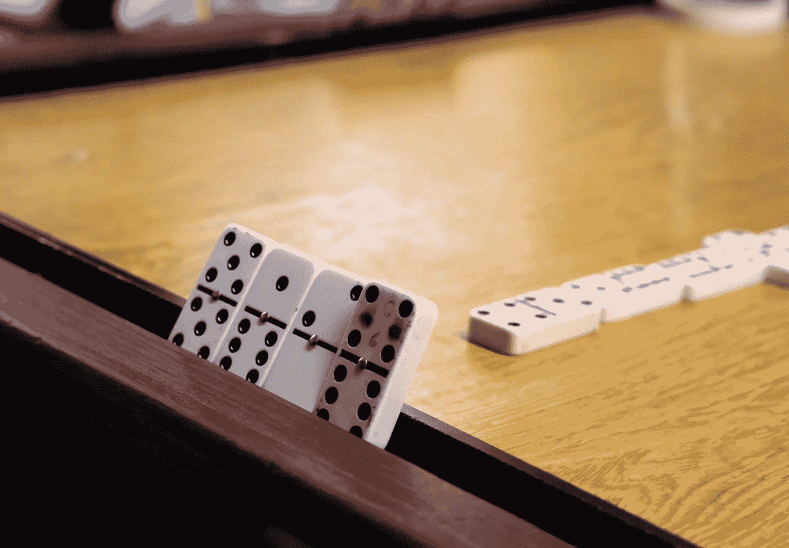
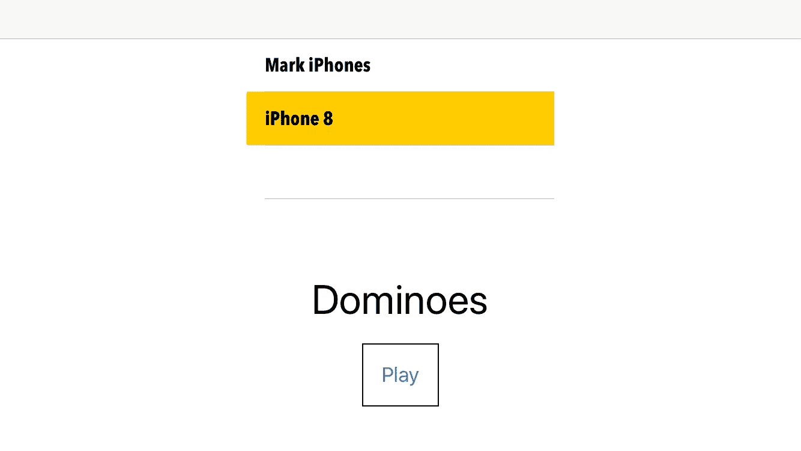

# 在 SwiftUI 中构建多米诺骨牌游戏(第 3 部分)

> 原文：<https://betterprogramming.pub/build-a-dominoes-game-in-swiftui-part-3-c96e29b8101e>

## 网络版



照片由[塔蒂亚娜·罗德里格兹](https://unsplash.com/@tata186?utm_source=unsplash&utm_medium=referral&utm_content=creditCopyText)在 [Unsplash](https://unsplash.com/s/photos/domino?utm_source=unsplash&utm_medium=referral&utm_content=creditCopyText) 拍摄

在[的前一篇文章](https://medium.com/better-programming/build-a-dominoes-game-in-swiftui-part-2-188b825cc35a)中，我浏览了一桶模板代码，这些代码是使网络运行起来所需要的。我创建了一个非常简单的服务器/客户端应用程序。然后我修改了界面，开始使用新的界面构建多米诺骨牌 II。

在本文中，我计划从我们停止的地方继续。我们有相当多的事情要做。这是我整理的任务清单。我们基本上完成了其中的第一个项目，然后遇到了一些困难。我稍微改变了一下规则，因为这是电子骨牌。

*   你在局域网上宣传一款游戏。你的朋友运行搜索，看到你，选择你，并加入游戏。
*   您发回一条包含所选 domino 对的消息。这个想法是同步你的设置。
*   您将一个牌放入游戏中，并将其 ID 和新位置发送给他们。你的朋友也一样。你们继续轮流玩，直到用完牌或不能玩为止。
*   如果你选择了一个多米诺骨牌，不能添加到任何一端，那么你就失去了这个回合。另一个玩家走了，尽管你翻过的牌仍然是你的。
*   游戏的赢家将是没有剩余牌的人，假设不再有任何牌可以翻转，并且他们已经将所有的牌放置在游戏中。然而，有可能游戏结束时你们都还剩下一两张牌，所以我们不能把这作为终止条件。

好吧，我确实认真考虑过在我的 UDP 守护进程旁边运行一个 TCP 守护进程，但是后来我想到了一个更简单的方法。我需要创建一个新的 combine publisher，通过用特定的消息触发它来让应用程序改变页面，下面的代码就是这样做的。那么，我要对`ContentView.swift`做两处改动。

(**但是打住，现在不要改这两个文件**。我这次把一些 mega gists 的改动都贴在文末了。)

第一块发送游戏邀请。

```
Button("Play") {
  self.udpCode.bonjourToUDP(self.name)
  self.env.currentPage = .SecondPage
  DispatchQueue.main.asyncAfter(deadline: .now() + 2, execute: {
    self.udpCode.sendUDP("@ComePlay:" + UIDevice.current.name)
  })
}
```

第二个作用于它。

```
let nextPagePublisher = PassthroughSubject<String, Never>()....onReceive(nextPagePublisher) { ( clientName ) in
  self.udpCode.bonjourToUDP(clientName)
  self.env.currentPage = .SecondPage
}
```

当然，有一小部分被添加到`UDPNetwork.swift`文件中来接收和操作这个方法。

```
if backToString.contains("@ComePlay:") {
  let clientName = backToString.replacingOccurrences(of: "@ComePlay:", with: "")
  nextPagePublisher.send(clientName)
}
```

我的下一步是打开`Dominoes.swift`项目，并将它的`contentView.swift`复制粘贴到一个新文件中，我将用与我现有项目相同的名称来命名它。

我将刚刚复制粘贴到当前构建中的原始`Dominoes.swift`项目中的`ContentView.swift`重命名。现在我们开始工作了，尽管我们还需要一些新的功能。我们谈到了第二个需求，即需要将选定的多米诺骨牌与我们的两个玩家同步。



切换到(我制作的多米诺骨牌的)第二页将会展示棋盘和多米诺骨牌，但是他们有自己的一套。我们需要发送第二个命令。

让我们回顾一下现有的代码。方法`allocateViews`返回一个结构，其中充满了图像。它们将与我在第二个客户端中的图像相同，发送这些图像毫无意义。我们只需要发送它配对的多米诺骨牌列表。

我将该功能一分为二，并引入第三个命令，我从第一个设备的第二页发送该命令，在它出现后有一个短暂的延迟(4 秒)。

```
if prime {
  DispatchQueue.main.asyncAfter(deadline: .now() + Double(4)) {
    let string2send = tiles.joined(separator: ",")
    debugPrint("Sending DominoesSet ",string2send)
    self.env.udpCode.sendUDP("@DominoesSet:" + string2send)
  }
}
```

此处显示的主要变量是在建议初始链接时设置的。这是为了确保我们不会以循环结束，玩家 A 发送他们的集合，然后玩家 B 发送回相同的集合。

**Bug**——但是等等，我被我在[第二部](https://medium.com/better-programming/build-a-dominoes-game-in-swiftui-part-2-188b825cc35a)中犯的一个错误岔开了，一个在方法`received8192`和初始`ContentView`上的愚蠢错误。我警告过你不要犯这个错误。在`ContentView`中，我用这个发送了来玩的邀请:

```
self.env.udpCode.sendUDP("@ComePlay:" + UIDevice.current.name)
```

在`UDPNetwork`中，我用 8192 版本的`receive`方法接收并处理它，其中有一个严重错误:

```
if connection.state == .ready && isComplete == false && recursive {
  print("re-running")
  self.receive8192(on: connection, recursive: true)
}
```

你能发现它吗？当然，这是可以使用的正确版本。它成功了，返回了我发给它的数据，然后运行上面那行代码。问题出在`isComplete variable`上。通过使用`send`假设数据包大小小于 8192，它会将`isComplete`标记为`true`。

使用这个版本，我能够发送一个初始包并读取它，但仅此而已。因为该包小于 8192 字节，并且`isComplete`被设置为`true`，所以该方法退出。

在要点里，我把它改成了`true`，和这个项目一起工作。但是要注意:如果你一次发送超过 8192 字节，它会再次中断。我认为事实是，您需要以不同的方式使用这个标志，而不是在它重新运行`receive8192`方法时进行管理。或者至少做好退出的准备。

几个小时后(是的，我花了很长时间才发现那个愚蠢的错误)，我让它工作了。现在已经让两个玩家在同一页上，我需要一种方法来标记谁玩了什么。

但是别说了。那是什么意思？我不能删除它们。玩家 A 和玩家 B 共用一组牌，所以他们需要知道所有的牌。但是我们需要对某种形式的所有权进行编码。

我首先想到的是把它添加到我创建的结构中，但是没有。我不能这么容易地改变结构中的值。

下一站，看起来是一个有希望的候选人。它已经包含了多米诺骨牌在棋盘上的位置及其方向。我在`DominoWrapper`中为 domino 片段所有权和枚举创建了一个状态。我把它设为可选，这样我就有三种状态:玩家 A，玩家 B，或者没有玩家。

让我们试着记下更多的规则，因为我已经迷路了。

*   当你触摸多米诺骨牌时，所有权将被分配。
*   你不能与其他玩家的多米诺骨牌互动。这不仅仅是一个“禁止接触”的政策，而是一个“绝不”的政策。
*   当其他玩家将多米诺骨牌放在棋盘上时，你只能看到他们的多米诺骨牌。发行的和从未发行的那堆中取出的仍然是秘密的，不可选择的。
*   你不能偷看其他的多米诺骨牌，当轮到你的时候你只能选择一个。你没有第二口苹果。
*   拿走一张多米诺骨牌并不意味着把它放在场上。它只是把它加到你所拥有的、你需要摆脱的东西上。
*   我们需要一些方法来指示是轮到你走，还是其他玩家走。

这又是一个又长又令人生畏的清单，我们还没有完成第一个。唷。

显然，我们需要一个全局变量，并将其设置为该设备的播放器。我们将它设置在`ContentView`，随后设置在`UDPNetwork`。顺便说一句，我不认为最终将所有这些自定义代码添加到网络方法中是一件好事。也许我们需要在某个时候重新审视这个结构。

我们有一个完美的地方来分配会员资格，也就是当你翻开多米诺骨牌的时候。我也需要一个全局变量来表示该轮到谁了。一号玩家开始游戏。

我不想自动化轮流。毕竟，我们正在使用网络，所以两个玩家很可能在同一个房间里，老实说，我们最不需要的就是游戏因为愚蠢的接口错过了一个 UDP 包而陷入僵局。

让我们在界面上添加一个按钮来控制轮到谁。下面是我添加的代码，以使轮流工作。

尽可能保持简单，我也把这个加到了`UDPNetwork`:

```
if backToString.contains("@YourTurn:") {
  turn = player
  turnPublisher.send()
}
```

它的工作方式是，最初的一会儿，两条消息都以绿色背景出现。当第二个设备从第一个设备加载 domino set 时，它会变成红色。我也需要换这一小块。

```
.onReceive(redoDominoes) { ( data ) in
(self.novelleViews.nouViews, tiles) = redoImages(tileString: data)
  turnPublisher.send()
}
```

我需要我邀请的第二台设备也连接到我。我们需要另一条自定义消息。我需要这样做来发送我最后一次移动的坐标。您应该还记得上一篇文章，UDP 网络不是双向通道。

当界面中注册了“拖动结束”状态时，我可以在已建立的通道上发送的坐标。我需要在该消息中标识我移动了哪个多米诺骨牌，以及它的坐标。

但是发送移动数据比看起来要复杂一些。我无法通过网络链接发送未编码的数据。我的数据需要采用不会给系统带来混乱的格式。我需要把它编码。字符串没问题，但是数字，需要编码。

Swift 的一个简单选项，也是一个国际标准，是 JSON。让我们对坐标进行编码，并在 JSON 包中嵌入一个 ID。第一步是定义一个存储它的结构，使它可以编码和解码。

```
struct moverNshaker: Encodable, Decodable {
  var dragID: Int!
  var dragOffset: CGSize!
  var dragAccumulated: CGSize!
}
```

下一步是对它进行编码。

同时，在接收端，我们需要解码 JSON。下面是我用来做这件事的代码。

它使用另一个发布者向`DominoWrapper`类发送消息，通知它这个移动。

```
.onReceive(movePublisher, perform: { ( cords ) in
  if cords.dragID == self.column {
    withAnimation {
    self.dragOffset = cords.dragOffset
    self.accumulated = cords.dragAccumulated
  }
}
})
```

但是这里有一些移动的可能性。我们没有坚持让他们翻过多米诺骨牌，即使一号玩家翻过，二号玩家仍然只能看到骨牌的背面。我们需要在 2 号玩家的多米诺骨牌移动后翻转它。我们还需要发送它的方位。我很想简单地把它添加到我们定义的`moverNShaker`结构中，但是它是视图中的一个状态变量，是视图的一个子视图，拖动也是附加的。

我们需要做和刚才移动时一样的工作，但是用`longPressGesture`和`doubleTapGesture`。我没有时间解释我是如何做到的，但是基本的方法和我刚刚概述的是一样的。我必须承认，我确实很难让背景远程扭曲，所以我作弊，只是让它看不见。

我们还需要实现多米诺骨牌的自动翻转，这样只要我远程将多米诺骨牌放入游戏，它就会翻转过来。我们可以很容易地通过创建一个`autoTurnPublisher`，将它链接到启动转动机制，并设置为与`movePublisher`一起发射。

```
.onReceive(autoTurnPublisher) { ( domino ) in
  if domino == self.$column.wrappedValue {
    withAnimation(Animation.linear(duration: 2.0).delay(0)) {
      self.spin = 180
    }
  }
}
```

从功能上讲，此时我们已经有 90%的代码就位。多米诺骨牌的网络游戏是可能的。我想写更多，但在 2000+字，我已经达到了文章的限制。这里有一个当前应用程序和我在文章开头提到的 mega gists 的快速截图。


我们重新制作的`UDPNetwork.swift`:

还有我们重新制作的`ContentView.swift`:

还有我们重新制作的`Dominoes.swift`:

假设您已经阅读了第二部分，那么您已经拥有了`BonjourBrowser.swift`，这是您将这篇文章变得生动所需要的唯一的另一个类。非常欢迎你更进一步。以下是我的待办事项清单中最重要的事情:

*   我从不宣布赢家。我让玩家自己决定。
*   我不阻止你玩其他玩家的多米诺骨牌，尽管我怀疑这是一个相当容易的解决办法。
*   你可以想看多少张多米诺骨牌就看多少张，但是当你这样做的时候，它会把所有权分配给你——你拥有的多米诺骨牌越多，你就越需要扔掉。
*   最后一个偷看多米诺骨牌的人成为主人，这意味着，在现实中，这是一场比赛，为了获胜，你要在你的伙伴之前翻转尽可能多的多米诺骨牌。这一方面听起来不错，但另一方面，如果你知道这条规则，而你的伴侣却不知道，那就非常不公平了。
*   如果有某种迹象表明谁最终拥有棋盘上的什么，那就更好了。事实上，我认为这不是可有可无的，这是停止之前行为的必要条件。

我可能会做第四部分，我会试着解决所有这些待办事项，也许还会再做一些。我们走着瞧。