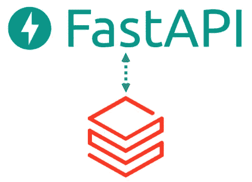
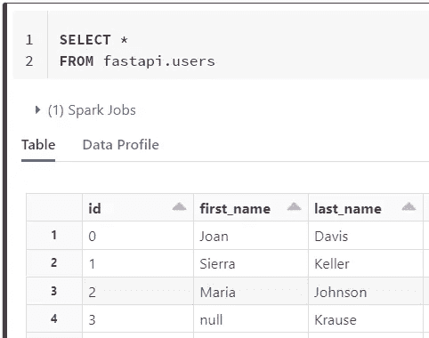

# 在湖边小屋建一个 FastAPI

> 原文：<https://betterprogramming.pub/build-a-fastapi-on-the-lakehouse-94e4052cc3c9>

## 在 Databricks Lakehouse 上创建一个具有完整 CRUD 功能的 FastAPI



FastAPI 与 Databricks Lakehouse 集成

Databricks 的团队一直在推动名为“ [Lakehouse](https://databricks.com/blog/2020/01/30/what-is-a-data-lakehouse.html) ”的新数据管理架构数据湖库的核心是实现对存储在数据湖中的数据的高效和安全的访问。这种架构有望融合数据湖的所有优秀品质(对象存储、非结构化数据等)。)和传统数据仓库的那些(ACID 事务、性能等。)于是，数据湖+房子。

Lakehouse 中的开发人员可以利用各种标准工具进行数据分析、工程和 ML 工作负载。那么，应用程序开发人员是否也可以利用 Lakehouse 来构建可伸缩的数据应用程序呢？简答:有！

因此，在本文中，我将向您展示如何在 Databricks Lakehouse 上创建一个简单的带有后端数据库的 [FastAPI](https://fastapi.tiangolo.com/) 服务器，该服务器支持使用 SQLAlchemy 进行完整的创建、读取、更新和删除(CRUD)操作。

本文中的所有代码都可以在 repo [这里](https://github.com/sjrusso8/fastapi-lakehouse)获得。

## 背景

对于本文中的示例，我在 Databricks 工作区中创建了一个名为`users`的表，其中包含 1，000，000 条虚假用户数据记录。我利用 Databricks Labs 库 [dbldatagen](https://github.com/databrickslabs/dbldatagen) 来生成所有数据。`users`表格如下所示:



用户表的输出

最终的 API 将能够在`users`表上执行以下操作:

*   通过特定 ID 获取用户(`GET`)
*   创建新用户(`POST`)
*   更新现有用户(`PUT`)
*   删除用户(`DELETE`)

## 设置

为了使 API 正常工作，您需要能够访问这些项目:

1.  访问 Databricks 工作区
2.  使用或创建集群的权限
3.  访问以生成数据块的个人访问令牌(PAT)

按照本[数据块指南](https://docs.databricks.com/dev-tools/python-sql-connector.html#get-started)收集以下集群详情:

*   服务器主机名
*   HTTP 路径
*   PAT 令牌

将这些值和一个目标数据库名称添加到一个`.env`文件中，或者将它们创建为环境变量。一旦您完成了以上所有工作，您就可以开始从 API 连接到 Databricks Lakehouse 了。

# 连接到数据里克斯湖边小屋

除了安装标准的 FastAPI 库，您还需要安装 Python 库 [sqlalchemy-databricks](https://github.com/crflynn/sqlalchemy-databricks) 。该库是[databricks-SQL-connector](https://docs.databricks.com/dev-tools/python-sql-connector.html)和 [PyHive SQLAlchemy](https://github.com/dropbox/PyHive#sqlalchemy) 库上的一个瘦包装器。

下面的代码建立了到 Databricks 集群的连接，该集群能够在定义的数据模型上使用 SQLAchlemy 命令。

随着连接的建立，您可以开始使用您的 API 定义您想要执行的所有 HTTP 方法。

## API 路线

下面的代码是 API 的`main.py`文件中所有路线的完整设置。代码如下:

准备好 API 代码后，运行以下命令启动 FastAPI 服务器。

```
uvicorn app.main:app --reload
```

您可以向根端点发送请求，以确保服务器在本地运行。

```
 curl -X GET '[http://localhost:8000/'](http://127.0.0.1:8000/')
```

它应该会返回一条带有`{“message":”Hello Lakehouse"}`的 JSON 消息。`/user`定义的路由支持对湖边小屋中的数据进行完全的 CRUD 处理。

GET 请求将通过`id=1`为用户返回一条 JSON 消息，其中包含详细信息。

```
--- Requestcurl -X GET '[http://localhost:8000/user?id=1'](http://127.0.0.1:8000/user?id=1')--- Response : 200[
  {
    "last_name": "Keller",
    "email": "[sbartlett@sanchez-zimmerman.com](mailto:sbartlett@sanchez-zimmerman.com)",
    "first_name": "Sierra",
    "address": "29032 Montes Village\nLake Josechester, NJ 42870",
    "id": 1,
    "ip_address": "172.26.121.155"
  }
]
```

通过发送一个`POST`请求创建一个用户。响应是所创建用户的`id`和状态码`200`。

```
--- Requestcurl -X POST '[http://](http://127.0.0.1:8000/user')[localhost](http://127.0.0.1:8000/user?id=1')[:8000/user'](http://127.0.0.1:8000/user') \
  --header 'Content-Type: application/json' \
  --data-raw '{
    "first_name": "Lake",
    "last_name": "House"
}'--- Response : 200{
  "user_id": 3363124
}
```

通过向`/user/3363124`发送`PUT`请求来更新新创建的用户。

```
--- Requestcurl -X PUT '[http://localhost:8000/user/3363124'](http://127.0.0.1:8000/user/3363124') \
  --header 'Content-Type: application/json' \
  --data-raw '{
    "first_name": "Databricks",
    "last_name": "LakeHouse"
}'--- Response : 200{
  "user_id": 3363124
}
```

最后，通过向`/user/3363124`发送`DELETE`请求来删除用户。

```
--- Requestcurl -X DELETE '[http://](http://127.0.0.1:8000/user/3363124')[localhost](http://127.0.0.1:8000/user/3363124')[:8000/user/3363124'](http://127.0.0.1:8000/user/3363124')--- Response : 200{
  "user_id": 3363124,
  "msg": "record deleted"
}
```

瞧啊。现在，您已经从一个现有用户那里读取了数据，创建了一个新用户，更新了同一个用户，并从 Lakehouse 中删除了该用户。

# 召唤

虽然这种方法是可行的，但是如果您选择扩展这个示例，我还是想指出一些需要记住的事情。

1.  如果目标集群在 API 发出请求时处于关闭状态，那么在您收到响应之前，集群可能需要 3–10 分钟的时间才能启动
2.  注意数据大小和查询数据的成本
3.  注意集群成本

访问数据的其他方法可以通过已经提到的 [databricks-sql-connector](https://docs.databricks.com/dev-tools/python-sql-connector.html) 或新的[增量共享](https://databricks.com/blog/2021/05/26/introducing-delta-sharing-an-open-protocol-for-secure-data-sharing.html)功能来完成。

# **收尾**

通过这种设置，您可以快速创建一个完整的 CRUD API，该 API 利用来自 Databricks 上的 Lakehouse 架构的数据。这个基线示例可以通过集成到部署在数据块、实时数据集和大数据应用程序中的 ML 模型中，开辟更多 API 可能性。

同样，本文中的所有代码都可以在 repo [这里](https://github.com/sjrusso8/fastapi-lakehouse)获得。

感谢您的阅读。请留下评论，享受我关于数据工程的其他文章、书籍、教程等等！

干杯！