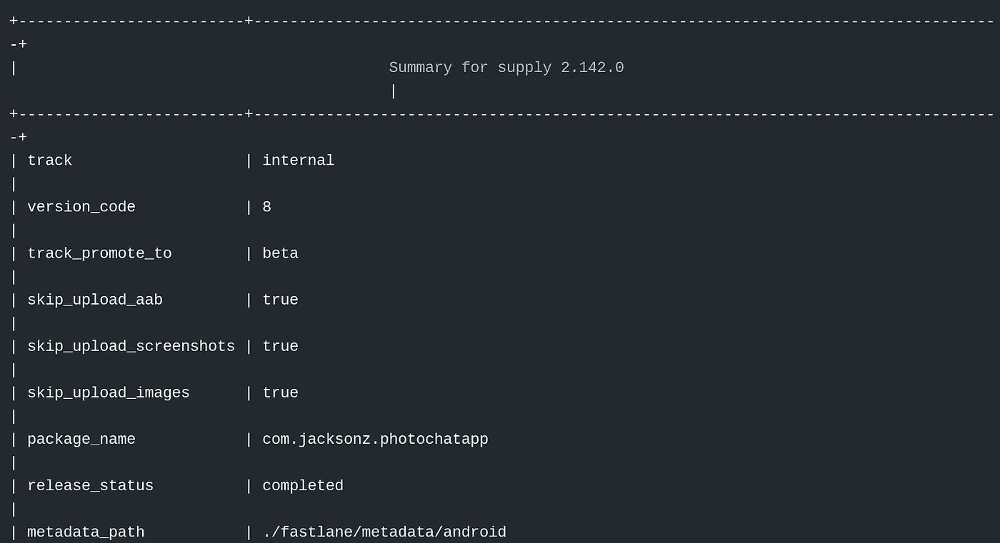

# 从头开始为 Flutter 版本管理构建一个浪子插件

> 原文：<https://betterprogramming.pub/build-a-fastlane-plugin-for-flutter-version-management-from-scratch-5df82bce391f>

## 告别“哦不，我忘了撞版本”

照片由[斯蒂夫·约翰森](https://unsplash.com/@steve_j?utm_source=medium&utm_medium=referral)在 [Unsplash](https://unsplash.com?utm_source=medium&utm_medium=referral) 上拍摄。

# 浪子自动化移动应用部署

传统上，发布一个应用程序需要大量的移动应用程序开发工作。

随着 NoOps 和跨平台框架(加倍努力发布)在 2020 年开始流行，开发者倾向于尽可能自动化应用部署。

[浪子](https://fastlane.tools/)是一个自动将 iOS 和 Android 部署到市场的实用程序。

# 浪子不支持颤振版本

版本管理对于自动化变更日志和上传截图到市场是必不可少的。

由于 Flutter 是新的，目前还不支持它的版本自动化。因此，每当有版本升级时，开发人员必须手动将更改同步到浪子的配置中:

# 浪子是可定制的，足以 DIY Flutter 版本支持

浪子对于任何任意的 Ruby 实现都是高度可配置的。

由于浪子的可定制结构，我们可以自己构建一个版本管理自动化插件。

让我们一步一步为浪子构建一个 Flutter 版本管理插件。

# 步骤 1:初始化浪子插件

所有的浪子插件都以`fastlane new_plugin flutter_version`开头，这是一个初始化插件所需的一切的便利工具。

在这种情况下，`fastlane new_plugin flutter_version`初始化一个名为`flutter_version`的插件，如下所示:

# 步骤 2:添加元数据

下一步是将联系信息添加到插件元数据中:

# 步骤 3:读取颤振配置文件

第一步是读取和解析包含所有关于 Flutter 项目的元数据的配置文件:

# 步骤 4:检索并返回 Flutter 版本代码

解析完 Flutter 项目的元数据后，我们现在可以检索版本代码:

# 步骤 5:发布插件

以下命令将把我们的插件发布到 [RubyGems](https://rubygems.org/) 中，以便其他开发者可以使用它:

# 步骤 6:在一个 Flutter 项目中使用插件

插件公开后，通过在`Fastfile`中添加以下代码，可以在一个 Flutter 项目中使用它:

如下面的浪子执行所示，`flutter_version()`被求值为 *8* ，这是`pubspec.yaml`中定义的版本代码:

万岁！释放是自动的:

随着`pubspec.yaml`版本的进展，变更日志会自动更新。

# 资源

对于有兴趣为 Flutter 项目添加开箱即用版本支持的人，请使用我构建的插件:

 [## RubyGems.org |你的社区宝石主机

### RubyGems.org 是通过与大 Ruby 社区的合作而成为可能的。快速提供带宽和 CDN…

rubygems.org](https://rubygems.org/gems/fastlane-plugin-flutter_version) 

对于有兴趣了解完整实现的人，请查看存储库:

 [## 天昊 95/快车道-外挂-颤振 _ 版本

### flutter_version 是一个浪子插件，用于从 flutter 项目中检索版本代码，可以用来发布…

github.com](https://github.com/tianhaoz95/fastlane-plugin-flutter_version) 

对于那些对如何在一个 Flutter 项目中使用该插件感兴趣的人，请查看示例库，[迷你驴](https://medium.com/minidonkey101)(一个用于加密隐写术的应用):

 [## 天昊 95/照片

### 迷你驴携带加密(AES)和隐写术(的技术)安全和秘密的私人信息

github.com](https://github.com/tianhaoz95/photochat)