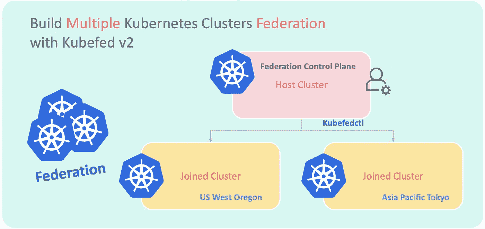
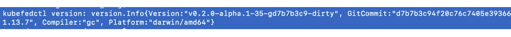
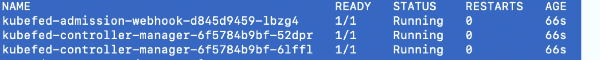
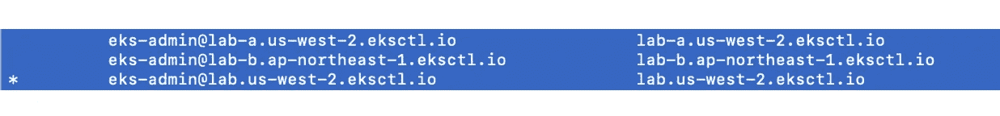
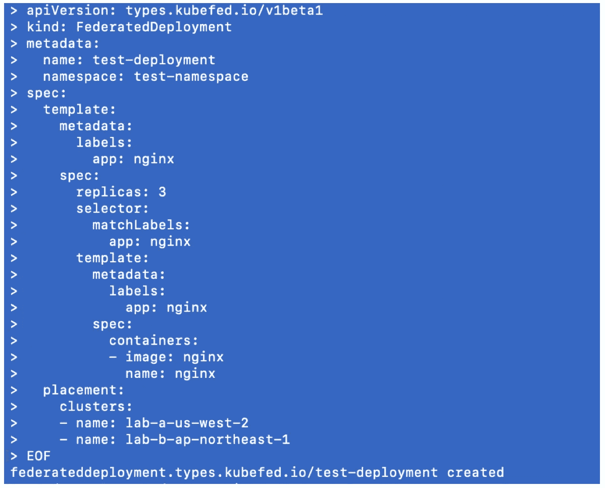
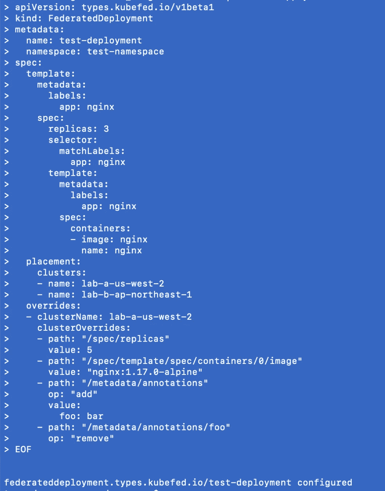
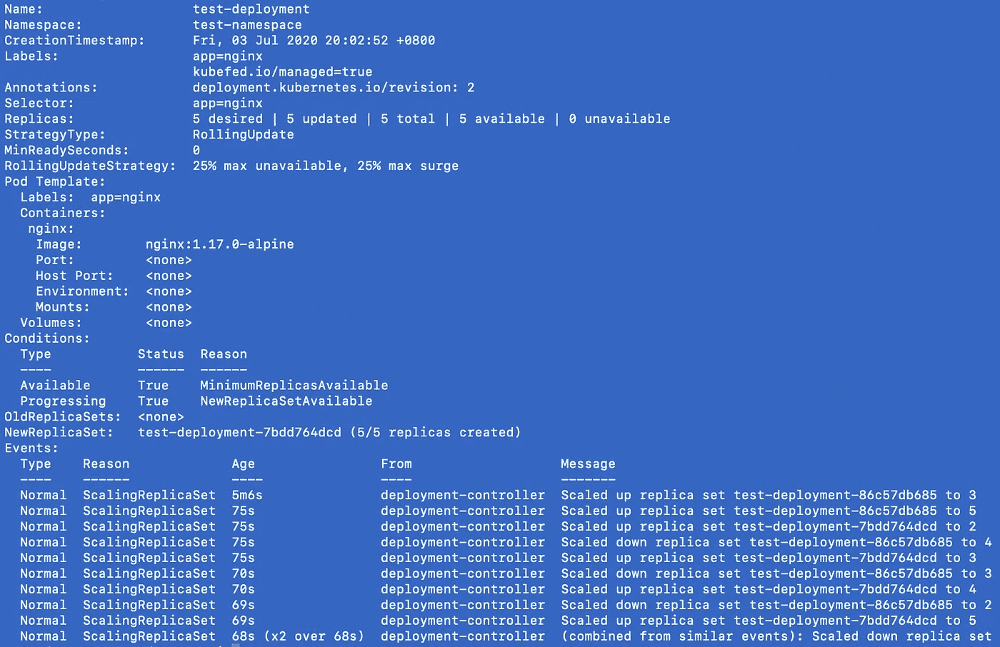

# 与 Kubefed 建立多个 Kubernetes 集群的联盟

> 原文：<https://betterprogramming.pub/build-a-federation-of-multiple-kubernetes-clusters-with-kubefed-v2-8d2f7d9e198a>

## 构建 Kubernetes 联盟的分步指南，使用 KubeFed 管理多个地区的集群



图片由作者提供

# 库伯菲德是什么？

KubeFed (Kubernetes 集群联盟)允许您使用单个 [Kubernetes](https://kubernetes.io/) 集群来协调多个 Kubernetes 集群。它可以在不同的区域部署多集群应用程序，并为灾难恢复而设计。

了解更多关于 kube fed:*[https://github.com/kubernetes-sigs/kubefed](https://github.com/kubernetes-sigs/kubefed)*

# *先决条件*

*Kubernetes 集群必须启动并运行:`kubernetes v1.13+`。*

*在本文中，我们将有三个 Kubernetes 集群。一种是安装联合控制面板作为主机群集(名为 lab)。其他的用于部署名为 lab-a 和 lab-b 的应用程序。*

**

*Kubernetes 集群准备*

# *KubeFed CLI 安装*

*`kubefedctl`是 KubeFed 命令行实用程序。现在它只支持 Linux 和 OSX。在主机集群中，您可以查看以下链接来获取发布版本并运行命令进行安装:[https://github.com/kubernetes-sigs/kubefed/releases](https://github.com/kubernetes-sigs/kubefed/releases)*

```
*#Replace KUBEFEDVERSION, OSTYPEVERSION=KUBEFEDVERSION <latest-version, e.g. 0.1.0-rc3>
OS=OSTYPE <darwin/linux>
ARCH=amd64
curl -LO https://github.com/kubernetes-sigs/kubefed/releases/download/v${VERSION}/kubefedctl-${VERSION}-${OS}-${ARCH}.tgz
tar -zxvf kubefedctl-*.tgz
chmod u+x kubefedctl
sudo mv kubefedctl /usr/local/bin/ #make sure the location is in the PATH*
```

*您可以通过以下方式查看您的`kubefedctl`版本:*

```
*kubefedctl version*
```

**

*Kubefedctl 版本*

# *KubeFed 装置*

*KubeFed 安装使用[舵](https://helm.sh/)图进行部署。在主机集群中，可以使用以下命令安装 Helm CLI `Helm v2.10+`:*

```
*curl -LO [https://git.io/get_helm.sh](https://git.io/get_helm.sh)
chmod 700 get_helm.sh
./get_helm.sh*
```

*然后在 Kubernetes 集群上安装舵柄:*

```
*cat << EOF | kubectl apply -f -
apiVersion: v1
kind: ServiceAccount
metadata:
  name: tiller
  namespace: kube-system
---
apiVersion: rbac.authorization.k8s.io/v1
kind: ClusterRoleBinding
metadata:
  name: tiller
roleRef:
  apiGroup: rbac.authorization.k8s.io
  kind: ClusterRole
  name: cluster-admin
subjects:
  - kind: ServiceAccount
    name: tiller
    namespace: kube-system
---
apiVersion: apps/v1
kind: Deployment
metadata:
  labels:
    app: helm
    name: tiller
  name: tiller-deploy
  namespace: kube-system
spec:
  progressDeadlineSeconds: 600
  replicas: 1
  revisionHistoryLimit: 10
  selector:
    matchLabels:
      app: helm
      name: tiller
  template:
    metadata:
      creationTimestamp: null
      labels:
        app: helm
        name: tiller
    spec:
      automountServiceAccountToken: true
      containers:
        - env:
            - name: TILLER_NAMESPACE
              value: kube-system
            - name: TILLER_HISTORY_MAX
              value: '0'
          image: 'gcr.io/kubernetes-helm/tiller:v2.16.9'
          imagePullPolicy: IfNotPresent
          livenessProbe:
            failureThreshold: 3
            httpGet:
              path: /liveness
              port: 44135
              scheme: HTTP
            initialDelaySeconds: 1
            periodSeconds: 10
            successThreshold: 1
            timeoutSeconds: 1
          name: tiller
          ports:
            - containerPort: 44134
              name: tiller
              protocol: TCP
            - containerPort: 44135
              name: http
              protocol: TCP
          readinessProbe:
            failureThreshold: 3
            httpGet:
              path: /readiness
              port: 44135
              scheme: HTTP
            initialDelaySeconds: 1
            periodSeconds: 10
            successThreshold: 1
            timeoutSeconds: 1
          resources: {}
          terminationMessagePath: /dev/termination-log
          terminationMessagePolicy: File
      dnsPolicy: ClusterFirst
      restartPolicy: Always
      schedulerName: default-scheduler
      securityContext: {}
      serviceAccount: tiller
      serviceAccountName: tiller
      terminationGracePeriodSeconds: 30
EOF*
```

# *什么是头盔？*

*Helm 是 Kubernetes 的包装经理。它可以帮助您管理 Kubernetes 应用程序，通过 Helm Charts 轻松安装和升级。*

*了解更多关于赫尔姆的信息:[https://helm.sh/](https://helm.sh/)*

*运行以下命令检查 KubeFed 图表版本:*

```
*helm init --service-account tillerhelm repo add kubefed-charts [https://raw.githubusercontent.com/kubernetes-sigs/kubefed/master/charts](https://raw.githubusercontent.com/kubernetes-sigs/kubefed/master/charts)helm search kubefed*
```

**

*Kubefed 图表版本*

*使用以下命令在`kube-federation-system` 名称空间(默认)中安装 KubeFed v0.3.0:*

```
*helm install  kubefed-charts/kubefed  --name=kubefed  --version=0.3.0 --namespace kube-federation-system --devel --debug# Check if kubefed is ready
kubectl get pod  -n kube-federation-system*
```

**

*Kubefed 安装状态*

# *聚类注册*

*在主机集群中，为 lab-a 和 lab-b 设置`Kubectl config`，以便我们能够通过上下文切换访问这些集群，并使用上下文加入联盟:*

```
*#Replace CLUSTERNAME, CLUSTERIP, USERNAME, TOKEN, CONTEXTNAMEkubectl config set-cluster CLUSTERNAME --server=CLUSTERIP
kubectl config set-credentials USERNAME --token="TOKEN"
kubectl config set-context CONTEXTNAME --cluster=CLUSTERNAME --user=USERNAME*
```

*检查所有集群的上下文:*

```
*kubectl config get-contexts*
```

**

*库伯内特语境*

*使用`kubefedctl join` 将集群注册到主机集群中:*

```
*#Replace JOINED_CLUSTER_NAME, HOST_CLUSTER_NAME, HOST_CLUSTER_CONTEXT, JOINED_CLUSTER_CONTEXTkubefedctl join JOINED_CLUSTER_NAME --host-cluster-name=HOST_CLUSTER_NAME --host-cluster-context=HOST_CLUSTER_CONTEXT --cluster-context=JOINED_CLUSTER_CONTEXT# --kubefed-namespace string
If you install kubefed into specific namespace instead of default (default "kube-federation-system") You should provide the specific namespace in the host cluster where the KubeFed system components are installed#example. 
kubefedctl join lab-a-us-west-2 --host-cluster-name=lab --host-cluster-context=eks-admin@lab.us-west-2.eksctl.io --cluster-context=eks-admin@lab-a.us-west-2.eksctl.io*
```

*加入集群后，您可以通过以下命令检查状态:*

```
*kubectl -n kube-federation-system get kubefedclusters*
```

**

*Kubefed 加入了集群*

*您的联盟集群现在已经准备好了。*

# *部署服务*

*请注意，您必须首先在主机集群中创建一个名称空间，然后联合到加入的集群。*

*在主机集群中，使用以下命令为主机集群和其他集群创建名称空间和 nginx 部署。您可以将集群更改为加入时使用的集群名称。*

```
*cat << EOF | kubectl apply -f -
apiVersion: v1
kind: Namespace
metadata:
  name: test-namespace
EOFcat << EOF | kubectl apply -f -
apiVersion: types.kubefed.io/v1beta1
kind: FederatedNamespace
metadata:
  name: test-namespace
  namespace: test-namespace
spec:
  placement:
    clusters:
    - name: **lab-a-us-west-2** 
    - name: **lab-b-ap-northeast-1**
EOFcat << EOF | kubectl apply -f -
apiVersion: types.kubefed.io/v1beta1
kind: FederatedDeployment
metadata:
  name: test-deployment
  namespace: test-namespace
spec:
  template:
    metadata:
      labels:
        app: nginx
    spec:
      replicas: 3
      selector:
        matchLabels:
          app: nginx
      template:
        metadata:
          labels:
            app: nginx
        spec:
          containers:
          - image: nginx
            name: nginx
  placement:
    clusters:
    - name: **lab-a-us-west-2** 
    - name: **lab-b-ap-northeast-1**
EOF*
```

**

*部署之后，您将能够看到 nginx 部署在两个集群中启动并运行。*

```
*#Check for lab-akubectl get deployment -n test-namespace --context [eks-admin@lab-a.us-west-2.eksctl.io](mailto:eks-admin@lab-a.us-west-2.eksctl.io) #Check for lab-bkubectl get deployment -n test-namespace --context [eks-admin@lab-b.ap-northeast-1.eksctl.io](mailto:eks-admin@lab-b.ap-northeast-1.eksctl.io)*
```

**

*您还可以覆盖应用程序部署版本等。，仅适用于通过在 YAML 文件中定义覆盖的特定群:*

```
*cat << EOF | kubectl apply -f -
apiVersion: types.kubefed.io/v1beta1
kind: FederatedDeployment
metadata:
  name: test-deployment
  namespace: test-namespace
spec:
  template:
    metadata:
      labels:
        app: nginx
    spec:
      replicas: 3
      selector:
        matchLabels:
          app: nginx
      template:
        metadata:
          labels:
            app: nginx
        spec:
          containers:
          - image: nginx
            name: nginx
  placement:
    clusters:
    - name: **lab-a-us-west-2** 
    - name: **lab-b-ap-northeast-1**
  overrides:
  - clusterName: **lab-a-us-west-2** 
    clusterOverrides:
    - path: "/spec/replicas"
      value: 5
    - path: "/spec/template/spec/containers/0/image"
      value: "nginx:1.17.0-alpine"
    - path: "/metadata/annotations"
      op: "add"
      value:
        foo: bar
    - path: "/metadata/annotations/foo"
      op: "remove"
EOF*
```

**

*部署之后，您将能够看到 nginx 部署的副本、镜像版本等。实验室-a 中的现已修改。*

```
*kubectl describe deployment -n test-namespace --context [eks-admin@lab-a.us-west-2.eksctl.io](mailto:eks-admin@lab-a.us-west-2.eksctl.io)*
```

**

*应用程序部署测试到此结束。*

*现在，您将能够使用联盟来管理您的集群和应用程序！*

# *我的工作版本*

**